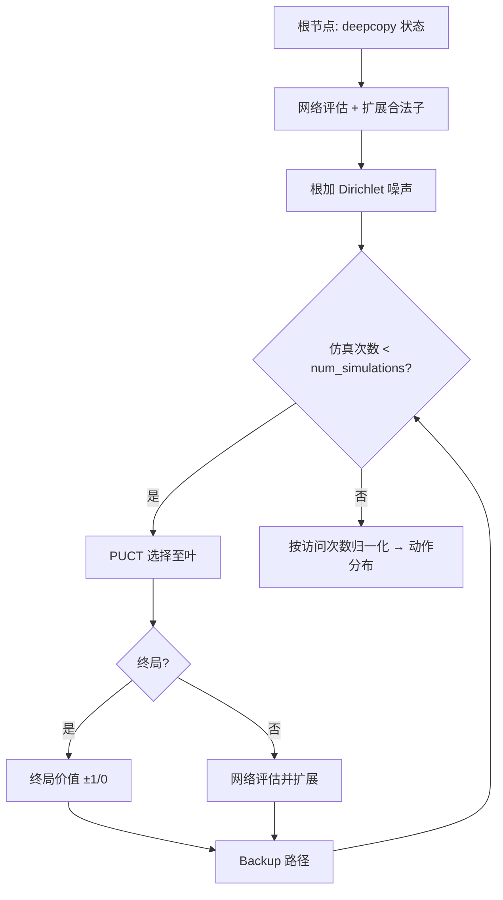

# AlphaZero 与 MCTS

> 返回：[算法总览](overview.md) · [源码总览](../source-analysis/overview.md) · [索引](../AGENTS.md)

---

## 1. 一句话直觉

神经网络猜「该走哪、局面谁优」；**蒙特卡洛树搜索（MCTS）**在脑子里试很多变化，用访问次数得到更靠谱的走子分布；再用自对弈棋谱训练网络——搜索与学习互相抬高。

---

## 2. 要解决的问题

- 纯策略网络一步贪心，缺乏**前瞻**。
- 纯搜索无启发式时，分支因子巨大（本游戏 flat 动作极多）。
- 需要把**策略先验**与**价值估计**嵌入 PUCT 选择，并在合法动作上扩展。

---

## 3. 核心概念

| 概念 | 含义 |
|------|------|
| **策略头** | \(p(a\|s)=\pi_\theta(a\|s)\)，作 MCTS 先验 |
| **价值头** | \(v_\theta(s)\in[-1,1]\) 量级，局面评估 |
| **选择 Selection** | 沿树用 PUCT 走到叶 |
| **扩展 Expansion** | 叶节点按合法动作建子节点，挂先验 |
| **评估 Evaluation** | 用网络估 \(v\)（AlphaZero **无**随机 rollout） |
| **回传 Backup** | 沿路径更新访问次数 \(N\) 与价值累计 \(W\) |
| **自对弈数据** | \((s, \pi_{\text{MCTS}}, z)\)：状态、改进策略、终局结果 |
| **Dirichlet 噪声** | 根节点探索，避免只信网络 |

节点统计：

\[
Q(s,a) = \frac{W(s,a)}{N(s,a)}
\]

---

## 4. 算法步骤

### 4.1 单次 MCTS（`MCTS.search`）

### 4.2 训练迭代（`AlphaZeroTrainer`）

1. 多局自对弈：每步 `search` → 温度采样动作 → 存 \((s,\pi)\)。
2. 终局得到 \(z\)（相对该方）。
3. 回放缓冲采样，监督：策略 CE + 价值 MSE。
4. 定期与旧模型或规则 Bot 评估，决定是否晋级权重。

---

## 5. 公式与数字例子

### 5.1 PUCT 选择（与本仓库实现一致）

对子节点：

\[
\text{score}(a) = Q(s,a) + c_{\text{puct}}\, P(s,a)\, \frac{\sqrt{N(s)+1}}{1+N(s,a)}
\]

实现中：`sqrt_parent = sqrt(node.visit_count + 1)`，
`exploration = c_puct * child.prior * sqrt_parent / (1 + child.visit_count)`，
`score = q + exploration`；若子节点轮到对手，\(Q\) 取反。

| 符号 | 含义 | 代码 |
|------|------|------|
| \(Q(s,a)\) | 平均行动价值 | `child.q_value`（或取反） |
| \(P(s,a)\) | 网络先验 | `child.prior` |
| \(N(s)\) | 父访问 | `node.visit_count` |
| \(N(s,a)\) | 边访问 | `child.visit_count` |
| \(c_{\text{puct}}\) | 探索强度 | 默认 `1.5` |

**玩具例**：父 \(N=8\)，两动作：

| a | \(N_a\) | \(Q\) | \(P\) |
|---|--------|-------|-------|
| A | 5 | 0.4 | 0.6 |
| B | 1 | 0.1 | 0.4 |

\(c_{\text{puct}}=1.5\)，\(\sqrt{N+1}=\sqrt{9}=3\)：

\[
U_A = 1.5\times 0.6\times 3 / (1+5) = 2.7/6 = 0.45,\quad
\text{score}_A=0.4+0.45=0.85
\]

\[
U_B = 1.5\times 0.4\times 3 / (1+1) = 1.8/2 = 0.9,\quad
\text{score}_B=0.1+0.9=1.0
\]

→ 选 **B**（访问少、先验尚可，探索项大）。

### 5.2 根策略与温度

访问次数 \(\{N_a\}\)，温度 \(\tau\)：

\[
\pi(a) \propto N_a^{1/\tau}
\]

- \(\tau\to 0\)：取 \(\arg\max N_a\)（评估常用）
- \(\tau=1\)：按访问比例（自对弈前段）

### 5.3 训练损失（标准 AlphaZero 形）

\[
L = (z - v)^2 - \pi^\top \log p + c\|\theta\|^2
\]

| 符号 | 含义 |
|------|------|
| \(z\) | 终局结果（胜 +1 / 负 −1 / 和 0，相对当前方） |
| \(v\) | 价值头输出 |
| \(\pi\) | MCTS 改进策略 |
| \(p\) | 网络策略 |

### 5.4 Dirichlet 噪声

根先验：

\[
P'(a) = (1-\epsilon)P(a) + \epsilon\,\eta_a,\quad
\eta\sim\mathrm{Dir}(\alpha)
\]

默认：`dirichlet_alpha=0.3`，`dirichlet_epsilon=0.25`。

---

## 6. 在本项目中的实现

| 组件 | 位置 |
|------|------|
| MCTS | `rl/mcts.MCTS`、`MCTSNode` |
| PUCT | `MCTS._select_child` |
| 扩展/回传 | `_expand_node`、`_backup` |
| 网络 | `rl/alphazero_net.AlphaZeroNet`、`ResidualBlock` |
| 训练 | `rl/alphazero_trainer.AlphaZeroTrainer`、`self_play_game`、`ReplayBuffer` |
| 对局 Bot | `game/alphazero_bot.py` |
| 配置 | `rl/config.AlphaZeroConfig` |
| YAML | `configs/alphazero/alphazero.yaml` |
| 脚本 | `scripts/train/train_alphazero.py` |

Flat 动作映射与 env 一致：`atype * H*W + y*W + x`；`end_turn` 映射到 atype=5 的规范格。

源码导读：[../source-analysis/rl-advanced-trainers.md](../source-analysis/rl-advanced-trainers.md)

---

## 7. 配置与超参（简）

| 字段 | 默认 | 作用 |
|------|------|------|
| `num_simulations` | 100 | 每步 MCTS 仿真次数 |
| `c_puct` | 1.5 | PUCT 探索 |
| `dirichlet_alpha` / `epsilon` | 0.3 / 0.25 | 根噪声 |
| `res_blocks` / `channels` | 6 / 128 | 网络容量 |
| `iterations` | 100 | 外层迭代 |
| `games_per_iter` | 25 | 每轮自对弈局数 |
| `epochs_per_iter` | 10 | 每轮训练 epoch |
| `buffer_size` | 1e5 | 回放大小 |
| `temperature_threshold` | 30 | 前若干步用高温 |
| `eval_threshold` | 0.55 | 晋级胜率门槛 |
| `lr` / `weight_decay` | 1e-3 / 1e-4 | 优化 |

---

## 8. 常见误解

1. **「MCTS 就是随机模拟到终局」**
   AlphaZero 叶节点用**网络价值**，不做长随机 rollout。

2. **「仿真次数越多一定越强」**
   受网络质量与时间预算限制；弱网 + 深搜仍可能错。

3. **「策略头直接 argmax 即可，不必 MCTS」**
   可玩，但失去规划；本路径的核心是搜索改进数据。

4. **「与 PPO checkpoint 通用」**
   否；结构、动作表示、训练循环均不同。

5. **「和棋价值随便标」**
   本实现终局：赢 +1、输 −1、和 0（相对 root 玩家）。

---

## 9. 延伸阅读

- Silver et al., *Mastering Chess and Shogi by Self-Play with a General Reinforcement Learning Algorithm* (AlphaZero)
- 本目录：[self-play.md](self-play.md) · [mdp-gymnasium-basics.md](mdp-gymnasium-basics.md) · [action-masking.md](action-masking.md)
- 测试：`tests/test_alphazero.py`
