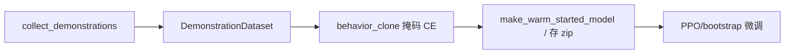

# 行为克隆（Behavior Cloning, BC）

> 返回：[算法总览](overview.md) · [源码总览](../source-analysis/overview.md) · [索引](../AGENTS.md)

---

## 1. 一句话直觉

先看高手录像，**监督学习「在这个局面下怎么走」**；学会皮毛后再用 PPO 自己练，比从零乱试快。

---

## 2. 要解决的问题

- 纯 RL 冷启动在大动作空间里极慢。
- 脚本 Bot 能打出**可复现演示**，可当「伪专家」。
- 但演示质量差或**重复同一条轨迹**时，BC 只会背答案，不会泛化。

---

## 3. 核心概念

| 概念 | 含义 |
|------|------|
| **行为克隆** | 把 \((o_t, a_t)\) 当分类/回归数据集，拟合 \(\pi(a\|o)\) |
| **演示轨迹** | Bot 或人类对局记录的状态—动作序列 |
| **BC → PPO** | 先 BC 热启动策略头，再 on-policy 微调（价值头常留给 PPO） |
| **掩码交叉熵** | 只在合法动作上计算损失（与 Maskable 一致） |
| **类别不平衡** | `end_turn` 样本极多，需 `end_turn_weight` |
| **确定性重复** | 确定 Bot × 确定引擎 → N 局 = 1 条轨迹复制 N 次 |

---

## 4. 算法步骤

1. **采集**：专家 Bot 对局，记录 obs、动作、mask。
2. **BC 训练**：Adam + 掩码交叉熵，默认**不更新 value_net**。
3. **导出** checkpoint。
4. **RL 微调**：`warm_start_path` 或 `make_warm_started_model`。
5. **Sanity-eval**：对 Bot 阶梯测胜率（**不要只看 BC loss**）。

---

## 5. 公式与数字例子

### 5.1 监督学习目标

对数据集 \(\mathcal{D}=\{(o_i,a_i)\}\)：

\[
L_{\text{BC}}(\theta) = -\mathbb{E}_{(o,a)\sim\mathcal{D}}\big[\log \pi_\theta(a\|o)\big]
\]

带样本权重 \(w_i\)（如抬高/压低 end_turn）：

\[
L = -\frac{1}{N}\sum_i w_i \log \pi_\theta(a_i\|o_i)
\]

| 符号 | 含义 |
|------|------|
| \(\pi_\theta(a\|o)\) | 策略在掩码后的概率 |
| \(a_i\) | 演示动作（MultiDiscrete 各维） |
| \(w_i\) | 样本权重 |

### 5.2 end_turn 自动权重

演示中 end_turn 条数 \(n_{\text{end}}\)，其它 \(n_{\text{non}}\)：

\[
w_{\text{end}} = \frac{n_{\text{non}}}{\max(n_{\text{end}},1)}
\]

**玩具例**：\(n_{\text{end}}=900\)，\(n_{\text{non}}=100\) → \(w_{\text{end}}=100/900\approx 0.11\)？
等一下：代码是 `n_non_end / n_end`，用于让 end_turn 的**总梯度贡献**与非 end 合计相当：

若 end 很多，\(n_{\text{non}}/n_{\text{end}}\) 较小 → **压低**每条 end_turn 的权重。
例：900 end，100 non → \(w=100/900\approx 0.11\)，则 end 总权重 \(900\times 0.11=100\)，与 non 总权重 100 平衡。

（若 end 很少则会抬高 \(w_{\text{end}}\)。）

### 5.3 数据集「有效样本量」

确定性对局：

\[
N_{\text{unique}} \approx 1,\quad
N_{\text{recorded}} = N
\]

BC 以为有 \(N\) 条独立样本，实际在背 **1 条脚本**。
开启随机平局决胜 / 随机对手后：

\[
N_{\text{unique}} \uparrow
\]

### 5.4 准确率 vs 胜率

假设 full_action_acc 从 0.21→0.27，但对 SimpleBot 的胜率字节级不变——
因为 loss 主要改善了「演示里该 end_turn 的帧」，**不改变**其它状态下的 argmax 战术先验。
**务必用 `evaluate_bc_against_bot_ladder` 等对局指标。**

---

## 6. 在本项目中的实现

| 组件 | 位置 |
|------|------|
| 演示结构 | `rl/imitation.Demonstration`、`DemonstrationDataset` |
| 采集 | `collect_demonstrations`、`collect_demonstrations_multi` |
| 场景 YAML | `load_scenarios_from_yaml`、`DemonstrationScenario` |
| BC 循环 | `behavior_clone` |
| 热启动模型 | `make_warm_started_model` |
| BC 后评估 | `evaluate_bc_against_bot_ladder` |
| 脚本 | `scripts/build_bc_warmstart.py`、`examples/train_with_bc_warmstart.py` |
| 配置 | `configs/imitation/bc_*.yaml` |
| 课程接入 | `TrainingConfig.warm_start_path` + `bootstrap.run_curriculum` |

源码导读：[../source-analysis/rl-advanced-trainers.md](../source-analysis/rl-advanced-trainers.md)

教训汇总：`docs/zh/bootstrap_lessons_learned.md` 中「BC 热启动」章节。

---

## 7. 配置与超参（简）

| 参数 | 作用 |
|------|------|
| `n_epochs` | BC 轮数 |
| `batch_size` | 小批量 |
| `learning_rate` | Adam LR（常 `3e-4`） |
| `end_turn_weight` | `None`=自动平衡；`1.0`=关闭 |
| 采集局数 / 地图 / 双方 Bot | 场景 YAML |
| `stochastic_tiebreak` | 打破确定性重复（若启用） |

BC 只动策略相关参数；**价值头**留给 PPO 拟合真实回报。

---

## 8. 常见误解

1. **「演示越多越好」**
   重复轨迹再多也只是过拟合一条路径。

2. **「BC loss 下降 = 更会玩」**
   否；必须看对局胜率与动作分布。

3. **「BC 应同时预训练 V」**
   本实现默认不训 V；演示回报分布与 RL 奖励可能不一致。

4. **「从玩家 2 录制可修地图不对称」**
   确定性伪影常伪装成座位优势；先开随机性再下结论。

5. **「BC 完可以不再 RL」**
   专家外推误差（compounding error）大，需 PPO 微调。

---

## 9. 延伸阅读

- Ross et al., DAgger（减轻复合误差的经典后续）
- 本目录：[curriculum-bootstrap.md](curriculum-bootstrap.md) · [ppo.md](ppo.md) · [action-masking.md](action-masking.md)
- 配置：`configs/imitation/bc_beginner_warmstart.yaml` 等
- 测试：`tests/test_imitation.py`
