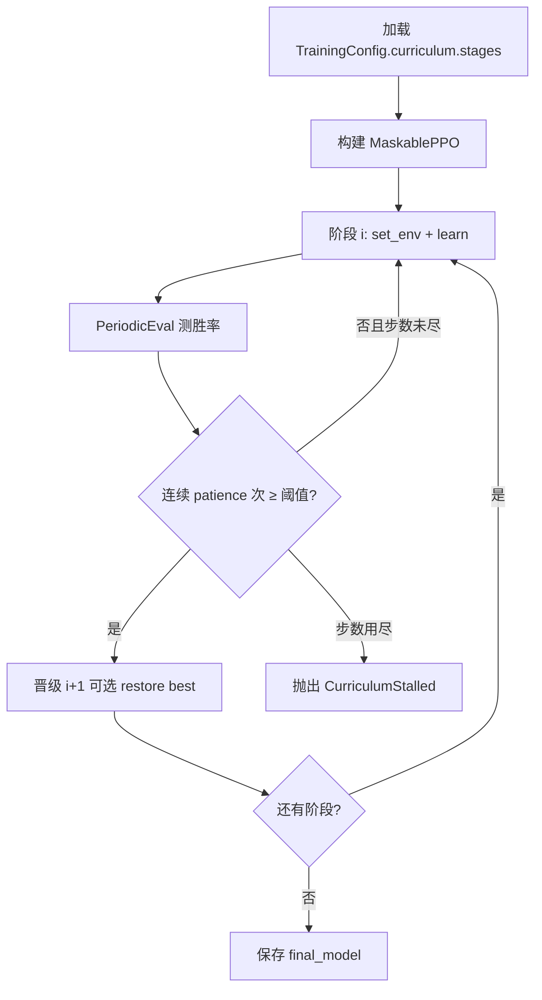

# 课程学习与 Bootstrap

> 返回：[算法总览](overview.md) · [源码总览](../source-analysis/overview.md) · [索引](../AGENTS.md)

---

## 1. 一句话直觉

别一上来就打最强对手、最大地图——先在**简单关卡**学会走路，达标后再解锁下一关；整条「关卡表」就是课程（curriculum），跑通它叫 **bootstrap 冷启动**。

---

## 2. 要解决的问题

- 冷启动 PPO 面对强 Bot + 稀疏胜利条件 → 回报几乎恒定失败 → **优势≈0 → 学不动**（死策略陷阱）。
- 直接上大地图会导致价值函数错位。
- 需要可配置的**阶段序列**、**晋级门槛**、失败时**大声报错**（而不是默默训满步数装成功）。

---

## 3. 核心概念

| 概念 | 含义 |
|------|------|
| **阶段（Stage）** | 一张地图 × 一种对手 ×（可选）奖励/熵覆盖 |
| **晋级胜率** | `promotion_win_rate`：评估胜率需达到的阈值 |
| **耐心 patience** | 连续多少次评估都达标才晋级（防噪声偶然冲线） |
| **阶段预算** | `max_timesteps`：用尽仍未晋级 → 失败 |
| **CurriculumStalled** | 卡关时抛出的异常，带历史与 best checkpoint |
| **MixedBot** | 以概率混合 easy/hard 脚本 Bot，作难度桥 |
| **阶段间恢复最佳** | 晋级前可加载本阶段 `best_model`，减轻策略漂移 |

对手难度阶梯（示意）：`noop` / `balanced_random` / `random` → `simple` → `mixed` → `medium` → `advanced`。

**重要经验**：对 PPO 而言「更弱但完全确定」的对手可能**更难学**（方差为 0）；随机对手往往更「可学」。

---

## 4. 算法步骤



实现入口：`reinforcetactics.rl.bootstrap.run_curriculum`。
晋级逻辑：`rl.callbacks.PromotionCallback`。

---

## 5. 公式与数字例子

### 5.1 晋级判定（概念）

设第 \(k\) 次评估胜率为 \(\hat{w}_k\)（\(n\) 局中的赢的比例）：

\[
\hat{w}_k = \frac{\#\{\text{wins in eval }k\}}{n}
\]

晋级条件（示意）：

\[
\hat{w}_{t-p+1},\;\ldots,\;\hat{w}_t \;\ge\; \tau
\quad\text{且}\quad
\text{阶段内步数} \ge T_{\min}\;(\text{若配置})
\]

| 符号 | 含义 | 配置字段 |
|------|------|----------|
| \(\tau\) | 晋级阈值 | `promotion_win_rate` |
| \(p\) | 连续达标次数 | `patience` |
| \(n\) | 每次评估局数 | `eval.n_eval_episodes` |
| \(T_{\max}\) | 阶段最大步数 | `max_timesteps` |

### 5.2 玩具例

- \(\tau=0.9\)，\(p=2\)，\(n=20\)
- 评估序列胜率：0.85 → 0.95 → 0.92

第 2、3 次连续 ≥0.9 → **晋级**。
若为 0.95 → 0.80 → 0.95，耐心被打断，需重新连满 2 次。

### 5.3 MixedBot 期望难度

\[
\text{每局对手} =
\begin{cases}
\text{hard} & \text{以概率 }p_{\text{hard}}\\
\text{easy} & \text{以概率 }1-p_{\text{hard}}
\end{cases}
\]

**整局**固定 easy 或 hard（不在中途切换），便于策略连贯。
例：`p_hard=0.5`，`easy=simple`，`hard=medium` → 一半对局像 Simple，一半像 Medium。

### 5.4 二项噪声直觉

真胜率 \(w=0.85\)，\(n=20\)：

\[
\mathbb{E}[\hat{w}]=0.85,\quad
\mathrm{Var}(\hat{w})=\frac{w(1-w)}{n}\approx 0.0064,\quad
\mathrm{std}\approx 0.08
\]

单次评估掉到 0.75 并不罕见 → **patience≥2** 有意义。

---

## 6. 在本项目中的实现

| 组件 | 位置 |
|------|------|
| 主循环 | `rl/bootstrap.run_curriculum` |
| 卡关异常 | `rl/bootstrap.CurriculumStalled`（`partial_result()`） |
| 阶段定义 | `rl/config.CurriculumStage`、`CurriculumConfig` |
| 晋级回调 | `rl/callbacks.PromotionCallback` |
| 周期评估 | `rl/callbacks.PeriodicEvalCallback` |
| 熵退火 | `rl/callbacks.EntropyScheduleCallback` |
| 造兵探索 | `purchase_exploration.install_purchase_explore_hook` |
| 阶段 env | `bootstrap.make_stage_env`、`make_maskable_vec_env` |
| MixedBot | `game.bot.MixedBot`（`opponent_kwargs`: `easy`/`hard`/`p_hard`） |
| 脚本入口 | `scripts/train/train_bootstrap.py` |
| 笔记本 | `notebooks/ppo_bootstrap.ipynb` |

源码导读：[../source-analysis/rl-training-pipelines.md](../source-analysis/rl-training-pipelines.md)

配置：`configs/ppo/bootstrap.yaml`（及 `bootstrap_sweep/`）。

---

## 7. 配置与超参（简）

```yaml
algorithm: maskable_ppo
env:
  n_envs: 8
  action_space_type: flat_discrete
  max_steps: 3000
curriculum:
  stages:
    - name: beginner_random
      map_file: maps/1v1/beginner.csv
      opponent: random
      promotion_win_rate: 0.9
      patience: 2
      max_timesteps: 500000
      max_turns: 75
      opponent_kwargs: { max_actions: 20 }
```

| 字段 | 作用 |
|------|------|
| `promotion_win_rate` | \(\tau\) |
| `patience` | 连续达标 |
| `max_timesteps` | 卡关预算 |
| `min_timesteps_before_promotion` | 可选最低训练量（慎用，教训见文档） |
| `ent_coef` 覆盖 / 退火 | 新地图「砸开」旧确定性策略 |
| `reward_config` 覆盖 | 地图几何变化时调整激励 |
| `warm_start_path` | BC 或上轮 checkpoint |
| `pad_to_size` | 跨地图尺寸统一观察（flat） |

---

## 8. 常见误解

1. **「对手越弱越好训」**
   完全确定的 Noop 可能导致零方差；随机弱敌往往更好。

2. **「卡关就加长 max_timesteps」**
   常掩盖奖励/平衡问题；默认应 `CurriculumStalled` 暴露问题。

3. **「阶段末模型 = 阶段最佳」**
   PPO 会漂移；生产路径倾向 **restore best** 再晋级。

4. **「胜率 100% 且 std=0 很棒」**
   可能过拟合确定轨迹，换图即崩。

5. **「课程能修好单位数值失衡」**
   单 Warrior 统治常是**经济数值**问题，不是再加阶段能根治。

---

## 9. 延伸阅读

- 必读：`docs/zh/bootstrap_lessons_learned.md`
- `docs/zh/bootstrap_runs_review.md`、`docs/zh/REVIEW_ppo_training.md`
- 本目录：[ppo.md](ppo.md) · [reward-shaping.md](reward-shaping.md) · [self-play.md](self-play.md) · [behavior-cloning.md](behavior-cloning.md)
- Narvekar et al., *Curriculum Learning for Reinforcement Learning Domains: A Framework and Survey*
