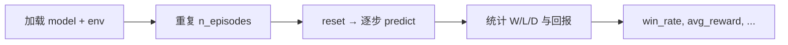

# 评估与 Elo 等级分

> 返回：[算法总览](overview.md) · [源码总览](../source-analysis/overview.md) · [索引](../AGENTS.md)

---

## 1. 一句话直觉

想知道「谁更强」，不能只看一两局运气：用**多局胜率**估实力，用 **Elo** 把胜负换成可加减的分数，方便排天梯。

---

## 2. 要解决的问题

- 单局结果噪声大（地图、先手、随机性）。
- 训练曲线上的 reward **不等于**对真实对手的胜率。
- 多 Bot 两两对战需要**传递性近似**的评分，便于排名与历史比较。

---

## 3. 核心概念

| 概念 | 含义 |
|------|------|
| **胜率** | \(\hat{w} = \#\text{wins}/n\)（可另报平局率） |
| **评估噪声** | 有限 \(n\) 下 \(\hat{w}\) 的统计波动 |
| **确定性评估** | `deterministic=True`：取众数动作，降噪声但可能掩盖随机策略行为 |
| **Elo** | 用期望胜率与实际结果更新的相对评分 |
| **K 因子** | 单场最大分差尺度；越大越「敏感」 |
| **end_reason** | 区分 HQ 胜、歼灭、和棋、步数截断 |

本项目 RL 评估：`evaluate_model`；锦标赛：`tournament/` + `EloRatingSystem`。

---

## 4. 算法步骤

### 4.1 模型评估（`evaluate_model`）

1. 可选固定种子：`seed + i` 使第 \(i\) 局可复现。
2. Maskable 模型自动传 `action_masks`。
3. 汇总 `win_rate`、`avg_reward`、`std_reward`、长度、可选奖励分解。

### 4.2 Elo 更新（`EloRatingSystem.update_ratings`）

1. 取双方当前分 \(R_A,R_B\)。
2. 算期望分 \(E_A,E_B\)。
3. 实际分：胜 1 / 负 0 / 和 0.5。
4. \(R \leftarrow R + K(S-E)\)。

---

## 5. 公式与数字例子

### 5.1 胜率与标准误

\[
\hat{w} = \frac{W}{n},\qquad
\mathrm{SE} \approx \sqrt{\frac{\hat{w}(1-\hat{w})}{n}}
\]

| 符号 | 含义 |
|------|------|
| \(W\) | 胜场 |
| \(n\) | 总局数 |
| \(\mathrm{SE}\) | 标准误（二项近似） |

**玩具例**：\(W=18\)，\(n=30\) → \(\hat{w}=0.6\)，

\[
\mathrm{SE}\approx\sqrt{0.6\times0.4/30}\approx 0.089
\]

粗略 95% 区间约 \(0.6\pm 1.96\times 0.089 \approx [0.43, 0.77]\)——
**30 局仍很宽**；宣称「稳胜」需要更大 \(n\) 或多次评估。

若 \(\hat{w}=1.0\) 且 `std_reward=0`：可能是真强，也可能是**确定性死剧本**（见课程文档）。

### 5.2 Elo 期望得分

\[
E_A = \frac{1}{1 + 10^{(R_B - R_A)/400}}
\]

| 符号 | 含义 |
|------|------|
| \(R_A,R_B\) | A、B 当前 Elo |
| \(E_A\) | A 的期望得分（∈(0,1)） |
| 400 | 经典标度：差 400 分 ≈ 期望 10:1 |

**对称性**：\(E_B = 1 - E_A\)（零和期望）。

**玩具例**：\(R_A=1500\)，\(R_B=1700\)：

\[
E_A = \frac{1}{1+10^{200/400}} = \frac{1}{1+10^{0.5}} \approx \frac{1}{1+3.162} \approx 0.240
\]

\[
E_B \approx 0.760
\]

即弱者仍有约 24%「期望分」（含爆冷）。

### 5.3 Elo 更新

\[
R_A' = R_A + K\,(S_A - E_A)
\]

| 符号 | 含义 | 默认 |
|------|------|------|
| \(K\) | K 因子 | 32 |
| \(S_A\) | 实际得分：胜 1，负 0，和 0.5 | — |

**续上例**：A 爆冷击败 B，\(S_A=1\)，\(K=32\)：

\[
\Delta R_A = 32\times(1-0.240)\approx 24.3,\quad
R_A' \approx 1524.3
\]

\[
\Delta R_B = 32\times(0-0.760)\approx -24.3,\quad
R_B' \approx 1675.7
\]

若双方打平 \(S=0.5\)：

\[
\Delta R_A = 32\times(0.5-0.240)\approx +8.3
\]

（低分者平局「赚分」，高分者「丢分」。）

### 5.4 分差速查

| \(R_B-R_A\) | \(E_A\)（约） |
|-------------|---------------|
| 0 | 0.50 |
| 100 | 0.36 |
| 200 | 0.24 |
| 400 | 0.09 |

---

## 6. 在本项目中的实现

| 组件 | 位置 |
|------|------|
| RL 评估 | `rl/evaluation.evaluate_model` |
| 动作名 / 奖励分量常量 | `ACTION_TYPE_NAMES`、`REWARD_COMPONENTS`、`END_REASONS` |
| CLI 评估 | `cli/commands.evaluate_mode` |
| 脚本 | `scripts/eval_agent.py` |
| Elo | `tournament/elo.EloRatingSystem` |
| 锦标赛 | `tournament/runner.TournamentRunner` |
| 赛程 | `tournament/schedule.generate_round_robin_schedule` |
| 结果 | `tournament/results.*` |
| 入口 | `scripts/tournament.py`、`docker/tournament/` |

`calculate_expected_score` 与 `update_ratings` 实现上文公式。

源码导读：

- [../source-analysis/tournament-system.md](../source-analysis/tournament-system.md)
- [../source-analysis/rl-training-pipelines.md](../source-analysis/rl-training-pipelines.md)

可视化：`rl/viz.plot_eval_curves` 等。

---

## 7. 配置与超参（简）

### RL 评估（`EvalConfig` / 函数参数）

| 参数 | 作用 |
|------|------|
| `n_episodes` / `n_eval_episodes` | 局数 \(n\) |
| `deterministic` | 是否贪心动作 |
| `eval_freq` | 训练中评估间隔 |
| `seed` | 可复现序列 |
| `track_breakdown` | 动作与奖励分量统计 |
| `trace_dir` | 导出截断等轨迹 JSONL |

### Elo / 锦标赛

| 参数 | 默认 | 作用 |
|------|------|------|
| `starting_elo` | 1500 | 初始分 |
| `k_factor` | 32 | \(K\) |
| 每对局数 / 地图 | 锦标赛配置 | 降噪声 |

---

## 8. 常见误解

1. **「训练 reward 升高 = 更会赢」**
   塑形可抬高 reward 而不提高胜率。

2. **「n=10 胜率 70% 就够晋级」**
   噪声大；课程用 `patience` 多次评估有道理。

3. **「Elo 是绝对实力」**
   只是**当前对手池内**的相对分；换池会变。

4. **「和棋不改 Elo」**
   改；\(S=0.5\)，相对期望仍更新。

5. **「确定性 Bot 多局 = 多样本」**
   可能只是重复轨迹；有效 \(n\) ≈ 唯一对局数（见平衡分析文档）。

6. **「截断局算输」**
   `evaluate_model` 按 env 终局信息区分 draw/truncate；解读时看 `end_reason`。

---

## 9. 延伸阅读

- Elo, *The Rating of Chessplayers, Past and Present*
- 二项比例置信区间（Wilson）在小样本更稳
- 本目录：[curriculum-bootstrap.md](curriculum-bootstrap.md) · [self-play.md](self-play.md) · [ppo.md](ppo.md)
- `docs/zh/balance_analysis_lessons_learned.md`（评估伪影与重复轨迹）
- 用户文档：`docs-site/zh/docs/tournament-system.md`（若存在）
