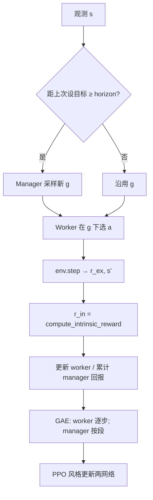

# Feudal RL（分层经理—工人）

> 返回：[算法总览](overview.md) · [源码总览](../source-analysis/overview.md) · [索引](../AGENTS.md)

---

## 1. 一句话直觉

**经理**每隔一段时间下达「去哪、干什么」（目标），**工人**每一步执行具体微动作；工人既听环境发的「外在工资」，也听「有没有靠近目标」的**内在奖金**。

---

## 2. 要解决的问题

- 平坦 PPO 在长地平线上信用分配难（上百步后才胜利）。
- 希望高层学战略（攻/守/占/扩），低层学操作。
- 可选**自回归动作头**缓解 MultiDiscrete 掩码过近似。

---

## 3. 核心概念

| 概念 | 符号/代码 | 含义 |
|------|-----------|------|
| Manager | `ManagerNetwork` | 输出目标 \(g=(\text{goal\_x},\text{goal\_y},\text{goal\_type})\) |
| Worker | `WorkerNetwork` / AR | 在 \(g\) 条件下选微动作 |
| Manager 地平线 | `manager_horizon` \(H_m\) | 每隔 \(H_m\) 个 worker 步重设目标 |
| 内在奖励 | \(r^{\text{in}}\) | 目标达成/靠近（`compute_intrinsic_reward`） |
| 外在奖励 | \(r^{\text{ex}}\) | 环境 `reward` |
| Worker 混合 | \(\alpha\) | `worker_reward_alpha` 混合内外奖励 |
| 段（segment） | \(k_t\) | 一个 manager 目标持续的 worker 步数 |
| GAE 段折扣 | \(\gamma^{k_t}\) | Manager 的优势按段长折扣 |

**目标类型**（代码）：0=attack，1=defend，2=capture，3=expand。

---

## 4. 算法步骤

实现主类：`reinforcetactics.rl.feudal_rl.FeudalRLAgent`。
缓冲：`FeudalRolloutBuffer`（`end_manager_segment`）。

---

## 5. 公式与数字例子

### 5.1 Worker 奖励混合（概念）

配置中 `worker_reward_alpha` 与 `reward_scale` 控制尺度；直觉上：

\[
r^{\text{w}}_t = \alpha\, r^{\text{in}}_t + (1-\alpha)\, c\, r^{\text{ex}}_t
\]

（\(c\) 为 `reward_scale`；具体拼装以 `collect_rollout` 实现为准。）

| 符号 | 含义 |
|------|------|
| \(r^{\text{in}}\) | 内在 |
| \(r^{\text{ex}}\) | 外在 |
| \(\alpha\) | 内在权重 |
| \(c\) | 外在缩放，防 ±大终局撑爆价值 |

### 5.2 内在奖励（与代码一致的结构）

`compute_intrinsic_reward(next_state, goal)`：

1. 若己方无单位：返回 \(-10\)。
2. 曼哈顿距离到目标的最近己方单位：

\[
d_{\min} = \min_i \big(|y_i - g_y| + |x_i - g_x|\big)
\]

\[
r \leftarrow -0.1\, d_{\min}
\]

3. 单位站在目标格：\(r \leftarrow r + 5\)。
4. 按 `goal_type` 加成：

| type | 额外逻辑（摘要） |
|------|------------------|
| 0 attack | 目标附近（≤3）敌人数 \(\times 1.0\) |
| 1 defend | 在目标再 +3；目标在己方地再 +2 |
| 2 capture | 目标格为可占领建筑再 +4 |
| 3 expand | 距目标 ≤4 的己方单位数 \(\times 0.5\) |

**玩具例**：目标 \((g_x,g_y)=(3,1)\)，type=2；最近己方单位在 \((3,2)\)：

\[
d_{\min}=|2-1|+|3-3|=1,\quad r=-0.1
\]

若下一步走到 \((3,1)\) 且该格为建筑：

\[
r = -0.1\cdot 0 + 5 + 4 = 9
\]

### 5.3 Manager 段 GAE

对 manager 时间索引 \(t\)，段长 \(k_t\)（worker 步数）：

\[
\delta_t = R_t + \gamma^{k_t} V(s_{t+1})(1-d_t) - V(s_t)
\]

\[
A_t = \delta_t + \gamma^{k_t}\lambda (1-d_t) A_{t+1}
\]

| 符号 | 含义 |
|------|------|
| \(R_t\) | 该段累计外在回报（实现中的 manager 回报） |
| \(k_t\) | `segment_lengths[t]` |
| \(\gamma^{k_t}\) | 跨过 \(k_t\) 个底层步的折扣 |

**数字**：\(\gamma=0.99\)，\(k=10\) → \(\gamma^{10}\approx 0.904\)，
约等于「底层走 10 步才换一次目标」时的折扣。

### 5.4 Horizon

`manager_horizon=10`：每 10 个 env 步（或段逻辑触发时）经理重选目标。
过短 → 高层噪声；过长 → 目标过时。

---

## 6. 在本项目中的实现

| 组件 | 位置 |
|------|------|
| 智能体 | `rl/feudal_rl.FeudalRLAgent` |
| Manager / Worker 网 | `ManagerNetwork`、`WorkerNetwork` |
| AR 头 | `AutoregressiveActionHead`、`AutoregressiveWorkerNetwork` |
| 内在奖励 | `compute_intrinsic_reward` |
| GAE | `_compute_gae(..., segment_lengths=...)` |
| 掩码 | `StructuredMaskProvider`、`_apply_action_masks` |
| 配置 | `rl/config.FeudalConfig` |
| YAML | `configs/feudal/feudal_rl.yaml` |
| 脚本 | `scripts/train/train_feudal_rl.py` |
| 笔记本 | `notebooks/feudal_rl_training.ipynb` |
| 评测模型 Bot | `game/model_bot.py`（feudal/AR 推理） |

源码导读：[../source-analysis/rl-advanced-trainers.md](../source-analysis/rl-advanced-trainers.md)

项目笔记：`docs/zh/feudal_rl_review.md`。

---

## 7. 配置与超参（简）

| 字段 | 默认 | 作用 |
|------|------|------|
| `manager_horizon` | 10 | 目标刷新间隔 |
| `worker_reward_alpha` | 0.5 | 内外奖励混合 |
| `manager_lr_scale` / `worker_lr_scale` | 1.0 | 分层学习率倍率 |
| `autoregressive_worker` | False | 是否 AR worker |
| `reward_scale` | 1.0 | 外在奖励缩放 |

PPO 共享超参仍来自 `ppo:`（gamma、gae_lambda、clip 等）。

---

## 8. 常见误解

1. **「有了分层就不用奖励设计」**
   内在奖励本身就是塑形；目标差仍会带偏。

2. **「Manager 每步都决策更好」**
   失去时间抽象，退化成难训的双策略。

3. **「内在奖励应远大于终局」**
   会忽略胜负；`reward_scale` 与 \(\alpha\) 需平衡。

4. **「Feudal 与 MaskablePPO checkpoint 通用」**
   网络结构不同；加载需对应 `ModelBot` 分支。

5. **「segment_lengths 可忽略」**
   忽略则 manager 的折扣时间尺度错误。

---

## 9. 延伸阅读

- Vezhnevets et al., *FeUdal Networks for Hierarchical Reinforcement Learning* (FuN)
- 本目录：[action-masking.md](action-masking.md) · [reward-shaping.md](reward-shaping.md) · [ppo.md](ppo.md)
- 测试：`tests/test_feudal_rl.py`、`tests/test_feudal_rl_integration.py`
