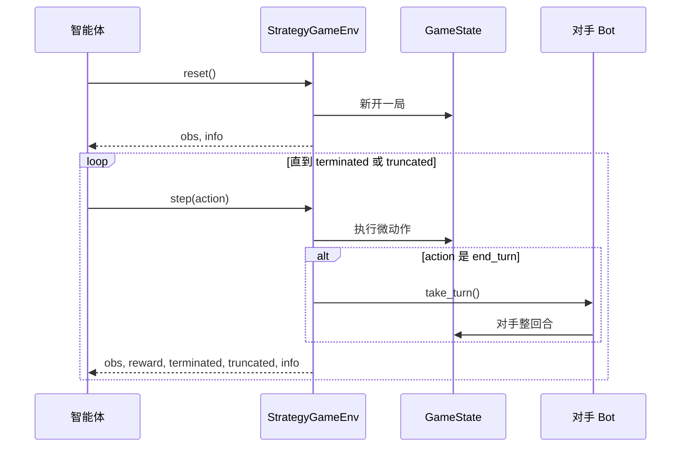

# MDP 与 Gymnasium 基础

> 返回：[算法总览](overview.md) · [源码总览](../source-analysis/overview.md) · [索引](../AGENTS.md)

---

## 1. 一句话直觉

把「学下棋」抽象成：看局面 → 选一步 → 拿分 → 看新局面；反复这样做，目标是**整局结束时累计得分尽量高**。

---

## 2. 要解决的问题

- 没有老师逐手告诉你「这一步标答是什么」。
- 好结果往往**很晚**才出现（例如只有赢棋才 +1000）。
- 需要一套标准接口，让同一套训练代码能换不同游戏/地图。

本项目用 **MDP（马尔可夫决策过程）** 描述问题，用 **Gymnasium** 的 `reset` / `step` 把回合制策略游戏包装成可训练环境。

---

## 3. 核心概念

### 3.1 MDP 五元组

一个 MDP 通常写成：

\[
\mathcal{M} = (\mathcal{S}, \mathcal{A}, P, R, \gamma)
\]

| 符号 | 含义 | 白话 |
|------|------|------|
| \(\mathcal{S}\) | 状态集合 | 所有可能局面 |
| \(\mathcal{A}\) | 动作集合 | 所有可能操作 |
| \(P(s'\|s,a)\) | 转移概率 | 在 \(s\) 做 \(a\) 后到 \(s'\) 的概率 |
| \(R(s,a)\) 或 \(r_t\) | 奖励 | 这一步拿到的即时分数 |
| \(\gamma \in [0,1]\) | 折扣因子 | 未来奖励打几折（越近越重要） |

**马尔可夫性**：下一步只依赖当前状态与动作，不需要整段历史。
实践中智能体常只能看到**观察** \(o_t\)（例如有战争迷雾），这是 POMDP；本项目默认可关雾，观察近似完整。

### 3.2 轨迹与回报

一条轨迹（trajectory）：

\[
\tau = (s_0, a_0, r_1, s_1, a_1, r_2, \ldots)
\]

从时刻 \(t\) 起的**折扣回报**（return）：

\[
G_t = r_{t+1} + \gamma r_{t+2} + \gamma^2 r_{t+3} + \cdots = \sum_{k=0}^{\infty} \gamma^k r_{t+1+k}
\]

| 符号 | 含义 |
|------|------|
| \(G_t\) | 从 \(t\) 之后能拿到的「总价值」 |
| \(r_{t+k}\) | 第 \(k\) 步后的即时奖励 |
| \(\gamma\) | 每远一步，奖励乘一次 \(\gamma\) |

### 3.3 Gymnasium API

| 调用 | 返回（要点） | 含义 |
|------|--------------|------|
| `reset()` | `obs, info` | 开新局，拿到初始观察 |
| `step(action)` | `obs, reward, terminated, truncated, info` | 执行一步 |

**`terminated` vs `truncated`（极易混）：**

| 标志 | 何时为真 | 含义 |
|------|----------|------|
| `terminated` | 规则上对局结束（赢/输/和棋） | **真正的终局**；价值不再自举到未来 |
| `truncated` | 外部截断（如 env 步数到 `max_steps`） | **人为掐断**；训练器通常还会用 \(V(s')\) 估剩余价值 |

本项目 `StrategyGameEnv`：

- `terminated = game_state.game_over`（占领 HQ、歼灭、`max_turns` 和棋等）
- `truncated = current_step >= max_steps`

### 3.4 本项目的「一步」≠「一整回合」

| 概念 | 含义 |
|------|------|
| **Env 步** | 智能体一次微动作：造单位、移动、攻击、`end_turn`… |
| **游戏回合** | 当前玩家操作完后 `end_turn`，对手走完一整回合 |

一局可有**成百上千**个 env 步。

---

## 4. 算法步骤（智能体与环境交互）



---

## 5. 公式与数字玩具例

### 5.1 折扣回报

设 \(\gamma = 0.9\)，某条短轨迹奖励序列为：

\[
r_1=1,\quad r_2=2,\quad r_3=10
\]

从 \(t=0\) 起：

\[
G_0 = 1 + 0.9\cdot 2 + 0.9^2\cdot 10 = 1 + 1.8 + 8.1 = 10.9
\]

若把大奖励放在更远：\(r_1=10, r_2=2, r_3=1\)：

\[
G_0 = 10 + 0.9\cdot 2 + 0.9^2\cdot 1 = 10 + 1.8 + 0.81 = 12.61
\]

**直觉**：同样三步总分不同时，\(\gamma\) 会改变「晚拿分」是否划算；\(\gamma=1\) 时不打折，\(\gamma\to 0\) 时几乎只看下一步。

### 5.2 与本环境默认终局奖励的对照（量级）

默认 `reward_config` 量级（可被 YAML 覆盖）：

| 键 | 默认量级 | 角色 |
|----|----------|------|
| `win` | \(+1000\) | 终局赢 |
| `loss` | \(-1000\) | 终局输 |
| `draw` | \(-200\) | 和棋 |
| `kill` | \(+5\) | 击杀塑形 |
| `capture` | \(+200\) | 占领建筑等 |

若一局只在第 50 个 env 步赢棋，中间塑形总和为 \(S\)，则粗略：

\[
G_0 \approx S_{\text{折扣后}} + \gamma^{49}\cdot 1000
\]

\(\gamma=0.99\) 时 \(\gamma^{49}\approx 0.61\)，终局 +1000 在起点仍约值 610——说明**长局中折扣很重要**。

---

## 6. 在本项目中的实现

| 概念 | 代码落点 |
|------|----------|
| 环境类 | `reinforcetactics.rl.gym_env.StrategyGameEnv` |
| 观察构造 | `reinforcetactics.rl.observation.build_observation` |
| 动作掩码 | `action_masks()` / `build_per_dim_masks` / `build_structured_masks` |
| `reset` / `step` | `StrategyGameEnv.reset`, `StrategyGameEnv.step` |
| `terminated` / `truncated` | `step` 内：`game_over` vs `current_step >= max_steps` |
| `end_reason` | `hq_capture` / `elimination` / `max_turns_draw` / `max_steps_truncate` |
| 折扣 \(\gamma\)（塑形用） | 构造参数 `gamma`（应与训练器一致） |

源码导读：[../source-analysis/rl-gym-env.md](../source-analysis/rl-gym-env.md) · [../source-analysis/overview.md](../source-analysis/overview.md)

典型片段语义：

```python
# step 末尾（语义示意）
terminated = self.game_state.game_over
truncated = self.current_step >= self.max_steps
return obs, reward, terminated, truncated, info
```

CLI 快速训练也会构造该环境：`reinforcetactics.cli.commands.train_mode`。

---

## 7. 配置与超参（简）

| 参数 | 作用 | 常见值 |
|------|------|--------|
| `max_steps` | env 步上限 → 触发 `truncated` | bootstrap 常用 3000 |
| `max_turns` | 游戏回合上限 → 常为和棋 `terminated` | 20–200 视地图 |
| `gamma` | 折扣（塑形与 PPO 应一致） | 0.99 |
| `map_file` | 地图 CSV | `maps/1v1/*.csv` |
| `opponent` | 环境内对手 | `simple` / `random` / `self`… |
| `fog_of_war` | 是否部分可观测 | 默认 `False` |
| `action_space_type` | `multi_discrete` 或 `flat_discrete` | 课程常用 flat |

配置入口：`reinforcetactics.rl.config.EnvConfig`、`configs/ppo/*.yaml`。

---

## 8. 常见误解

1. **「一步 = 一整回合」**
   否。一步只是一个微动作；`end_turn` 才会让对手整回合。

2. **「`truncated` 也是输了」**
   否。截断只是步数用尽；默认 truncation 终端奖常为 0，PPO 会对截断做价值自举。

3. **「观察 = 完整状态」**
   开雾时是部分观察；编码是 agent-relative（自己/对手通道），不是全局上帝视角标签。

4. **「奖励 = UI 上的游戏得分」**
   否。`reward_config` 是**训练信号**，可任意塑形。

5. **「和棋一定是 `truncated`」**
   否。`max_turns` 到时通常是 `terminated` + `winner is None`（`max_turns_draw`）。

---

## 9. 延伸阅读

- 本目录：[ppo.md](ppo.md) · [action-masking.md](action-masking.md) · [reward-shaping.md](reward-shaping.md)
- Gymnasium 文档：`reset` / `step` 与 terminated/truncated 语义
- Sutton & Barto《Reinforcement Learning: An Introduction》第 3 章（MDP）
- 项目经验：`docs/zh/bootstrap_lessons_learned.md`（冷启动与方差）
