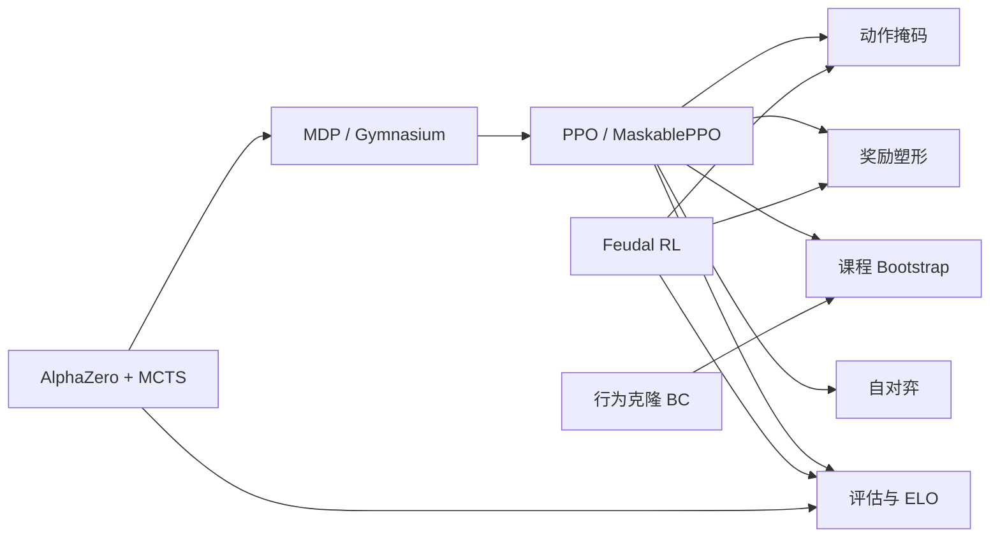

# 强化学习算法总览（零基础入口）

> 返回：[索引](../AGENTS.md) · [源码总览](../source-analysis/overview.md)

本目录说明 **本仓库实际用到的** 强化学习（Reinforcement Learning, RL）概念与算法。
目标：即使你从未学过 RL，也能建立直觉，并知道「概念 → 代码」落在哪里。

---

## 1. RL 是什么（直觉）

把智能体想象成一个正在学下棋的玩家：

1. **看局面**（观察 observation）
2. **选一步操作**（动作 action）
3. **环境给出结果**（新局面 + 奖励 reward）
4. 重复，目标是 **长期累计奖励尽量高**

与监督学习不同：没有现成「正确标签」；反馈常常 **延迟**（例如只有赢棋才有大奖励）。

本项目把「棋」换成回合制策略：建造单位、移动、攻击、占领总部。

---

## 2. 本仓库算法地图

| 文档 | 你将学到 | 主要代码 |
|------|----------|----------|
| [mdp-gymnasium-basics.md](mdp-gymnasium-basics.md) | 状态/动作/奖励、折扣、Gym 的 `reset/step` | `rl/gym_env.py` |
| [ppo.md](ppo.md) | 策略梯度、clip、Actor-Critic 直觉 | SB3 + `cli/commands.py` |
| [action-masking.md](action-masking.md) | 为什么要屏蔽非法动作、MultiDiscrete 局限 | `masking.py`, `gym_env` |
| [reward-shaping.md](reward-shaping.md) | 稀疏 vs 稠密、potential-based | `reward_config` in env |
| [curriculum-bootstrap.md](curriculum-bootstrap.md) | 由易到难阶段与晋升 | `rl/bootstrap.py` |
| [self-play.md](self-play.md) | 与自己/历史快照对打 | `rl/self_play.py` |
| [behavior-cloning.md](behavior-cloning.md) | 用专家演示初始化策略 | `rl/imitation.py` |
| [feudal-rl.md](feudal-rl.md) | Manager 定目标、Worker 执行 | `rl/feudal_rl.py` |
| [alphazero-mcts.md](alphazero-mcts.md) | 搜索 + 神经网络 | `mcts.py`, `alphazero_*` |
| [evaluation-and-elo.md](evaluation-and-elo.md) | 胜率噪声、ELO 更新 | `evaluation.py`, `tournament/elo.py` |

---

## 3. 术语小词典

| 术语 | 符号/英文 | 白话 |
|------|-----------|------|
| 智能体 | agent | 做决策的程序 |
| 环境 | environment | 游戏规则 + 对手 |
| 状态 / 观察 | \(s\) / \(o\) | 完整状态 vs 智能体看到的（可有战争迷雾） |
| 动作 | \(a\) | 一次操作；本项目 env 步 = 微动作 |
| 奖励 | \(r\) | 即时打分信号 |
| 轨迹 | trajectory | \(o_0,a_0,r_1,o_1,\ldots\) |
| 回报 | return \(G\) | 折扣后的累计奖励 |
| 折扣 | \(\gamma\) | 更看重近期还是远期（常 0.99） |
| 策略 | \(\pi(a\|o)\) | 在观察下选动作的概率 |
| 价值 | \(V(o)\) | 从该观察出发的期望回报 |
| 回合结束 | terminated | 按规则赢/输/和 |
| 截断 | truncated | 步数上限等外部停止 |

---

## 4. 本项目的「一步」与「一回合」

这是初学者最容易混淆的点：

| 概念 | 含义 | 代码 |
|------|------|------|
| **Env 步** | 智能体做 **一个** 微动作（移动一个单位、打一下…） | `StrategyGameEnv.step` |
| **游戏回合** | 当前玩家可操作多个单位后 `end_turn` | `GameState.end_turn` |
| **对手回合** | 智能体 `end_turn` 后，环境内循环调用对手 `take_turn` | `_opponent_turn` |

因此：一局游戏可能有 **成百上千个 env 步**。这会影响信用分配（见 [reward-shaping](reward-shaping.md)、[ppo](ppo.md)）。

源码说明：[../source-analysis/rl-gym-env.md](../source-analysis/rl-gym-env.md)

---

## 5. 训练路径怎么选

| 目标 | 建议路径 | 算法文 |
|------|----------|--------|
| 最快跑通「能训练」 | `main.py --mode train --algorithm ppo` | [ppo](ppo.md) |
| 认真冲过弱 Bot 课程 | bootstrap YAML | [curriculum-bootstrap](curriculum-bootstrap.md) |
| 没有专家时继续变强 | self-play | [self-play](self-play.md) |
| 用演示热启动 | BC + PPO | [behavior-cloning](behavior-cloning.md) |
| 分层目标实验 | feudal | [feudal-rl](feudal-rl.md) |
| 规划 + 网络 | AlphaZero | [alphazero-mcts](alphazero-mcts.md) |
| 比强弱 | tournament | [evaluation-and-elo](evaluation-and-elo.md) |

源码入口：[../source-analysis/scripts-configs-maps.md](../source-analysis/scripts-configs-maps.md)

---

## 6. 推荐学习顺序

1. **本文**
2. [mdp-gymnasium-basics.md](mdp-gymnasium-basics.md)
3. [ppo.md](ppo.md) + [action-masking.md](action-masking.md)
4. [reward-shaping.md](reward-shaping.md)
5. [curriculum-bootstrap.md](curriculum-bootstrap.md)（可配合 `docs/zh/bootstrap_lessons_learned.md`）
6. 按兴趣：自对弈 / BC / Feudal / AlphaZero
7. [evaluation-and-elo.md](evaluation-and-elo.md)

每篇结构统一：**直觉 → 问题 → 步骤 → 公式（带符号解释与数字例子）→ 本仓库代码 → 常见误解**。

---

## 7. 与源码分析的关系

| 算法主题 | 源码文档 |
|----------|----------|
| Env / 观察 / 掩码 / 奖励 | [rl-gym-env.md](../source-analysis/rl-gym-env.md) |
| Bootstrap / 自对弈 / 配置 | [rl-training-pipelines.md](../source-analysis/rl-training-pipelines.md) |
| Feudal / AlphaZero / BC | [rl-advanced-trainers.md](../source-analysis/rl-advanced-trainers.md) |
| 规则对手作为「环境一部分」 | [game-bots.md](../source-analysis/game-bots.md) |
| 锦标赛梯子 | [tournament-system.md](../source-analysis/tournament-system.md) |

---

## 8. 公式书写约定

全文公式尽量满足：

1. 先用白话说「在算什么」
2. 再写公式
3. **逐符号解释**
4. 给一个小数字例子

若某文中公式与 Stable-Baselines3 默认实现细节略有出入，以「直觉正确 + 指向代码」为准，并注明 SB3 黑盒封装。
