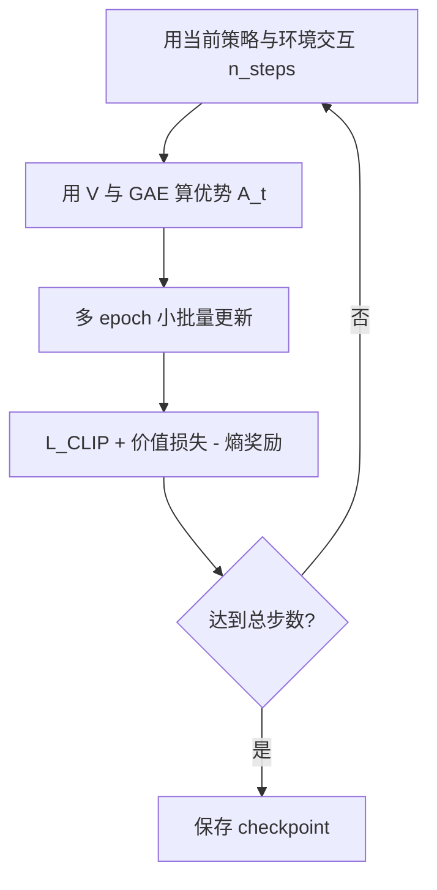

> 返回：[算法总览](overview.md) · [源码总览](../source-analysis/overview.md) · [索引](../AGENTS.md)

# PPO（近端策略优化）

---

## 1. 一句话直觉

一边用**演员（Actor）**试着选更好的招，一边用**评论家（Critic）**估计「这盘棋大概值多少分」；每次更新策略时**别改太猛**（用 clip 卡住），以免学崩。

---

## 2. 要解决的问题

- **策略梯度**直接最大化期望回报，但步长一大就容易崩盘。
- 纯策略方法方差高；需要价值估计与优势（advantage）来降噪。
- 本项目动作空间巨大且带掩码，需要稳定的 on-policy 算法（本仓库主力是 **MaskablePPO**）。

---

## 3. 核心概念

| 概念 | 符号 | 白话 |
|------|------|------|
| 策略 | \(\pi_\theta(a\|o)\) | 参数 \(\theta\) 的「在观察 \(o\) 下选动作 \(a\)」的概率 |
| 价值 | \(V_\phi(o)\) | 从观察 \(o\) 出发，期望还能拿多少回报 |
| 优势 | \(A_t\) | 「这一步比平均好多少」；正→鼓励，负→抑制 |
| 重要性比率 | \(r_t(\theta)\) | 新策略相对采样时旧策略，概率变了多少倍 |
| Clip | \(\epsilon\) | 限制 \(r_t\) 别偏离 1 太远（常 0.2） |
| GAE | \(\lambda\) | 用多步 TD 折中偏差与方差，估 \(A_t\) |

**Actor-Critic**：Actor 更新 \(\pi\)，Critic 拟合 \(V\)；两者共享特征时很常见（SB3 默认）。

**On-policy**：用**当前策略**采的数据更新；数据用几次就丢（相对 DQN 的 replay）。

---

## 4. 算法步骤

1. **采样**：并行 env 跑若干步，存 \((o,a,\log\pi_{\text{old}},r,\text{done})\)。
2. **估价值 / 优势**：GAE → \(A_t\)，回报目标 \(R_t = A_t + V(o_t)\)。
3. **更新策略**：最大化 clip 目标（见下）。
4. **更新价值**：让 \(V\) 拟合 \(R_t\)。
5. **熵项**：鼓励探索（`ent_coef`）。

本项目带掩码时：采样与 log-prob **只在合法动作上**归一化（`MaskablePPO`）。

---

## 5. 公式、符号与数字例子

### 5.1 策略梯度直觉

目标：最大化期望回报 \(J(\theta)=\mathbb{E}_{\tau\sim\pi_\theta}[G_0]\)。
策略梯度（示意）：

\[
\nabla_\theta J(\theta) \propto \mathbb{E}\big[\nabla_\theta \log \pi_\theta(a_t\|o_t)\, A_t\big]
\]

| 符号 | 含义 |
|------|------|
| \(\theta\) | 策略网络参数 |
| \(\log \pi_\theta(a_t\|o_t)\) | 选中动作的对数概率 |
| \(A_t\) | 优势：做得好比预期好则 \(>0\) |

### 5.2 重要性比率

\[
r_t(\theta) = \frac{\pi_\theta(a_t\|o_t)}{\pi_{\theta_{\text{old}}}(a_t\|o_t)}
\]

| 符号 | 含义 |
|------|------|
| \(\pi_\theta\) | 正在更新的新策略 |
| \(\pi_{\theta_{\text{old}}}\) | 采样时的旧策略 |
| \(r_t\) | 新/旧概率比；=1 表示没变 |

### 5.3 PPO Clip 目标 \(L^{\text{CLIP}}\)

\[
L^{\text{CLIP}}(\theta) = \mathbb{E}_t\Big[
\min\big(
r_t(\theta)\,A_t,\;
\text{clip}(r_t(\theta), 1-\epsilon, 1+\epsilon)\,A_t
\big)
\Big]
\]

| 符号 | 含义 |
|------|------|
| \(\epsilon\) | 裁剪宽度，本仓库默认常 `clip_range=0.2` |
| \(\text{clip}(r,1-\epsilon,1+\epsilon)\) | 把 \(r\) 限制在 \([1-\epsilon,1+\epsilon]\) |
| \(\min(\cdot)\) | 取悲观的一边，防止为抬高目标而大幅改概率 |

**数字玩具例**（单样本）：

- 旧策略 \(\pi_{\text{old}}(a\|o)=0.25\)，新策略 \(\pi_\theta(a\|o)=0.40\)
  → \(r = 0.40/0.25 = 1.6\)
- \(\epsilon=0.2\) → clip 上界 \(1.2\)
- 若 \(A_t = +2\)（好动作）：
  - 未 clip 项：\(1.6\times 2 = 3.2\)
  - clip 项：\(1.2\times 2 = 2.4\)
  - \(\min = 2.4\) → **不允许**靠把概率涨到 1.6 倍无限抬目标
- 若 \(A_t = -2\)（坏动作）：
  - 未 clip：\(1.6\times(-2)=-3.2\)
  - clip：\(1.2\times(-2)=-2.4\)
  - \(\min=-3.2\) → 仍惩罚「把坏动作概率抬高」

### 5.4 GAE 直觉（广义优势估计）

一步 TD 误差：

\[
\delta_t = r_{t+1} + \gamma V(o_{t+1})(1-d_t) - V(o_t)
\]

GAE：

\[
A_t^{\text{GAE}(\gamma,\lambda)} = \sum_{l=0}^{\infty}(\gamma\lambda)^l \delta_{t+l}
\]

| 符号 | 含义 | 本仓库默认 |
|------|------|------------|
| \(\gamma\) | 折扣 | 0.99 |
| \(\lambda\) | GAE 平滑 | 0.95（`gae_lambda`） |
| \(d_t\) | 是否终止（实现细节上与 done 标志相关） | — |

- \(\lambda\to 0\)：几乎只用一步 TD，偏差大、方差小
- \(\lambda\to 1\)：更接近蒙特卡洛，方差大

**极简数字**：\(V(o_0)=5, V(o_1)=6, r_1=2, \gamma=0.99, d_0=0\)

\[
\delta_0 = 2 + 0.99\cdot 6 - 5 = 2.94
\]

若后面 \(\delta\) 为 0，则 \(A_0\approx 2.94\)（\(\lambda\) 只影响后续累加）。

---

## 6. 在本项目中的实现

| 用途 | 落点 |
|------|------|
| 简单 CLI PPO | `cli/commands.py` → `train_mode`：`stable_baselines3.PPO` |
| 正式课程 / 掩码 | `rl/bootstrap.py` → `MaskablePPO`（sb3-contrib） |
| 掩码向量环境 | `rl/masking.make_maskable_vec_env` |
| 超参数据类 | `rl/config.PPOConfig`（`as_sb3_kwargs`） |
| 评估 | `rl/evaluation.evaluate_model`（自动探测 `action_masks`） |
| 空间特征 | `rl/extractors.SpatialFeatureExtractor`（可选 policy_kwargs） |

**注意**：`main.py --mode train` 的简易路径是**不带动作掩码**的普通 PPO；严肃训练请走 `configs/ppo/bootstrap.yaml` + `scripts/train/train_bootstrap.py` 或 Maskable 配置。

源码导读：

- [../source-analysis/rl-training-pipelines.md](../source-analysis/rl-training-pipelines.md)
- [../source-analysis/rl-gym-env.md](../source-analysis/rl-gym-env.md)
- [../source-analysis/entrypoints-and-cli.md](../source-analysis/entrypoints-and-cli.md)

配套算法：[action-masking.md](action-masking.md) · [curriculum-bootstrap.md](curriculum-bootstrap.md)

---

## 7. 配置与超参（简）

`PPOConfig` / YAML `ppo:` 段常用字段：

| 字段 | 默认直觉 | 作用 |
|------|----------|------|
| `learning_rate` | `3e-4` | 步长 |
| `n_steps` | 2048 | 每次更新前每 env 采样步数 |
| `batch_size` | 64 | 小批量 |
| `n_epochs` | 10 | 同一批数据复用轮数 |
| `gamma` | 0.99 | 折扣（须与 env 塑形 gamma 一致） |
| `gae_lambda` | 0.95 | GAE |
| `clip_range` | 0.2 | \(\epsilon\) |
| `ent_coef` | 常 0.01–0.05 | 熵系数；课程早期可更大 |
| `vf_coef` | 0.5 | 价值损失权重 |
| `max_grad_norm` | 0.5 | 梯度裁剪 |
| `use_action_masking` | True | 是否走 Maskable |
| `purchase_explore_eps` | 0 | 造兵 unit_type 探索（bootstrap 专用） |

示例配置：`configs/ppo/maskable_ppo.yaml`、`configs/ppo/bootstrap.yaml`。

---

## 8. 常见误解

1. **「PPO 是 off-policy，能像 DQN 一样无限重放」**
   否。本质 on-policy；clip 只允许**小幅**偏离采样策略。

2. **「clip 保证绝对不崩」**
   否。只是降低风险；奖励尺度爆炸、价值拟合失败仍会崩。

3. **「胜率 100% 且 reward std=0 一定学得很好」**
   可能是**死策略 / 过拟合确定性环境**（见 bootstrap 教训）。

4. **「CLI 的 PPO 和 MaskablePPO 一样」**
   否。无掩码时非法动作依赖 env 惩罚，学习更难。

5. **「提高 n_epochs 总更好」**
   过多 epoch 会把 on-policy 数据用过头，近似 KL 飙升。

---

## 9. 延伸阅读

- Schulman et al., *Proximal Policy Optimization Algorithms* (2017)
- Schulman et al., *High-Dimensional Continuous Control Using Generalized Advantage Estimation*
- Stable-Baselines3 PPO 文档；sb3-contrib `MaskablePPO`
- 项目：`docs/zh/REVIEW_ppo_training.md`、`docs/zh/bootstrap_lessons_learned.md`
- 本目录：[mdp-gymnasium-basics.md](mdp-gymnasium-basics.md) · [reward-shaping.md](reward-shaping.md)
