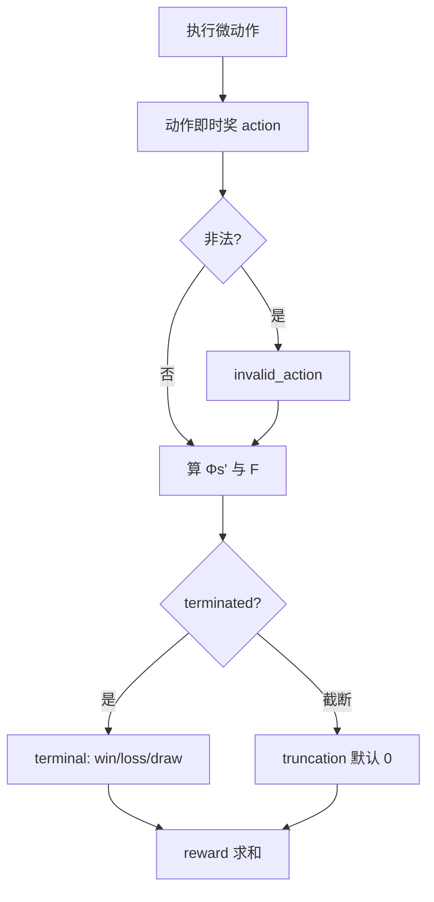

# 奖励塑形（Reward Shaping）

> 返回：[算法总览](overview.md) · [源码总览](../source-analysis/overview.md) · [索引](../AGENTS.md)

---

## 1. 一句话直觉

若只有「赢棋才给糖」，智能体要试运气很久才尝到甜头；塑形是在中途塞**路标分**——但路标设错，它会学会「刷分不赢棋」。

---

## 2. 要解决的问题

- **稀疏终局奖励**：长局、信用分配难。
- **稠密塑形**：加速学习，但易引入**局部最优**（杀敌刷分、永不 end_turn、和棋吸分）。
- 需要在「可学」与「最优策略不变」之间折中；经典工具是 **potential-based shaping**。

---

## 3. 核心概念

### 3.1 稀疏 vs 稠密

| 类型 | 例子 | 优点 | 风险 |
|------|------|------|------|
| 稀疏 | 仅 `win`/`loss`/`draw` | 目标清晰 | 极难冷启动 |
| 稠密 | 击杀、占地、伤害 | 信号密 | 可能偏离真正目标 |

### 3.2 本环境奖励拆解（`info["reward_breakdown"]`）

| 分量 | 含义 |
|------|------|
| `action` | 本步动作即时奖（杀、占、造兵…） |
| `shaping_delta` | 势能塑形 \(\gamma\Phi(s')-\Phi(s)\) |
| `invalid_penalty` | 非法动作 |
| `terminal` | 终局 win/loss/draw/truncation |

### 3.3 Potential-based shaping

势能 \(\Phi(s)\) 描述「局面有多好」。塑形项：

\[
F(s,s') = \gamma\,\Phi(s') - \Phi(s)
\]

Ng et al. (1999)：在标准条件下，**不改变最优策略**（若 \(\Phi(\text{terminal})=0\) 等条件满足）。

本项目 \(\Phi\) 由差分项组成：收入差、单位数差、建筑控制差（权重来自 `reward_config`）。

### 3.4 杀敌刷分陷阱（kill-farm）

旧设定若「一击杀 > 一回合占领进度」，策略会：

- 与会重生/可磨血的对手**无限换血**；
- 拖到 `max_turns` 和棋仍可能塑形为正；
- **从不去占 HQ**。

对策（代码注释与默认值已体现）：

- 抬高 `capture`、`seize_progress`；
- 压低 `kill` 相对终局 `win`；
- `damage_taken_scale` 使伤害近似零和；
- `draw` 为负；
- 默认 `turn_penalty=0`（避免「永远不 end_turn」吸引子）。

---

## 4. 算法步骤（一步奖励如何算）



终局时本实现可对塑形做 \(\Phi(\text{terminal})=0\) 处理（收 \(- \Phi(s)\)），以贴近理论条件。

---

## 5. 公式与数字例子

### 5.1 势能塑形

\[
F(s,a,s') = \gamma\,\Phi(s') - \Phi(s)
\]

| 符号 | 含义 |
|------|------|
| \(\Phi(s)\) | 状态势能 |
| \(\gamma\) | 与 PPO 相同的折扣（env 构造参数 `gamma`） |
| \(F\) | 加到即时奖励上的塑形项 |

本项目示意：

\[
\Phi(s) = w_{\text{inc}}\Delta_{\text{income}} + w_{\text{unit}}\Delta_{\text{units}} + w_{\text{str}}\Delta_{\text{structures}}
\]

### 5.2 玩具例：势能

设 \(\gamma=0.99\)，\(w_{\text{unit}}=0.3\)，仅看单位差：

- \(s\)：己方 2 单位、敌 2 → \(\Delta=0\) → \(\Phi(s)=0\)
- \(s'\)：己方 3、敌 2 → \(\Delta=1\) → \(\Phi(s')=0.3\)

\[
F = 0.99\times 0.3 - 0 = 0.297
\]

若下一步又变回均势 \(\Phi(s'')=0\)：

\[
F' = 0.99\times 0 - 0.3 = -0.3
\]

**直觉**：塑形鼓励「变好」，但若局面回到原样，之前拿到的塑形会被**吐回去**（近似），避免永久刷差。

### 5.3 终局 vs 刷分

假设一局 100 步，每步击杀塑形期望 +0.5，终局赢 +10（缩放后配置）：

- 纯刷杀并和棋：累计约 \(50\)，再加 `draw`（负）
- 早赢：塑形较少但拿满 `win` + 可能的 `win_speed_bonus`

设计时应保证：**真胜利路径的期望回报 > 和棋刷分路径**。

### 5.4 默认量级对照（未缩放的代码默认）

| 键 | 默认 | 角色 |
|----|------|------|
| `win` / `loss` | ±1000 | 终局主信号 |
| `draw` | -200 | 惩罚磨到和 |
| `capture` | 200 | 占领 |
| `seize_progress` | 5 | 占领进度 |
| `kill` | 5 | 击杀 |
| `damage_scale` | 0.05 | 每点伤害 |
| `invalid_action` | -10 | 非法 |

Bootstrap YAML 常把终端与多项塑形**整体缩小**（如 /100），以稳住价值网络尺度。

---

## 6. 在本项目中的实现

| 项 | 位置 |
|----|------|
| 默认与合并 `reward_config` | `StrategyGameEnv.__init__` |
| \(\Phi(s)\) | `StrategyGameEnv._compute_potential` |
| 总奖励 | `StrategyGameEnv._calculate_reward` |
| 终局奖与 `win_speed_bonus` | `step` 内 terminal 分支 |
| 对手回合伤害/占领惩罚 | `_execute_action` 相关逻辑 |
| 评估分解 | `evaluation.REWARD_COMPONENTS`、`track_breakdown=True` |

源码导读：[../source-analysis/rl-gym-env.md](../source-analysis/rl-gym-env.md)

经验文档（强烈推荐）：

- `docs/zh/bootstrap_lessons_learned.md`（杀敌吸引子、std=0、地图几何）
- `docs/zh/balance_analysis_lessons_learned.md`
- `docs/zh/REVIEW_ppo_training.md`

---

## 7. 配置与超参（简）

在 YAML：

```yaml
env:
  reward_config:
    win: 10.0
    loss: -10.0
    draw: -2.0
    kill: 0.05
    capture: 2.0
    # ...
  # gamma 在 ppo.gamma；构造 env 时应传入同一值做塑形
```

阶段可覆盖：`CurriculumStage.reward_config` 合并进默认。

关键旋钮：

| 旋钮 | 建议 |
|------|------|
| 终端 / 塑形比 | 终端应主导长期回报 |
| `damage_taken_scale` | 对抗互殴刷分 |
| `enemy_*_capture` | 惩罚丢地 |
| `turn_penalty` | 默认 0；慎用 |
| `win_speed_bonus` | 鼓励速胜，且只在终局触发 |

---

## 8. 常见误解

1. **「塑形越多学得越快」**
   可能更快拟合错误目标。

2. **「potential-based 随便定义 Φ 都安全」**
   终局 \(\Phi\neq 0\)、实现与 \(\gamma\) 不一致会破坏不变性。

3. **「draw 给 0 就中立」**
   若中途塑形大，和棋路径期望可为正 → 需负 draw 或压塑形。

4. **「截断也该扣 draw」**
   本实现默认 truncation 终端为 0，避免与 SB3 截断自举**双重惩罚**。

5. **「UI 金币/击杀 = 奖励」**
   否；以 `reward_config` 为准。

---

## 9. 延伸阅读

- Ng, Harada, Russell, *Policy Invariance Under Reward Transformations* (1999)
- 本目录：[mdp-gymnasium-basics.md](mdp-gymnasium-basics.md) · [curriculum-bootstrap.md](curriculum-bootstrap.md) · [ppo.md](ppo.md)
- 配置样例：`configs/ppo/bootstrap.yaml` 中 `reward_config`
