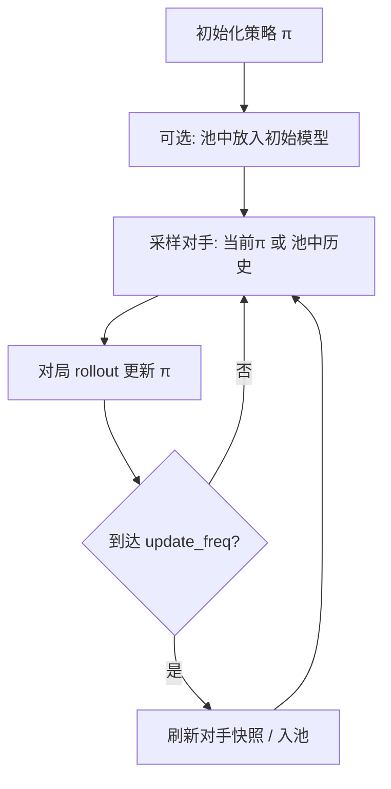

# 自对弈（Self-Play）

> 返回：[算法总览](overview.md) · [源码总览](../source-analysis/overview.md) · [索引](../AGENTS.md)

---

## 1. 一句话直觉

没有更强的老师时，就**和「昨天的自己」下棋**——对手变强，你也被迫变强；像天梯上永远有个镜像号。

---

## 2. 要解决的问题

- 脚本 Bot 有**天花板**，打穿后策略会过拟合固定套路。
- 人类演示昂贵；需要**自动生成**对抗压力。
- 只打「当前自己」易形成**循环策略**或遗忘旧克制（非传递性博弈）。

---

## 3. 核心概念

| 概念 | 含义 |
|------|------|
| **自对弈** | 训练智能体的对手也是策略（当前或历史快照） |
| **对手池 OpponentPool** | 保存多个历史 checkpoint，采样作对手 |
| **虚构自对弈（FSP 风格）** | 对历史混合分布最佳反应，减轻过拟合单一镜像 |
| **swap_players** | 随机当玩家 1/2，减轻座位偏差 |
| **混合训练** | 一部分局打 Bot，一部分自对弈 |

环境侧：`opponent="self"` 时，不在内部硬编码对手，而是通过工厂函数绑定 `ModelBot` 等。

---

## 4. 算法步骤

1. 构造自对弈环境（`SelfPlayEnv` 或 `make_self_play_vec_env`）。
2. 注册 `set_self_play_opponent_factory`：每次 `reset` 为对手玩家生成 Bot。
3. 训练循环中按频率更新对手权重 / 池。
4. 用固定 Bot 或历史快照做**稳定评估**（避免「自己评自己」虚高）。

---

## 5. 公式与数字例子

### 5.1 均匀对手池

池中有 \(M\) 个历史策略 \(\pi_1,\ldots,\pi_M\)，均匀采样：

\[
P(\text{对手}=\pi_i) = \frac{1}{M}
\]

| 符号 | 含义 |
|------|------|
| \(M\) | `pool_size` |
| \(\pi_i\) | 某次快照的参数 |

### 5.2 「近期偏好」示意

若 `selection_strategy="recent"`，可用递增权重（示意）：

\[
P(i) \propto i \quad (i=1\ldots M)
\]

则最新模型 \(M\) 被抽中概率：

\[
P(M) = \frac{M}{M(M+1)/2} = \frac{2}{M+1}
\]

例：\(M=10\) → 最新约占 \(2/11\approx 18\%\)（仍保留旧版本）。

### 5.3 混合 Bot 比例

`mixed_training` 且 `bot_ratio=0.3`：

\[
P(\text{对手为脚本 Bot})=0.3,\quad
P(\text{自对弈对手})=0.7
\]

**玩具例**：1000 局中约 300 局打 Simple/Medium，700 局打池中模型——保留可解释基线，同时自我进化。

### 5.4 非传递性（为何需要池）

剪刀石头布：\(\pi_A\) 克 \(\pi_B\) 克 \(\pi_C\) 克 \(\pi_A\)。
只打当前自己可能围着圈转；池强迫对**多种风格**保持鲁棒。

---

## 6. 在本项目中的实现

| 组件 | 位置 |
|------|------|
| 对手池 | `rl/self_play.OpponentPool` |
| 环境包装 | `rl/self_play.SelfPlayEnv` |
| 工厂注册 | `StrategyGameEnv.set_self_play_opponent_factory(factory)` |
| `factory` 签名 | `(game_state, opponent_player) -> Bot`（需 `take_turn()`） |
| 向量环境 | `make_self_play_env` / `make_self_play_vec_env` |
| SB3 回调 | `SelfPlayCallback`（模块内） |
| 配置 | `rl/config.SelfPlayConfig` |
| 脚本 | `scripts/train/train_self_play.py` |
| YAML | `configs/self_play/self_play.yaml`、`configs/ppo/skirmish_bc_selfplay.yaml` |

`reset` 时若 `opponent_type=="self"`，调用工厂重新绑定对手到新 `game_state`。

源码导读：[../source-analysis/rl-training-pipelines.md](../source-analysis/rl-training-pipelines.md) · [../source-analysis/rl-gym-env.md](../source-analysis/rl-gym-env.md)

---

## 7. 配置与超参（简）

`SelfPlayConfig` 字段：

| 字段 | 默认直觉 | 作用 |
|------|----------|------|
| `swap_players` | True | 座位互换 |
| `opponent_update_freq` | 10000 | 多久刷新当前对手 |
| `use_opponent_pool` | False | 是否用历史池 |
| `pool_size` | 10 | 池容量 |
| `pool_strategy` | uniform | uniform / recent / prioritized |
| `add_to_pool_freq` | 50000 | 入池频率 |
| `min_win_rate_for_pool` | 0.55 | 过弱快照不入池 |
| `mixed_training` | False | 混合脚本 Bot |
| `bot_ratio` | 0.3 | 脚本 Bot 局比例 |
| `snapshot_freq` | 10000 | Feudal 等路径快照 |
| `eval_opponent` | random | 固定评估对手 |

---

## 8. 常见误解

1. **「自对弈胜率 50% 说明没进步」**
   对当前自己约 50% 是常态；应看对**固定 Bot / 旧 checkpoint** 的胜率。

2. **「只保存最新镜像即可」**
   易灾难循环；池更稳。

3. **「`opponent=self` 不设 factory 也能训」**
   工厂为 `None` 时对手回合可能空转，学不到对抗。

4. **「自对弈可替代一切课程」**
   冷启动仍常需 bootstrap 先学会基本操作。

5. **「池越大越好」**
   过大则对手过时过弱，梯度噪声增；需权衡。

---

## 9. 延伸阅读

- Silver et al., AlphaZero / AlphaGo 自对弈思想
- Heinrich et al., Fictitious Self-Play
- 本目录：[curriculum-bootstrap.md](curriculum-bootstrap.md) · [alphazero-mcts.md](alphazero-mcts.md) · [evaluation-and-elo.md](evaluation-and-elo.md)
- 项目：`docs/zh/REVIEW_rl_pipeline_2026-07-24.md`
