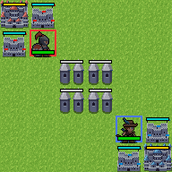

# 第 01 章　游戏规则与策略问题

## 1.1 棋盘与一局游戏

Reinforce Tactics 在方格地图上进行。地图包含可通行地形、阻挡地形以及总部、塔楼等建筑。每名玩家拥有金币、单位和建筑控制权。玩家在自己的回合中可以执行多个微动作，最后显式结束回合。对局通常通过占领敌方总部、消灭满足规则条件的敌方力量，或在最大回合数处形成和局而结束。



游戏逻辑的单一真源是 `reinforcetactics/core/game_state.py` 中的 `GameState`。GUI、规则 Bot、LLM Bot、强化学习环境和锦标赛都应通过同一规则层改变状态。这个设计非常重要：如果训练环境另写一套简化规则，模型可能在训练器里合法、进入 GUI 后却无法行动。

## 1.2 八类单位

项目包含八类单位。精确数值由常量和可能的 `engine_overrides` 决定，因此本书以稳定的功能角色为主。

| 单位 | 代码 | 主要角色 | 学习上的意义 |
|---|---:|---|---|
| Warrior | `W` | 低成本近战基础单位 | 容易形成单兵种局部最优 |
| Mage | `M` | 法术攻击 | 需要选择高价值目标 |
| Cleric | `C` | 治疗或净化 | 奖励常延迟体现为存活率 |
| Archer | `A` | 远程攻击 | 位置和射程关系重要 |
| Knight | `K` | 高机动或冲击 | 行动价值依赖路径与时机 |
| Rogue | `R` | 灵活战术单位 | 增加动作组合和反制关系 |
| Sorcerer | `S` | 增益、减益和控制 | 动作目标依赖更复杂 |
| Barbarian | `B` | 高攻击近战 | 成本、伤害与生存的权衡 |

单位类型不是独立标签。选择造什么兵取决于金币、建筑、地图距离、敌方组成和未来数个回合。仅按“当前伤害最大”行动会忽略经济与占领目标。

## 1.3 建筑、收入与占领

建筑同时承担经济、生产和胜负功能。控制建筑通常会在回合转换时产生收入；某些建筑允许创建单位；敌方总部是核心战略目标。占领不是瞬时视觉效果，而是由单位在合法位置执行 `seize` 一类动作改变控制进度或归属。

经济系统制造了强化学习中的延迟收益：

- 花费金币造兵会使当前资源减少；
- 新单位可能数回合后才参与战斗；
- 占领中立建筑的直接收益有限，但之后每回合增加收入；
- 过度储蓄在数值上安全，却可能失去地图控制。

因此，一步奖励不能只按金币余额增加。否则智能体可能拒绝合理消费。

## 1.4 玩家回合与环境步

游戏回合不是强化学习环境中的一个 `step`。智能体的一回合可表示为：

```text
创建单位 → 移动单位 A → 攻击 → 移动单位 B → 占领 → 结束回合
```

上述每个箭头前的操作通常各占一个环境步。只有执行 `end_turn` 后，环境才让规则 Bot 完成其整个回合，再把控制权交回智能体。

| 概念 | 作用域 | 典型代码 |
|---|---|---|
| 环境步 | 一次微动作 | `StrategyGameEnv.step(action)` |
| 玩家回合 | 当前玩家的一组动作 | `GameState.current_player` |
| 完整轮次 | 双方都行动一次 | 由游戏回合计数体现 |
| 一局 episode | 从初始状态到终止或截断 | `reset` 到下一次 `reset` |

这个区别影响折扣：若一局有 80 个游戏回合，但每回合平均有 8 个微动作，终局奖励可能距离开局约 640 个环境步。

## 1.5 合法动作

`GameState.get_legal_actions(player)` 根据当前状态生成合法操作。合法性至少依赖：

- 当前玩家及单位所有权；
- 单位是否已行动、是否受到状态效果；
- 起点、终点、射程和路径；
- 目标位置是否被占用；
- 金币是否足够、建筑是否允许生产；
- 技能类型与目标类型是否匹配；
- 游戏是否已结束。

合法动作集合会在每一步后变化。移动一个单位可能使另一个单位的路径失效；购买会改变金币；攻击可能消灭目标；占领会改变建筑归属。因此，动作掩码不能只在 `reset` 时计算一次。

## 1.6 胜利与失败

强化学习环境关心的是终局语义，而不是 GUI 是否显示结束画面。项目的 `info["end_reason"]` 可区分总部占领、消灭、最大回合和最大环境步等原因。需要特别区分：

- **规则终止**：游戏规则确认胜、负或和，例如最大游戏回合导致和局；
- **外部截断**：环境达到 `max_steps`，但规则内的游戏仍可能继续。

终止意味着该轨迹在 MDP 内真正结束；截断通常意味着数据收集器提前停止。二者对价值函数是否继续 bootstrap 的处理不同，第七和第十二章会严格展开。

## 1.7 策略不只是战斗

一个完整策略至少包含四个互相制约的层面。

1. **经济**：何时消费、生产何种单位。
2. **机动**：如何分配单位、选择路径和保持阵形。
3. **战斗**：目标优先级、射程、治疗、控制与风险。
4. **目标**：占领中立建筑、防守总部、推进敌方总部并结束游戏。

历史训练中出现“只造 Warrior”并不表示模型完全没有学习。它可能学到了一个在当前价格、对手和奖励下足够稳定的局部最优。要判断问题来自算法还是平衡，需要将单位组成、对局结果和地图目标一起分析。

## 1.8 对手是环境的一部分

从智能体的接口看，执行 `end_turn` 后发生的对手行动属于环境转移。若对手是固定脚本，转移分布相对稳定；若对手从池中随机抽取，转移带有额外随机性；若对手不断换成当前策略的最新快照，环境变得非平稳。

同一策略面对不同对手可能呈现不同胜率。因此，“模型强度”不是脱离对手定义的单一数值。课程学习需要明确每一阶段的对手，最终评估需要固定锚点。

## 1.9 一个手工决策例

假设当前有足够金币建造一个 Warrior 或保留资金，前方有中立塔楼：

- 立即造兵：当前金币下降，但下一回合多一个可推进单位；
- 保留金币：当前资源指标更高，但可能让对手先占塔；
- 移动现有单位：短期没有伤害奖励，但缩短占领距离；
- 攻击附近敌人：获得即时战斗信号，却可能偏离总部目标。

这个例子说明奖励函数必须表达“最终赢棋优先”，中间信号只能充当路标。若击伤奖励可以无限获取而占领只奖励一次，智能体就可能主动维持战斗而不结束游戏。

## 1.10 本章练习

1. 给出一个“当前金币减少但长期价值增加”的动作。
2. 为什么 `end_turn` 必须是一个可学习的动作，而不能总由环境自动执行？
3. 若评估时换了更强 Bot，胜率下降是否足以证明模型退化？
4. 为什么合法动作必须在每个环境步重新计算？

