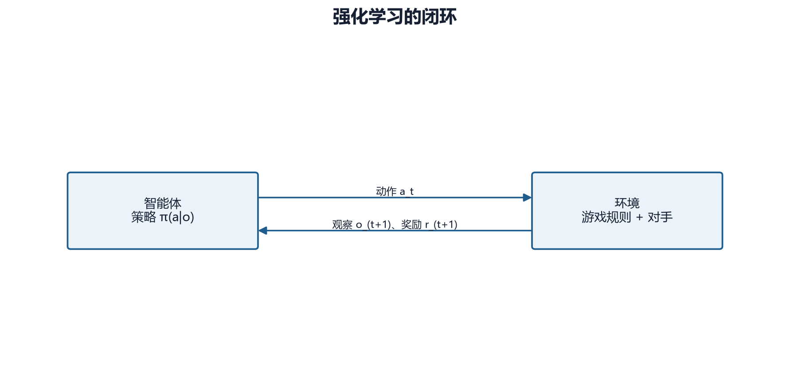

# 第 02 章　智能体、环境与马尔可夫决策过程

## 2.1 强化学习闭环

强化学习研究连续决策。智能体观察环境，选择动作；环境执行规则，返回新观察和奖励；这一过程重复到 episode 结束。

形式化地，一条轨迹写作：

\[
\tau=(S_0,A_0,R_1,S_1,A_1,R_2,\ldots,S_T)
\]

| 符号 | 含义 | 本项目实例 |
|---|---|---|
| \(S_t\) | 时刻 \(t\) 的完整状态 | 棋盘、双方单位、金币、回合等 |
| \(A_t\) | 在状态 \(S_t\) 选择的动作 | 创建、移动、攻击、占领或结束回合 |
| \(R_{t+1}\) | 动作后得到的即时奖励 | 终局、占领、势能变化等 |
| \(T\) | episode 最后一步 | 胜负、规则和局或外部截断 |

奖励下标写成 \(R_{t+1}\)，强调它是在执行 \(A_t\) 后才得到。不同资料也会写成 \(r_t\)；只要定义一致，两种记法都可使用。

## 2.2 MDP 五元组

马尔可夫决策过程（MDP）通常定义为：

\[
\mathcal{M}=(\mathcal{S},\mathcal{A},P,R,\gamma)
\]

- \(\mathcal{S}\)：所有可能状态的集合；
- \(\mathcal{A}\)：动作集合；
- \(P(s'|s,a)\)：在状态 \(s\) 执行动作 \(a\) 后转移到 \(s'\) 的概率；
- \(R(s,a,s')\)：转移对应的奖励；
- \(\gamma\)：折扣因子，决定未来奖励的当前权重。

“马尔可夫”不是说未来与历史毫无关系，而是说：给定当前完整状态后，预测下一状态不再需要更早历史。

\[
P(S_{t+1}|S_t,A_t,S_{t-1},A_{t-1},\ldots)=P(S_{t+1}|S_t,A_t)
\]

在本项目中，若 `GameState` 包含单位状态、金币、当前玩家、回合、控制权和所有会影响规则的计数器，它可以近似视为马尔可夫状态。若漏掉“单位本回合是否行动”等变量，相同棋盘外观可能产生不同合法动作，观察便不再满足马尔可夫性。

## 2.3 状态与观察

算法通常不直接接收 `GameState` 对象，而接收数值观察 \(O_t\)：

\[
O_t = f(S_t)
\]

函数 \(f\) 把复杂状态编码成 `grid`、`units` 和 `global_features`。若编码保留了决策所需的全部信息，可以把观察近似当作状态；若启用战争迷雾，智能体只能看见局部信息，问题更接近部分可观测 MDP（POMDP）。

POMDP 额外考虑隐藏状态和观察生成：

\[
O_t \sim \Omega(\cdot|S_t)
\]

此时同一个观察可能对应多个真实局面。无记忆策略只能按当前可见信息行动；带循环网络、历史堆叠或显式信念状态的策略才可能利用过去推断隐藏单位。本项目主线策略没有完整的信念状态建模，因此战争迷雾应被视为显著增加难度的实验条件。

## 2.4 转移概率从何而来

游戏规则本身大多是确定的，但整体转移仍可能随机：

- Bot 的随机选择或随机决胜规则；
- 地图随机生成；
- 初始状态或玩家座次；
- 自对弈对手池抽样；
- 随机种子未统一时的多个随机数生成器。

即使环境完全确定，随机策略也会产生不同轨迹。训练中的随机性至少来自策略采样、环境随机和优化器的小批次。

## 2.5 策略

策略 \(\pi\) 描述在观察下如何选择动作。随机策略写作：

\[
\pi_\theta(a|o)=P(A_t=a|O_t=o;\theta)
\]

\(\theta\) 是神经网络参数。确定性评估通常选择概率最大的合法动作；随机训练则按分布采样，以获得探索。

策略不是“把局面映射为唯一动作”的表。对 PPO 而言，它是可微的概率分布；对 DQN 而言，常先估计每个动作的 \(Q\) 值，再用 ε-greedy 选择；对 MCTS 而言，最终动作分布来自搜索访问次数。

## 2.6 为什么本项目训练接口是单智能体 1v1

游戏引擎支持多种玩家布局，但 `StrategyGameEnv` 的 RL 观察采用“自己/对手”相对通道，且以 `opp = 3 - player` 的方式确定唯一对手。这一编码天然面向两名玩家。

训练时，学习智能体控制一方；另一方 Bot 在智能体结束回合后由环境内部执行。因此，从 Gymnasium API 看只有一个学习者。这样可以直接使用 Stable-Baselines3 的单智能体算法。

真正的多智能体环境需要明确：

- 每个智能体分别看到什么；
- 同时还是轮流行动；
- 奖励是共享、零和还是个体化；
- 智能体退出后环境怎样继续；
- 队友与敌人的相对编码。

`pyproject.toml` 虽列出 PettingZoo 依赖，但当前主训练路径没有实现 PettingZoo 的 AEC 或 Parallel 环境。不能因为依赖存在就声称项目已经具备通用多智能体训练接口。

## 2.7 微动作 MDP 的时间尺度

设一个玩家回合平均含 \(m\) 个微动作，一局含 \(H\) 个玩家回合，则 episode 大约含 \(mH\) 个智能体环境步，再加上对手在环境内部执行的动作。折扣按环境步生效：

\[
\text{终局权重}\approx\gamma^{mH}
\]

若 \(\gamma=0.99\)、\(mH=500\)：

\[
0.99^{500}\approx 0.0066
\]

开局看到的终局奖励只剩原始量级的约 0.66%。这不是说 PPO完全忽略终局，而是说明长微动作轨迹会加剧信用分配困难。提高 \(\gamma\)、缩短 episode、合理塑形、课程学习和分层决策都在不同层面缓解该问题。

## 2.8 终止与截断属于模型定义

若总部被占领，后续状态没有意义，属于 `terminated=True`。若达到外部 `max_steps`，游戏规则仍可继续，属于 `truncated=True`。对价值目标：

\[
y_t =
\begin{cases}
r_{t+1}, & \text{规则终止}\\
r_{t+1}+\gamma V(s_{t+1}), & \text{时间截断且下一状态可估值}
\end{cases}
\]

把两者都当作终止会在截断边界错误地把未来价值设为零；反过来，把真正失败也 bootstrap 会让价值穿过不应存在的终局。

## 2.9 MDP 建模检查表

建立新地图或新规则实验时，应检查：

1. 观察是否包含影响合法动作和奖励的状态变量？
2. 动作编码是否能唯一还原领域动作？
3. 奖励是否与最终目标一致？
4. `terminated` 和 `truncated` 是否语义正确？
5. 对手、随机地图和座次是否进入种子控制？
6. 不同地图的空间形状是否与同一模型兼容？

## 2.10 本章练习

1. 指出一个在 GUI 中可见但可能不应直接作为奖励的量。
2. 战争迷雾为何使问题从近似 MDP 变成 POMDP？
3. 计算 \(\gamma=0.99\) 时距离 200 步的终局奖励权重。
4. 为什么“项目依赖 PettingZoo”不等于“当前 RL 环境是 PettingZoo 多智能体环境”？

