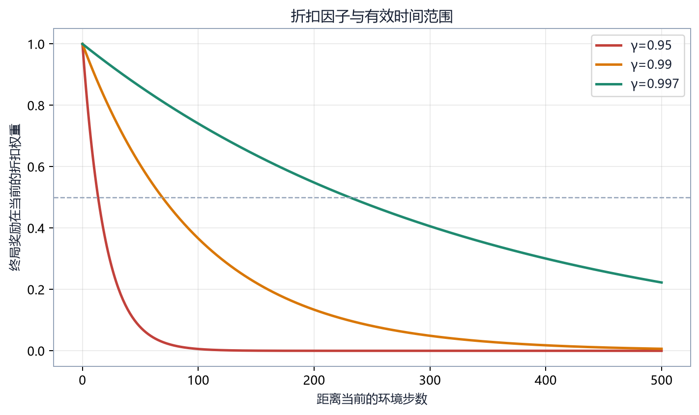

# 第 05 章　强化学习基础

## 5.1 即时奖励与回报

即时奖励 \(R_{t+1}\) 只描述一次转移。智能体要最大化的是从当前开始的长期回报：

\[
G_t=R_{t+1}+\gamma R_{t+2}+\gamma^2R_{t+3}+\cdots
\]

也可写成：

\[
G_t=\sum_{k=0}^{T-t-1}\gamma^kR_{t+k+1}
\]

| 符号 | 含义 | 范围 |
|---|---|---|
| \(G_t\) | 从时刻 \(t\) 开始的折扣回报 | 由奖励尺度决定 |
| \(\gamma\) | 折扣因子 | 通常 \(0\le\gamma\le1\) |
| \(k\) | 距离当前的步数 | 0,1,2,… |
| \(T\) | episode 结束时刻 | 正整数 |

若奖励为 \(1,1,1\)，\(\gamma=0.9\)：

\[
G_0=1+0.9+0.9^2=2.71
\]

回报不等于日志里的“episode reward”在所有实现中的含义。监控器常记录未折扣奖励之和，而算法内部计算折扣目标。

## 5.2 折扣与有效时间范围

折扣有三种作用：

- 表达更早收益通常更确定；
- 控制无限序列的数学收敛；
- 决定信用能向多远传播。

常用近似有效范围：

\[
H_{\mathrm{eff}}\approx\frac1{1-\gamma}
\]

\(\gamma=0.99\) 时约 100 步，\(\gamma=0.997\) 时约 333 步。它不是硬边界，而是量级判断。

项目一局可能包含数百微动作，因此固定使用 0.99 会使早期状态对远端终局的直接权重很低。提高 \(\gamma\) 也会增加价值估计方差，不能只看“越长期越好”。

## 5.3 状态价值函数

策略 \(\pi\) 下的状态价值：

\[
V^\pi(s)=\mathbb{E}_\pi[G_t|S_t=s]
\]

它表示从状态 \(s\) 出发继续按策略 \(\pi\) 行动的期望回报。价值是期望，不是胜负确定预测。

若某局面有 60% 概率得到 +10、40% 概率得到 -10：

\[
V^\pi(s)=0.6\times10+0.4\times(-10)=2
\]

实际一局不会得到 2，但长期平均为 2。

## 5.4 动作价值函数

\[
Q^\pi(s,a)=\mathbb{E}_\pi[G_t|S_t=s,A_t=a]
\]

它表示在 \(s\) 先执行 \(a\)，以后再按 \(\pi\) 行动的期望回报。DQN 直接近似 \(Q\)；Actor-Critic 通常分别表示策略和 \(V\)。

## 5.5 优势函数

\[
A^\pi(s,a)=Q^\pi(s,a)-V^\pi(s)
\]

优势衡量动作相对当前状态下策略平均水平的好坏。若 \(V(s)=5\)、\(Q(s,a)=8\)，优势为 +3；若 \(Q=2\)，优势为 -3。

使用优势而不是原始回报可以减少“本来就处于好局面”造成的共同偏移。策略梯度据此提高正优势动作的概率、降低负优势动作的概率。

## 5.6 Bellman 递推

回报可拆成当前奖励与下一状态回报：

\[
G_t=R_{t+1}+\gamma G_{t+1}
\]

对条件期望取平均：

\[
V^\pi(s)=\mathbb{E}_\pi[R_{t+1}+\gamma V^\pi(S_{t+1})|S_t=s]
\]

这就是 Bellman 期望方程。它的关键不是形式复杂，而是允许用“一步奖励 + 下一状态估值”学习长期价值。

Q 函数对应：

\[
Q^\pi(s,a)=\mathbb{E}[R_{t+1}+\gamma\mathbb{E}_{a'\sim\pi}Q^\pi(S_{t+1},a')]
\]

最优 Q 的 Bellman 方程将下一个动作替换为最大值：

\[
Q^*(s,a)=\mathbb{E}[R_{t+1}+\gamma\max_{a'}Q^*(S_{t+1},a')]
\]

## 5.7 Monte Carlo 与 TD

Monte Carlo（MC）等 episode 结束后用实际回报：

\[
\text{target}_{MC}=G_t
\]

优点是目标不依赖当前价值估计，缺点是必须等待终局且方差高。

一步 Temporal Difference（TD）使用：

\[
\text{target}_{TD}=R_{t+1}+\gamma V(S_{t+1})
\]

TD 可以在线更新，方差较低，但目标依赖不完美的 \(V\)，引入偏差。TD 误差：

\[
\delta_t=R_{t+1}+\gamma V(S_{t+1})-V(S_t)
\]

## 5.8 n 步回报与 GAE

n 步目标在 MC 与一步 TD 之间折中：

\[
G_t^{(n)}=R_{t+1}+\gamma R_{t+2}+\cdots+\gamma^{n-1}R_{t+n}+\gamma^nV(S_{t+n})
\]

GAE 用参数 \(\lambda\) 对不同长度的 TD 信息加权：

\[
\hat A_t^{GAE}=\sum_{l=0}^{\infty}(\gamma\lambda)^l\delta_{t+l}
\]

\(\lambda\) 越接近 0，越接近短程 TD；越接近 1，越依赖长程实际奖励。PPO 常见 \(\gamma=0.99,\lambda=0.95\)，但长微动作任务需要结合 episode 长度验证。

## 5.9 探索与利用

**利用**选择当前估计最好的动作，**探索**尝试不确定动作。只利用可能过早锁定局部最优；只探索则无法稳定执行已学策略。

不同算法使用不同机制：

- DQN：ε-greedy；
- PPO/A2C：从随机策略分布采样，并可加入熵奖励；
- AlphaZero：MCTS 访问分布与根节点 Dirichlet 噪声；
- 自对弈：改变对手分布形成战略探索。

策略熵：

\[
\mathcal{H}(\pi)=-\sum_a\pi(a|s)\log\pi(a|s)
\]

均匀分布熵高，单一动作概率接近 1 时熵低。熵系数太高会妨碍收敛，太低则容易过早确定化。

## 5.10 信用分配

信用分配回答：最终胜利应归因于哪些早期动作。策略游戏的困难来自：

- 因果链长；
- 同一动作在不同局面作用不同；
- 对手行动介于自己的两次决策之间；
- 奖励塑形可能提供错误捷径。

解决方案不是单一算法开关，而是组合：

- 正确的观察与动作表示；
- 合理 \(\gamma\) 与 GAE；
- 价值函数；
- 势能塑形；
- 课程学习；
- 分层目标；
- 高质量评估。

## 5.11 On-policy 与 Off-policy

On-policy 算法主要使用当前策略刚产生的数据。PPO、A2C 属于此类；策略更新后旧数据很快失效，样本利用率较低但更新定义清晰。

Off-policy 算法可以重复使用旧策略数据。DQN 使用经验回放；样本利用率较高，但旧数据分布和当前策略不同，需要目标网络等稳定机制。

## 5.12 本章练习

1. 计算奖励 \(2,0,3\)、\(\gamma=0.9\) 时的 \(G_0\)。
2. 若 \(V=7,Q=4\)，优势是多少，策略应倾向提高还是降低该动作概率？
3. 说明 MC 与一步 TD 的偏差—方差差别。
4. 为什么提高 \(\gamma\) 不能自动解决长局训练？

