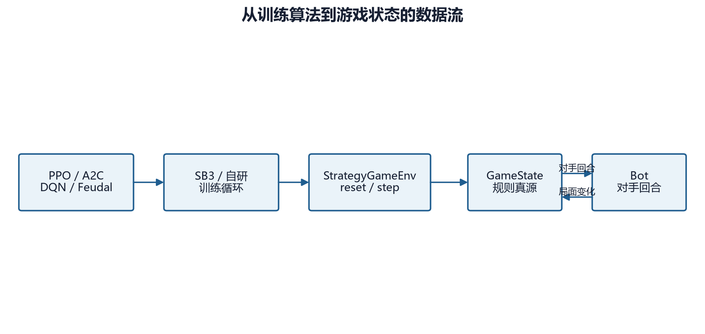

# 第 09 章　项目运行时与数据流

## 9.1 分层结构

项目不是“一个训练脚本加一个环境”。主要层次如下：

| 层 | 主要职责 | 代表模块 |
|---|---|---|
| 入口 | 参数解析与模式分发 | `main.py`、`reinforcetactics/cli` |
| 应用 | GUI 会话、输入和 Bot 工厂 | `reinforcetactics/app` |
| 领域 | 游戏状态、单位、地图和规则 | `reinforcetactics/core`、`game` |
| RL 环境 | 观察、动作、奖励、掩码 | `reinforcetactics/rl/gym_env.py` |
| 训练 | PPO、课程、自对弈、Feudal、AlphaZero | `reinforcetactics/rl`、`scripts/train` |
| 评估 | 模型评估、锦标赛、Elo | `rl/evaluation.py`、`tournament` |



领域层应保持为规则真源。RL 环境可以编码和计分，却不应偷偷改变移动、攻击或占领规则。

## 9.2 CLI 的四种模式

`main.py` 提供 `train`、`evaluate`、`play` 和 `stats`。

```powershell
python main.py --mode play
python main.py --mode train --algorithm ppo --timesteps 100000
python main.py --mode evaluate --model models/ppo_final.zip --episodes 20
python main.py --mode stats
```

基础 CLI 适合理解入口，但不是当前最可靠的生产训练路径：

- `ppo` 使用普通 PPO，不自动使用动作掩码；
- `a2c` 同样没有掩码；
- `dqn` 默认创建 MultiDiscrete 环境，而 SB3 DQN 只接受 Discrete，当前会在模型构造处失败；
- 课程、BC、自对弈、Feudal 和 AlphaZero 各有独立脚本。

教材不会把“参数可选”误写成“训练路径已验证”。

## 9.3 `GameState` 的职责

`GameState` 保存并改变：

- 地图与建筑；
- 单位及其生命、位置和状态；
- 当前玩家、回合和金币；
- 合法动作；
- 移动、攻击、治疗、技能和占领；
- 胜负与最大回合；
- 可选的规则常量覆盖。

GUI 人类操作、Bot 和环境最终都应调用这些领域操作。例如环境解码出 `move` 后，仍由规则层验证移动。训练环境不能假设掩码永远正确；执行时必须再次校验。

## 9.4 `StrategyGameEnv.__init__`

构造函数把游戏实例包装为 RL 任务。关键参数：

| 参数 | 作用 |
|---|---|
| `map_file` | 固定地图；为空时随机生成 |
| `opponent` | 规则 Bot、随机、noop、自对弈或空 |
| `max_steps` | 外部环境步上限 |
| `max_turns` | 游戏规则回合上限 |
| `reward_config` | 奖励权重覆盖 |
| `enabled_units` | 可创建兵种集合 |
| `fog_of_war` | 部分可观测模式 |
| `action_space_type` | `multi_discrete` 或 `flat_discrete` |
| `max_flat_actions` | Flat 模式固定上限 |
| `max_actions_per_turn` | 防止永不结束回合 |
| `gamma` | 势能塑形折扣，应与训练器一致 |
| `pad_to_size` | 跨地图统一观察尺寸 |
| `engine_overrides` | 平衡实验覆盖 |

构造函数固定 RL 环境为 1v1；GUI 的多人模式不经过同一观察契约。

## 9.5 `reset` 数据流

重置时必须同时恢复领域状态和训练辅助状态：

```text
加载初始地图
→ 创建新的 GameState
→ 初始化/重新绑定对手
→ 确定 agent_player
→ 清零步数、动作与 episode 统计
→ 初始化势函数 Φ(s₀)
→ 构建 flat 合法动作（若启用）
→ 返回观察和 info
```

势能塑形的 `_prev_potential` 必须设为初始状态的 \(\Phi(s_0)\)，不能简单设为 0；否则 episode 第一步会凭空得到 \(\gamma\Phi(s_1)\)。

## 9.6 `step` 数据流

环境每步大致执行：

```text
输入动作
→ 根据动作空间解码为六字段动作
→ 执行领域动作
→ 记录无效、伤害、治疗、购买、占领等事件
→ 计算本方动作即时奖励
→ 如果 end_turn：运行对手完整回合并记录对手事件
→ 检查规则终局 / max_steps
→ 计算势能变化和终局奖励
→ 构建下一观察、掩码所需合法动作和 info
```

动作执行和奖励计算不能随意交换。若在对手回合前就计算完整势能差，就会漏掉对手夺取建筑和造成伤害；若终局先关闭势能而后又重复计算，奖励分解会不守恒。

## 9.7 对手回合

智能体选择 `end_turn` 后：

1. `GameState.end_turn()` 把控制权给对手；
2. 环境调用对手 `take_turn()`；
3. Bot 内部执行多个领域动作并结束自己的回合；
4. 控制权回到智能体。

历史实现曾出现环境在 Bot 已结束回合后再调用一次 `end_turn`，导致玩家被切换两次。此类错误会让观察与当前玩家不一致，训练表现看似随机。当前逻辑应检查 Bot 执行后 `current_player`，只在仍未归还时补救。

## 9.8 自对弈工厂

`opponent="self"` 本身不包含对手网络。训练脚本通过：

```text
set_self_play_opponent_factory(factory)
```

注入一个函数，根据新的 `GameState` 和对手玩家创建快照 Bot。每次 `reset` 都要重新绑定到新状态，不能让 Bot 保留上一个 episode 的 `GameState` 引用。

## 9.9 配置流

高级训练使用 `reinforcetactics/rl/config.py` 的 dataclass：

```text
EnvConfig
PPOConfig
FeudalConfig
SelfPlayConfig
AlphaZeroConfig
CurriculumStage / CurriculumConfig
EvalConfig / LoggingConfig
TrainingConfig
```

`load_config` 读取 YAML/JSON，`apply_overrides` 应用点号路径 CLI 覆盖。训练器最终得到一个合并后的 `TrainingConfig`。记录实验时必须保存这一最终对象，而非只保存原始 YAML。

## 9.10 数据形状穿过各层

```text
GameState 对象
  ↓ build_observation
Dict[str, np.ndarray]
  ↓ VecEnv
Dict[str, np.ndarray]，带批维 B
  ↓ features extractor
Tensor[B, features_dim]
  ↓ 策略/价值头
动作分布 + V(o)
  ↓ sample / predict
NumPy 动作
  ↓ env.step
领域动作
```

调试时沿这条链逐层打印形状，比直接查看最终 loss 更有效。

## 9.11 失败归属示例

| 现象 | 优先检查层 |
|---|---|
| 动作索引越界 | 动作编码/环境 |
| 训练 loss 为 NaN | 观察、奖励尺度、网络 |
| 只会结束回合 | 掩码、奖励、探索和对手 |
| 训练胜率高、GUI 不能加载 | 空间/特征提取器/checkpoint |
| 换地图构造失败 | observation/action shape |
| 同模型重复评估结果完全相同 | 对手 RNG 与种子 |

## 9.12 本章练习

1. 为什么 Bot 必须在每次 `reset` 后绑定新的 `GameState`？
2. 势能基线若错误设为 0，第一步奖励会出现什么偏差？
3. 基础 CLI 的 DQN 为什么不是当前可直接运行的默认路径？
4. 说明从 `GameState` 到策略 logits 的数据形状链。

