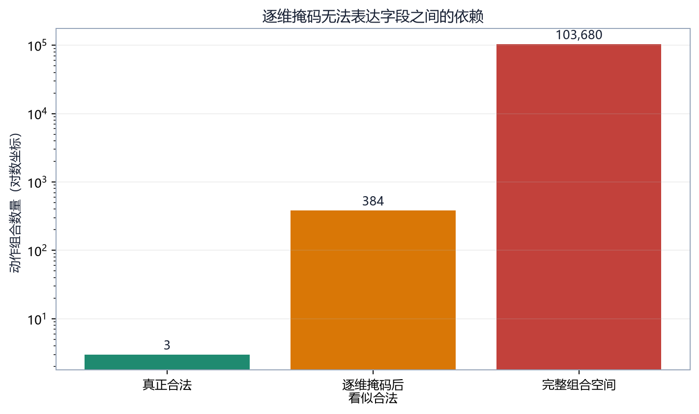
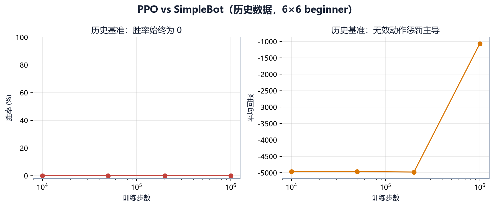

# 第 11 章　动作空间与动作掩码

## 11.1 六字段动作

默认动作向量：

\[
a=(t,u,x_s,y_s,x_d,y_d)
\]

| 字段 | 含义 | 典型范围 |
|---|---|---|
| \(t\) | 动作类型 | 0-9 |
| \(u\) | 创建单位类型 | 0-7 |
| \(x_s,y_s\) | 起点 | 地图坐标 |
| \(x_d,y_d\) | 目标点 | 地图坐标 |

动作类型包括创建、移动、攻击、占领、治疗、结束回合以及多种技能。并非所有字段对每类动作有意义，例如 `end_turn` 不需要坐标，但固定长度便于统一接口。

## 11.2 组合空间

6×6 地图的完整组合数：

\[
10\times8\times6\times6\times6\times6=103680
\]

某一步真正合法动作常只有几十条。随机采样几乎必然无效。仅给无效动作负奖励会浪费样本，并使惩罚淹没游戏信号。

## 11.3 逐维掩码

MultiDiscrete MaskablePPO 为每个维度提供独立布尔掩码。例如合法动作只有：

```text
move   from (1,0) to (2,0)
attack from (3,2) to (4,2)
end_turn
```

逐维掩码会分别允许：

```text
type: move, attack, end_turn
from_x: 1, 3
from_y: 0, 2
to_x: 2, 4
to_y: 0, 2
```

独立分布可重组出 `move from (3,0) to (4,2)` 等从未存在的动作。掩码保证每个字段值曾在某条合法动作出现，却不能保证字段组合合法。



若上述掩码还允许 8 个单位类型，近似组合为：

\[
3\times8\times2\times2\times2\times2=384
\]

真正合法只有 3 条，表面“通过掩码”的组合约 99.2% 仍无效。

## 11.4 历史基准证据

历史 PPO vs SimpleBot 基准在 10K、50K、200K 和 1M 步时胜率均为 0。前 200K 步 episode 常达到 500 步截断，平均回报约 -4965；1M 步后模型学会频繁 `end_turn`，平均局长降到约 10，但全部失败。

如果每局 500 步、无效率约 99%、无效惩罚 -10：

\[
500\times0.99\times(-10)=-4950
\]

这与观测回报接近，说明训练主要在学习避免接口惩罚，而不是游戏策略。



后期 `end_turn` 坍缩也有因果解释：它始终合法，可以避免 -10；但对手得到连续发展机会，模型迅速失败。

## 11.5 Flat Discrete 精确掩码

Flat 模式在每步枚举完整合法动作：

```text
_current_actions = [
  [create, unit_type, x, y, x, y],
  [move, _, sx, sy, dx, dy],
  ...
  [end_turn, _, 0, 0, 0, 0],
]
```

动作空间固定为 `Discrete(max_flat_actions)`。前 `len(_current_actions)` 个索引对应真实动作，其余 padding 索引为 False。策略采样一个索引即可得到完整组合，因此掩码是精确的。

优势：

- 消除字段重组无效动作；
- DQN 也能使用 Discrete；
- 固定 `max_flat_actions` 可与观察 padding 共同支持跨地图。

代价：

- 索引语义随当前合法动作列表变化；
- 上限太小会截断合法动作；
- 上限太大使策略输出头变大；
- 若列表排序不稳定，同一索引在相似状态中含义变化剧烈。

2026-07-24 审查特别指出 Flat 动作索引按当前列表位置重建，策略难以形成稳定动作语义。精确合法性不等于理想表示。

## 11.6 上限与截断

`max_flat_actions` 必须覆盖课程最密集局面。若实际合法动作数超过上限，简单截断可能系统性丢掉排序靠后的单位或动作。

正确做法：

1. 在代表地图与高单位密度下记录 `n_legal_actions`；
2. 观察最大值和高分位数；
3. 检查截断日志；
4. 明确动作排序；
5. 必要时提高上限或改用结构化动作网络。

## 11.7 自回归动作头

自回归分解按条件选择：

\[
p(a|s)=p(t|s)\,p(u|t,s)\,p(x_s,y_s|t,u,s)\,p(x_d,y_d|t,u,x_s,y_s,s)
\]

先选动作类型，再根据类型生成相关字段掩码；选定起点后，目标掩码只包含该单位可执行目标。这样既保留结构语义，又能表达字段依赖。

项目 Feudal AR Worker 使用 `structured_action_masks()` 提供阶段条件掩码。代价是采样、log probability、entropy、训练评估和 batch 化都更复杂；任何阶段掩码错位都会破坏 PPO 概率比。

## 11.8 掩码概率

给合法指示 \(m_i\in\{0,1\}\)：

\[
\pi'(a=i|s)=\frac{m_i e^{z_i}}{\sum_jm_je^{z_j}}
\]

非法动作概率为 0，合法动作重新归一化。若 logits 对两个合法动作分别为 2 和 1，其他动作即使 logit 为 100 也会被掩掉，合法动作概率仍约为 0.731 与 0.269。

## 11.9 掩码必须进入整条链

- rollout 采样必须使用掩码；
- buffer 要保留与动作对应的掩码或能重建；
- 更新时计算 log probability 必须用相同语义掩码；
- `predict` 评估必须传掩码；
- 自对弈对手从翻转观察行动时也要用对手视角合法动作；
- SubprocVecEnv 的子环境必须原生暴露 `action_masks`。

只在训练 `sample` 时掩码、更新时不掩码，会使新旧概率不可比。

## 11.10 动手观察

```powershell
python agents/learning-guide-v2/tools/smoke_labs.py
```

结果中的 `mask_cross_product` 与 `domain_legal_actions` 展示逐维掩码的过度近似比；`action_space_compatibility` 展示 DQN 在两种空间下的构造差异。

## 11.11 选择建议

| 场景 | 建议 |
|---|---|
| 小地图、先验证可训练性 | Flat Discrete + MaskablePPO |
| 默认 MultiDiscrete 基线 | 可研究，但必须监控无效率 |
| 大地图、动作很多 | 自回归或合法动作评分网络 |
| DQN 实验 | 只能使用 Discrete 路径 |
| 跨地图同一模型 | Flat + padding，或重新设计固定结构动作 |

## 11.12 本章练习

1. 为什么每个维度都合法仍可能组成非法动作？
2. Flat Discrete 精确掩码解决了什么，又引入什么语义问题？
3. 为什么训练和评估必须使用一致掩码？
4. 写出自回归动作概率的条件分解。

