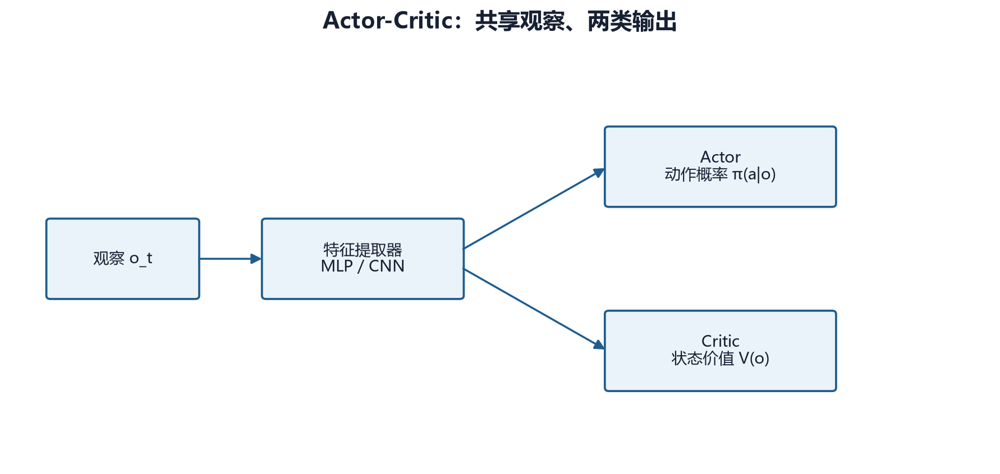

# 第 14 章　A2C：同步优势 Actor-Critic

## 14.1 从策略梯度到 Actor-Critic

策略梯度直接优化期望回报：

\[
J(\theta)=\mathbb{E}_{\tau\sim\pi_\theta}[G(\tau)]
\]

策略梯度定理给出更新方向的核心形式：

\[
\nabla_\theta J(\theta)
=\mathbb{E}\left[
\nabla_\theta\log\pi_\theta(a_t|s_t)A_t
\right]
\]

若 \(A_t>0\)，提高该动作概率；若 \(A_t<0\)，降低概率。Actor 表示策略，Critic 估计 \(V(s)\) 以构造优势。



## 14.2 A2C 的含义

A2C 通常解释为 Advantage Actor-Critic 的同步版本。它从一个或多个环境收集短 rollout，计算 n 步回报和优势，然后同步更新策略与价值网络。

相比异步 A3C，A2C 在一次批更新前等待并组合多个环境的数据，工程实现更适合现代批计算。

## 14.3 n 步目标

\[
R_t^{(n)}=
\sum_{k=0}^{n-1}\gamma^k r_{t+k+1}
+\gamma^nV(s_{t+n})
\]

优势估计：

\[
\hat A_t=R_t^{(n)}-V(s_t)
\]

若两步奖励为 1、2，\(\gamma=0.9\)，两步后的价值估计为 5：

\[
R_t^{(2)}=1+0.9\times2+0.9^2\times5=6.85
\]

若当前价值为 4，优势为 2.85。

## 14.4 联合损失

策略损失：

\[
L_{\mathrm{policy}}=-\mathbb{E}[\log\pi_\theta(a_t|s_t)\hat A_t]
\]

价值损失：

\[
L_{\mathrm{value}}=\mathbb{E}[(R_t^{(n)}-V_\phi(s_t))^2]
\]

熵奖励鼓励探索：

\[
\mathcal{H}(\pi)=-\sum_a\pi(a|s)\log\pi(a|s)
\]

常见总损失：

\[
L=L_{\mathrm{policy}}+c_vL_{\mathrm{value}}-c_e\mathcal{H}(\pi)
\]

负号表示最小化损失时会提高熵。\(c_v\) 和 \(c_e\) 分别控制价值项和熵项。

## 14.5 与 PPO 的差别

A2C 没有 PPO 的新旧概率比裁剪。一次更新过大时，策略可能发生显著变化。A2C 每批通常只做较直接的更新，结构简单、速度快，但在复杂任务上对学习率和奖励尺度更敏感。

| A2C | PPO |
|---|---|
| 直接策略梯度更新 | 裁剪概率比 |
| rollout 通常较短 | 常收集更长 rollout |
| 每批利用较少 | 同一批多 epoch |
| 实现简单 | 更新更保守、超参更多 |

## 14.6 项目实现路径

基础 CLI 构造：

```python
A2C(
    "MultiInputPolicy",
    env,
    learning_rate=3e-4,
    n_steps=5,
)
```

SB3 A2C 支持 MultiDiscrete，因此在默认动作空间下可构造。问题在于基础 CLI 使用普通环境和普通 A2C，没有把合法动作掩码加入策略分布。

在 103,680 个组合空间中，普通 A2C 会大量采样无效动作。环境的 -10 无效惩罚可能主导回报，重演旧 PPO 的接口学习问题。当前 `sb3-contrib` 没有与 MaskablePPO 对等的 MaskableA2C 主线，因此需要自定义分布或改用精确 Flat 空间。

## 14.7 为什么保留 A2C

- 展示最直接的 Actor-Critic；
- 训练循环比 PPO 更容易理解；
- 可作为 PPO 裁剪价值的对照；
- 在小型、合法动作简单的环境上是合理基线。

但本项目选择 MaskablePPO 作为主线，是因为动作合法性和策略更新稳定性比算法结构简洁更重要。

## 14.8 实验设计

若比较 A2C 与 PPO，应固定：

- 相同观察和特征提取器；
- 相同动作空间；
- 相同对手、地图和奖励；
- 相同总环境步；
- 多训练种子；
- 相同评估协议。

不能直接拿 A2C 默认 `n_steps=5` 与 PPO 课程配置比较，然后把差异全部归因于算法。

## 14.9 常见问题

| 现象 | 诊断 |
|---|---|
| 回报极低且无效率高 | 没有掩码 |
| 熵快速趋近 0 | 学习率大、熵系数小或惩罚捷径 |
| value loss 爆炸 | 终局尺度过大、归一化不足 |
| 训练很快但完全不赢 | 短 rollout 与长信用链，或奖励投机 |
| 评估结果抖动 | 策略更新大、样本少、评估局数不足 |

## 14.10 本章练习

1. 用给定数字计算两步回报和优势。
2. Actor 与 Critic 分别输出什么？
3. 熵项为何在总损失中带负号？
4. A2C 在默认动作空间可构造，为什么仍不推荐作为主线？

