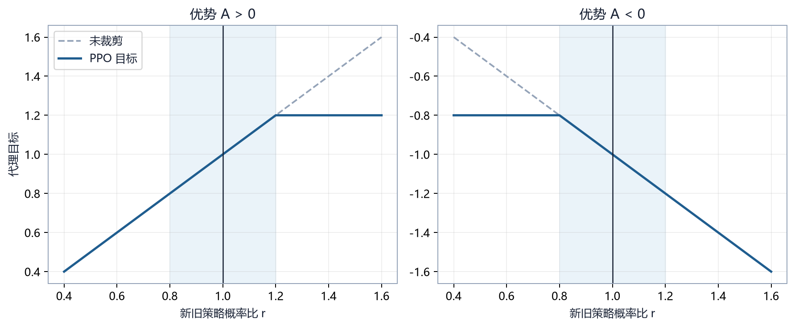

# 第 15 章　PPO：受约束的策略更新

## 15.1 PPO 要解决的稳定性问题

策略梯度根据采样动作更新概率。如果一次更新把高优势动作概率从 0.01 推到 0.8，策略分布会发生巨大变化；同一批数据对新策略已不再具有代表性，价值估计也可能失效。

PPO（Proximal Policy Optimization）通过限制新策略相对旧策略的变化，让每批数据的更新更保守。

## 15.2 新旧策略概率比

\[
r_t(\theta)=
\frac{\pi_\theta(a_t|s_t)}
{\pi_{\theta_{\mathrm{old}}}(a_t|s_t)}
\]

- \(r=1\)：动作概率未变；
- \(r=1.2\)：新概率是旧概率的 1.2 倍；
- \(r=0.7\)：新概率降到旧概率的 70%。

实现中用 log probability：

\[
r_t=\exp\left(
\log\pi_\theta(a_t|s_t)
-\log\pi_{\mathrm{old}}(a_t|s_t)
\right)
\]

若旧概率 0.25、新概率 0.30，比例为 1.2。

## 15.3 未裁剪代理目标

\[
L^{PG}(\theta)=\mathbb{E}[r_t(\theta)\hat A_t]
\]

正优势希望 \(r\) 增大，负优势希望 \(r\) 减小。若反复在同一批数据上优化，比例可能离 1 很远。

## 15.4 裁剪目标

\[
L^{CLIP}(\theta)=
\mathbb{E}\left[
\min\left(
r_t\hat A_t,
\operatorname{clip}(r_t,1-\epsilon,1+\epsilon)\hat A_t
\right)
\right]
\]

常见 \(\epsilon=0.2\)，裁剪区间为 \([0.8,1.2]\)。



### 正优势数字例

\(\hat A=2,r=1.5,\epsilon=0.2\)：

\[
r\hat A=3,\qquad
\operatorname{clip}(1.5,0.8,1.2)\hat A=2.4
\]

取较小值 2.4。超过 1.2 的继续增益被截断。

### 负优势数字例

\(\hat A=-2,r=0.5\)：

\[
r\hat A=-1,\qquad
0.8\times(-2)=-1.6
\]

取较小值 -1.6。概率降低超过边界不会继续带来有利目标。

裁剪不是把所有梯度限制在固定范围，也不是保证 KL 永不超标；它只对代理目标形成悲观下界。

## 15.5 GAE

TD 误差：

\[
\delta_t=r_{t+1}+\gamma V(s_{t+1})-V(s_t)
\]

GAE：

\[
\hat A_t=\delta_t+(\gamma\lambda)\delta_{t+1}
+(\gamma\lambda)^2\delta_{t+2}+\cdots
\]

\(\lambda\) 控制偏差与方差。项目默认常用 0.95。对长微动作 episode，\(\gamma\lambda\) 决定优势向后传播速度：

\[
0.99\times0.95=0.9405
\]

相隔 50 步的 TD 误差权重约 \(0.9405^{50}\approx0.047\)。

## 15.6 PPO 总损失

SB3 以最小化形式组合：

\[
L(\theta)=
-L^{CLIP}
+c_vL_V
-c_e\mathcal{H}(\pi)
\]

价值损失：

\[
L_V=\mathbb{E}[(V_\theta(s_t)-\hat R_t)^2]
\]

熵项鼓励探索。三项量级不同，`vf_coef` 和 `ent_coef` 用于权衡。若环境终局为 ±5000，价值损失可能远大于策略项；仅调 `vf_coef` 不能替代奖励缩放。

## 15.7 一次 PPO 更新

```text
用旧策略收集 n_steps × n_envs 条转移
→ 计算 value、return、GAE advantage
→ 固定 old_log_prob
→ 打乱为多个 minibatch
→ 重复 n_epochs：
     计算新 log_prob 与 ratio
     计算裁剪策略损失、价值损失、熵
     反向传播、梯度裁剪、优化
→ 丢弃 rollout，重新采样
```

同一批数据重复 `n_epochs` 提高样本利用率，但 epoch 太多会使新策略偏离收集策略，表现为 `approx_kl` 和 `clip_fraction` 增大。

## 15.8 超参数解释

| 参数 | 主要作用 | 过大风险 | 过小风险 |
|---|---|---|---|
| `learning_rate` | 每次参数更新尺度 | KL 大、崩溃 | 学习缓慢 |
| `n_steps` | 每环境 rollout 长度 | 内存和延迟 | 长期信息不足 |
| `batch_size` | 小批大小 | 更新次数少 | 梯度噪声 |
| `n_epochs` | 同批重复利用 | 过拟合旧批 | 利用不足 |
| `gamma` | 长期折扣 | 方差高 | 终局太远 |
| `gae_lambda` | 优势平滑 | 方差高 | 偏差高 |
| `clip_range` | 更新限制 | 约束弱 | 学不动 |
| `ent_coef` | 探索 | 难收敛 | 过早坍缩 |
| `vf_coef` | 价值损失权重 | Critic 主导 | 价值学不准 |
| `max_grad_norm` | 梯度裁剪 | 约束弱 | 持续削弱更新 |

参数相互作用，不能用“单参数最佳值”概括。

## 15.9 项目为何选择 PPO

- 支持 Dict 观察和 MultiDiscrete/Discrete；
- 能结合自定义 CNN 特征提取器；
- sb3-contrib 提供 MaskablePPO；
- on-policy 数据与变化对手的语义较清晰；
- 课程、回调、评估和模型 Bot 已围绕 SB3 建立。

代价是样本利用率低，长局训练昂贵；掩码和奖励错误仍会使它稳定地学到错误策略。

## 15.10 历史困难

项目长期 PPO 训练的主要障碍不是 clip 公式本身，而是系统层：

- 逐维动作掩码产生大量无效组合；
- \(\gamma=0.99\) 对数百微动作终局过短；
- 展平特征缺乏空间归纳偏置；
- 奖励项鼓励刷伤害、拖延或落后状态；
- 课程晋级受评估噪声与 checkpoint 交接影响；
- 单随机种子无法区分改进与偶然。

PPO 章节必须与第十一、十二、十七和二十三章一起使用。

## 15.11 监控指标

- `approx_kl` 持续过高：更新过大；
- `clip_fraction` 接近 1：大量样本被裁剪；
- entropy 迅速归零：策略坍缩；
- explained variance 长期接近 0 或为负：价值预测无解释力；
- value loss 极大：回报尺度或 Critic 失配；
- 平均回报涨而胜率不涨：检查奖励分解。

## 15.12 本章练习

1. 旧概率 0.4、新概率 0.5，计算比例。
2. \(\epsilon=0.2,A=3,r=1.4\) 时裁剪目标取多少？
3. 为什么 PPO 仍属于 on-policy？
4. 列出两个 clip 公式之外导致项目 PPO 失败的系统原因。

