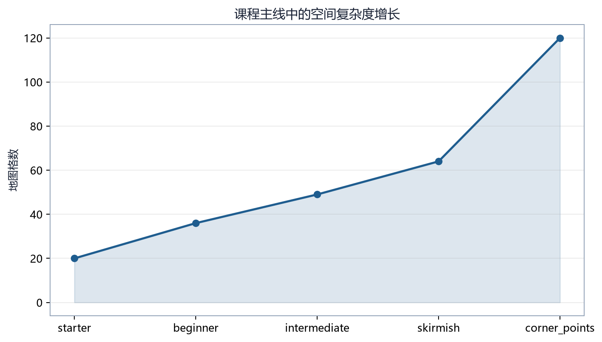

# 第 17 章　课程学习与 Bootstrap

## 17.1 冷启动问题

初始策略接近随机。在完整地图、全部单位和强对手下，它很难偶然完成“生产—行军—战斗—占领总部”的长链。若所有轨迹都失败且回报相似，优势估计缺乏可区分信号。

课程学习把任务按难度排列，使当前策略面对“略高于已有能力”的数据分布。Bootstrap 指通过弱对手、小地图、受限兵种、行为克隆或塑形让策略离开随机冷启动区。



## 17.2 课程阶段

项目阶段可抽象为：

\[
\mathcal{C}_i=
(\text{map},\text{opponent},\tau_i,p_i,T_i,
\text{reward},\text{entropy},\text{rules})
\]

| 量 | 含义 |
|---|---|
| \(\tau_i\) | 晋级胜率阈值 |
| \(p_i\) | 连续达标次数 patience |
| \(T_i\) | 最大训练步预算 |
| map | 地图及观察/动作复杂度 |
| opponent | 对手类型与参数 |

阶段不是只换对手。地图尺寸、回合上限、奖励、熵系数和规则覆盖都可能变化。

## 17.3 训练状态机

```text
加载配置与模型
→ 构建阶段 i 的训练/评估环境
→ 训练 eval_freq 步
→ 固定协议评估
→ 连续 p 次胜率 ≥ τ 且满足最低步数？
   ├─ 是：恢复阶段最佳 checkpoint，进入 i+1
   └─ 否：预算是否耗尽？
          ├─ 否：继续训练
          └─ 是：抛出 CurriculumStalled
```

停滞应显式失败并保留历史，不能静默进入下一关。否则最终模型看似“完成课程”，实际可能跳过未掌握技能。

## 17.4 晋级噪声

评估胜率：

\[
\hat w=\frac{W}{n}
\]

若真实胜率 0.7、评估 20 局，标准误约：

\[
\sqrt{\frac{0.7\times0.3}{20}}\approx0.102
\]

一次 85% 可能只是波动。`patience=2` 要求连续两次达标，降低偶然晋级；增加评估局数降低噪声。二者仍不能消除 winner's curse：恰好被选为“最佳”的 checkpoint 可能包含正向噪声。

## 17.5 MixedBot 难度桥

从 RandomBot 直接换 SimpleBot 可能改变的不只是强度，还包括行为分布。MixedBot 每局以概率 \(p_h\) 选择 hard，否则选择 easy：

\[
O\sim
\begin{cases}
O_{\mathrm{hard}},&p_h\\
O_{\mathrm{easy}},&1-p_h
\end{cases}
\]

每局内部保持同一个 Bot，使对手策略连贯。课程可用 25%、50% 等难度桥逐步改变分布。

## 17.6 阶段交接：峰值而非末值

on-policy 策略在达到高胜率后仍会继续更新，可能向塑形捷径漂移。若下一阶段从“预算耗尽时的最后权重”开始，会丢掉阶段内最佳能力。

当前设计可在晋级时恢复 `best_model`。但“最佳”必须由与阶段一致的评估环境确定，且 checkpoint 保存时点要真实包含触发指标的参数。

历史审查发现 `best_model.zip` 有时仍是阶段带入模型，晋级后恢复会撤销本阶段学习。解决这类问题要核对：

- 首次评估前是否保存 carry-in 基准；
- 达到更好指标时是否覆盖；
- 回调调用顺序；
- 恢复后总步数与优化器状态；
- stage 目录中的时间戳和指标。

## 17.7 早期失败：确定性 noop 教师

完全不行动的对手适合检查造兵、移动和占领接口，但若作为长期唯一老师：

- 轨迹高度重复；
- 策略可用单一剧本获胜；
- 回报方差趋近零；
- 迁移到会争夺地图的对手时崩溃。

因此 noop 是单元测试和最初台阶，不是课程的能力终点。

## 17.8 地图迁移与价值错位

从 starter 到 beginner，空间尺寸、路径长度、收入节奏和终局距离改变。即使观察 padding 统一，价值网络对旧地图回报分布的估计也可能不适合新地图。

缓解方式：

- 中间地图；
- 地图切换时提高探索；
- 使用空间特征与坐标通道；
- 阶段首部做诊断评估；
- 允许 Critic 重新适应；
- 避免同时改变太多奖励和规则。

## 17.9 课程漂移与错误修复链

长期 Bootstrap 复盘可归纳为以下因果链。

### 现象

一些运行通过早期阶段，却在 `beginner_random_15/20` 或更大地图处形成大量和局；另一些在阶段内先达到高胜率，之后退化。

### 证据

- 胜率曲线先升后降；
- 平均回合靠近最大回合；
- 塑形回报继续增长；
- 伤害/击杀多而占领减少；
- 不同单种子运行分歧很大。

### 排除过程

实验依次检查熵、耐心、兵种限制、对手强度、checkpoint 交接、引擎常量、行为克隆和奖励项。多次结论后来被配置或评估环境不一致推翻，说明实验隔离比调参速度更重要。

### 已落地改进

- 恢复阶段最佳 checkpoint；
- 将规则常量显式放入 `engine_overrides`；
- 增加 MixedBot 与中间地图；
- 改进随机 Bot 与 RNG；
- 记录终局原因和行为组成；
- 调整战斗、占领、受伤与和局奖励；
- 支持最低训练步、patience 和停滞异常；
- 使用空间特征提取器。

### 当前开放问题

- 长微动作下 \(\gamma\) 的系统性消融；
- 多训练种子；
- Flat 动作索引的语义不稳定；
- 更适合大地图的结构化动作网络；
- 课程阈值的统计决策方法。

## 17.10 `max_timesteps` 是安全阀

阶段预算应表示“最多允许消耗多少数据后认定停滞”，不是保证这么多步一定足够。若指标长期不动，简单扩大预算可能只强化错误吸引子。

诊断顺序：

1. 是否有合法且多样的动作；
2. 回报是否有方差；
3. 终局原因；
4. 奖励分解；
5. 行为直方图；
6. 评估环境一致性；
7. 最后才考虑增加预算。

## 17.11 最小管线实验

本书提供一阶段配置：

```powershell
python scripts/train/train_bootstrap.py `
  --config agents/learning-guide-v2/labs/bootstrap-smoke.yaml `
  --device cpu `
  --output-dir tmp/guide-bootstrap-smoke `
  --skip-plots `
  --skip-videos `
  --sanity-episodes 0 `
  --no-gcs
```

该阶段阈值为 0、最低步数 32、预算 64，只验证模型创建、评估、晋级和输出目录。它不验证课程是否能学习游戏。

## 17.12 本章练习

1. 为什么 patience 能降低偶然晋级却不能消除 winner's curse？
2. MixedBot 为何按 episode 选对手而不是每一步切换？
3. 阶段末模型与阶段最佳模型为何可能不同？
4. 看到 `CurriculumStalled` 后应先检查哪些证据，而不是立即加预算？

