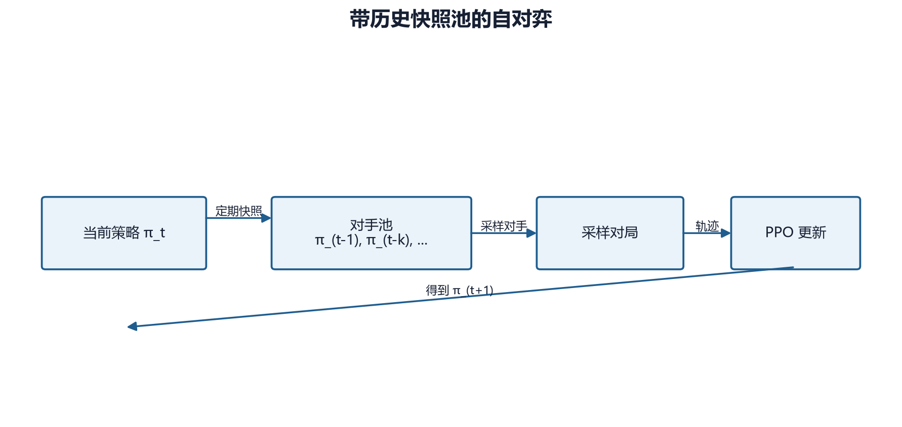

# 第 19 章　自对弈

## 19.1 为什么需要自对弈

固定脚本 Bot 提供稳定课程，却有能力上限和可利用模式。自对弈让策略面对自己的历史版本，训练分布随能力增长。

最简单形式：

\[
\pi_t \text{ 对战 } \pi_t
\]

但只对战当前镜像容易产生同步退化和策略循环。项目使用快照与对手池稳定训练。



## 19.2 非平稳性

普通单智能体 MDP 假定环境转移固定。自对弈中对手随训练更新，策略看到的转移分布变为：

\[
P_t(s'|s,a;\pi^{opp}_t)
\]

若每几步就把对手替换为当前网络，学习者追逐移动目标。更新太快会不稳定，太慢则容易过拟合旧对手。

## 19.3 快照池

对手池：

\[
\mathcal{P}_t=\{\pi_{t_1},\pi_{t_2},\ldots,\pi_{t_K}\}
\]

每个 episode 从池中采样对手。选择策略：

- uniform：所有快照等概率；
- recent：偏向近期对手；
- prioritized：按胜率或难度加权。

均匀采样简单且提供历史覆盖；偏近期更聚焦当前前沿；优先采样需要可靠难度估计，否则会形成反馈偏差。

## 19.4 为什么历史对手重要

策略可能存在非传递关系：

```text
A 克制 B，B 克制 C，C 克制 A
```

只对战最新对手可能忘记较早策略，出现战略循环。历史池相当于持续复习旧考试。

## 19.5 对手快照与权重安全

对手不应引用会在优化器更新时变化的同一参数对象。应复制或保存稳定快照。若为了推理临时交换权重，必须在异常时通过 `finally` 恢复，否则训练模型可能被对手权重污染。

项目的自对弈工厂在 episode reset 时创建绑定当前 `GameState` 的 ModelBot；快照更新频率和池大小由配置控制。

## 19.6 玩家视角与座次

随机交换座次可以减少先手偏差，但需要完整翻转：

- grid 和 unit 归属；
- own/opp 金币；
- 当前玩家；
- 可见性；
- 奖励符号；
- winner 判断；
- 合法动作查询玩家。

任何漏项都会让“对手视角观察”内部矛盾。战争迷雾下尤其要防止用原玩家可见性。

## 19.7 固定评估锚

如果训练和评估都面对不断变强的自对弈对手，胜率可能一直约 50%，无法判断绝对能力。必须保留固定锚：

- RandomBot；
- Simple/Medium/AdvancedBot；
- 固定历史 checkpoint；
- 固定地图与座次协议。

自对弈训练指标回答“相对当前对手如何”，固定锚回答“绝对能力是否进步”。

## 19.8 混合训练

混合策略以概率 \(\rho\) 对脚本 Bot，其余对自对弈：

\[
O\sim
\begin{cases}
O_{\mathrm{bot}},&\rho\\
O_{\mathrm{self}},&1-\rho
\end{cases}
\]

脚本 Bot 提供稳定技能锚，自对弈提供不断变化的挑战。比例不是越偏自对弈越先进；冷启动策略的镜像对手同样不会提供高质量战术。

## 19.9 与课程和 BC 的组合

合理顺序：

```text
BC（可选）掌握基本操作
→ Bot 课程建立造兵、占领、战斗能力
→ 自对弈扩展策略
→ 固定 Bot 梯与锦标赛持续评估
```

直接让两个随机策略自对弈，双方可能共同稳定在拖延或无效行为。

## 19.10 项目实现

`reinforcetactics/rl/self_play.py` 提供：

- `OpponentPool`；
- `SelfPlayEnv`；
- `make_self_play_env`；
- `make_self_play_vec_env`。

训练脚本：

```powershell
python scripts/train/train_self_play.py `
  --mode self-play `
  --use-opponent-pool `
  --pool-size 4 `
  --n-envs 1 `
  --no-subprocess `
  --total-timesteps 64 `
  --n-steps 32 `
  --batch-size 32 `
  --n-epochs 1 `
  --device cpu `
  --max-steps 32 `
  --eval-freq 32 `
  --n-eval-episodes 1 `
  --checkpoint-freq 64 `
  --log-dir tmp/guide-self-play-smoke
```

这是接口冒烟；64 步不足以形成有意义对手池能力。

## 19.11 RNG 与推理热路径

2026-07-24 审查指出自对弈 RNG 和对手推理路径存在可复现与性能风险。应记录池采样 RNG、环境种子和对手推理设备；对手网络应使用 `eval()`、`no_grad()`，避免不必要梯度和随机层。

## 19.12 常见失败

| 现象 | 原因 |
|---|---|
| 自对弈胜率恒 50% | 指标相对且对手同步变化 |
| 对固定 Bot 退化 | 灾难遗忘、池太偏近期 |
| 多环境结果不复现 | 子进程种子或池 RNG |
| 训练越来越慢 | 对手推理在热路径、设备切换 |
| 一方观察异常 | 视角翻转不完整 |
| 两边一起拖延 | 冷启动和奖励共同形成坏均衡 |

## 19.13 本章练习

1. 为什么只对战当前镜像不足以避免战略遗忘？
2. 自对弈胜率约 50% 时，怎样判断绝对能力？
3. 说明座次翻转至少要同步改变的四类信息。
4. 为什么自对弈通常应放在 Bot 课程或 BC 之后？

