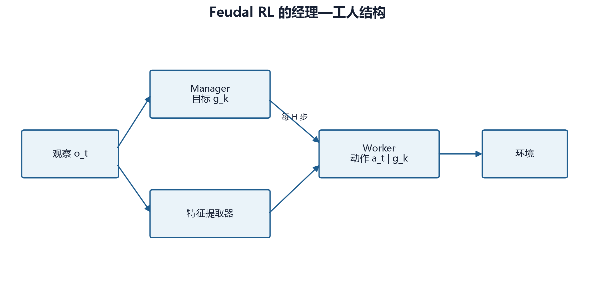

# 第 20 章　Feudal RL：用层级决策分解长期战略

## 20.1 为什么需要层级

前面的 PPO、MaskablePPO 都在同一个时间尺度上作决定：策略每接收一次观察，就直接输出一次环境动作。这个做法适合局部决策，却很难自然表达“先夺取中央资源点，再集结远程单位，最后进攻基地”这样的多步意图。

策略游戏同时包含两种时间尺度：

- **战略层**决定一段时间内应当追求什么；
- **执行层**决定下一步具体移动、生产、攻击还是结束回合。

Feudal Reinforcement Learning（封建式强化学习，简称 Feudal RL）把一个策略拆成 Manager 和 Worker。Manager 以较低频率提出目标，Worker 在接下来的若干微动作中，依据当前观察和目标选择具体动作。



这不是把两个完全独立的智能体放进游戏。二者共享同一环境轨迹，只是承担不同职责，并分别拥有策略网络、价值网络和训练数据。

## 20.2 从时间抽象理解 Manager 与 Worker

设环境微动作编号为 \(t\)，Manager 每隔 \(c\) 个微动作输出一次目标：

\[
g_k \sim \pi_M(g\mid s_{kc})
\]

其中：

- \(k\) 是 Manager 的决策段编号；
- \(c\) 是 `manager_horizon`；
- \(s_{kc}\) 是该段开始时的状态；
- \(g_k\) 是这一段要追求的目标；
- \(\pi_M\) 是 Manager 策略。

在段内，Worker 每一步都接收同一个目标：

\[
a_t \sim \pi_W(a\mid s_t,g_k),\qquad kc\le t<(k+1)c
\]

与普通策略相比，Worker 多了一个条件变量 \(g_k\)。相同状态下，目标不同，动作分布也应不同。例如，目标位于左上资源点时，向左移动的概率应提高；目标是防守基地时，召回单位或结束冒进的概率应提高。

这种设计的关键不是网络数量，而是**时间抽象**：Manager 的一个动作对应 Worker 的一段动作序列。

## 20.3 项目中的目标表示

本项目的 Manager 输出三维连续目标，概念上可写为

\[
g=(x_g,y_g,z_g)
\]

前两个分量描述地图目标位置，第三个分量描述目标类别或高层语义。网络输出会被限制到规定范围，再转换为 Worker 能消费的目标向量。这样做有两个好处：

1. 目标空间远小于完整微动作组合，Manager 不必直接选择单位、动作类型和目标坐标；
2. 目标位置可以与卷积提取出的空间特征对齐。

连续目标并不意味着环境存在“移动到坐标”这一原子动作。Worker 仍然需要选择真实合法动作，一步步改变状态。

### 目标条件不是命令执行器

Manager 的目标只改变 Worker 的概率分布，并不保证 Worker 一定到达目标。训练早期尤其可能出现：

- Manager 给出的目标没有战略意义；
- Worker 尚未学会响应目标；
- Worker 忽略目标，只依赖环境奖励；
- 目标在当前局面不可到达；
- 目标频繁变化，尚未执行就被替换。

因此，层级方法比单层 PPO 多出一个“协同学习”问题：Manager 要提出 Worker 能完成且有价值的目标，Worker 又要表现出足够稳定的目标响应，Manager 才能学到目标的后果。

## 20.4 内在奖励：怎样告诉 Worker 目标是否有进展

只把终局胜负奖励交给 Worker，目标变量很容易被忽略。项目使用内在奖励衡量单位与目标的空间关系。抽象地写，可以把一个简单版本表示为

\[
r_t^{\text{int}}
=d(s_t,g)-d(s_{t+1},g)+b\cdot \mathbf{1}[\text{reach}(s_{t+1},g)]
\]

逐项解释：

- \(d(s,g)\)：状态中相关单位到目标的距离；
- \(d(s_t,g)-d(s_{t+1},g)\)：距离缩短时为正，远离时为负；
- \(\mathbf{1}[\cdot]\)：指示函数，条件成立取 1，否则取 0；
- \(b\)：到达目标的额外奖励；
- 单位：与环境奖励一样，都是“每个微动作的奖励值”，但数值尺度可能不同。

假设单位到目标的曼哈顿距离从 5 降到 3，未到达目标，且距离改善系数为 1，那么内在奖励为 \(5-3=2\)。若下一步从距离 1 到达目标，且到达奖励为 5，则奖励为 \(1+5=6\)。

这里的关键是，内在奖励只回答“是否按照 Manager 的目标行动”，并不直接回答“这个目标能否赢得游戏”。后者由外在环境奖励和 Manager 学习承担。

## 20.5 Worker 奖励：必须以实际代码为准

项目当前缓冲区中的合成公式是：

```python
self.w_rewards.append(
    intrinsic_reward
    + worker_reward_alpha * extrinsic_reward
)
```

因此，Worker 实际接收

\[
r_t^W=r_t^{\text{int}}+\alpha r_t^{\text{ext}}
\]

其中：

- \(r_t^{\text{int}}\) 是目标进展奖励；
- \(r_t^{\text{ext}}\) 是经过 `reward_scale` 缩放后的环境奖励；
- \(\alpha\) 对应 `worker_reward_alpha`，默认配置为 0.5；
- \(r_t^W\) 是进入 Worker GAE 和 PPO 更新的奖励。

这不是

\[
(1-\alpha)r^{\text{int}}+\alpha r^{\text{ext}}
\]

形式的凸组合。换句话说，`worker_reward_alpha=1.0` 在当前实现中表示“完整内在奖励加上一倍外在奖励”，并不表示“只保留外在奖励”。如果命令帮助或旧实验注释把它描述为内外奖励的插值比例，应当把那种描述视为不精确说明，以这段实际数据路径为准。

### 数值例子

假设：

- 原始环境奖励为 100；
- `reward_scale=0.001`；
- 内在奖励为 2；
- `worker_reward_alpha=0.5`。

先缩放外在奖励：

\[
r^{\text{ext}}=100\times 0.001=0.1
\]

再合成 Worker 奖励：

\[
r^W=2+0.5\times 0.1=2.05
\]

这个例子揭示了尺度关系：若内在奖励经常在 1 到 5，而缩放后外在奖励只有 0.1，Worker 的短期行为主要受目标塑形控制。Manager 则需要通过累计外在奖励判断这个目标是否真正有利于胜利。

## 20.6 Manager 奖励与段级回报

Manager 的一个动作持续 \(k_t\) 个环境微动作。项目在目标段结束时记录该段累计的外在奖励和实际段长：

```python
def end_manager_segment(self, cumulative_reward, done, segment_length):
    self.m_rewards.append(cumulative_reward)
    self.m_dones.append(done)
    self.m_segment_lengths.append(segment_length)
```

段长不能被忽略。若仍对每个 Manager 段固定乘一次 \(\gamma\)，就相当于把持续 2 步和持续 10 步的目标视为具有相同时间跨度。当前 `_compute_gae` 对 Manager 使用

\[
\gamma_t=\gamma^{k_t}
\]

并把 TD 残差写为

\[
\delta_t=R_t^M+\gamma^{k_t}(1-d_t)V(s_{t+1})-V(s_t)
\]

其中：

- \(R_t^M\) 是整个目标段的累计外在奖励；
- \(k_t\) 是该段真实持续的微动作数；
- \(d_t\) 表示段末是否终局；
- \(V\) 是 Manager 价值估计。

若 \(\gamma=0.99\)，段长为 10，则跨段折扣为

\[
0.99^{10}\approx 0.904
\]

而不是 0.99。这样才能保持与逐微动作时间尺度一致。

Manager 的 GAE 递推也要使用段折扣：

\[
A_t=\delta_t+\gamma^{k_t}\lambda(1-d_t)A_{t+1}
\]

这是一处很容易被“照抄普通 PPO”遗漏的实现细节。

## 20.7 两套 Worker 动作头

项目保留两类 Worker。

### 20.7.1 传统多头 Worker

传统 Worker 为 MultiDiscrete 的各维分别输出概率，例如动作类型、来源坐标、单位类型和目标坐标。训练时可保存每一维的布尔掩码，并在 PPO 重算对数概率时应用同一组掩码。

优点是结构简单、并行计算方便。局限与第 11 章讨论的一样：逐维掩码只能说明单个取值是否在某些合法动作中出现，不能保证各维组合后仍然合法。

### 20.7.2 自回归 Worker

自回归 Worker 按条件顺序生成结构化动作：

\[
p(a\mid s,g)
=p(a_{\text{type}}\mid s,g)
\times p(a_{\text{src}}\mid a_{\text{type}},s,g)
\times p(a_{\text{unit}}\mid a_{\text{type}},a_{\text{src}},s,g)
\times p(a_{\text{target}}\mid \text{previous},s,g)
\]

取对数以后才变为各阶段对数概率之和：

\[
\log p(a\mid s,g)=\sum_j\log p(a_j\mid a_{<j},s,g)
\]

每个阶段使用依赖前面选择的条件掩码。项目缓冲区会保存 `atype`、`src`、`unit_type` 和 `target` 四组采样时掩码，在 PPO 更新时重放，避免“采样分布与训练分布不一致”。

这比传统多头更接近精确动作掩码，但代价是：

- 推理要顺序执行多个头；
- 缓冲区必须保存更多条件信息；
- 某个早期头选择不佳，会限制后续所有选择；
- 实现与测试明显更复杂。

## 20.8 Manager 和 Worker 都使用 PPO

项目不是用一种新损失完全替代 PPO，而是在两个时间尺度上分别应用 PPO。对任一层 \(X\in\{M,W\}\)，策略损失为

\[
L_X^{\text{clip}}
=-\mathbb{E}\left[
\min\left(
r_t^X A_t^X,\,
\operatorname{clip}(r_t^X,1-\epsilon,1+\epsilon)A_t^X
\right)\right]
\]

再加价值损失、减去熵奖励：

\[
L_X=L_X^{\text{clip}}+c_vL_X^V-c_eH_X
\]

项目为 Manager 和 Worker 分别统计 policy loss、value loss 和 entropy。诊断时不能只看总回报：

- Worker 内在奖励持续升高，但胜率不升：Worker 会执行目标，Manager 目标可能无用；
- Manager 回报有改善，但 Worker 到达目标率低：高层意图没有可靠落地；
- 两层价值损失都很大：奖励尺度或终局脉冲可能过强；
- 熵迅速接近零：某一层过早形成确定性策略。

## 20.9 为什么项目尝试 Feudal RL

本项目的长回合、空间地图和组合动作天然具有层级结构。Feudal RL 的潜在优势是：

1. **延长信用分配范围。** Manager 以段为单位学习，不必把每个微动作分别关联到终局；
2. **形成可解释中间变量。** 目标坐标可绘制、统计到达率；
3. **复用执行技能。** 一个会“向目标移动与作战”的 Worker 可以服务多个高层目标；
4. **匹配策略语言。** 占点、集结、进攻等计划本来就跨越多个动作。

代价同样明显：

1. 两层同时变化，训练分布非平稳；
2. 内在奖励设计会引入新的偏好；
3. 目标空间是否足够表达战略并无保证；
4. 样本和调参成本高于单层 MaskablePPO；
5. 传统 Worker 仍承受组合动作掩码的近似误差。

因此，Feudal RL 在本项目中属于进阶实验路径，不应因为结构更复杂就预设它一定优于主线 MaskablePPO。

## 20.10 历史困难的因果整理

### 当时现象

- 训练能够运行，但 Worker 内在奖励与胜率不同步；
- Manager 的价值损失容易受大额终局奖励影响；
- 逐维动作头仍会形成非法组合；
- 多环境采集、断点恢复和自对弈快照需要保存额外层级状态；
- 配置中的环境平衡、奖励和单位限制曾有未完整传递的风险。

### 调查证据

单看 episode reward 无法判断问题来自哪一层。后来增加了 Worker 内在/外在奖励、到达目标率、Manager/Worker 各自损失等诊断；缓冲区也显式保存动作掩码和 Manager 段长。

### 已排除的简单解释

“层级网络没有学会”过于笼统。至少要分别检查目标是否可完成、Worker 是否响应目标、Manager 是否获得正确段奖励，以及掩码在更新时是否与采样一致。

### 已落地修复

- 外在奖励进入层级缓冲区前支持 `reward_scale`；
- Manager GAE 使用真实段长的 \(\gamma^{k_t}\)；
- Worker 采样掩码可随轨迹保存并重放；
- 增加自回归 Worker 与阶段条件掩码；
- 训练配置把环境奖励、引擎覆盖、单位集合和观察尺度传给 Feudal 环境；
- checkpoint 保存训练计数、最佳指标和快照节奏。

### 当前仍开放的问题

- 三维目标是否是最合适的高层表示；
- 内在奖励是否诱导“抵达坐标”而非“取得战略收益”；
- Manager horizon 是否应随局面变化；
- 自回归 Worker 的额外复杂度能否稳定转化为胜率；
- 在相同计算预算下，层级方法是否显著优于更充分训练的 MaskablePPO。

## 20.11 最小实操

先运行单元与集成测试：

```powershell
pytest -q tests/test_feudal_rl.py tests/test_feudal_rl_integration.py
```

再用教材配置作 CPU 冒烟训练：

```powershell
python scripts/train/train_feudal_rl.py `
  --mode feudal `
  --config agents/learning-guide-v2/labs/feudal-smoke.yaml
```

冒烟训练的验收目标不是胜率，而是：

- 能完成一次 rollout 和两层 PPO 更新；
- Manager 与 Worker 的损失均为有限数；
- 轨迹长度、段长和奖励分量可记录；
- checkpoint 可写入临时目录；
- 使用自回归 Worker 时，四组条件掩码数量与 Worker 步数一致。

正式实验应至少比较：

| 实验 | Worker | `reward_scale` | 目的 |
|---|---|---:|---|
| F0 | 传统多头 | 1.0 | 原始尺度基线 |
| F1 | 传统多头 | 0.001 | 检查价值损失稳定性 |
| F2 | 自回归 | 0.001 | 检查精确条件掩码收益 |
| F3 | 自回归 | 0.001 | 改变 horizon，检查时间抽象 |

所有比较都应固定地图、对手、训练步数、评估种子和评估局数。

## 20.12 常见误解

**误解一：Manager 直接控制游戏。**  
Manager 只产生目标；环境动作全部由 Worker 输出。

**误解二：内在奖励越高，策略越强。**  
它只说明 Worker 更符合目标。目标本身可能无助于胜利。

**误解三：`worker_reward_alpha=1` 等于只用外在奖励。**  
当前实现是内在奖励加一倍外在奖励。

**误解四：Manager 每段折扣一次普通 \(\gamma\) 即可。**  
段长不同，应使用 \(\gamma^{k_t}\)。

**误解五：层级网络天然比单层网络强。**  
它提供了归纳偏置，也引入了协同、奖励设计和非平稳问题，结论必须由等预算实验给出。

## 20.13 本章小结

Feudal RL 通过 Manager—Worker 把长期目标与微动作执行分开。项目当前实现包含独立的两层 PPO、目标内在奖励、段级 GAE、掩码重放和可选自回归 Worker。理解这一实现最重要的三点是：目标不是原子动作；Worker 奖励是实际代码规定的加法结构；Manager 的时间折扣必须反映真实段长。

## 20.14 练习

1. 当 \(\gamma=0.98\)、Manager 段长为 8 时，跨段折扣是多少？为什么不能直接使用 0.98？
2. 若内在奖励为 3、原始外在奖励为 500、`reward_scale=0.001`、`worker_reward_alpha=0.2`，计算 Worker 奖励。
3. 解释“到达目标率上升但胜率下降”可能对应的两种原因。
4. 为什么 PPO 更新时必须重放采样时使用的条件掩码？
5. 设计一个消融实验，区分自回归动作头和奖励缩放各自的作用。
