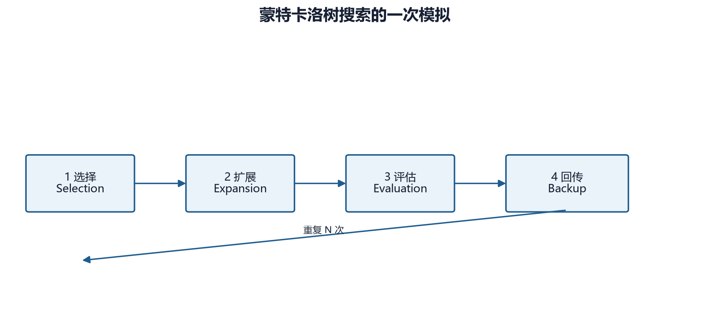

# 第 21 章　蒙特卡洛树搜索：在行动之前进行推演

## 21.1 从反应式策略到显式搜索

PPO 或 DQN 的网络通常只做一次前向传播，就给出当前状态下的动作。MCTS 则在真正执行动作之前，复制当前局面并反复模拟可能的后续分支，以访问次数形成改进后的决策。

这两种方法回答不同问题：

- 神经网络回答“凭已有经验，这个局面看起来怎样”；
- 树搜索回答“如果沿着若干候选动作继续推演，哪些分支更值得选择”。

Reinforce Tactics 的 AlphaZero 实验把二者结合：网络提供先验概率和叶节点价值，MCTS 在当前局面内重新分配搜索预算。



## 21.2 搜索树中的统计量

树中每个节点代表一个游戏状态，边代表一个合法动作。对父节点 \(s\) 和动作 \(a\)，需要维护：

- \(P(s,a)\)：神经网络给出的先验概率；
- \(N(s,a)\)：这条边被访问的次数；
- \(W(s,a)\)：经过这条边得到的累计价值；
- \(Q(s,a)=W(s,a)/N(s,a)\)：平均价值。

第一次访问时 \(N=0\)，项目把对应 \(Q\) 视为 0，避免除零。

### 数值例子

假设三个合法动作的统计如下：

| 动作 | \(P\) | \(N\) | \(W\) | \(Q\) |
|---|---:|---:|---:|---:|
| 攻击 | 0.50 | 20 | 8 | 0.40 |
| 占点 | 0.30 | 5 | 3 | 0.60 |
| 结束回合 | 0.20 | 1 | 0 | 0.00 |

攻击的平均价值不如占点，但访问更多；结束回合证据最少。选择公式要同时利用现有价值与探索不足。

## 21.3 Selection：PUCT 选择

项目使用 AlphaZero 风格 PUCT：

\[
\operatorname{score}(s,a)
=Q(s,a)
+c_{\text{puct}}P(s,a)
\frac{\sqrt{N(s)+1}}{1+N(s,a)}
\]

其中：

- \(N(s)\) 是父节点访问次数；
- \(c_{\text{puct}}\) 控制探索强度；
- \(P(s,a)\) 使网络认为较可能的动作优先得到搜索机会；
- 分母 \(1+N(s,a)\) 会降低已经充分访问的分支的探索奖励。

假设父节点访问 25 次、\(c_{\text{puct}}=1.5\)。对上表“占点”：

\[
U=1.5\times 0.30\times
\frac{\sqrt{26}}{1+5}
\approx 0.382
\]

所以总分约为 \(0.60+0.382=0.982\)。

对“攻击”：

\[
U=1.5\times0.50\times
\frac{\sqrt{26}}{21}
\approx0.182
\]

总分约为 \(0.582\)。虽然攻击先验更高，但占点当前的价值和访问不确定性使它更值得继续探索。

### 玩家视角的符号

两人零和游戏中，“对当前玩家有利”通常意味着“对对手不利”。项目节点保存玩家身份，选择与回传时依据节点玩家和根玩家关系翻转 \(Q\) 或累积价值的符号。

这是实现 MCTS 最容易出错的部分之一。若所有层都不翻号，搜索会假设对手配合根玩家；若重复翻号，又会把本来正确的价值变反。阅读代码时必须同时确认：

1. 网络价值从谁的视角输出；
2. 终局价值从谁的视角定义；
3. 回传存储统一根视角还是节点视角；
4. 选择时是否还需翻转。

当前实现的约定是：网络估值最初来自叶节点当前玩家视角，必要时转为根玩家视角；回传依据节点玩家与根玩家关系加减；选择子节点时再使 \(Q\) 与当前父节点视角一致。

## 21.4 Expansion：只扩展合法动作

到达未扩展叶节点后，搜索取得真实合法动作，把它们映射到 Flat Discrete 索引，然后只为这些索引创建子节点。

项目平坦动作空间大小为：

\[
|\mathcal A|=10\times W\times H
\]

其中 10 是动作类别数，\(W,H\) 为地图宽高。对 \(20\times20\) 地图，策略头输出 4000 个 logit，但每个局面只扩展合法索引。

先验概率在网络中已经用动作掩码归一化。非法动作 logit 被设为约 \(-10^8\)，softmax 后概率接近零。树仍以游戏引擎给出的合法动作表为最终依据，而不是假设所有高概率索引均可执行。

### 惰性复制

项目创建子节点时不立即复制并推进全部状态。只有某个子节点首次在 Selection 中被选中，才：

1. 深复制父状态；
2. 把保存的动作引用解析到复制后的对象；
3. 执行动作；
4. 更新当前玩家和终局标志。

这样可避免为从未访问的分支支付完整状态复制成本。代价是动作对象不能直接从原状态复用，因为深复制后的单位与建筑是不同对象；必须按坐标或稳定标识重新解析。

## 21.5 Evaluation：策略头与价值头

叶节点不再进行随机 rollout，而由网络一次输出：

\[
(p,v)=f_\theta(s)
\]

- \(p\) 是 Flat Discrete 动作空间上的概率；
- \(v\in[-1,1]\) 是当前玩家视角的终局结果估计。

若节点已经终局，则不调用网络：

\[
v=
\begin{cases}
+1,&\text{根玩家获胜}\\
0,&\text{和局}\\
-1,&\text{根玩家失败}
\end{cases}
\]

网络减少了从叶节点一直随机模拟到终局的成本，但估值质量会直接限制搜索质量。未经训练的随机网络仍能完成流程测试，却不能提供可靠棋力。

## 21.6 Backup：把叶节点证据传回根

一条模拟路径得到叶节点价值 \(v\) 后，对路径上的节点更新：

\[
N\leftarrow N+1
\]

\[
W\leftarrow W+\sigma v
\]

其中 \(\sigma\) 根据节点玩家与根玩家是否一致取 \(+1\) 或 \(-1\)。然后

\[
Q=\frac{W}{N}
\]

访问次数增加会使同一分支的平均价值逐渐稳定，也会降低它在 PUCT 中的探索项。

需要注意，MCTS 的一次“simulation”并不是一局完整游戏；它通常只从根沿当前树走到一个未展开叶节点，评估一次，再回传。

## 21.7 根节点狄利克雷噪声

自对弈若始终沿最大先验搜索，很快会反复产生相似轨迹。项目训练搜索在根节点混入狄利克雷噪声：

\[
P'(s,a)
=(1-\varepsilon)P(s,a)+\varepsilon\eta_a
\]

\[
\boldsymbol\eta\sim
\operatorname{Dirichlet}(\alpha,\ldots,\alpha)
\]

其中 `dirichlet_epsilon` 决定噪声权重，`dirichlet_alpha` 决定噪声形态。

- 较小 \(\alpha\)：概率质量集中到少数随机动作，探索更尖锐；
- 较大 \(\alpha\)：噪声更平均；
- \(\varepsilon=0\)：完全不注入根噪声。

项目默认 `dirichlet_alpha=0.3`、噪声权重 0.25。评估时应设置 `add_noise=False`，否则同一模型比较会混入不必要的搜索随机性。

## 21.8 从访问次数得到动作分布

搜索结束后，项目先用访问比例构造完整动作分布：

\[
\pi(a\mid s)
=\frac{N(s,a)}{\sum_b N(s,b)}
\]

这既是选动作的依据，也是 AlphaZero 训练策略头的监督目标。

温度 \(\tau\) 进一步控制采样：

\[
\pi_\tau(a\mid s)
=\frac{N(s,a)^{1/\tau}}
{\sum_bN(s,b)^{1/\tau}}
\]

- \(\tau=1\)：保持访问比例；
- \(0<\tau<1\)：分布更尖锐；
- \(\tau\to0\)：趋向访问次数最大的动作；
- 项目对 `temperature=0` 直接使用 `argmax`。

假设访问次数为 \([50,30,20]\)。\(\tau=1\) 时概率为 \([0.5,0.3,0.2]\)；\(\tau=0.5\) 时平方后归一化：

\[
[2500,900,400]/3800
\approx[0.658,0.237,0.105]
\]

训练前期使用较高温度可增加局面多样性，后期和评估使用贪心选择可提高稳定性。

## 21.9 当前代码的完整调用路径

核心搜索接口是：

```python
action_probs, root_value = mcts.search(
    game_state,
    add_noise=True,
)
```

或者直接选动作：

```python
flat_action, action_probs = mcts.select_action(
    game_state,
    temperature=1.0,
    add_noise=True,
)
```

`search` 返回二元组，而不是包含字段的字典：

1. `action_probs`：长度为 \(10WH\) 的访问分布；
2. `root_value`：根节点累计价值的均值。

搜索内部链路为：

```text
GameState
  -> build_observation + legal flat mask
  -> AlphaZeroNet.predict
  -> expand legal children
  -> repeat PUCT / lazy state transition / evaluate / backup
  -> visit-count policy
```

## 21.10 计算成本

若每个真实动作运行 \(S\) 次 simulation，一局有 \(T\) 个微动作，那么至少约有 \(S\times T\) 次叶节点网络评估，还伴随大量 Python 状态深复制、合法动作枚举和引擎执行。

例如 \(S=100,T=300\)，单局就可能需要约 3 万次模拟扩展。训练又需要许多自对弈局，因此 MCTS/AlphaZero 的 CPU 成本远高于一次前向传播选动作的 PPO。

可采用的工程优化包括：

- 批量评估多个叶节点；
- 缓存状态评估；
- 更紧凑的可复制状态；
- 减少无意义的微动作；
- 并行自对弈；
- 训练初期用较少 simulations，后期增加；
- 对等预算比较，而不是只比较训练迭代数。

项目当前实现更偏向清晰、可验证的实验原型，不能把它的吞吐率直接等同于高度优化的棋类 AlphaZero 系统。

## 21.11 失败模式与诊断

### 全零访问分布

可能原因包括：合法动作映射为空、simulation 数为 0、动作执行异常或根节点没有成功扩展。项目选择动作时有结束回合的 fallback，但 fallback 只能防止崩溃，不能说明搜索正确。

### 所有价值都接近零

随机初始化网络常出现这种情况。检查访问分布是否仍由先验和探索项形成；真正训练后再判断价值头是否有区分力。

### 搜索偏爱非法动作

检查三层一致性：

1. 网络掩码形状是否为 \(10WH\)；
2. flat 索引编码/解码是否一致；
3. 深复制后动作引用是否重新解析。

### 加大 simulation 数却没有提升

可能是价值网络误差形成系统性误导，也可能是动作粒度过细：大量搜索预算花在同一游戏回合内的排列选择，尚未看到长期局面变化。

### 评估结果波动

需要固定随机种子、关闭根噪声、使用 `temperature=0`，并扩大对局数。搜索本身的随机性与对局随机性必须分开控制。

## 21.12 为什么 MCTS 适合又不完全适合本项目

适合之处：

- 游戏规则可准确模拟；
- 状态可以深复制；
- 动作合法性可枚举；
- 双方对抗、终局胜负明确；
- 空间局面适合策略价值网络。

困难之处：

- 微动作分支多、对局长；
- 动作顺序可能产生大量近似等价分支；
- 状态复制和 Python 引擎执行较重；
- 不完全信息开启后，单一真实状态树会泄露隐藏信息；
- 训练网络之前，搜索缺乏可靠叶节点评估。

当前主线训练默认不启用战争迷雾，AlphaZero 路径也建立在可观测 `GameState` 上。若未来在 POMDP 条件下使用搜索，需要考虑信念状态、信息集合或 determinization，而不能直接让智能体搜索它本不应看到的信息。

## 21.13 最小实操

先运行 MCTS/AlphaZero 单元测试：

```powershell
pytest -q tests/test_alphazero.py
```

教材冒烟工具使用小网络与极少 simulation：

```powershell
python agents/learning-guide-v2/tools/smoke_labs.py --only mcts
```

预期检查项是：

- 搜索返回长度正确的概率数组；
- 所有概率有限且非负；
- 有访问时概率和约为 1；
- 非零概率只出现在合法 flat 索引；
- `root_value` 位于合理范围；
- 原始 `GameState` 没有被模拟修改。

这仍然是结构验证，不是棋力评估。

## 21.14 本章小结

MCTS 通过 Selection、Expansion、Evaluation 和 Backup，把网络的即时判断变成经过局面推演的访问分布。PUCT 平衡平均价值、网络先验和访问不确定性；根噪声与温度负责自对弈探索。对本项目而言，最关键的正确性条件是玩家视角、合法动作映射、状态复制和动作引用解析的一致性。

## 21.15 练习

1. 计算父访问次数为 99、子访问 9、先验 0.2、\(Q=0.3\)、\(c_{\text{puct}}=1.5\) 时的 PUCT 分数。
2. 为什么评估时要关闭狄利克雷噪声并令温度为 0？
3. 若访问次数为 \([9,4,1]\)，分别计算 \(\tau=1\) 与 \(\tau=0.5\) 的动作概率。
4. 说明深复制状态后不能直接复用原单位对象引用的原因。
5. 战争迷雾下直接搜索完整 `GameState` 会产生什么信息泄露？
