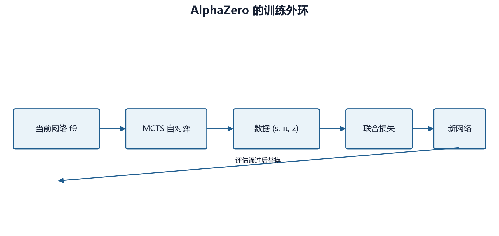

# 第 22 章　AlphaZero：让搜索生成更强的学习目标

## 22.1 核心闭环

AlphaZero 不是“神经网络加 MCTS”这一静态组合，而是一个循环：

1. 当前网络指导 MCTS；
2. MCTS 产生比网络原始策略更强的访问分布；
3. 双方按该分布自对弈，得到终局结果；
4. 用访问分布训练策略头，用结果训练价值头；
5. 候选网络与当前最佳网络比较；
6. 达到门槛后替换最佳网络，再开始下一轮。



网络为搜索提供方向，搜索又为网络提供改进目标。这种“策略改进—策略评估”循环与动态规划思想相通，只是使用神经网络近似大状态空间中的策略与价值。

## 22.2 训练样本 \((s,\pi,z)\)

自对弈每一步保存：

\[
(s_t,\pi_t,z_t)
\]

其中：

- \(s_t\)：玩家相对视角编码的观察；
- \(\pi_t\)：MCTS 访问次数归一化后的动作分布；
- \(z_t\in\{-1,0,+1\}\)：对局结束后，从 \(s_t\) 当前玩家视角回填的结果。

这里的策略目标不是实际采样出的单个动作，而是完整分布 \(\pi_t\)。例如一次搜索访问三个动作的次数是 50、30、20，那么目标为 \([0.5,0.3,0.2]\)。它保留了搜索对多个候选分支的相对判断，比 one-hot 动作标签包含更多信息。

终局结果要按样本视角回填。若最后玩家 0 获胜：

- 玩家 0 回合采集的状态标签为 \(+1\)；
- 玩家 1 回合采集的状态标签为 \(-1\)；
- 和局则双方状态均为 0。

若忘记视角翻转，价值头会被同一局中的互相矛盾标签训练。

## 22.3 项目的双头网络

`AlphaZeroNet` 先把三部分观察组合起来：

1. `grid` 空间通道；
2. `units` 空间通道；
3. 广播到每个网格位置的 `global_features`。

张量从 \((B,H,W,C)\) 转为 PyTorch 卷积使用的 \((B,C,H,W)\)，经过输入卷积和若干残差块，再分成两个头。

### 策略头

策略头输出：

\[
\mathbf l_\theta(s)\in\mathbb R^{10WH}
\]

其中 \(\mathbf l\) 是 logits。预测时将非法动作位置设为约 \(-10^8\)，再做 softmax：

\[
p_\theta(a\mid s)
=\frac{\exp l_a}
{\sum_{b\in\mathcal A_{\text{legal}}}\exp l_b}
,\quad a\in\mathcal A_{\text{legal}}
\]

非法动作概率近似为 0。

### 价值头

价值头输出一个标量：

\[
v_\theta(s)=\tanh(u_\theta(s))\in[-1,1]
\]

这个范围与胜、和、负标签 \(+1,0,-1\) 相匹配。

### 为什么使用残差块

残差块计算

\[
y=x+F(x)
\]

网络只需学习相对输入的修正 \(F(x)\)。跳连有助于梯度跨越较深网络，并允许多层卷积逐渐扩大感受野。项目默认 6 个残差块、128 个通道；教材冒烟会缩到 1 个块和少量通道，以验证流程而非模型容量。

## 22.4 联合损失

对一个 batch，项目策略损失是目标访问分布与网络 log-softmax 的交叉熵：

\[
L_p
=-\frac1B\sum_{i=1}^{B}
\sum_a \pi_i(a)\log p_\theta(a\mid s_i)
\]

价值损失是均方误差：

\[
L_v
=\frac1B\sum_{i=1}^{B}
\left(v_\theta(s_i)-z_i\right)^2
\]

代码组合为：

\[
L=L_p+L_v
\]

并由优化器的 `weight_decay` 实现参数正则化。书写成理论形式可记为

\[
L(\theta)
=(z-v_\theta(s))^2
-\pi^\top\log p_\theta(\cdot\mid s)
+c\lVert\theta\rVert^2
\]

### 数值例子

设搜索目标为

\[
\pi=[0.7,0.2,0.1]
\]

网络输出

\[
p=[0.5,0.4,0.1]
\]

则策略损失为

\[
L_p
=-\left(
0.7\ln0.5+0.2\ln0.4+0.1\ln0.1
\right)
\approx0.899
\]

若终局标签 \(z=1\)，价值预测 \(v=0.4\)，则

\[
L_v=(1-0.4)^2=0.36
\]

忽略正则项，总损失约为 1.259。

逐符号理解：

- \(\pi\) 不是网络旧策略，而是搜索后的教师分布；
- \(p_\theta\) 是网络当前预测；
- \(z\) 是完整对局结束后的真实结果；
- \(v_\theta\) 是当前状态下的结果预测。

## 22.5 搜索为何可看作策略改进

网络先验 \(p_\theta\) 只经过一次前向传播。MCTS 利用规则模型向后推演，把计算集中到看起来更有价值或证据不足的分支，最后得到 \(\pi\)。

在理想情况下：

\[
\pi \approx \operatorname{Improve}(p_\theta,v_\theta)
\]

训练再使

\[
p_{\theta'}\approx\pi
\]

于是新网络把这次搜索获得的知识“摊销”进一次前向传播。下一轮搜索从更好的先验和价值出发，可以产生更好的目标。

这并不保证每轮都改进：

- 搜索预算太小，\(\pi\) 可能主要反映噪声；
- 价值头错误会误导深层选择；
- 自对弈数据过于相似会导致策略覆盖变窄；
- 训练过度会过拟合最近 buffer；
- 候选评估样本过少会误判晋级。

## 22.6 Replay Buffer 与数据时效

项目的 `ReplayBuffer` 保存多个自对弈迭代的样本，容量由 `buffer_size` 控制。训练从中采样 batch。

保留历史数据的优点：

- 降低相邻自对弈局之间的相关性；
- 防止网络只记住最近候选策略；
- 提高样本复用率。

代价是数据由旧网络和旧搜索产生。容量太大时，训练目标可能滞后；容量太小时，数据多样性不足。需要联合考虑：

- 每轮自对弈局数；
- 每局样本数；
- buffer 容量；
- 每轮 epoch 数；
- 网络更新幅度。

“更大的 buffer 一定更稳定”不是普遍结论。

## 22.7 自对弈中的探索日程

项目用 `temperature_threshold` 控制一局中的探索阶段：

- 前若干动作按访问分布采样；
- 超过阈值后用低温或贪心选择。

原因是开局需要覆盖多种布局和战略，后期则希望减少随机失误，使终局标签更能反映策略质量。根节点狄利克雷噪声仅在自对弈时打开。

如果从第一步就完全贪心，buffer 很快被少数开局占据；如果全局一直高温，许多本可获胜的局会因后期随机动作而丢失，价值标签噪声上升。

## 22.8 候选模型晋级

每轮训练后，项目可让候选网络与上一最佳网络对局。设评估 \(n\) 局，候选胜 \(w\) 局，则经验胜率：

\[
\hat p=\frac{w}{n}
\]

达到 `eval_threshold` 才接受候选。默认阈值为 0.55。

若只评估 20 局，55% 对应 11 胜。11 比 10 只多一局，统计证据很弱。以二项分布的近似标准误差估计，在 \(p\approx0.5,n=20\) 时：

\[
\operatorname{SE}(\hat p)
\approx\sqrt{\frac{0.5(1-0.5)}{20}}
\approx0.112
\]

一次随机波动就足以跨越门槛。因此：

- 冒烟测试可用少量对局检查流程；
- 正式晋级应扩大对局数；
- 双方交换先后手；
- 固定评估种子与搜索预算；
- 关闭根噪声；
- 报告胜/和/负，而不只给单一胜率。

如果候选未达门槛，当前实现恢复最佳网络参数，而不是继续以失败候选作为下一轮起点。这是“候选—最佳”门控机制。

## 22.9 当前实现状态

项目已经具备：

- 残差策略价值网络；
- 合法动作掩码；
- 神经网络引导的 MCTS；
- 根噪声和温度选动作；
- 自对弈样本生成；
- replay buffer；
- 联合策略/价值训练；
- 候选对最佳网络评估；
- checkpoint 与恢复入口；
- `AlphaZeroBot` 推理接入；
- 单元与冒烟测试。

同时必须保持准确定位：这是项目中的实验路径，并非已经由大规模、多种子、等计算预算实验确认优于 MaskablePPO 的生产级主线。MCTS 的 Python 状态复制和微动作搜索成本也使完整训练远比命令表面上的“100 次迭代”昂贵。

## 22.10 历史困难的因果整理

### 当时现象

- 搜索流程可以运行，但训练耗时很高；
- 小样本候选评估波动明显；
- flat 动作索引、合法掩码与真实引擎动作需要三方一致；
- 状态复制后，动作中的对象引用可能指向原状态；
- 价值的玩家视角容易在自对弈、叶估值和回传之间混淆。

### 调查证据

对应测试分别验证了网络输出形状与范围、掩码归一化、MCTS 返回分布、动作解析、自对弈样本以及训练损失。性能问题则来自每个真实微动作都要进行多次状态复制与叶评估，而不是单一网络前向本身。

### 已落地措施

- 使用 Flat Discrete 的统一编码；
- 搜索扩展只依据合法动作；
- 子状态惰性创建；
- 深复制后重新解析动作引用；
- 明确网络价值和终局标签的玩家相对视角；
- 自对弈与评估分别控制噪声、温度；
- 通过最佳模型门控避免每个候选自动成为新基线。

### 当前开放问题

- 如何降低状态复制和动作枚举成本；
- 微动作层搜索是否应改为游戏回合级宏动作；
- 候选评估应采用多大样本与何种置信门；
- 网络规模、搜索预算与自对弈数量的最优分配；
- 长期是否需要并行自对弈和批量叶评估。

## 22.11 最小训练

教材提供的 CPU 冒烟命令为：

```powershell
python scripts/train/train_alphazero.py `
  --map-file maps/1v1/starter.csv `
  --res-blocks 1 `
  --channels 16 `
  --num-simulations 1 `
  --iterations 1 `
  --games-per-iter 1 `
  --epochs-per-iter 1 `
  --batch-size 2 `
  --buffer-size 128 `
  --max-game-steps 4 `
  --temperature-threshold 2 `
  --eval-games 0 `
  --checkpoint-dir tmp/learning-guide-v2/alphazero `
  --device cpu
```

该命令已在基准环境中验证：生成 4 个自对弈样本，完成一次联合损失更新，并写出 iteration 与 final checkpoint。`eval-games=0` 在当前脚本中表示跳过候选晋级对局。

冒烟成功只表示：

- 自对弈能生成至少一个样本；
- policy target 形状为 \(10WH\)；
- 价值标签在 \([-1,1]\)；
- 一次反向传播损失有限；
- checkpoint 可保存和读取。

不能由一次 16 步截断小局推断策略已经学会游戏。

## 22.12 结果应怎样阅读

训练日志至少同时看：

- `policy_loss`：网络与 MCTS 分布的差异；
- `value_loss`：结果预测误差；
- buffer 样本数；
- 每局平均长度；
- 搜索访问分布熵；
- 候选对最佳的胜/和/负；
- 每秒生成的自对弈步数；
- 每个真实动作的搜索时间。

策略损失下降不是充分成功条件。若 MCTS 教师本身质量差，网络只是更准确地模仿一个弱教师。价值损失下降也可能来自大量和局，使网络统一预测 0。必须结合对局和固定锚点评估。

## 22.13 与 PPO、自对弈 PPO 的区别

| 方面 | MaskablePPO | 自对弈 PPO | AlphaZero |
|---|---|---|---|
| 动作目标 | PPO 优势 | PPO 优势 | MCTS 访问分布 |
| 价值目标 | GAE 回报 | GAE 回报 | 终局结果 |
| 是否显式搜索 | 否 | 否 | 是 |
| 数据来源 | 环境对手 | 历史策略池 | 双方同源自对弈 |
| 每步推理成本 | 一次策略前向 | 一次策略前向 | 多次模拟与前向 |
| 主动作空间 | MultiDiscrete/掩码 | 同左 | Flat Discrete |
| 当前项目定位 | 主训练路径 | 进阶训练策略 | 实验路径 |

AlphaZero 并不是 PPO 加一个自对弈开关。它改变了训练标签、动作表示、推理过程与计算预算结构。

## 22.14 常见误解

**误解一：MCTS 分布是真实最优策略。**  
它只是给定网络、搜索预算和探索参数下的改进近似。

**误解二：价值头直接回归每步即时奖励。**  
项目目标是终局结果 \(z\)，不是单步 shaped reward。

**误解三：候选胜率 55% 就已证明更强。**  
结论强度取决于评估局数、置信区间和先后手控制。

**误解四：增加 simulations 总会线性提高实力。**  
弱价值网络、冗余动作树和计算瓶颈都可能产生收益递减。

**误解五：一次冒烟训练可与完整 AlphaZero 结果比较。**  
冒烟验证软件路径，不验证算法极限。

## 22.15 本章小结

AlphaZero 用网络指导搜索，再用搜索生成的访问分布与终局结果训练网络。项目实现了双头残差网络、合法动作掩码、MCTS、自对弈 buffer、联合损失与候选晋级。正确理解它需要同时把握三个视角：\(\pi\) 是搜索教师，\(z\) 是玩家相对终局标签，候选评估是带统计误差的实验而不是确定性裁决。

## 22.16 练习

1. 已知 \(\pi=[0.6,0.4]\)、\(p=[0.75,0.25]\)，计算策略交叉熵。
2. 为什么每个历史状态的 \(z\) 必须按当时行动玩家的视角回填？
3. 分析 buffer 太大和太小各自可能产生的问题。
4. 20 局评估中 11 胜是否足以确信候选更强？请用标准误差解释。
5. 设计一组等计算预算实验，比较 MaskablePPO 与 AlphaZero，而不是简单比较“训练迭代数”。
