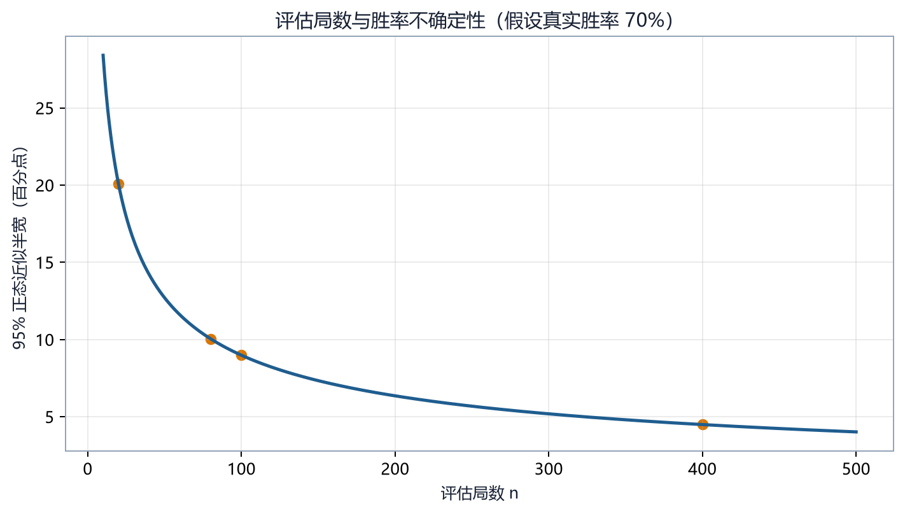

# 第 23 章　实验设计、统计误差与可复现性

## 23.1 训练成功不是单次曲线上升

强化学习结果同时受初始化、环境随机性、探索动作、对手行为和评估样本影响。一次训练中胜率上升，只能说明“这一条随机轨迹在这一套条件下得到这个结果”，不能自动证明算法或配置更好。

一个可解释实验至少要明确：

- 研究问题；
- 对照组与实验组；
- 唯一主动改变的因素；
- 训练预算；
- 随机种子；
- 评估协议；
- 主要指标与次要指标；
- 失败判据；
- 代码、配置和环境版本。

## 23.2 先写假设，再运行

以“精确掩码是否优于逐维掩码”为例，合格的预注册式描述是：

> 在相同地图、对手、网络、总环境步数和随机种子集合下，自回归精确掩码将降低无效动作率，并提高固定评估集上的平均胜率。

它包含：

- 自变量：动作头与掩码方法；
- 因变量：无效动作率、胜率；
- 控制变量：地图、对手、网络、步数、种子；
- 方向性预测：降低或提高。

“试试这个参数是否更好”没有说明“好”的指标，也没有排除同时变化的因素。

## 23.3 随机种子控制了什么

项目训练可能涉及 Python `random`、NumPy、PyTorch、Gymnasium 环境以及 Bot 内部 RNG。只调用一次 `torch.manual_seed` 不等于完整复现。

理想做法是为每次 run 记录一个主种子 \(s\)，再确定性派生：

\[
s_{\text{env}},s_{\text{policy}},s_{\text{opponent}},s_{\text{eval}}
=h(s,\text{component})
\]

这样各组件既可复现，又不会意外共享完全相同的随机流。

训练和评估种子应分离。若训练过程不断在同一组评估种子上选 checkpoint，就会对评估集过拟合；应保留最终测试种子，只在模型选择完成后使用。

## 23.4 均值、方差与标准误

设 \(n\) 个种子的最终胜率为 \(x_1,\ldots,x_n\)。样本均值：

\[
\bar x=\frac1n\sum_{i=1}^n x_i
\]

样本标准差：

\[
s=\sqrt{
\frac1{n-1}\sum_{i=1}^n(x_i-\bar x)^2
}
\]

均值标准误：

\[
\operatorname{SE}(\bar x)=\frac{s}{\sqrt n}
\]

假设五个种子的胜率为 0.40、0.55、0.45、0.60、0.50，均值是 0.50，样本标准差约 0.079，标准误约 0.035。

标准差描述单次 run 的离散程度；标准误描述对总体均值估计的不确定性。不能用“均值 ± 标准差”冒充均值置信区间。

## 23.5 胜率是二项比例

如果每局只有胜或负，胜局数

\[
W\sim\operatorname{Binomial}(n,p)
\]

经验胜率为 \(\hat p=W/n\)。简单正态近似标准误为

\[
\sqrt{\frac{\hat p(1-\hat p)}n}
\]

当样本很少或胜率接近 0/1 时，更适合 Wilson 区间，而不是对称正态区间。Wilson 95% 区间可写为

\[
\frac{
\hat p+\frac{z^2}{2n}
\pm z\sqrt{
\frac{\hat p(1-\hat p)}n+\frac{z^2}{4n^2}
}}
{1+\frac{z^2}{n}}
\]

其中 \(z=1.96\)。

若 20 局赢 12 局，点估计是 60%，但区间仍很宽。项目中的课程晋级和候选模型门控因此需要耐心、最小阶段步数或更多评估局，不能把一次略过阈值视为稳定能力。



## 23.6 和局与截断不能随意并入失败

策略游戏常有三种结果：胜、负、和。还要区分和局原因：

- `max_turns_draw`：游戏回合上限；
- `max_steps_truncate`：环境微动作上限；
- 规则定义的其他和局。

可报告：

\[
\text{win rate}=\frac{W}{N}
\]

\[
\text{non-loss rate}=\frac{W+D}{N}
\]

也可给和局半分的 score：

\[
\text{score}=\frac{W+0.5D}{N}
\]

但三者含义不同。若奖励塑形产生拖延吸引子，模型可能通过增加和局提高 non-loss rate，却没有提高获胜能力。因此本项目评估工具保留 wins、losses、draws 和 `end_reason` 分解。

## 23.7 训练曲线不是独立样本

同一 run 中相邻评估点共享绝大多数训练历史，不能把 100 个时间点当作 100 个独立实验。平滑曲线只用于看趋势，不增加独立证据。

绘图时建议：

- 横轴使用环境步数，而非日志行号；
- 多种子画均值线与置信带；
- 同时保留每个种子的细线；
- 标记阶段切换和配置改变；
- 不用过强平滑掩盖崩溃；
- 指标定义改变时分图，不强行拼接。

## 23.8 消融实验

消融实验通过移除或替换一个机制，判断改进来自哪里。以 Bootstrap 某版本为例，若同时改了奖励、对手、动作空间和晋级门，即使结果变好，也不能知道贡献来源。

一个 \(2\times2\) 设计：

| 组别 | 精确掩码 | 势能塑形 |
|---|---|---|
| A | 否 | 否 |
| B | 是 | 否 |
| C | 否 | 是 |
| D | 是 | 是 |

可以估计：

- 掩码主效应；
- 奖励主效应；
- 两者交互：精确掩码是否只有在某种奖励下才有效。

若计算预算有限，先做成对消融：从当前最佳配置只去掉一个机制。不要把不同训练预算的旧 run 当作严格对照。

## 23.9 配对评估

地图和先后手造成的方差可以通过配对降低。对模型 A 与 B：

1. 在地图 \(m\)、种子 \(s\) 上让 A 先手；
2. 同一地图和种子让 B 先手；
3. 对所有地图、种子重复；
4. 对每一对的 score 差做统计。

配对差：

\[
d_i=x_i^A-x_i^B
\]

比较 \(\bar d\) 比比较两组互不对应的均值更容易消除局面难度差异。

## 23.10 多重尝试与选择偏差

如果试了 54 个版本，只报告最好一个，哪怕所有版本真实能力相同，也容易因随机波动找到一个“赢家”。这叫多重比较或研究者自由度问题。

应保留：

- 所有版本清单；
- 每次改动原因；
- 失败结果；
- 选择下一实验的依据；
- 独立最终测试集。

本书附录 D 将 v15–v54 等历史实验按版本索引，而正文只选有明确因果证据的案例深入解释。两者功能不同：正文教推理，索引防止选择性遗忘。

## 23.11 可复现实验记录

每个 run 建议至少保存：

```yaml
experiment_id: mask_ablation_seed0
code_revision: <git commit>
created_at: <ISO-8601 time>
seed: 0
python: 3.12.13
gymnasium: 1.3.0
stable_baselines3: 2.9.0
sb3_contrib: 2.9.0
torch: 2.13.0+cpu
device: cpu
map: maps/1v1/starter.csv
opponent: balanced_random
total_timesteps: 100000
evaluation:
  seed: 10000
  episodes: 100
  deterministic: true
```

还需保存完整解析后的配置，而不只保存用户传入的 YAML。因为默认值可能随代码变化。

## 23.12 本项目的诊断指标

`evaluate_model` 除胜率与回报外，还能统计：

- 动作类型计数；
- `action`、`shaping_delta`、`invalid_penalty`、`terminal` 奖励分量；
- `hq_capture`、`elimination`、`max_turns_draw`、`max_steps_truncate`；
- 单位生产构成；
- captures、kills、attacks、seize attempts、伤害；
- 建筑治疗的 HP 与金币；
- 可夺取动作出现率；
- 最大合法动作数；
- 峰值军队规模与平均金币；
- 指定失败结局的逐步 JSONL trace。

这些指标用于区分“不会”与“不能”：

- `seize_available_rate` 很低：环境中很少出现可夺取机会；
- 机会很多但 seize 次数低：策略不愿选择；
- `max_legal_actions` 接近 flat 上限：动作截断风险；
- 胜率低且伤害高：可能只会战斗，不会完成胜利条件；
- 回报高但终局多为截断：可能奖励吸引子。

## 23.13 一个完整实验模板

研究问题：`reward_scale=0.001` 是否稳定 Feudal 的价值学习？

1. 选择两个配置，只改变 `reward_scale`；
2. 使用种子 0、1、2、3、4；
3. 每个种子训练相同环境步数；
4. 每 10 万步在固定 50 局开发集评估；
5. 最终 checkpoint 在未使用的 200 局测试集评估；
6. 主要指标：测试胜率；
7. 次要指标：Worker/Manager value loss、截断率、到达目标率；
8. 报告五种子均值、标准差和原始点；
9. 若某 run 崩溃，不静默删除，记录失败原因。

## 23.14 本章小结

强化学习实验的基本单位不是一条漂亮曲线，而是定义明确、可复现、带不确定性的比较。随机种子、评估协议、和局原因、配对设计和失败记录共同决定结论是否可信。项目的细粒度评估指标应服务于因果诊断，而不能由单一 episode reward 代替。

## 23.15 练习

1. 五个种子结果为 0.3、0.4、0.4、0.5、0.9。计算均值，并说明只报告均值为何危险。
2. 100 局中 60 胜、20 和、20 负，计算 win rate、non-loss rate 和半分 score。
3. 为什么相邻训练评估点不能当作独立样本？
4. 为“课程学习是否优于固定难度训练”设计一个公平对照。
5. 找出一个同时改变三个因素的错误实验，并改写为可解释的消融。
