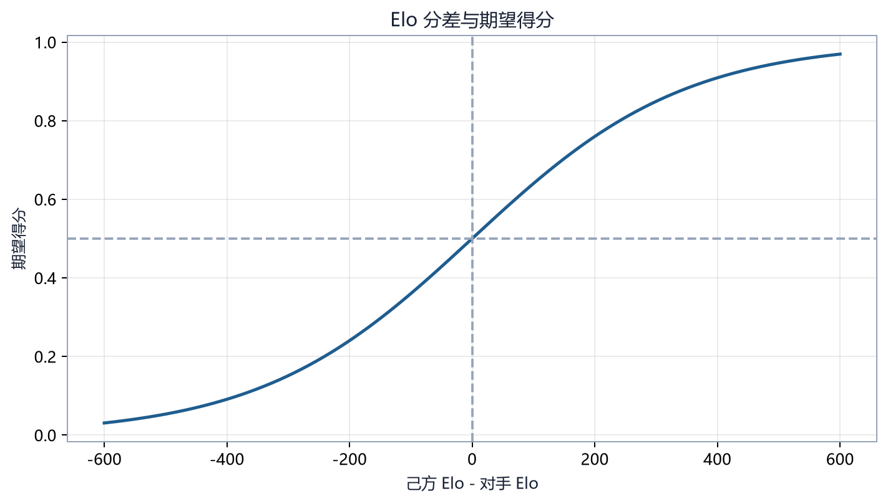

# 第 25 章　模型评估、Elo、循环赛与回放

## 25.1 评估回答的不是“训练奖励有多高”

训练 episode reward 受奖励塑形、探索动作和对手采样影响。评估应回答更直接的问题：

- 能否获胜；
- 以何种方式结束；
- 对哪些地图与对手有效；
- 是否依赖先手；
- 是否稳定复现；
- 是否出现拖延、刷分或动作退化。

因此需要把固定 episode 评估、成对模型比较、循环赛和回放结合起来。

## 25.2 `evaluate_model` 的调用契约

项目统一评估函数可用于普通 PPO 与 MaskablePPO：

```python
results = evaluate_model(
    model,
    env,
    n_episodes=50,
    deterministic=True,
    seed=10_000,
    track_breakdown=True,
    trace_dir="tmp/eval_traces",
)
```

它通过检查 `model.predict` 的签名决定是否传 `action_masks`。这避免把掩码参数错误地传给普通 PPO，也避免 MaskablePPO 在评估时失去掩码。

评估循环的终止条件是：

```python
done = terminated or truncated
```

但结果分类仍保留终局与截断原因。截断不是环境规则胜负，不能只因循环结束就当成失败。

## 25.3 平均回报与胜率的分工

平均回报可用于诊断奖励路径，胜率用于衡量任务结果。两者可能背离：

- 高伤害、高占领 shaped reward，但没有终结对局；
- 快速取胜使累计塑形少，回报反而低；
- 频繁截断获得生存或资源增量；
- 终局奖励尺度变化导致跨配置回报不可比。

所以同一表中应同时给：

| 指标 | 回答的问题 |
|---|---|
| 胜/和/负 | 是否完成对抗目标 |
| `end_reason` | 如何结束 |
| episode reward | 奖励函数怎样评价轨迹 |
| episode length/turns | 是否拖延 |
| reward breakdown | 哪一分量主导 |
| action counts | 策略实际做了什么 |

## 25.4 Elo 的基本公式

两个模型 A、B 的 Elo 差转为 A 的预期得分：

\[
E_A=\frac{1}{1+10^{(R_B-R_A)/400}}
\]

若 \(R_A=1600,R_B=1400\)：

\[
E_A=\frac{1}{1+10^{-0.5}}\approx0.760
\]

比赛实际得分 \(S_A\) 取胜 1、和 0.5、负 0。更新：

\[
R_A'=R_A+K(S_A-E_A)
\]

若 A 意外失败，\(K=32\)：

\[
R_A'=1600+32(0-0.760)\approx1575.7
\]

B 对称增加约 24.3 分。



## 25.5 Elo 的局限

Elo 假设一个近似一维、相对稳定的实力尺度。策略游戏常违反这些假设：

- A 克 B、B 克 C、C 克 A 的非传递循环；
- 地图改变相对强弱；
- 先手优势；
- 搜索预算不同；
- 模型仍在训练，实力非平稳；
- 多局来自同一确定性轨迹，不独立。

因此 Elo 是压缩摘要，不能替代对阵矩阵。至少同时保存：

- 每一对的胜/和/负；
- 地图分层；
- 先后手分层；
- 原始比赛数；
- rating history；
- 计算使用的 \(K\) 与初始分。

## 25.6 循环赛调度

有 \(m\) 个参赛者，单循环无方向配对数：

\[
\binom m2=\frac{m(m-1)}2
\]

若每一对在每张地图上双方各先手 \(g\) 局，共 \(L\) 张地图，总局数：

\[
G=\frac{m(m-1)}2\times L\times2g
\]

例如 6 个 Bot、3 张地图、每边 2 局：

\[
G=15\times3\times4=180
\]

比赛预算很快增长。可先用小地图与少量局做冒烟，再用预先固定的完整协议正式评估。

## 25.7 TournamentConfig 的重要字段

项目 `TournamentConfig` 包含：

- `maps` 与 `map_pool_mode`；
- `games_per_side`；
- `max_turns`；
- `output_dir`、replay 目录；
- `save_replays`；
- `enabled_units`；
- `rng_seed`；
- `concurrent_games`；
- 可选 LLM 日志与 API 间隔。

`validate()` 会检查地图存在、局数和回合数为正、模式取值、并发数、单位代码等。正式运行前先验证配置，避免比赛完成一半才发现地图或单位设置错误。

## 25.8 模型公平比较

比较两个 RL 模型时要锁定：

- 相同观察与动作空间；
- 相同 `pad_to_size`；
- 相同单位集合和引擎覆盖；
- 相同战争迷雾；
- 相同动作掩码语义；
- 相同确定性设置；
- AlphaZero 相同 simulation 数；
- 相同硬件或至少报告推理时延；
- 换边和相同地图种子。

若一个模型使用搜索 200 次，另一个只前向一次，只报告胜率是不完整的。应同时报告每步墙钟时间或等计算预算结果。

## 25.9 回放是行为证据

聚合指标能发现异常，回放用来解释异常。应优先检查：

- 高回报但未获胜的局；
- `max_steps_truncate`；
- 置信区间外的异常胜负；
- 先手和后手表现差异；
- 模型排名变化最大的地图；
- 高频无效动作或重复移动；
- 可夺取却不夺取的状态。

回放必须保存足够信息重建动作序列。项目测试包含 replay determinism 和 save replay，目的是确认同一动作记录能够重放为同一终局。

### Trace 与完整 replay

`evaluate_model` 可把特定 `end_reason` 的逐步信息写成 JSONL trace。Trace 适合快速统计和文本诊断；完整 replay 适合在游戏界面中重现。二者都不应只保存最终得分。

## 25.10 模型比较的分层报告

推荐报告结构：

1. **总体结果**：胜/和/负、score、Elo；
2. **地图层**：每张地图结果；
3. **先后手层**：玩家 1/2；
4. **终局层**：HQ 捕获、消灭、回合和局、微动作截断；
5. **行为层**：动作、单位、经济、伤害、占领；
6. **效率层**：每步推理时间、峰值内存；
7. **不确定性**：局数、种子、置信区间；
8. **定性证据**：典型与失败回放。

## 25.11 最小实操

评估与锦标赛测试：

```powershell
pytest -q `
  tests/test_rl_evaluation.py `
  tests/test_tournament_library.py `
  tests/test_tournament_config.py `
  tests/test_tournament.py `
  tests/test_save_replay.py `
  tests/test_replay_determinism.py
```

查看评估入口：

```powershell
python scripts/eval_agent.py --help
python scripts/tournament.py --help
```

不要在正式报告里只引用 `--help`。应把实际调用命令、解析后的配置和输出 JSON 一并保存。

## 25.12 典型误判

**只选 best checkpoint。**  
若 best 由很小评估集挑出，会有赢家诅咒。保留 final、best 和若干中间 checkpoint 的独立测试。

**Elo 高就全面更强。**  
检查非传递对阵和地图分层。

**多跑几次确定性 Bot 就等于增加样本。**  
没有随机 tie-break 时可能是重复 replay。

**回放看起来合理就证明算法有效。**  
回放是解释工具，不代替统计样本。

**截断都算和局就没有问题。**  
大量微动作截断往往是停滞或动作粒度问题，应单独报告。

## 25.13 本章小结

项目评估体系从单模型 episode 统计扩展到换边循环赛、Elo 和回放诊断。Elo 提供简洁相对尺度，但对阵矩阵、地图、先手和计算预算不可省略。可靠结论来自统计结果与行为证据相互验证。

## 25.14 练习

1. 计算 Elo 1500 对 1700 时前者的预期得分。
2. 8 个模型、4 张地图、每边 3 局的完整循环赛有多少局？
3. 为什么 AlphaZero 与 PPO 比较时必须报告搜索预算和推理时间？
4. 给出三类最值得人工查看的失败回放。
5. 设计一份能揭示非传递性的对阵报告。
