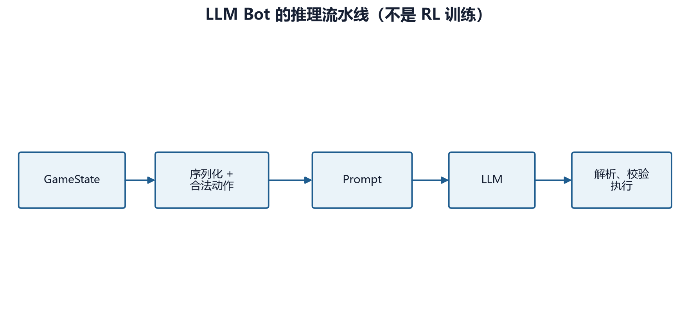

# 第 26 章　LLM Bot：提示、状态序列化与安全执行

## 26.1 LLM Bot 不是强化学习训练

项目中的 LLM Bot 在每个游戏回合把状态转换成文本/JSON，请外部语言模型返回结构化动作，再校验并执行。它没有：

- rollout buffer；
- 策略梯度；
- Bellman 更新；
- 经验回放训练；
- 通过本局奖励更新模型参数。

因此它是推理型 Bot 与实验对手，不是本项目 RL 训练算法。LLM 可以参与行为比较、数据采集或生成示范，但这不改变它自身未在游戏中在线强化学习的事实。



本章不调用任何付费 API，实操全部使用 mock 响应。

## 26.2 状态为什么要序列化

语言模型不能直接读取 Python `GameState` 对象。`_serialize_game_state()` 要把当前决策所需信息转为 JSON 可表示结构，例如：

- 当前玩家与回合；
- 地图尺寸、地形和建筑；
- 双方金币；
- 单位 ID、类型、坐标、生命、状态；
- 可用技能与冷却；
- 当前合法动作；
- 胜负状态。

序列化有三个目标：

1. **完备性**：做合法决策所需信息不能缺失；
2. **最小性**：删除与决策无关的内部对象，控制 token 和歧义；
3. **稳定性**：字段名、坐标系、单位 ID 不随一次调用意外变化。

序列化不是简单 `str(game_state)`。内部对象引用、枚举和循环关系既不适合 JSON，也会让模型无法精确引用某个单位。

## 26.3 玩家视角与信息边界

若启用战争迷雾，LLM 状态也必须遵守可见性。不能因为 LLM 接口在游戏进程内部，就把完整敌方单位列表直接暴露给它。否则与使用局部观察训练的 RL 模型比较不公平。

相对视角还需要统一：

- 坐标仍是绝对地图坐标，还是旋转到己方视角；
- `player` 字段使用真实编号，还是 `self/opponent`；
- 建筑所有者的编码；
- 单位 ID 是否只在本局稳定。

提示中的规则与序列化字段必须一致。

## 26.4 提示由规则、任务与格式组成

项目提供 basic、strategic 和 two-phase 等提示策略。一个有效的系统提示应包含：

- 胜利条件；
- 单位、建筑和关键战斗规则；
- 可用动作；
- 行动顺序约束；
- JSON 输出模式；
- 禁止额外自然语言的要求。

提示过短会导致规则幻觉，过长会增加延迟、费用和关键信息被淹没的风险。更重要的是，提示中的数值会随游戏平衡变化；若硬编码规则与当前 `UNIT_DATA` 不一致，LLM 即使完全遵循提示也会作出错误判断。

因此应增加“提示规则—当前常量”的一致性测试，而不是把 prompt 当成永远正确的静态文案。

## 26.5 两阶段规划

`two_phase_planning=True` 时，流程分两次调用：

1. 规划阶段输出局势判断、主要目标、动作序列和风险；
2. 执行阶段读取该计划与最新状态，输出可执行动作 JSON。

优点是把“决定做什么”与“填写精确坐标和 ID”分开，便于日志诊断。代价是：

- API 调用、token、费用和延迟约增加；
- 计划可能在动作逐条执行后失效；
- 第二阶段可能不遵守第一阶段；
- 第一阶段计划并不通过游戏引擎验证。

两阶段不是自动获得更强推理的保证，必须通过固定题集与对局实验比较。

## 26.6 结构化动作

典型响应概念上为：

```json
{
  "reasoning": "先清除阻挡单位，再占领建筑。",
  "actions": [
    {"type": "attack", "unit_id": 2, "target_id": 7},
    {"type": "move", "unit_id": 3, "x": 5, "y": 4},
    {"type": "seize", "unit_id": 3},
    {"type": "end_turn"}
  ]
}
```

动作顺序有语义。第一步可能杀死目标、改变合法路径或结束游戏，后续动作必须依据更新后的 `GameState` 执行，不能只在响应开始时统一校验一次。

## 26.7 JSON 提取不是合法性验证

项目 `_extract_json` 依次尝试：

1. 整个文本直接 `json.loads`；
2. Markdown JSON 代码块；
3. 文本中首尾花括号片段。

解析成功只说明语法是 JSON，不说明：

- 存在 `actions`；
- `actions` 是列表；
- 动作类型已知；
- 单位属于当前玩家；
- 目标存在；
- 坐标在地图内；
- 技能未冷却；
- 动作在当前更新后的局面合法。

因此 `_execute_actions` 和各 `_execute_*` 方法仍需把单位 ID 映射回当前对象，并调用游戏规则校验。

## 26.8 逐动作重新校验

假设 LLM 返回：

1. 单位 2 攻击单位 7；
2. 单位 3 移动到单位 7 原位置；
3. 单位 3 占领。

若第一击没有击杀，第二步可能因位置占用而非法；若第一击直接赢得游戏，后续动作都应停止。正确执行器要在每一步：

- 检查 `game_over`；
- 重新取得或验证对象；
- 依据当前状态执行；
- 捕获单步异常；
- 防止异常动作破坏整个回合；
- 最终在需要时安全结束回合。

这与 RL 动作掩码的思想相通：模型输出只是提议，环境规则才是合法性的最终裁决者。

## 26.9 失败恢复

`LLMBot.take_turn()` 的主流程包含重试。若调用失败或响应无效，Bot 应安全回退到结束回合，而不是让游戏主循环崩溃。

需要区分：

- 网络/API 错误；
- 超时或限流；
- 响应被截断；
- JSON 语法错误；
- schema 错误；
- 某个动作因状态变化无效；
- 模型主动 resign。

把所有失败都记为“模型选择 end_turn”会丢失诊断信息。日志应分别记录 stop reason、重试次数、原始响应、执行成功数和失败原因。

## 26.10 状态历史与 token

`stateful=True` 时，会把先前 user/assistant 消息加入后续调用。历史可能帮助模型保持计划，但也会：

- 重复发送大量旧状态；
- 让模型混淆旧单位位置；
- token 和延迟随回合增长；
- 把早期错误计划持续带入。

更稳健的做法是使用结构化短期记忆：保留上回合计划摘要，而把当前 `GameState` 始终作为权威事实。若使用完整历史，应明确最大长度与裁剪规则。

项目跟踪累计输入、输出 token，并可把每回合 prompt、响应、使用量和 stop reason 写入 JSON 日志。这些是比较 LLM Bot 成本不可缺少的数据。

## 26.11 延迟与成本模型

一局近似成本可写为

\[
C
=\sum_{t=1}^{T}
\left(
n_t^{\text{in}}c_{\text{in}}
+n_t^{\text{out}}c_{\text{out}}
\right)
\]

其中：

- \(T\)：LLM 决策回合数；
- \(n_t^{\text{in/out}}\)：第 \(t\) 回合输入/输出 token；
- \(c_{\text{in/out}}\)：每 token 价格。

总延迟近似为

\[
L=\sum_t(L_t^{\text{network}}+L_t^{\text{generation}})+L^{\text{retry}}
\]

价格与模型可随时间变化，本书不固化供应商报价。实验应记录调用时模型名、日期和实际 usage；本章也不发起真实请求。

## 26.12 安全边界

游戏中的 LLM 输出仍是不可信输入。执行器应：

- 只接受白名单动作；
- 限制每回合动作数量；
- 限制字符串与数组大小；
- 不把响应拼接成 Python 或 shell 执行；
- 不允许模型选择文件路径；
- 对日志中的 API key 做隔离；
- 对异常响应安全失败；
- 在提示中避免暴露不必要的环境变量与路径。

结构化输出降低解析歧义，不等于建立安全边界。

## 26.13 Mock 实操

运行已有测试，不需要 API key：

```powershell
pytest -q tests/test_llm_bot.py tests/test_llm_prompts.py
```

测试应覆盖：

- 固定 `GameState` 的序列化快照；
- 纯 JSON、代码块 JSON、带前后文本 JSON；
- 缺少 `actions`；
- 未知动作类型；
- 错误单位 ID；
- 顺序执行后第二动作失效；
- API 异常后的重试和 end-turn fallback；
- token 统计与日志格式；
- 两阶段规划 mock。

一个最小 mock 的思想是继承 `LLMBot`，让 `_call_llm` 返回固定字符串。这样测试的是本地数据管线，不产生网络费用。

## 26.14 LLM 与 RL 的可比性

比较 LLM Bot 和 RL Bot 时应说明：

- LLM 是否看到完整规则文本；
- 两者是否看到同样的战争迷雾；
- LLM 一次返回整回合动作，RL 每次返回微动作；
- 是否允许两阶段规划；
- 每步/每局延迟；
- token 成本与硬件成本；
- 是否使用外部模型更新后的版本；
- 随机温度；
- 失败 fallback 如何计分。

否则“胜率更高”可能主要来自信息量和计算预算差异。

## 26.15 本章小结

LLM Bot 是一个状态序列化—提示—结构化响应—逐动作校验—安全回退的工程管线，而不是 RL 算法。决定其可靠性的往往不是提示辞藻，而是信息边界、schema、动态合法性校验、日志与失败处理。项目测试可以在完全不调用付费 API 的情况下验证这些关键环节。

## 26.16 练习

1. 解释 JSON 语法正确与游戏动作合法之间的区别。
2. 为什么多个动作必须按执行后的新状态逐个校验？
3. 为 LLM 响应设计一个最小 JSON Schema。
4. 列举 `stateful=True` 的两个收益和三个风险。
5. 设计一组不调用外部 API 的 LLM Bot 回归测试。
