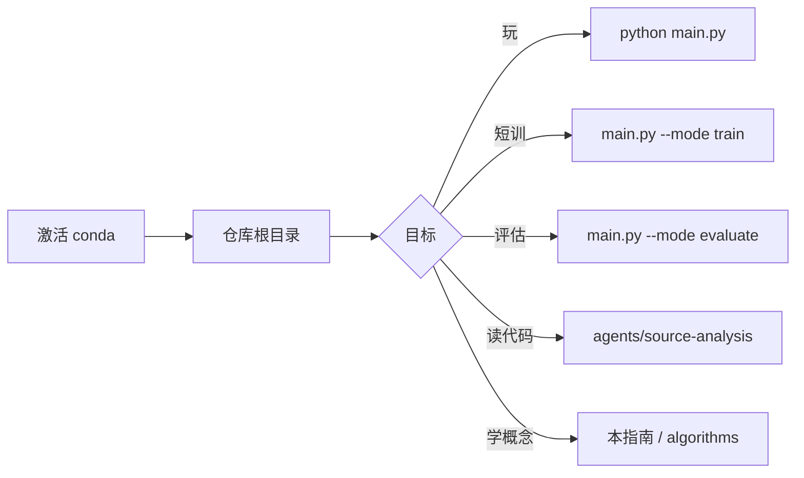

> 返回：[指南目录](README.md) · [上一章](README.md) · [下一章](01-why-rl-and-this-game.md) · [索引](../AGENTS.md)

# 00 · 如何使用本指南

欢迎。你是**有编程基础、零强化学习（RL）背景**的读者；本指南会用游戏与代码语言带你走完：

「会玩这款策略游戏 → 理解它为何像一个 RL 问题 → 跑通一次短训 PPO → 看懂观察、掩码与奖励」。

本章不讲算法，只帮你把**环境、仓库地图、路径约定**摆好，避免后面卡在安装上。

---

## 1. 本指南是什么、不是什么

| 是 | 不是 |
|----|------|
| 循序渐进的中文教程 | 论文精读 / 数学推导手册 |
| 绑定本仓库可运行命令 | 通用「所有游戏的 RL」百科 |
| 每章有自测与实操 | 只贴 API 文档的速查表 |
| Part A+B 为必读主线 | 云端 Vertex 训练细节（刻意不写） |

**Part A（00–03）**：动机、规则 ↔ MDP、最小数学。
**Part B（04–07）**：Gymnasium / SB3、第一次训练、观察掩码、奖励。
**Part C/D**（08 起）：课程、BC、自对弈、Feudal、AlphaZero 等，可在主线跑通后再读。

更短的算法卡片在 [`../algorithms/`](../algorithms/)；源码深潜在 [`../source-analysis/`](../source-analysis/)。

---

## 2. 阅读与实操约定

### 2.1 建议节奏

| 你的时间 | 建议路径 |
|----------|----------|
| 1–2 小时 | 00 → 02 浏览 + 本章 import 实操；可选打开 GUI 打半局 |
| 半天 | 到 05，**必须**完成一次 `--timesteps 2000` 短训 |
| 2–3 天 | 到 07，能解释「一步 / 一回合 / 掩码 / 塑形」 |

### 2.2 每章结构（统一）

1. 白话直觉
2. 概念与（必要时）公式 + 数字例子
3. 落到本仓库的路径 / 命令
4. 常见坑
5. **自测** 3 题（答案在章末折叠区或下一句提示里自检）

### 2.3 路径约定

| 写法 | 含义 |
|------|------|
| 仓库根 | 含 `main.py`、`reinforcetactics/`、`maps/` 的目录 |
| 本机示例 | `D:\Grok\project2\reinforce-tactics`（按你的克隆位置改） |
| 文档相对路径 | 从当前 `.md` 文件出发，如 `../source-analysis/rl-gym-env.md` |
| 代码模块路径 | 相对包：`reinforcetactics.rl.gym_env.StrategyGameEnv` |
| Shell | **Windows PowerShell**；不要默认用 bash 路径 |

命令块默认假设：

```powershell
cd D:\Grok\project2\reinforce-tactics   # 换成你的仓库根
conda activate reinforce-tactics
```

### 2.4 截图资源

界面插图在：

[`../assets/screenshots/`](../assets/screenshots/)

| 文件 | 内容 |
|------|------|
| `01-main-menu-zh.png` | 中文主菜单 |
| `07-game-board-beginner.png` | Beginner 地图对局画面 |

重新生成（需 GUI 依赖）：

```powershell
python scripts/_capture_doc_screenshots.py
```

从本章引用截图的相对路径示例：

```markdown

```

---

## 3. 仓库地图（你会反复碰到的包）

```text
reinforce-tactics/
├── main.py                 # CLI / GUI 总入口
├── reinforcetactics/       # 可安装的 Python 包
│   ├── core/               # GameState、格子、单位（无 pygame）
│   ├── game/               # 规则 mechanics、各类 Bot
│   ├── rl/                 # Gym 环境、观察、掩码、训练器
│   ├── app/ · ui/          # GUI 会话与菜单
│   ├── tournament/         # 锦标赛与 Elo
│   ├── cli/                # train / evaluate / play / stats
│   └── utils/              # 设置、i18n、回放、字体…
├── maps/                   # CSV 地图
├── configs/                # 课程 / PPO / 自对弈等 YAML
├── models/                 # 训练产物（常被 gitignore）
├── scripts/                # 高级训练与锦标赛脚本
├── agents/                 # 给人 / AI 助手看的知识库（本指南在此）
└── docs/ · docs/zh/        # 作者实验笔记（更碎、更专业）
```

### 3.1 主包职责一句话

| 包路径 | 一句话 |
|--------|--------|
| `reinforcetactics.core` | **唯一真相源** `GameState`：金币、单位、合法动作、`end_turn` |
| `reinforcetactics.game` | 战斗/收入规则 + Simple/Medium/Advanced/LLM/Model Bot |
| `reinforcetactics.rl` | `StrategyGameEnv`：把一局游戏变成 `reset` / `step` |
| `reinforcetactics.cli` | `main.py --mode train|evaluate|play|stats` 的实现 |
| `reinforcetactics.tournament` | 循环赛调度与 Elo |
| `reinforcetactics.ui` / `app` | 给人点的界面（训练 headless 不需要窗口） |

分层总览（更细）：[`../source-analysis/overview.md`](../source-analysis/overview.md)。

### 3.2 两套「agents 文档」怎么用

| 目录 | 适合 |
|------|------|
| **本指南** `learning-guide/` | 从零按顺序学 |
| `algorithms/` | 已经知道名词，查「PPO / 掩码 / 塑形」卡片 |
| `source-analysis/` | 打开 IDE 跟调用链 |
| `usage/` | 安装、汉化、git 提交约定 |
| `troubleshooting/` | 字体乱码、回放重复等 |

算法总览入口：[`../algorithms/overview.md`](../algorithms/overview.md)。

---

## 4. Conda 环境与 extras

### 4.1 环境名

本机约定 Conda 环境名：**`reinforce-tactics`**（Python 3.12 左右）。

```powershell
conda activate reinforce-tactics
python -V
```

若尚未创建，见 [`../usage/local-run-guide.md`](../usage/local-run-guide.md) 与 [`../../docs/LOCAL_DEPLOY.md`](../../docs/LOCAL_DEPLOY.md) / [`../../deploy/README.md`](../../deploy/README.md)。

### 4.2 依赖档位（extras）

定义在仓库根 `pyproject.toml`：

| Extra | 装了能干什么 | 本指南默认假设 |
|-------|----------------|----------------|
| **base**（必装） | Gymnasium、SB3、sb3-contrib、torch、tensorboard… | ✅ 已装 |
| **`[gui]`** | pygame-ce、截图/视频导出相关 | 玩 GUI 需要；纯 headless 训练可无 |
| **`[llm]`** | OpenAI / Anthropic / Google 客户端 | 跑 LLM Bot 才需要 |
| **`[dev]`** | pytest、ruff、mypy、pre-commit | 改代码/跑测试 |
| **`[cloud]`** | Google Cloud Storage 等 | **本指南不覆盖**；本地可不装 |

可编辑安装示例：

```powershell
pip install -e ".[gui,llm,dev]"
# 一般不装 cloud：
# pip install -e ".[cloud]"
```

### 4.3 本指南明确不覆盖的内容

- Google Cloud / Vertex AI 作业提交与账单
- 多机分布式训练
- 把模型推到线上服务

云相关原文可自行查阅 `docs/vertex_training.md` / `docs/zh/vertex_training.md`，**不是入门主线**。

### 4.4 GPU 与否

本仓库在 CPU 上即可完成短训与评估。有 CUDA 的 PyTorch 会更快，但**没有 GPU 不是 blockers**。后面 05 章短训 2000 步，CPU 通常几分钟内结束。

---

## 5. 日常工作流（你会反复做的事）



| 目标 | 命令 / 入口 |
|------|-------------|
| 打开 GUI | `python main.py` 或 `python main.py --mode play` |
| 短训冒烟 | `python main.py --mode train --algorithm ppo --timesteps 2000 --opponent bot` |
| 评估 zip | `python main.py --mode evaluate --model models/ppo_final.zip --episodes 5` |
| 看帮助 | `python main.py --help` |
| 跑测试 | `pytest tests/test_gym_env.py -q`（需 `[dev]`） |

本地操作细则：[`../usage/local-run-guide.md`](../usage/local-run-guide.md)。

---

## 6. 实操：验证 import

在**仓库根**、已 `conda activate reinforce-tactics` 时执行：

```powershell
python -c "import reinforcetactics, gymnasium, torch; print('ok', reinforcetactics.__file__)"
```

期望：打印 `ok` 以及指向本仓库内 `reinforcetactics` 包的路径（可编辑安装时一般是 `...\reinforce-tactics\reinforcetactics\...`）。

再验证 RL 环境类能导入：

```powershell
python -c "from reinforcetactics.rl.gym_env import StrategyGameEnv; print(StrategyGameEnv)"
```

可选：GUI 依赖（若你装了 `[gui]`）：

```powershell
python -c "import pygame; print('pygame', pygame.version.ver)"
```

### 6.1 常见失败

| 现象 | 可能原因 | 处理 |
|------|----------|------|
| `No module named reinforcetactics` | 未在环境中安装包 / 未激活 conda | `conda activate` 后 `pip install -e .` |
| `No module named gymnasium` | base 依赖缺失 | `pip install -e .` 或按 `requirements.txt` |
| `No module named pygame` | 未装 gui extra | `pip install -e ".[gui]"` |
| 命令在错误目录 | 不在含 `main.py` 的根 | `cd` 到仓库根再试 |
| 中文菜单方框 | 字体问题 | 见 [`../troubleshooting/chinese-font-display.md`](../troubleshooting/chinese-font-display.md) |

---

## 7. 符号与排版约定（后续章节）

- 公式用 `$$ ... $$` 或 `\[ ... \]`。
- 第一次出现的术语会给**中文白话 + 英文**。
- 代码路径用反引号；可点击的文档用 Markdown 链接。
- **Env 步**与**游戏回合**从第 02 章起严格区分——这是本项目最容易混的一点。

---

## 8. 学完 00 你应能回答

1. 我在哪个目录敲命令？Conda 环境名是什么？
2. `gui` / `llm` / `dev` / `cloud` 各干什么？本指南是否需要 cloud？
3. 训练逻辑主要在哪个包？规则引擎在哪个包？

若三条都能脱口而出，进入 [01 · 为何用 RL 与这款游戏](01-why-rl-and-this-game.md)。

---

## 自测

1. **操作**：写出激活环境并检查 `gymnasium` 可导入的两条 PowerShell 命令（可与上文不同，但必须能工作）。
2. **概念**：为什么训练路径可以不装 `pygame`，而「打开主菜单」不行？
3. **导航**：若你想查「非法动作掩码」的短文，应打开 `algorithms/` 下哪一类文档？源码又在 `source-analysis/` 的哪一篇？

<details>
<summary>参考答案（先自己想再展开）</summary>

1. `conda activate reinforce-tactics`，然后
   `python -c "import gymnasium; print(gymnasium.__version__)"`（目录在仓库根更稳妥）。
2. 领域层与 RL 环境不依赖渲染；`main.py --mode play` 走 `ui/` + pygame。
3. 算法：[`../algorithms/action-masking.md`](../algorithms/action-masking.md)；源码：[`../source-analysis/rl-gym-env.md`](../source-analysis/rl-gym-env.md)。

</details>

---

**下一章**：[01 · 为何用 RL 与这款游戏](01-why-rl-and-this-game.md)
