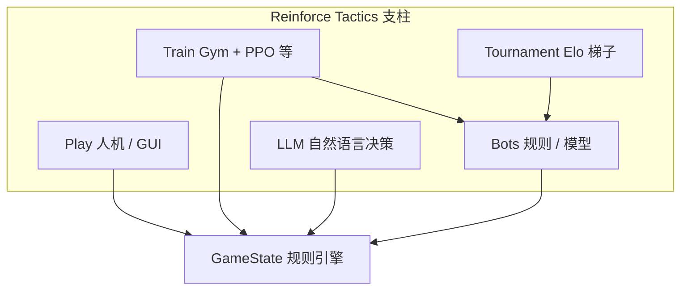
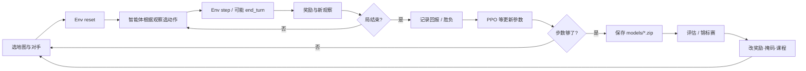

> 返回：[指南目录](README.md) · [上一章](00-how-to-use-this-guide.md) · [下一章](02-game-mechanics-as-mdp.md) · [索引](../AGENTS.md)

# 01 · 为何用强化学习，以及为何是这款游戏

上一章你已经能 import 包。本章回答两个「为什么」：

1. **为什么**不用普通监督学习解决「怎么打这盘棋」？
2. **为什么**回合制策略（本仓库这款游戏）是练 RL 的好靶场？

读完后你应能用自己的话向同事解释：RL 在优化什么，以及本项目的五根支柱。

---

## 1. 一张图先建立项目印象


主菜单背后其实挂着多条能力线：**人机对战、读档回放、设置语言、以及命令行训练**。GUI 是「看得见的游戏」；同一套规则引擎也可以 **完全无窗口** 地被 Gym 环境驱动，这是研究向项目的关键设计。

---

## 2. 监督学习 vs 强化学习：同一目标，两种反馈

### 2.1 用「学开车」类比

| 方式 | 老师给什么 | 学生学什么 |
|------|------------|------------|
| **监督学习** | 每一帧画面配「正确方向盘角度」标签 | 模仿标注数据：\(x \mapsto y\) |
| **强化学习** | 很少直接给「正确动作」；给**结果好坏**（有没有撞、到没到终点） | 在交互中改策略，让**长期总分**变高 |

策略游戏几乎不可能有「每一步的标准答案」：

- 高手在同一局面也可能分歧；
- 早期造兵 vs 抢塔的价值，要几十步后才显现；
- 对手在变，最优应对也在变。

所以我们把问题建成：

> 智能体在局面 \(s\) 选动作 \(a\)，环境给新局面与奖励 \(r\)，重复直到终局；目标是让期望累计奖励尽量大。

这就是 RL 的核心循环。算法总览见 [`../algorithms/overview.md`](../algorithms/overview.md)。

### 2.2 代码世界的对应

| 监督学习 | 强化学习（本项目） |
|----------|-------------------|
| 数据集 `(x, y)` | 轨迹：观察、动作、奖励序列 |
| 损失函数对标签 | 对**回报** \(G\) 或优势 \(A\) 的代理目标 |
| 离线一次训完也可 | 常要 **边交互边学**（on-policy 如 PPO） |
| 评估准确率 | 评估胜率 / Elo / 对固定 Bot 的分 |

行为克隆（BC）会把「专家回放」当监督学习用——那是 **热启动**，真正变强往往还要再上 RL。见后续 Part C 与 [`../algorithms/behavior-cloning.md`](../algorithms/behavior-cloning.md)。

### 2.3 延迟奖励：为什么比分类难

若只在「占领敌方总部」时给 \(+1000\)，中间几百步几乎全是 \(0\)。
智能体要回答：**刚才那步造兵，是不是导致了 40 步后的胜利？**
这叫 **信用分配（credit assignment）**。第 03 章的折扣回报、第 07 章的奖励塑形，都是为了对付它。

---

## 3. 为什么「回合制策略」适合当 RL 基准

不是所有游戏都同样适合入门 RL。本类游戏有几条对研究者友好的性质：

### 3.1 离散、可枚举的动作（虽多但规则清晰）

- 动作是「造哪个兵、从哪走到哪、打谁、结束回合」等，而不是连续力矩。
- 规则引擎能列出 **合法动作**（`get_legal_actions`），便于做 **动作掩码**。
- 便于写规则 Bot（Simple / Medium / Advanced）当固定对手与课程台阶。

### 3.2 状态可完全访问（默认可关战争迷雾）

- 训练默认可在完整信息下进行，降低 POMDP 难度。
- 需要时再开 fog，研究部分可观察。

### 3.3 一局既不太短也不「无限帧」

- 比 Atari 单帧决策更「有计划」：经济、站位、攻城。
- 比完整 RTS 微操简单：时间被 **回合** 切块。
- 但要注意：对 RL 接口而言，一步常常是 **一个微动作**，不是整回合（第 02 章重点）。

### 3.4 多条能力线可共享同一引擎

同一 `GameState` 可服务：

| 用途 | 消费者 |
|------|--------|
| 人玩 | GUI `app` / `ui` |
| 训智能体 | `StrategyGameEnv` |
| 规则 AI | `game/bot*.py` |
| 模型 AI | `ModelBot` 加载 `.zip` |
| 比强弱 | `tournament` + Elo |

这意味着你学的不是「一个孤立的 cartpole 玩具」，而是 **可扩展的研究脚手架**。

### 3.5 明确的胜负与可塑形的中间信号

- 终局：占 HQ、歼灭、回合上限和棋——稀疏但清晰。
- 中间：击杀、占领进度、经济差——可做塑形（也容易设错，第 07 章专门讲坑）。

---

## 4. 本项目的五根支柱

记住这句话：

> **Play · Train · Bots · Tournament · LLM**



### 4.1 Play（玩）

```powershell
python main.py --mode play
```

选 1v1、beginner 图、Human vs SimpleBot，点单位、造兵、**End Turn**。
这是建立「状态长什么样」的最快方式。本地步骤见 [`../usage/local-run-guide.md`](../usage/local-run-guide.md)。

### 4.2 Train（训）

```powershell
python main.py --mode train --algorithm ppo --timesteps 2000 --opponent bot
```

Headless：环境里包着 `GameState` + 对手 Bot，SB3 的 PPO 在改策略网络。
更认真的课程训练走 `scripts/train/train_bootstrap.py` + YAML（Part C）。

### 4.3 Bots（对手与基准）

| 类型 | 角色 |
|------|------|
| Random / Noop / BalancedRandom | 弱基准、压力测试、课程最低档 |
| Simple / Medium / Advanced | 规则强度阶梯 |
| ModelBot | 加载你训好的策略 |
| AlphaZeroBot | 搜索 + 网络（进阶） |

Bot 源码导读：[`../source-analysis/game-bots.md`](../source-analysis/game-bots.md)。

### 4.4 Tournament（锦标赛）

固定赛程、多 Bot 循环赛、Elo 更新。用来回答「这次改奖励到底变强了没有」，而不是只看训练曲线。
见 [`../source-analysis/tournament-system.md`](../source-analysis/tournament-system.md) 与 [`../algorithms/evaluation-and-elo.md`](../algorithms/evaluation-and-elo.md)。

### 4.5 LLM（大模型 Bot）

把局面序列化成提示词，让 GPT/Claude/Gemini 输出动作（需 `[llm]` 与 API Key）。
它不是本指南 Part A+B 主线，但说明「决策者可插拔」：只要会操作 `GameState`，就能进同一生态。
见 [`../source-analysis/game-llm-and-model-bots.md`](../source-analysis/game-llm-and-model-bots.md)。

---

## 5. 高阶项目循环（你训练时实际在转的圈）



- **内环**：交互采样（数据从哪来）。
- **中环**：参数更新（学到什么）。
- **外环**：评估与改实验设置（科研节奏）。

第 05 章会把内环 + 中环落成一条可复制的 PowerShell 命令。

---

## 6. 你将优化的「东西」到底是什么

直觉上：优化 **策略** \(\pi(a \mid o)\)——在观察 \(o\) 下选动作 \(a\) 的概率分布（或确定性规则）。

实现上（PPO / MaskablePPO）：

- 一个神经网络（常叫 Actor）输出各动作的分数；
- 另一个头（Critic）估计「这局面大概值多少」；
- 用采样到的轨迹算优势，**鼓励比预期好的动作、抑制比预期差的**。

公式与 clip 细节见 [`../algorithms/ppo.md`](../algorithms/ppo.md)；第 03 章先补期望、折扣、梯度直觉。

**你不会**在 Part A+B 手写反向传播；你会调用 Stable-Baselines3 的 `model.learn(...)`，但必须理解它在优化什么，否则调参像巫术。

---

## 7. 和「只写一个会赢的脚本 Bot」有何不同

| 规则 Bot | RL 智能体 |
|----------|-----------|
| 人写 if-else / 启发式 | 人写环境、奖励、网络结构 |
| 强度上限受设计者想象约束 | 理论上可发现非直观战术 |
| 改地图可能要重写规则 | 同一算法可换地图再训（需注意泛化） |
| 行为可解释 | 行为需用对局与特征分析来解释 |

实践中两者互补：规则 Bot 当 **对手与课程**，RL 去爬更高 Elo。项目文档里大量「bootstrap lessons」正是 RL 与规则对手较劲的经验。

---

## 8. 建议你现在就做的 10 分钟体验（可选但强烈推荐）

1. `conda activate reinforce-tactics`
2. `python main.py`
3. 新游戏 → 1v1 → beginner → 己方 Human，对方 SimpleBot
4. 只做三件事：在 HQ/建筑 **买一个 Warrior**、**移动**、点 **结束回合**
5. 观察：结束回合后对方会行动，你的金币与单位如何变化

这半局会让第 02 章的「P2 为何能买两个 Warrior」变得不抽象。

---

## 9. 常见误解（提前拆弹）

1. **「RL 就是深度学习」**
   深度学习是函数逼近工具；RL 是 **交互式决策问题** 的框架。可用表格 Q-learning，也可用神经网络。

2. **「有了大模型就不需要 RL」**
   LLM Bot 仍要环境与合法动作；且没有对局反馈时很难稳定变强。RL 与 LLM 可组合，不是互相替代。

3. **「训练曲线上升 = 真的变强」**
   可能过拟合某个 Bot 的漏洞，或在刷塑形分。需要 **评估与锦标赛**（支柱 4）。

4. **「这个游戏太简单，学不到真东西」**
   稀疏奖励、巨大离散动作空间、非法动作、非平稳对手（自对弈）——正是现代深度 RL 的经典痛点，只是地图比星海小。

---

## 10. 本章与后续的衔接

| 下一章 | 你将得到 |
|--------|----------|
| [02](02-game-mechanics-as-mdp.md) | 规则 → 状态/动作/奖励/转移；**微动作 vs 回合** |
| [03](03-math-without-tears.md) | 读公式所需的最小数学 |
| [04–05](04-gymnasium-and-sb3.md) | 标准 API + 第一次 `learn` |
| [06–07](06-observation-action-mask.md) | 智能体「看见什么、被禁什么、为钱学什么」 |

源码鸟瞰继续读：[`../source-analysis/overview.md`](../source-analysis/overview.md)。

---

## 自测

1. 用两句话对比：监督学习的训练信号 vs 强化学习的训练信号。
2. 列出本项目五根支柱，并各举一个仓库内入口（命令或目录即可）。
3. 为什么说「延迟奖励」让策略游戏比 ImageNet 分类更难？（不需要公式）

<details>
<summary>参考答案</summary>

1. 监督：每样本有标签，直接拟合 \(y\)；RL：通过与环境交互获得奖励，优化长期累计回报，往往没有逐步标签。
2. Play：`main.py --mode play`；Train：`--mode train` / `reinforcetactics/rl`；Bots：`game/bot*.py`；Tournament：`tournament/` / `scripts/tournament.py`；LLM：`game/llm_bot.py` + `[llm]`。
3. 好结果很晚才出现，中间大量动作没有直接对错标签，必须做信用分配。

</details>

---

**上一章**：[00 · 如何使用本指南](00-how-to-use-this-guide.md) · **下一章**：[02 · 游戏机制作为 MDP](02-game-mechanics-as-mdp.md)
