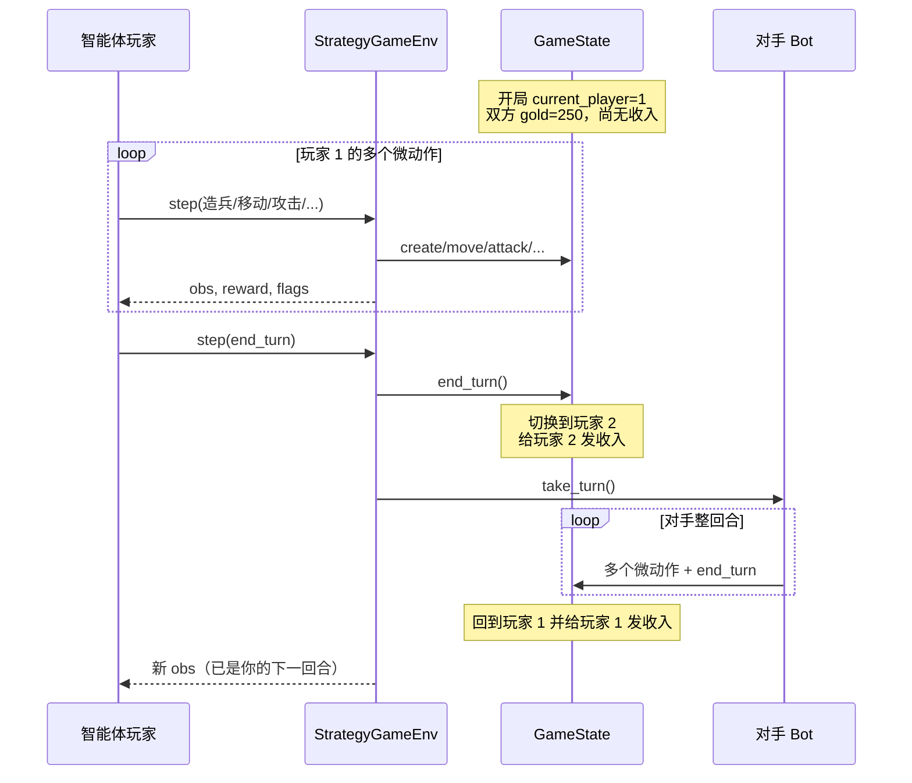
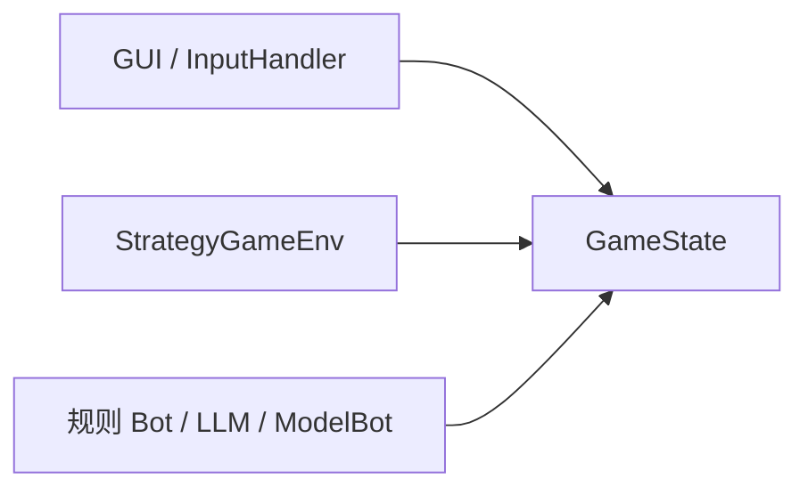

> 返回：[指南目录](README.md) · [上一章](01-why-rl-and-this-game.md) · [下一章](03-math-without-tears.md) · [索引](../AGENTS.md)

# 02 · 游戏机制如何变成 MDP

强化学习把问题建成 **马尔可夫决策过程（MDP）**：状态、动作、转移、奖励、折扣。
本章用 **白话规则** 把本游戏填进这五个格子，并强调全指南最关键的一点：

> **`StrategyGameEnv.step` 的一步 = 一个微动作；游戏「回合」要等 `end_turn`。**

源码导读：[`../source-analysis/core-game-engine.md`](../source-analysis/core-game-engine.md) · [`../source-analysis/rl-gym-env.md`](../source-analysis/rl-gym-env.md)
算法对照：[`../algorithms/mdp-gymnasium-basics.md`](../algorithms/mdp-gymnasium-basics.md)

---

## 1. 先看棋盘长什么样


你看到的是：网格地形、双方单位、建筑（总部 / 普通建筑 / 塔）、金币与回合信息。
对 RL 而言，这些会被编码成观察张量（第 06 章）；本章先讲 **规则语义**。

---

## 2. 规则白话：单位、建筑、收入、胜利

### 2.1 单位（8 种）

常量在 `reinforcetactics/constants.py` 的 `UNIT_DATA` / `ALL_UNIT_TYPES`。

| 代码 | 名称 | 费用（默认） | 定位一句话 |
|------|------|--------------|------------|
| W | Warrior | 200 | 便宜近战、占点好手 |
| C | Cleric | 200 | 治疗与解控 |
| A | Archer | 250 | 远程；山地形程更远 |
| M | Mage | 300 | 远程 + 麻痹 |
| K | Knight | 350 | 冲锋加伤 |
| R | Rogue | 350 | 侧袭与闪避 |
| S | Sorcerer | 350 | 加速与攻防 Buff |
| B | Barbarian | 400 | 高机动高血玻璃炮 |

细节表见用户站/docs-site 的游戏机制文；训练时可用 `engine_overrides` 改费用与数值（研究平衡时用）。

### 2.2 建筑与收入

| 建筑 | 地图码 | 每回合收入（默认） | 备注 |
|------|--------|-------------------|------|
| 总部 HQ | `h` | 150 | 被敌方占完 → 你输 |
| 建筑 Building | `b` | 100 | 也是 **造兵点** |
| 塔 Tower | `t` | 50 | 经济点 |

- **起始金币**：双方都是 **`STARTING_GOLD = 250`**。
- 收入在 **某玩家成为当前玩家时**（`end_turn` 切换之后）结算并加入其金币。
- 占领：单位站在建筑上 **Seize**，按单位当前 HP 扣建筑 HP；扣到 0 换主人。中立建筑可缓慢回血。

### 2.3 胜利条件

| 条件 | `end_reason`（代码） |
|------|----------------------|
| 占领敌方 HQ | `hq_capture` |
| 对方单位全灭 | `elimination` |
| 回合数打满 | `max_turns_draw`（和棋） |
| 认输 | `resign` |

RL 环境还有 **env 步数上限** `max_steps` → `truncated`（人为截断，不是规则和棋）。见第 04 章 `terminated` vs `truncated`。

### 2.4 你一回合里通常做什么

1. （可选）在己方建筑空位 **造兵**（扣金币）
2. **移动** 单位
3. **攻击** / 技能 / **占领**
4. 点 **结束回合** → 轮到对手整回合

GUI 与 Bot 都是这个心智模型。**Gym 环境把 1–4 拆成多次 `step`。**

---

## 3. 关键：Env 微动作 vs 游戏回合

### 3.1 对照表

| 概念 | 含义 | 代码落点 |
|------|------|----------|
| **Env 步** / 微动作 | 智能体一次决策：造一个兵、移动一次、打一下、`end_turn`… | `StrategyGameEnv.step` |
| **游戏回合** | 当前玩家可以连续做多个微动作，直到 `end_turn` | `GameState` 的 `current_player` |
| **对手回合** | 你 `end_turn` 之后，环境内调用对手 `take_turn()`，对手内部可循环多个微动作再 `end_turn` | `_opponent_turn` |

因此：

- 一局可能有 **成百上千** 个 env 步；
- TensorBoard 的 timesteps 计的是 env 步，不是「游戏回合数」；
- 信用分配更难：终局奖励要回传到很早以前的造兵决策。

### 3.2 回合生命周期（Mermaid）



### 3.3 为什么 P2 开局能买 2 个 Warrior？

数字（默认常量，`constants.py`）：

- 双方开局金币：\(250\)（**相同**，不是 P2 开挂）
- Warrior 费用：\(200\)
- HQ 收入：\(150\)；建筑：\(100\)；塔：\(50\)

以 `maps/1v1/beginner.csv` 为例：双方对称地各有 **1 总部 + 2 建筑**，
每侧「满地产」收入为：

\[
150 + 100 + 100 = 350
\]

时间线：

1. **开局**：P1 先手，金币 250，**尚未**领过任何结构收入。
   只能买 **1** 个 Warrior（还剩 50），买不起第 2 个。
2. P1 操作完毕 → **`end_turn`**。
3. `end_turn` 内部（关键顺序）：
   - 把 `current_player` 切到 **P2**；
   - 对 **新的当前玩家 P2** 调用 `calculate_income` 并发钱。
4. P2 此时金币：

\[
250 + 350 = 600
\]

5. \(600 / 200 = 3\) → 理论上最多 **3** 个 Warrior；Bot 常见是先买 **2** 个。

即使用「只算 HQ」的保守估计 \(250+150=400\)，也已经够 2 个 W。

这不是 bug，而是 **「收入在成为当前玩家时结算」** 与 **「P1 先手但开局双方都还没领过收入」** 叠加的结果：

- P1 的第一回合：**没有**开局收入，只用起始 250；
- P2 的第一回合：起始 250 **+** 第一次成为当前玩家时的地产收入。

设计启示：先手有节奏优势，但经济上 P2 第一回合更「富」——规则 Bot 与 RL 都会利用这一点。读 `GameState.end_turn` 可见「切换玩家 → `calculate_income`」顺序。

---

## 4. 把规则填进 MDP 五元组

经典写法：

\[
\mathcal{M} = (\mathcal{S}, \mathcal{A}, P, R, \gamma)
\]

| 符号 | 本游戏中的含义 |
|------|----------------|
| \(\mathcal{S}\) | 完整局面：格子、单位列表、金币、当前玩家、冷却与 Buff、`game_over`… 即 **`GameState` 能表达的一切** |
| \(\mathcal{A}\) | 微动作集合：造兵/移动/攻击/占领/技能/`end_turn`… 常编码为 6 维离散或 flat 索引 |
| \(P(s'\|s,a)\) | 转移：多数规则 **确定性**；少数含随机（如 Rogue 闪避）。对手 Bot 也可引入随机策略 |
| \(R\) | 由 `reward_config` 定义的即时奖励 + 势函数塑形 + 终局奖（第 07 章） |
| \(\gamma\) | 折扣因子，训练与塑形应一致，常用 \(0.99\) |

### 4.1 状态 vs 观察

- **状态 \(s\)**：引擎内部完整信息（`GameState`）。
- **观察 \(o\)**：给策略网络的张量字典（`build_observation`），默认 agent-relative；可含战争迷雾。

完整信息时 \(o\) 近似够用；有雾时是 **POMDP**，入门可先关雾。

### 4.2 动作：结构化微动作

Gym 默认 `MultiDiscrete` 六维（详见第 06 章）：

```text
[action_type, unit_type, from_x, from_y, to_x, to_y]
```

`action_type` 含：`create_unit`, `move`, `attack`, `seize`, heal/cure, **`end_turn`**, 麻痹/加速/Buff 等。

合法集合由 `GameState.get_legal_actions(player)` 枚举，再转成掩码。

### 4.3 奖励（先建立量级直觉）

默认量级（可被配置覆盖）：

| 信号 | 默认量级 | 角色 |
|------|----------|------|
| 赢 / 输 | \(\pm 1000\) | 终局主目标 |
| 和棋 | \(-200\) 量级 | 避免无限磨 |
| 击杀 / 占领等 | 较小正数 | 稠密塑形 |
| 非法动作 | \(-10\) | 兜底惩罚 |

**真正「什么叫学得好」应以胜负与评估为准**，不是中途击杀分刷到最高。

### 4.4 转移与「对手是环境的一部分」

对训练中的智能体来说：

- 自己的微动作 → 改 `GameState`；
- `end_turn` → 对手 `take_turn` 整段也是转移的一部分；
- 对手若是学习型或历史快照池，环境会 **非平稳**（自对弈章节再展开）。

---

## 5. 代码指针：从规则到 Env

### 5.1 `GameState`（领域 SSOT）

| 你想了解 | 去哪 |
|----------|------|
| 构造、金币、覆盖项 | `reinforcetactics/core/game_state.py` |
| 合法动作枚举 | `get_legal_actions` |
| 结束回合与收入 | `end_turn` |
| 胜负写入 | `_set_game_over` |
| 战斗与收入计算 | `reinforcetactics/game/mechanics.py` |
| 默认数值表 | `reinforcetactics/constants.py` |

文档：[`../source-analysis/core-game-engine.md`](../source-analysis/core-game-engine.md)

### 5.2 `StrategyGameEnv`（RL 外壳）

| 你想了解 | 去哪 |
|----------|------|
| `reset` / `step` | `reinforcetactics/rl/gym_env.py` |
| 观察编码 | `reinforcetactics/rl/observation.py` |
| 掩码封装 | `reinforcetactics/rl/masking.py` |

文档：[`../source-analysis/rl-gym-env.md`](../source-analysis/rl-gym-env.md)

语义示意（非逐行复制）：

```python
# step 末尾语义
terminated = self.game_state.game_over          # 规则终局
truncated = self.current_step >= self.max_steps  # 步数截断
return obs, reward, terminated, truncated, info
```

`end_turn` 分支才会 `_opponent_turn()`。

### 5.3 谁在用同一套规则



这保证：**你在 GUI 里理解的规则 = 训练里的规则**（同一套 API）。

---

## 6. 把一局拆成 MDP 轨迹（心智模型）

记智能体视角的轨迹：

\[
o_0, a_0, r_1, o_1, a_1, r_2, \ldots, o_T
\]

可能的片段：

| \(t\) | \(a_t\) 含义 | 说明 |
|-------|--------------|------|
| 0 | 造 Warrior | 金币 250→50 |
| 1 | 移动该单位 | 仍是 P1 回合 |
| 2 | `end_turn` | 触发对手整回合；奖励含对手造成的影响 |
| 3… | 下一回合微动作 | … |
| \(T-1\) | 占领 HQ 的 seize | 随后 `terminated=True`，大终局奖 |

注意：`a_2 = end_turn` 的 **一个** env 步，内部可能发生对手 **几十个** 领域动作——但它们不是你的策略输出的 \(a\)，而是环境转移。

---

## 7. 地图、模式与 Env 限制

| 能力 | 说明 |
|------|------|
| 地图 CSV | `maps/1v1/*.csv` 等；单元格如 `h_1` 表示 P1 的 HQ |
| GUI 模式 | 1v1 / 1v1v1 / 2v2 都可能有 |
| **RL Env** | **仅 1v1**（观察 self/opp 通道写死） |

训练入门优先：`maps/1v1/beginner.csv` 或 CLI 默认图。

---

## 8. 常见误解

1. **「timesteps=2000 就是打 2000 局」**
   否，是约 2000 次 `step`（微动作级）。

2. **「每 step 都会换手」**
   否，只有 `end_turn` 才换手。

3. **「双方每回合开始都有 250 收入」**
   收入来自建筑，HQ 默认 150；且 **开局第一手 P1 尚未领收入**。

4. **「状态就是 RGB 截图」**
   本项目默认是 **结构化张量**（grid/units/global_features），不是像素。

5. **「非法动作环境会帮我改成合法」**
   不保证；应靠掩码。无掩码时可能吃 `invalid_action` 惩罚。

---

## 9. 小结：本章的「地图」

```text
人类规则语言
    ↓
GameState API（合法动作、end_turn、胜负）
    ↓
StrategyGameEnv（观察、掩码、奖励、step）
    ↓
SB3 / MaskablePPO（第 04–05 章）
```

你已经能解释为什么这是一个 MDP。下一章补齐读公式所需的最小数学，仍然不要求微积分证明。

---

## 自测

1. 用自己的话区分 **env 步** 与 **游戏回合**，并指出哪一个对应 `end_turn`。
2. 从起始金币与收入规则，推导 **为何 P2 第一回合可以买 2 个 200 金的 Warrior**，而 P1 第一回合通常不能。
3. MDP 中的 \(\mathcal{S}\) 在本项目里主要由哪个类承载？策略实际吃到的 \(o\) 又由哪个模块构建？

<details>
<summary>参考答案</summary>

1. Env 步 = 一次微动作（`step`）；游戏回合 = 当前玩家连续微动作直到 `end_turn`；`end_turn` 是一种特殊微动作，触发换手与对手回合。
2. 双方开局 250；Warrior 200。P1 先手无开局收入 → 最多 1 个。P1 `end_turn` 后 P2 收 HQ 收入 150 → \(250+150=400\) → 2 个 Warrior。
3. \(\mathcal{S}\)：`GameState`；\(o\)：`observation.build_observation`（经 `StrategyGameEnv`）。

</details>

---

**上一章**：[01 · 为何用 RL](01-why-rl-and-this-game.md) · **下一章**：[03 · 无痛数学](03-math-without-tears.md)
