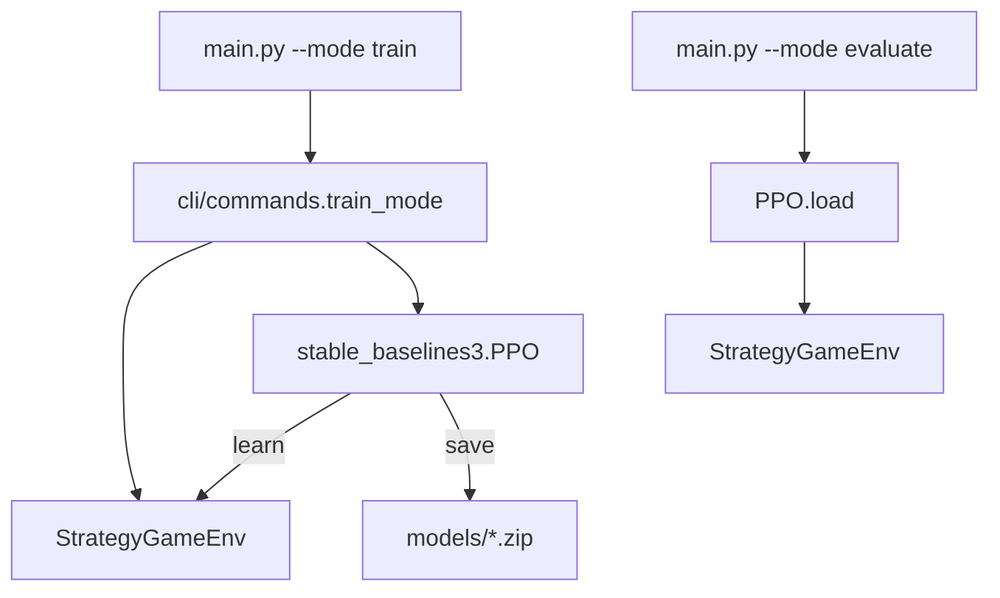

> 返回：[指南目录](README.md) · [上一章](03-math-without-tears.md) · [下一章](05-first-train-ppo.md) · [索引](../AGENTS.md)

# 04 · Gymnasium 与 Stable-Baselines3

有了 MDP 直觉后，工程上需要 **统一接口**：任何环境都提供 `reset` / `step`，任何算法库都能拿去训练。
本项目使用：

| 库 | 角色 |
|----|------|
| [Gymnasium](https://gymnasium.farama.org/) | 环境 API 标准（Farama 维护，Gym 继任者） |
| [Stable-Baselines3 (SB3)](https://stable-baselines3.readthedocs.io/) | PPO / A2C 等现成实现 |
| [sb3-contrib](https://sb3-contrib.readthedocs.io/) | **MaskablePPO** 等扩展 |

算法卡片：[`../algorithms/mdp-gymnasium-basics.md`](../algorithms/mdp-gymnasium-basics.md) · [`../algorithms/ppo.md`](../algorithms/ppo.md)
源码：[`../source-analysis/rl-gym-env.md`](../source-analysis/rl-gym-env.md)

---

## 1. Gymnasium 核心 API

### 1.1 生命周期

```text
env = make_env()
obs, info = env.reset(seed=0)
loop:
    action = policy(obs)          # 或随机 / 人类
    obs, reward, terminated, truncated, info = env.step(action)
    if terminated or truncated:
        obs, info = env.reset()
env.close()
```

### 1.2 返回值逐项

| 名称 | 类型直觉 | 含义 |
|------|----------|------|
| `obs` | 数组或 dict | 智能体观察 \(o\) |
| `reward` | float | 本步即时奖励 \(r\) |
| **`terminated`** | bool | **规则上**对局结束（赢/输/和） |
| **`truncated`** | bool | **外部**掐断（步数上限等） |
| `info` | dict | 诊断信息（不进观察） |

#### `terminated` vs `truncated`（必背）

| | `terminated=True` | `truncated=True` |
|--|-------------------|-------------------|
| 原因 | HQ 被占、歼灭、和棋规则等 | `current_step >= max_steps` |
| 语义 | 真正终局，没有「未来价值」 | 人为停止，训练器常仍用 \(V(s')\) bootstrap |
| 本项目 | `game_state.game_over` | env 步上限 |

两者可同时为假（对局继续）；一般不同时为「需要重置」的两种理由。任一为真都应 `reset` 开新局。

官方说明：[Gymnasium — Agent-Environment API](https://gymnasium.farama.org/introduction/basic_usage/)。

### 1.3 `reset`

```python
obs, info = env.reset(seed=42)
```

- 新开一局，返回初始观察；
- `seed` 控制随机性（地图固定时仍可能有 Rogue 闪避、随机 Bot 等）。

---

## 2. 本项目的观察与动作空间

### 2.1 Dict 观察

`StrategyGameEnv` 的 observation 是 **字典**（`spaces.Dict`），不是单张图：

| 键 | 形状（约） | 内容 |
|----|------------|------|
| `grid` | `(H, W, 11)` | 地形 one-hot + 归属 + 建筑 HP 比 |
| `units` | `(H, W, 16)` | 兵种、归属、是否耗尽行动、HP、状态 |
| `global_features` | `(5,)` | 己金/敌金/回合/己单位数/敌单位数（tanh 缩放） |
| `visibility` | `(H, W)` | 仅战争迷雾开启时 |

编码唯一入口：`reinforcetactics.rl.observation.build_observation`。
细节第 06 章；源码文 [`../source-analysis/rl-gym-env.md`](../source-analysis/rl-gym-env.md)。

因为是 Dict，SB3 策略网络用 **`MultiInputPolicy`**（多输入，而不是 `MlpPolicy` 单向量）。

### 2.2 MultiDiscrete 动作（默认）

```text
MultiDiscrete([10, 8, W, H, W, H])
  [0] action_type   0..9  造兵/移动/攻击/占领/治疗/end_turn/技能...
  [1] unit_type     0..7  对应 8 兵种（造兵时有意义）
  [2] from_x
  [3] from_y
  [4] to_x
  [5] to_y
```

一次 `step` 吃进长度为 6 的整数数组（或 flat 模式下的一个整数索引）。

### 2.3 可选 `flat_discrete`

把合法动作列成一张表，动作空间变成 `Discrete(max_flat_actions)`，掩码 **精确到候选**。
课程 Bootstrap 生产配置常偏好 flat，以减轻 MultiDiscrete 各维掩码的「过近似」。见第 06 章与 [`../algorithms/action-masking.md`](../algorithms/action-masking.md)。

---

## 3. Stable-Baselines3 你需要会的两件事

### 3.1 `model.learn`

```python
from stable_baselines3 import PPO

model = PPO("MultiInputPolicy", env, verbose=1, tensorboard_log="./tensorboard/")
model.learn(total_timesteps=10_000)
model.save("models/my_ppo")
```

- `total_timesteps`：与环境交互的 **env 步**总数；
- 内部循环：采样 → 算优势 → 多 epoch 更新；
- 文档：[SB3 PPO](https://stable-baselines3.readthedocs.io/en/master/modules/ppo.html)。

### 3.2 `model.predict`

```python
action, _state = model.predict(obs, deterministic=True)
obs, reward, terminated, truncated, info = env.step(action)
```

| `deterministic` | 行为 |
|-----------------|------|
| `True` | 取概率最大动作（评估常用） |
| `False` | 按分布采样（更接近训练时探索） |

CLI 评估模式封装了多局循环：第 05 章。

### 3.3 为何是 `MultiInputPolicy`

| 策略类 | 适用观察 |
|--------|----------|
| `MlpPolicy` | 一维 `Box` 向量 |
| `CnnPolicy` | 图像 |
| **`MultiInputPolicy`** | **`Dict` 多键**（本项目） |

看错策略类会在创建 model 时直接报错或维度不匹配。

---

## 4. 普通 PPO vs MaskablePPO

### 4.1 问题

离散动作里 **绝大多数组合非法**（从空格移动、打友军坐标等）。
普通 PPO 仍可能采样非法动作 → 大量 `invalid_action` 惩罚 → 几乎学不会。

### 4.2 解决：动作掩码 + MaskablePPO

- 环境提供 `action_masks()`（合法为 True）；
- **[MaskablePPO](https://sb3-contrib.readthedocs.io/en/master/modules/ppo_mask.html)**（`sb3-contrib`）在 softmax 前屏蔽非法 logit；
- 本仓库封装：`reinforcetactics.rl.masking.make_maskable_env` 等。

| | 普通 `PPO` | `MaskablePPO` |
|--|------------|----------------|
| 包 | `stable_baselines3` | `sb3-contrib` |
| 掩码 | 默认不用 | 每步读 mask |
| CLI 短训 `main.py --mode train` | 当前实现偏 **普通 PPO**（冒烟够用） | 认真训练 / 示例脚本常用 |
| 非法动作 | 靠惩罚硬扛 | 采样时基本避开 |

示例：`examples/train_with_action_masking.py`。
算法说明：[`../algorithms/action-masking.md`](../algorithms/action-masking.md) · [`../algorithms/ppo.md`](../algorithms/ppo.md)。

### 4.3 入门策略建议

1. **第 05 章**：先用 CLI 普通 PPO 跑通流水线（会训、会存、会评估）。
2. **第 06 章后**：理解掩码，再上 MaskablePPO / bootstrap 配置。
3. 不要在「环境都 step 不通」时先调 clip_range。

---

## 5. TensorBoard 基础

SB3 可写日志目录（CLI 默认 `./tensorboard/`）：

```powershell
tensorboard --logdir ./tensorboard
```

浏览器打开提示的 URL（常是 `http://localhost:6006`）。

| 常见曲线 | 粗读法 |
|----------|--------|
| `rollout/ep_rew_mean` | 回合奖励均值；上升通常是好事，但需防刷分 |
| `rollout/ep_len_mean` | 回合长度（env 步） |
| `train/loss` / `policy_gradient_loss` | 训练损失；剧烈爆炸要怀疑 lr |
| `train/entropy_loss` | 探索程度相关（实现里符号约定以 SB3 为准） |

**短训 2000 步**曲线会很噪，只适合确认「在跑」，不适合下「已经变强」的结论。

文档：[SB3 TensorBoard](https://stable-baselines3.readthedocs.io/en/master/guide/tensorboard.html)。

---

## 6. 实操：创建环境并随机 step（headless）

在仓库根、已激活 `reinforce-tactics`：

```powershell
python -c @"
from reinforcetactics.rl.gym_env import StrategyGameEnv

env = StrategyGameEnv(
    map_file='maps/1v1/beginner.csv',
    opponent='noop',   # 对手只 end_turn，便于冒烟
    render_mode=None,
)
obs, info = env.reset(seed=0)
print('obs keys:', sorted(obs.keys()))
print('action_space:', env.action_space)

total_r = 0.0
for t in range(20):
    action = env.action_space.sample()
    obs, r, terminated, truncated, info = env.step(action)
    total_r += r
    if terminated or truncated:
        print(f'episode ended at t={t}, terminated={terminated}, truncated={truncated}')
        obs, info = env.reset()
        break
else:
    print('finished 20 random steps without episode end')

print('sum reward (partial):', round(total_r, 3))
env.close()
print('ok')
"@
```

### 6.1 你应看到什么

- `obs keys` 含 `grid`, `units`, `global_features`；
- `action_space` 为 `MultiDiscrete` 或配置的 flat；
- 随机动作很多会非法 → 奖励可能偏负，**正常**；
- 打印 `ok` 表示环境可在无 GUI 下运行。

### 6.2 可选：打印掩码形状

```powershell
python -c @"
from reinforcetactics.rl.gym_env import StrategyGameEnv
env = StrategyGameEnv(map_file='maps/1v1/beginner.csv', opponent='noop')
env.reset(seed=0)
masks = env.action_masks()
if isinstance(masks, (list, tuple)):
    print('per-dim masks:', [m.shape for m in masks])
else:
    print('flat mask shape:', masks.shape, 'legal', int(masks.sum()))
env.close()
"@
```

---

## 7. CLI 与库代码如何接到一起



- 简单路径：`cli/commands.py` 里直接 `PPO(...)` + `Monitor`；
- 严肃路径：`scripts/train/*.py` + `configs/**/*.yaml` + 常为 MaskablePPO。

入口说明：[`../source-analysis/entrypoints-and-cli.md`](../source-analysis/entrypoints-and-cli.md)。

---

## 8. 外部文档（Markdown 链接）

| 资源 | 链接 |
|------|------|
| Gymnasium 文档首页 | https://gymnasium.farama.org/ |
| Gymnasium 基本用法 | https://gymnasium.farama.org/introduction/basic_usage/ |
| SB3 文档首页 | https://stable-baselines3.readthedocs.io/ |
| SB3 PPO | https://stable-baselines3.readthedocs.io/en/master/modules/ppo.html |
| MaskablePPO（sb3-contrib） | https://sb3-contrib.readthedocs.io/en/master/modules/ppo_mask.html |
| SB3 TensorBoard 指南 | https://stable-baselines3.readthedocs.io/en/master/guide/tensorboard.html |

---

## 9. 常见坑

1. **`obs` 是 dict，却当 numpy 直接喂错形状的网络**
   用 `MultiInputPolicy`，或自己写提取器（项目里有 `extractors`）。

2. **把 `truncated` 当成输了**
   截断只是步数到了；胜负看 `info` / `game_over` / 终局奖励。

3. **训练时 `render_mode` 开成 human**
   极慢；训练用 `None` headless。

4. **忘记 `env.close()`**
   短脚本无所谓；长期多环境注意资源。

5. **普通 PPO 训很久仍几乎随机**
   优先检查掩码与对手是否过强，而不是先加倍 timesteps。

---

## 10. 小结

- Gymnasium：`reset` / `step` + `terminated`/`truncated`。
- 本环境：Dict 观察 + MultiDiscrete（或 flat）动作。
- SB3：`learn` / `predict` / `MultiInputPolicy`。
- 认真做动作空间时用 **MaskablePPO**。
- 下一章：一条 PowerShell 命令完成首次训练与评估。

---

## 自测

1. `terminated=True` 与 `truncated=True` 在本项目中分别通常由什么触发？训练器为何要区分它们？
2. 为什么本项目的 PPO 要用 `MultiInputPolicy` 而不是 `MlpPolicy`？
3. 一句话说明 MaskablePPO 比普通 PPO 多解决了什么问题。

<details>
<summary>参考答案</summary>

1. `terminated`：`game_over`（占 HQ、歼灭、和棋等）；`truncated`：env 步数到 `max_steps`。区分是为了价值估计在截断时仍可 bootstrap，终局则停止自举。
2. 观察是 `Dict` 多键张量，需要多输入策略。
3. 在采样与 log-prob 时屏蔽非法动作，避免在巨大非法空间里瞎撞。

</details>

---

**上一章**：[03 · 无痛数学](03-math-without-tears.md) · **下一章**：[05 · 第一次训练 PPO](05-first-train-ppo.md)
