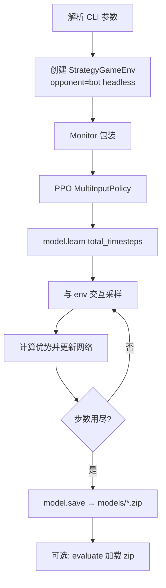

> 返回：[指南目录](README.md) · [上一章](04-gymnasium-and-sb3.md) · [下一章](06-observation-action-mask.md) · [索引](../AGENTS.md)

# 05 · 第一次训练 PPO（能跑通即可）

本章目标不是「训出能打 AdvancedBot 的神」，而是：

1. 在 Windows + Conda 下 **完整跑通** 训练；
2. 知道产物写在哪；
3. 会跑评估命令；
4. 能对照常见失败自救。

操作细则也可对照：[`../usage/local-run-guide.md`](../usage/local-run-guide.md)。
CLI 源码：`reinforcetactics/cli/commands.py` · [`../source-analysis/entrypoints-and-cli.md`](../source-analysis/entrypoints-and-cli.md)。

---

## 1. 训练前检查清单

在 **PowerShell** 中：

```powershell
cd D:\Grok\project2\reinforce-tactics   # 改成你的仓库根
conda activate reinforce-tactics
python -V
python -c "import reinforcetactics, gymnasium, torch, stable_baselines3; print('ok')"
```

确认：

- [ ] 当前目录有 `main.py`
- [ ] 环境名 `reinforce-tactics`
- [ ] import 打印 `ok`
- [ ] **不需要** GPU；CPU 即可

可选：先做第 04 章的 20 步随机 `step` 冒烟。

---

## 2. 短训命令（请原样跑一遍）

```powershell
python main.py --mode train --algorithm ppo --timesteps 2000 --opponent bot
```

| 参数 | 本命令取值 | 含义 |
|------|------------|------|
| `--mode` | `train` | 训练模式 |
| `--algorithm` | `ppo` | 使用 SB3 PPO |
| `--timesteps` | `2000` | 仅 **2000** 个 env 步（冒烟级） |
| `--opponent` | `bot` | 环境内规则对手（SimpleBot 兼容别名） |

### 2.1 可选增强参数

```powershell
# 固定地图
python main.py --mode train --algorithm ppo --timesteps 2000 --opponent bot --map-file maps/1v1/beginner.csv

# 自定义保存名（生成 models/my_first_ppo.zip）
python main.py --mode train --algorithm ppo --timesteps 2000 --opponent bot --model-name my_first_ppo

# 稍长一点的「还算认真」短训
python main.py --mode train --algorithm ppo --timesteps 50000 --opponent bot --map-file maps/1v1/beginner.csv
```

查看全部参数：

```powershell
python main.py --help
```

### 2.2 训练时终端大概会出现什么

- `Training PPO Agent` 之类横幅
- `Creating environment...` / `Creating PPO model...`
- SB3 表格：`total_timesteps`、`fps`、`explained_variance` 等
- 结束：`Model saved to models\....zip`（路径写法随实现）

`2000` 步时，SB3 默认 `n_steps=2048` 可能导致 **只完整更新极少次甚至边界行为**——这完全正常。本章优先验证 **管道**，不是验证 **强度**。若你想看到更像样的日志，可用 `10000` 或 `50000`。

---

## 3. 训练结束后磁盘上有什么

| 路径 | 内容 |
|------|------|
| **`models/`** | 最终模型，如 `ppo_final.zip`（或你 `--model-name` 指定的名字） |
| **`checkpoints/`** | 周期性检查点（CLI 里 `save_freq=10000`，故 **2000 步可能还没有** checkpoint） |
| **`tensorboard/`** | 事件文件；可用 TensorBoard 查看 |

```powershell
# 列出模型
Get-ChildItem models\*.zip

# 若有日志
tensorboard --logdir .\tensorboard
```

**注意**：`models/` 等目录常被 gitignore；换机器请自行拷贝 zip。

SB3 的 `model.save("models/ppo_final")` 会生成 **`models/ppo_final.zip`**（扩展名由 SB3 加上）。

---

## 4. 评估命令

训练完成后：

```powershell
python main.py --mode evaluate --model models/ppo_final.zip --episodes 5
```

若你用了自定义名：

```powershell
python main.py --mode evaluate --model models/my_first_ppo.zip --episodes 5
```

| 参数 | 含义 |
|------|------|
| `--model` | zip 路径 |
| `--episodes` | 评估局数 |
| `--render` | 可选；尝试渲染（需 GUI，慢） |

期望：打印若干局奖励/胜负统计（具体字段以实现为准），过程无 traceback。

**2000 步模型大概率仍然很弱**——评估的意义是确认 **加载 + 对局循环** 正常，不是看胜率。

---

## 5. 训练循环（你在跑的是这个）



对应实现要点（`train_mode`）：

- `StrategyGameEnv(..., render_mode=None)`
- `PPO("MultiInputPolicy", env, tensorboard_log="./tensorboard/", ...)`
- `CheckpointCallback` → `checkpoints/`
- `model.learn(...)` 后 `model.save(...)`

算法直觉：[`../algorithms/ppo.md`](../algorithms/ppo.md)。

---

## 6. 对手选项（简表）

| `--opponent` | 直觉 |
|--------------|------|
| `bot` / `simple` | 弱规则 AI，入门默认 |
| `random` | 随机合法动作，噪声大 |
| `noop` | 几乎只结束回合，极弱，适合调试 |
| `self` | 自对弈（需额外设置，进阶） |

冒烟用 `bot` 或 `noop` 都行；**想尽快看到「好像在学」** 可对 `noop` 训稍长步数，但仍要以评估为准。

---

## 7. 常见失败与处理

### 7.1 Conda / 包

| 现象 | 处理 |
|------|------|
| `conda: command not found` | 先装 Anaconda/Miniconda，或用已配好的环境入口 |
| 不在 `reinforce-tactics` 环境 | `conda activate reinforce-tactics` |
| `No module named stable_baselines3` | `pip install -e .` 重装 base 依赖 |
| `No module named reinforcetactics` | 在仓库根 `pip install -e .` |

### 7.2 路径

| 现象 | 处理 |
|------|------|
| `can't open file main.py` | `cd` 到仓库根 |
| 地图找不到 | 检查 `--map-file` 相对仓库根；`maps/1v1/beginner.csv` 是否存在 |
| 评估 `FileNotFoundError` | 确认 zip 路径；注意 SB3 保存名与 `.zip` |

### 7.3 GPU 相关焦虑

- **CPU 完全可用**；本指南默认 CPU。
- 若 PyTorch 报 CUDA 乱错，可确认安装的是 CPU 轮子，或设置设备（进阶）。
- 短训不必强求 GPU。

### 7.4 训练中断

- `Ctrl+C`：CLI 会尝试捕获并仍可能保存（见 `KeyboardInterrupt` 分支）；以是否生成 zip 为准。
- 磁盘满：清 `checkpoints/`、旧 `tensorboard/` 事件。

### 7.5 「跑完了但模型是废物」

预期内。继续：

- 加长 `timesteps`（如 1e5）；
- 换地图与课程（Part C Bootstrap）；
- 上动作掩码（第 06 章）；
- 调奖励（第 07 章）。

### 7.6 Windows 特有

- 用 **PowerShell** 即可；若复制了 Linux 的 `\` 转义问题，以本指南命令为准。
- 杀毒软件锁定 `models\` 写入时，可换目录或加排除。
- 中文路径偶发工具链问题：尽量把仓库放在如 `D:\Grok\...` 较短 ASCII 路径。

---

## 8. 建议的「第一次成功」定义

你满足下列全部即可勾选本章：

1. 短训命令 **退出码成功**（无 Python traceback）
2. `models\` 下出现 **`.zip`**
3. evaluate 命令能跑完 **≥1 局**
4. 能向别人说出：timesteps 是 **env 微动作步**，不是游戏局数

```text
□ conda activate + 仓库根
□ train 2000 steps
□ models/*.zip 存在
□ evaluate 不崩
□ 理解「弱是正常的」
```

---

## 9. 接下来学什么

| 问题 | 章节 |
|------|------|
| 智能体到底看见什么？非法动作怎么办？ | [06](06-observation-action-mask.md) |
| 奖励会不会教坏？ | [07](07-rewards-and-shaping.md) |
| 如何按阶段打怪升级？ | Part C · Bootstrap |
| 命令行以外的训练脚本 | [`../source-analysis/rl-training-pipelines.md`](../source-analysis/rl-training-pipelines.md) |

---

## 10. 附录：与 GUI 对战的关系

- **训练**不打开主菜单；纯 headless。
- 想 **看** 模型下棋：评估 `--render`（若可用），或 GUI 里用 ModelBot 加载 zip（菜单路径随版本可能变化）。
- 人机手玩：`python main.py --mode play`，与训练并行不冲突。

---

## 自测

1. 写出从「进入仓库」到「短训 2000 步」的完整 PowerShell 序列（至少 3 行）。
2. 训练结束后，最终策略权重默认写在哪个目录？TensorBoard 日志呢？
3. 为什么说 `timesteps 2000` 不足以判断算法好坏，但仍值得跑？

<details>
<summary>参考答案</summary>

1. `cd ...\reinforce-tactics` → `conda activate reinforce-tactics` → `python main.py --mode train --algorithm ppo --timesteps 2000 --opponent bot`。
2. `models/`（如 `ppo_final.zip`）；`tensorboard/`。
3. 步数太少、更新次数不足、方差大；但能验证环境、依赖、存盘与评估链路。

</details>

---

**上一章**：[04 · Gymnasium 与 SB3](04-gymnasium-and-sb3.md) · **下一章**：[06 · 观察与动作掩码](06-observation-action-mask.md)
