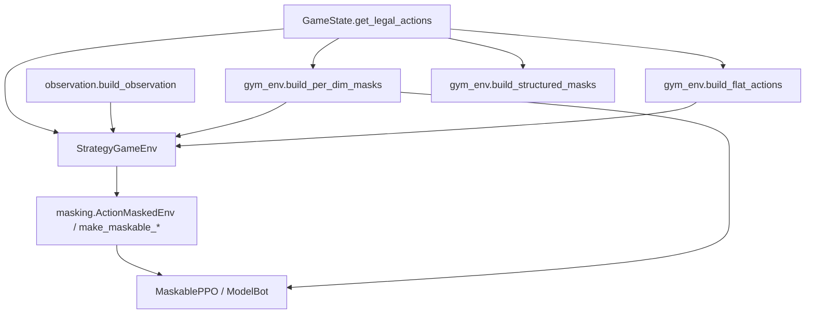

> 返回：[指南目录](README.md) · [上一章](05-first-train-ppo.md) · [下一章](07-rewards-and-shaping.md) · [索引](../AGENTS.md)

# 06 · 观察空间与动作掩码

智能体每一步要回答两个问题：

1. **我看到了什么？** → 观察（observation）
2. **我被允许做什么？** → 动作掩码（action mask）

本章把 `observation.py`、`gym_env` 掩码、`masking.py` 串成一条故事线。

| 文档 | 用途 |
|------|------|
| [`../algorithms/action-masking.md`](../algorithms/action-masking.md) | 掩码算法卡片 |
| [`../source-analysis/rl-gym-env.md`](../source-analysis/rl-gym-env.md) | Env / 观察 / 掩码源码导读 |
| `benchmarks/ppo_vs_simplebot/FLAT_DISCRETE_DESIGN.md` | flat 设计笔记（可选） |

---

## 1. 智能体看到什么

观察 **不是** 屏幕截图，而是结构化 `dict`（第 04 章已见 API）。

### 1.1 `grid` — 地形与建筑归属

形状：`(H, W, 11)`，`float32`。

| 通道 | 含义 |
|------|------|
| 0–7 | 地形类型 one-hot（草地/水/山/林/路/建筑/HQ/塔 等） |
| 8 | 是否己方拥有的建筑格 |
| 9 | 是否敌方拥有 |
| 10 | 建筑 HP 比例 \([0,1]\) |

中立建筑：己/敌通道都为 0。

### 1.2 `units` — 谁站在哪

形状：`(H, W, 16)`。

| 通道 | 含义 |
|------|------|
| 0–7 | 兵种 one-hot（`ALL_UNIT_TYPES` 顺序） |
| 8 / 9 | 己方 / 敌方单位 |
| 10 | **own_exhausted**：己方单位本回合是否已无行动可做 |
| 11 | 单位 HP 比例 |
| 12–15 | 麻痹、加速、防 Buff、攻 Buff（归一化） |

空格子在兵种通道上全 0。

### 1.3 `global_features` — 五维摘要

形状：`(5,)`，各自经 `tanh(x / scale)` 压到可比较的范围：

| 索引 | 原始语义 |
|------|----------|
| 0 | 己方金币 |
| 1 | 敌方金币 |
| 2 | 回合数 |
| 3 | 己方单位数 |
| 4 | 敌方单位数 |

**刻意不包含** `current_player`：智能体只在自己的回合被 `step`，该位恒等于视角玩家，没有信息量。

### 1.4 视角：agent-relative

编码时永远把 `perspective_player` 当作「己方」。
自对弈换边时，同一物理局面会翻成相同的 self/opp 通道布局，**策略不用为「我是 P1 还是 P2」各学一套**。

### 1.5 战争迷雾（可选）

`fog_of_war=True` 时多一个 `visibility` 平面。入门训练建议先关雾，降低 POMDP 难度。

### 1.6 掩码 **不是** 观察的一部分

- 策略的 Dict obs **不含** mask；
- MaskablePPO 通过 `env.action_masks()` **另通道**取掩码；
- 设计理由：掩码是约束，不是「世界状态」本身（见 `observation.py` 模块文档）。

---

## 2. 非法动作问题（为什么必须做掩码）

### 2.1 组合爆炸

六维动作：

\[
|\mathcal{A}| \approx 10 \times 8 \times W \times H \times W \times H
\]

对 \(8\times 8\) 图粗算：\(10\times 8\times 8^4 = 327680\) 量级，且随地图变大。

其中合法的往往只有 **几十到几百**（有时更少）。

### 2.2 只靠「非法 −10」会发生什么

早期策略近似均匀乱采 → 几乎每步非法 → 梯度被惩罚淹没 → **学不会移动与攻击的结构**。
项目实践：**强烈依赖动作掩码**。

### 2.3 合法动作从哪来

```text
GameState.get_legal_actions(player)
    → 结构化 dict（create_unit / move / attack / seize / end_turn / ...）
    → build_per_dim_masks 或 build_flat_actions / build_structured_masks
    → env.action_masks()
```

规则引擎是唯一真相；掩码是它的 **布尔投影**。

---

## 3. Per-dimension 掩码 vs `flat_discrete`

### 3.1 Per-dimension（配合 MultiDiscrete）

为六个维度各做一个 bool 向量：哪些 `action_type` 合法、哪些 `from_x` 出现过……

**优点**：实现直接、与 MultiDiscrete 对齐。
**缺点：过近似**——

> 维 A 允许坐标 \(x_1\)，维 B 允许 \(x_2\)，但「从 \(x_1\) 到 \(x_2\) 的移动」仍可能非法。

笛卡尔积 ⊇ 真合法集 → 仍可能采到 env 拒绝的动作 → 仍吃 `invalid_action`（概率已低很多）。

### 3.2 `flat_discrete`

- 先列出最多 `max_flat_actions`（默认常 512）个 **完整合法微动作**；
- 动作空间：`Discrete(max_flat_actions)`；
- 掩码：前 \(K\) 个 True，其余 False —— **精确到候选**；
- 超长时截断策略会优先保留占领与 `end_turn` 等关键类型（实现细节见源码）。

Bootstrap 等生产配置常选 **flat_discrete**，就是为了消灭过近似。

### 3.3 结构化 / 自回归（预习）

采样顺序：`atype → source → unit_type → target`，每步用条件掩码。
Feudal 的 AR 头走这条路；见 [`../algorithms/feudal-rl.md`](../algorithms/feudal-rl.md)。

### 3.4 对照表

| 模式 | 空间 | 掩码精度 | 典型用途 |
|------|------|----------|----------|
| `multi_discrete` + per-dim | 6 维 | 过近似 | CLI 默认、简单实验 |
| `flat_discrete` | 1 维离散 | 精确（截断内） | 课程 / 认真 PPO |
| Structured + AR | 顺序决策 | 条件精确 | Feudal 等 |

---

## 4. 代码路径地图



| 文件 | 职责 |
|------|------|
| `reinforcetactics/rl/observation.py` | **唯一**观察编码契约 |
| `reinforcetactics/rl/gym_env.py` | `StrategyGameEnv`、`action_masks`、`build_*_masks`、`build_flat_actions` |
| `reinforcetactics/rl/masking.py` | 与 sb3-contrib 对接的 Wrapper / 向量环境工厂、`validate_action_mask` |

GUI / 锦标赛里的 `ModelBot` 会 **复用** 同一套 `build_per_dim_masks` / flat 构建，保证训练与部署一致。

---

## 5. `end_turn` 与「永不结束回合」

- 在掩码中，`end_turn` **几乎总是合法**（保证总能交棒）。
- 若策略学到「一直移动刷塑形、从不 end_turn」：
  - 环境有 `max_actions_per_turn`：达限后掩码 **只留 end_turn**；
  - `turn_penalty` 默认 **0**（乱加会导致奇怪吸引子，见第 07 章）。

这是规则层 + 掩码层的双重保险。

---

## 6. 带掩码的概率（复习公式）

未掩码 logits \(z_i\)，掩码 \(m_i\in\{0,1\}\)：

\[
\pi(a=i \mid o) = \frac{m_i\, e^{z_i}}{\sum_j m_j\, e^{z_j}}
\]

玩具例：\(z=(0,1,2)\)，\(m=(1,0,1)\) → 中间动作概率为 0，概率只在 0 与 2 上分配。
完整推导见 [`../algorithms/action-masking.md`](../algorithms/action-masking.md)。

---

## 7. 动手：合法动作数量与掩码

```powershell
python -c @"
from reinforcetactics.rl.gym_env import StrategyGameEnv

env = StrategyGameEnv(map_file='maps/1v1/beginner.csv', opponent='noop')
obs, info = env.reset(seed=0)
print('obs shapes:', {k: getattr(v, 'shape', None) for k, v in obs.items()})

masks = env.action_masks()
if isinstance(masks, (list, tuple)):
    print('mode: multi_discrete per-dim')
    for i, m in enumerate(masks):
        print(f'  dim {i}: shape={m.shape}, true={int(m.sum())}')
else:
    print('mode: flat, legal=', int(masks.sum()), '/', masks.shape[0])

# 领域层合法动作规模
legal = env.game_state.get_legal_actions(env.agent_player)
counts = {k: (len(v) if isinstance(v, list) else v) for k, v in legal.items()}
print('legal actions summary:', counts)
env.close()
"@
```

尝试在 `reset` 后手动 `end_turn` 再看 P2 侧（若你改 `agent_player` 或读对手回合后状态）金币变化——与第 02 章经济故事互相印证。

---

## 8. 和训练算法的衔接

| 训练入口 | 掩码情况（概括） |
|----------|------------------|
| `main.py --mode train` 简单 PPO | 环境仍可提供 mask，但 **普通 PPO 默认不用** |
| `examples/train_with_action_masking.py` | 演示 MaskablePPO |
| Bootstrap YAML | 常 `flat_discrete` + masking |
| ModelBot 推理 | 必须用与训练一致的 mask 逻辑 |

**训练时用了 mask、部署时忘了 mask** → 行为分布错位，胜率断崖。保持同一 `build_*` 路径。

---

## 9. 常见误解

1. **「有 per-dim mask 就永远不会 invalid」** — 否，仍有过近似泄漏。
2. **「flat 截断 max_flat_actions 无影响」** — 合法动作极多时会丢动作；需看诊断。
3. **「把 mask 拼进 obs 就行」** — 本项目选择 API 分离；乱拼需改网络。
4. **「观察里的 exhausted 等于 mask」** — exhausted 帮助价值网络理解「谁动过」；mask 约束「下一步能选什么」。
5. **「换地图不用改网络」** — 空间尺寸变了 MultiDiscrete 的 W/H 会变；跨图课程常用 `pad_to_size` + flat。

---

## 10. 小结

- 观察：`grid` + `units` + `global_features`（+ 可选 visibility），agent-relative。
- 非法动作是默认状态；掩码是可学习的前提。
- Per-dim 快但不精确；flat 精确但有列表上限。
- 代码三角：`observation.py` · `gym_env.py` · `masking.py`。

下一章：奖励如何把「赢棋」翻译成逐步数字，以及如何避免杀敌刷分。

---

## 自测

1. 列出默认 Dict 观察的三个核心键，并各用一句话说它们描述什么。
2. 什么是 MultiDiscrete **过近似**？`flat_discrete` 如何缓解？
3. 为什么 `action_mask` 默认不放进观察字典，而要 `action_masks()` 另取？

<details>
<summary>参考答案</summary>

1. `grid`：地形与建筑归属/HP；`units`：单位类型、归属、状态；`global_features`：金币/回合/单位数摘要。
2. 各维分别合法的笛卡尔积仍可能整体非法；flat 枚举完整合法动作再掩码。
3. 掩码是动作约束而非世界状态；MaskablePPO 有专门接口；避免与状态特征耦合。

</details>

---

**上一章**：[05 · 第一次训练](05-first-train-ppo.md) · **下一章**：[07 · 奖励与塑形](07-rewards-and-shaping.md)
