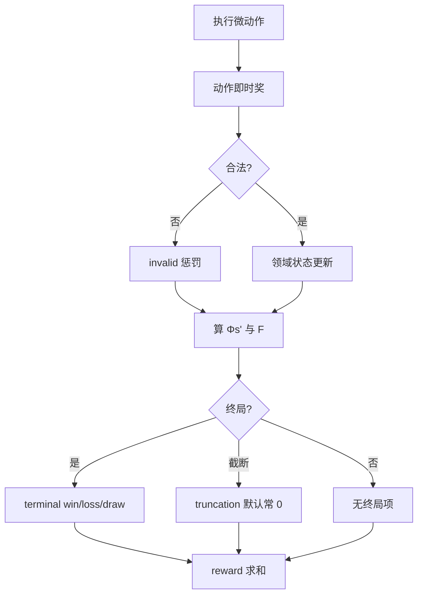
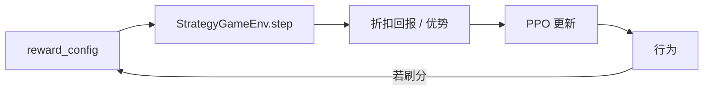

> 返回：[指南目录](README.md) · [上一章](06-observation-action-mask.md) · [下一章](08-curriculum-bootstrap.md) · [索引](../AGENTS.md)

# 07 · 奖励与塑形（Part B 收官）

策略优化的是 **期望回报**。回报由逐步奖励相加（折扣）而成——所以：

> **你写的 `reward_config`，就是在规定「什么叫好棋」。**

写错时，智能体会认真学会错误目标：杀敌刷分、永不攻城、拖到和棋……
本章用白话讲清稀疏/稠密、势能塑形，以及本项目踩过的 **kill-farm** 坑。

| 文档 | 用途 |
|------|------|
| [`../algorithms/reward-shaping.md`](../algorithms/reward-shaping.md) | 算法卡片（必读对照） |
| [`../source-analysis/rl-gym-env.md`](../source-analysis/rl-gym-env.md) | `_calculate_reward` / `_compute_potential` |
| `docs/zh/bootstrap_lessons_learned.md` | 作者实验日记（杀敌吸引子等） |

Part B 到此结束；Part C 从课程 Bootstrap 起（见 [指南目录](README.md)）。

---

## 1. 稀疏终局 vs 稠密塑形

### 1.1 稀疏（Sparse）

只在终局给大分：

| 事件 | 默认量级（代码默认，可改） |
|------|----------------------------|
| 赢 | \(+1000\) |
| 输 | \(-1000\) |
| 和 | \(-200\) 量级 |

**优点**：目标干净——真正要的是赢。
**缺点**：一局成百上千 env 步，中间几乎全 0 → 极难冷启动（第 03 章信用分配）。

### 1.2 稠密（Dense）

中途也给分：击杀、造成伤害、占领进度、造兵……

**优点**：每步都有学习信号。
**缺点**：智能体可能优化「中途分」而不是胜利 —— **目标错位（reward hacking）**。

### 1.3 本环境一步奖励拆什么

`info["reward_breakdown"]` 一类字段（实现以源码为准）概念上包括：

| 分量 | 含义 |
|------|------|
| `action` | 本微动作即时奖（杀、占、造…） |
| `shaping_delta` | 势能塑形 \(F=\gamma\Phi(s')-\Phi(s)\) |
| `invalid_penalty` | 非法动作 |
| `terminal` | 终局 win/loss/draw/截断 |

总奖励是各部分之和（再经配置缩放）。



---

## 2. 故事时间：杀敌刷分吸引子（kill-farm）

### 2.1 发生了什么（白话）

项目实验中出现过一类策略：

1. 找到能稳定 **换血 / 击杀** 的打法；
2. 每杀一次拿 **击杀塑形分**；
3. **不去占 HQ**，甚至避免终结比赛；
4. 拖到回合上限和棋，塑形总分仍可能不错看；
5. 训练曲线「很好」，评估胜率却上不去，或只会对会陪你刷分的对手。

这叫 **kill-farm 吸引子**：局部最优，奖励函数的锅，不是「PPO 坏了」。

### 2.2 为什么会被学到

粗算（数字仅为直觉，非某次 run 原样）：

- 每步期望击杀塑形 \(+0.5\)，磨 100 步 → \(+50\)
- 终局赢 \(+10\)（若配置把终端缩小了）或和棋 \(-2\)
- 若 **杀分累计 > 赢棋路径的期望**，理性智能体（在优化回报的意义下）会选刷杀

### 2.3 项目里的对策方向

默认与文档中反复强调的旋钮：

| 方向 | 做法 |
|------|------|
| 抬高真正目标 | 提高 `capture` / `seize_progress` / 终局 `win` 相对 `kill` 的比重 |
| 压低刷分 | 减小 `kill`、控制 `damage_scale` |
| 惩罚拖局 | `draw` 为负；可选 `win_speed_bonus` 鼓励速胜 |
| 互殴零和 | `damage_taken_scale` 使挨打也扣分 |
| 慎用回合罚 | **`turn_penalty` 默认 0**，乱加会导致「疯狂 end_turn」或相反极端 |
| 终局势能清零 | 真终局时 \(\Phi=0\) 处理，贴近理论条件 |

细节与键名表：[`../algorithms/reward-shaping.md`](../algorithms/reward-shaping.md)。

---

## 3. 势能塑形（Potential-based shaping）

### 3.1 想法

定义「局面有多好」的势能 \(\Phi(s)\)（只依赖状态，不依赖动作）。
每步附加：

\[
F(s, s') = \gamma\,\Phi(s') - \Phi(s)
\]

| 符号 | 含义 |
|------|------|
| \(\Phi(s)\) | 状态势能 |
| \(\gamma\) | 与 PPO **相同**的折扣（env 构造参数 `gamma`） |
| \(F\) | 加到即时奖励上的塑形项 |
| \(s'\) | 动作后的下一状态 |

经典结果（Ng et al., 1999）：在合适条件下（含终局势能处理），**不改变最优策略**，只改变学习速度与中间信号。

### 3.2 本项目 \(\Phi\) 的组成（示意）

\[
\Phi(s) \approx w_{\mathrm{inc}}\Delta_{\mathrm{income}} + w_{\mathrm{unit}}\Delta_{\mathrm{units}} + w_{\mathrm{str}}\Delta_{\mathrm{structures}}
\]

权重来自 `reward_config` 的 `income_diff`、`unit_diff`、`structure_control` 等。
实现：`StrategyGameEnv._compute_potential`。

注意：这些键是 **势能源**，不是每步直接「收入差 × 权重」乱加（那会与 \(F\) 的理论形式不一致）。逐步看到的是 \(F\) 的差分效果。

### 3.3 数字玩具例

设 \(\gamma=0.99\)，只看单位差，\(w_{\mathrm{unit}}=0.3\)：

| 状态 | 己方单位 | 敌方 | \(\Delta\) | \(\Phi\) |
|------|----------|------|------------|----------|
| \(s\) | 2 | 2 | 0 | 0 |
| \(s'\) | 3 | 2 | 1 | 0.3 |

\[
F = 0.99\times 0.3 - 0 = 0.297
\]

若再丢单位回到均势 \(\Phi(s'')=0\)：

\[
F' = 0.99\times 0 - 0.3 = -0.3
\]

**直觉**：变好时发奖金，变差时把奖金 **吐回去**（近似），避免「曾经领先过」就永久躺在高分上。

### 3.4 终局时

真终局令 \(\Phi(\mathrm{terminal})=0\)，取与 \(-\Phi(s_{\mathrm{prev}})\) 相关的塑形收尾，使理论条件更干净。
实现见 `step` 终局分支与 `_calculate_reward`。

### 3.5 \(\gamma\) 必须一致

若 PPO 用 \(\gamma=0.99\)，而 env 塑形用 \(0.9\)，等于在用 **另一套** 对未来价值的折算 → 引入偏差。
构造环境时传入与训练器相同的 `gamma`。

---

## 4. `reward_config` 在哪里

### 4.1 代码默认

`StrategyGameEnv.__init__` 内 `default_reward_config`，再被调用方 `update`。

CLI 短训（`commands.train_mode`）示例性传入：

```python
reward_config={
    "win": 1000.0,
    "loss": -1000.0,
    "income_diff": args.reward_income,
    "unit_diff": args.reward_units,
    "structure_control": args.reward_structures,
    "invalid_action": -10.0,
}
```

### 4.2 YAML / 课程

Bootstrap 等配置常在 `env.reward_config` 下写缩小版终端奖（如 win=10），以稳住价值网络数值尺度。
阶段还可 `CurriculumStage.reward_config` 合并覆盖。

### 4.3 键的角色分类（记忆用）

| 类别 | 例 | 角色 |
|------|----|------|
| 终局 | `win` `loss` `draw` `win_speed_bonus` `truncation` | 主目标 |
| 动作稠密 | `kill` `capture` `seize_progress` `create_unit` `damage_scale` | 战术路标 |
| 惩罚 | `invalid_action` `enemy_*_capture` `turn_penalty` | 约束 |
| 势能 | `income_diff` `unit_diff` `structure_control` | 进入 \(\Phi\) |

完整表与默认意图：[`../source-analysis/rl-gym-env.md`](../source-analysis/rl-gym-env.md) 中 `reward_config` 节。

---

## 5. 设计奖励时的检查清单

在你改任何权重前过一遍：

1. **真胜利路径的期望回报是否仍高于** 和棋刷分 / 无限换血？
2. `kill` 与 `capture` / `win` 的相对量级是否合理？
3. `draw` 是否足够负，避免「躺平磨分」？
4. `gamma` 训练与 env 是否一致？
5. 是否误开大 `turn_penalty`？
6. 评估时是否看 **胜率**，而不只看 `ep_rew_mean`？
7. 换对手后，曲线是否只是在 exploite 单一 Bot 漏洞？

---

## 6. 与评估、锦标赛的关系

奖励是训练信号；**发布结论靠评估**：

- `main.py --mode evaluate`
- `scripts/tournament.py` + Elo

同一奖励下可能过拟合 SimpleBot；换 Medium/自对弈池才知道泛化。
见 [`../algorithms/evaluation-and-elo.md`](../algorithms/evaluation-and-elo.md)。

---

## 7. 和前几章的拼图

| 章 | 拼图块 |
|----|--------|
| 02 | 微动作 / 回合；终局条件 |
| 03 | \(G_t\)、\(\gamma\)、优势——奖励进入这些公式 |
| 04–05 | Env 返回的 `reward`；SB3 用它学 |
| 06 | 非法动作惩罚 vs 掩码（掩码优先） |
| **07** | **如何定义 reward** |



---

## 8. 常见误解

1. **「奖励越高说明模型越强」** — 可能在刷塑形；要看胜负。
2. **「多加中间奖励一定更好」** — 常更差（目标错位）。
3. **「势能塑形可以随便加与状态无关的奖金」** — 破坏策略不变性；应用 \(F=\gamma\Phi(s')-\Phi(s)\) 形式。
4. **「和棋给 0 就行」** — 相对刷分路径，0 可能仍太甜；项目默认和棋为负。
5. **「截断 truncated 应等于输」** — 未必；乱加 truncation 惩罚会扭曲长局价值。默认截断项常为 0，避免与 SB3 逻辑双计。

---

## 9. Part B 毕业标准

你可以：

- [ ] 解释稀疏 vs 稠密
- [ ] 手算一个 \(F=\gamma\Phi'-\Phi\) 小例子
- [ ] 讲述 kill-farm 为何出现、如何从权重上压制
- [ ] 指出 `reward_config` 与 `_compute_potential` 的代码位置
- [ ] 说清：改奖励后必须用 **评估/锦标赛** 验收

若全部满足，Part A+B 主线完成。
下一步按时间选：

| 目标 | 去向 |
|------|------|
| 课程打怪 | [指南目录 Part C · 08](README.md) · [`../algorithms/curriculum-bootstrap.md`](../algorithms/curriculum-bootstrap.md) |
| 巩固算法 | [`../algorithms/overview.md`](../algorithms/overview.md) |
| 读实现 | [`../source-analysis/rl-gym-env.md`](../source-analysis/rl-gym-env.md) |
| 再训长一点 | 第 05 章加长 `timesteps` + 第 06 章掩码示例 |

---

## 自测

1. 用两句话对比稀疏终局奖励与稠密塑形的利弊。
2. 设 \(\Phi(s)=1.0\)，\(\Phi(s')=1.5\)，\(\gamma=0.99\)，求 \(F\)。若下一步回到 \(\Phi=1.0\)，新的 \(F'\) 是多少？
3. 什么是 kill-farm？举出至少两条本项目用来缓解它的配置方向。

<details>
<summary>参考答案</summary>

1. 稀疏目标清晰但难学；稠密好学但易目标错位。
2. \(F=0.99\times1.5 - 1.0 = 0.485\)；\(F'=0.99\times1.0 - 1.5 = -0.51\)。
3. 通过反复击杀刷塑形、回避真正胜利条件的策略。缓解：压低 kill、抬高 capture/win、draw 为负、伤害近似零和等。

</details>

---

**上一章**：[06 · 观察与动作掩码](06-observation-action-mask.md) · **下一章**：[08 · 课程 Bootstrap](08-curriculum-bootstrap.md) · **目录**：[指南目录](README.md)

> Part B 完。你已具备继续 Part C（课程 / BC / 自对弈…）的概念与实操地基。
