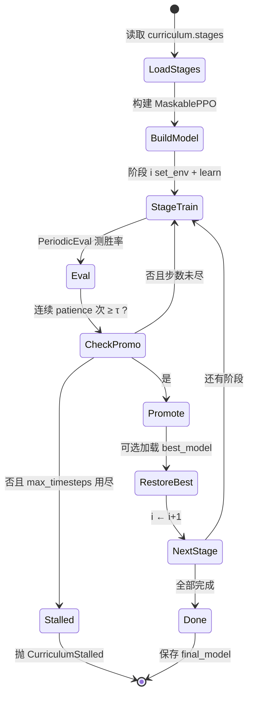

> 返回：[指南目录](README.md) · [上一章](07-rewards-and-shaping.md) · [下一章](09-behavior-cloning.md) · [索引](../AGENTS.md)

# 第 08 章：课程学习与 Bootstrap 冷启动

---

## 1. 本章目标

读完本章并完成短跑命令后，你应能：

1. 用自己的话解释：**为什么**不能一上来就让随机策略打最强对手、最大地图。
2. 说出课程里的关键旋钮：阶段（stage）、晋级胜率、耐心（patience）、阶段预算（max_timesteps）、MixedBot 难度桥。
3. 看懂一张「阶段状态机」图，并对应到 `run_curriculum` 的行为。
4. 理解作者踩过的坑（全确定性 noop 老师、和棋吸引子、评估噪声、阶段间策略漂移）以及「后来怎么改」。
5. 知道配置与代码落在哪：`bootstrap.yaml`、`rl/bootstrap.py`、`train_bootstrap.py`。

前置：建议已读 [05 首次 PPO](05-first-train-ppo.md)、[07 奖励](07-rewards-and-shaping.md)。速查卡见 [`../algorithms/curriculum-bootstrap.md`](../algorithms/curriculum-bootstrap.md)。

---

## 2. 生活 / 游戏类比

想象你学一款新的回合制策略游戏：

| 现实 | 课程 Bootstrap |
|------|----------------|
| 先在教程图里学会「造兵、走路、结束回合」 | 小地图 + 弱对手 |
| 通过再开下一关，不过关就重练 | 晋级胜率 + patience |
| 关卡有时间限制，超时判失败 | `max_timesteps` 用尽 → `CurriculumStalled` |
| 有时对手一半时间像新手、一半像老手 | **MixedBot** 按局混合 easy/hard |
| 别只找「站着不动」的陪练——太无聊，学不到应变 | 不要只用全确定的 NoopBot 当唯一老师 |

**Bootstrap（冷启动）**：策略一开始几乎在乱按键，回报几乎全是「输」。若不降低难度、不塑形、不控制地图规模，梯度会「没信号」——像在全黑房间里学走路。课程就是**有意识地排关卡表**，把「能学会」的台阶搭好。

---

## 3. 基本原理（零基础）

### 3.1 冷启动为什么会「死」

PPO 等 on-policy 方法靠「多条轨迹回报的差异」来更新：

- 若每条轨迹的回报几乎一样（全输、全平、全同一剧本）→ 优势（advantage）≈ 0 → 策略几乎不更新 → 继续产出同样烂数据 → **死策略陷阱**。
- 若地图突然变大、价值函数完全错位 → 更新会乱晃，策略可能缩回安全动作（例如狂点「结束回合」）。

所以冷启动要同时管三件事：**对手方差、地图难度、奖励尺度**。

### 3.2 阶段（Stage）是什么

一个阶段通常是：

\[
\text{Stage} = (\text{地图},\;\text{对手类型},\;\text{晋级门槛},\;\text{耐心},\;\text{步数预算},\;\text{可选奖励/熵覆盖})
\]

训练循环：在当前阶段环境上 `learn` → 周期性评估胜率 → 决定是否晋级。

### 3.3 晋级、耐心、预算

| 概念 | 白话 | 配置名（示意） |
|------|------|----------------|
| **晋级胜率** \(\tau\) | 评估胜率要到多高才算「会了」 | `promotion_win_rate` |
| **耐心** \(p\) | 要连续多少次评估都达标（防一次运气） | `patience` |
| **阶段预算** \(T_{\max}\) | 本阶段最多再训多少 env 步 | `max_timesteps` |
| **可选最低训练步** | 没训够不许晋级（默认常 0） | `min_timesteps_before_promotion` |

评估胜率本身有噪声：真胜率 85%、只评 20 局时，偶然掉到 75% 并不稀奇。**patience ≥ 2** 就是为了这一点。

### 3.4 MixedBot：难度桥

直接从 SimpleBot 跳到 MediumBot 可能太陡。`MixedBot` 在**整局开始时**按概率选 easy 或 hard（局中不切换）：

- 例：`easy=simple`，`hard=medium`，`p_hard=0.5` → 一半对局像 Simple，一半像 Medium。
- 策略被迫同时应付两种节奏，比「突然换一张脸」平滑。

### 3.5 阶段间「带走峰值，别带走漂移」

同一阶段内，策略可能先冲到高胜率，再被「和棋 + 塑形奖励」的吸引子慢慢带偏。若晋级时带走的是**阶段末内存里的模型**，下一关可能从「已经走形」的版本起步。

本项目默认：**晋级后加载本阶段 `best_model`**（`restore_best_checkpoint_between_stages`），把峰值交给下一阶段。

### 3.6 阶段状态机



对应实现：`reinforcetactics.rl.bootstrap.run_curriculum`；晋级逻辑在 `rl.callbacks.PromotionCallback`。

---

## 4. 公式、符号表与数字例

### 4.1 评估胜率

\[
\hat{w}_k = \frac{W_k}{n}
\]

| 符号 | 含义 |
|------|------|
| \(W_k\) | 第 \(k\) 次评估中的胜局数 |
| \(n\) | 每次评估局数（`eval.n_eval_episodes`） |
| \(\hat{w}_k\) | 第 \(k\) 次估计胜率 |

### 4.2 晋级条件（概念）

\[
\hat{w}_{t-p+1},\;\ldots,\;\hat{w}_t \;\ge\; \tau
\quad\text{（且若配置了最低步数，需已训满）}
\]

| 符号 | 含义 | 配置 |
|------|------|------|
| \(\tau\) | 阈值 | `promotion_win_rate` |
| \(p\) | 连续次数 | `patience` |
| \(T_{\max}\) | 阶段预算 | `max_timesteps` |

**玩具例**

- \(\tau=0.9\)，\(p=2\)，\(n=20\)
- 评估序列：0.85 → 0.95 → 0.92

第 2、3 次连续 ≥ 0.9 → **晋级**。
若 0.95 → 0.80 → 0.95：中间一次打断耐心，需重新连满 2 次。

### 4.3 评估噪声（为何要 patience）

真胜率 \(w=0.85\)，\(n=20\)：

\[
\mathrm{Var}(\hat{w})=\frac{w(1-w)}{n}\approx 0.0064,\quad
\mathrm{std}\approx 0.08
\]

单次评估掉到 ~0.75 并不罕见。阈值附近尤甚——作者文档里常写「阈值附近 ±15% 抖动」。

### 4.4 MixedBot

\[
\text{本局对手} =
\begin{cases}
\text{hard} & \text{概率 }p_{\text{hard}}\\
\text{easy} & \text{概率 }1-p_{\text{hard}}
\end{cases}
\]

例：`p_hard=0.5` 时，长期期望难度在 easy/hard 中间，但**每局内部**仍是单一脚本 Bot，便于策略连贯。

---

## 5. 为什么本项目选择它 + 优势

| 动机 | 说明 |
|------|------|
| 动作空间大、胜利稀疏 | 纯随机很难「碰巧」走出造兵—行军—占 HQ 长序列 |
| 脚本 Bot 阶梯现成 | noop / random / simple / mixed / medium / advanced 可当活靶 |
| 地图可从小到大 | starter → beginner → skirmish… 控制价值函数迁移难度 |
| 与 MaskablePPO 主线一致 | 课程只是编排环境与晋级，不换算法全家桶 |
| 失败要大声 | `CurriculumStalled` 带历史与 best checkpoint，避免「训满步数假装成功」 |

**相对「一阶段训到底」的优势**：可诊断（卡在哪一关一目了然）、可复现实验（改某一 stage 的 `ent_coef` / 奖励）、可与 BC 热启动拼接（先模仿再爬阶梯）。

更短的算法卡片：[`../algorithms/curriculum-bootstrap.md`](../algorithms/curriculum-bootstrap.md)。
管线源码导读：[`../source-analysis/rl-training-pipelines.md`](../source-analysis/rl-training-pipelines.md)。

---

## 6. 执行时可能遇到的问题

| 现象 | 可能原因 | 处理方向 |
|------|----------|----------|
| 一阶段永远 0% 胜率 | 对手过强 / 奖励无分化 / 策略锁死 | 降对手；查 `std_reward`；查动作直方图 |
| `std_reward = 0` 且 W/L/D 全相同 | 确定性对手 + 确定性评估 → 死剧本 | 换随机对手；勿只靠抬 `ent_coef` |
| 小图 100% 后大图崩溃 | 价值函数错位 | 小图 patience 别过大；大图首阶段抬熵 |
| 阈值附近反复晋级失败 | 评估噪声 + 策略漂移 | 加大 `n_eval_episodes`；恢复 best；勿盲目加 `min_timesteps` |
| `CurriculumStalled` | 预算耗尽未连续达标 | 读异常信息与 stage 目录下 eval；别静默接下阶段 |
| 全胜但只会造一种兵 | 单位性价比吸引子 | 看 `units_built`；调平衡而非只拧课程 |
| 大量和棋 | 超时 / max_steps 截断 / 不敢决战 | 看 `end_reason`；调 `max_turns`/`max_steps`/奖励 |

---

## 7. 作者 / 项目训练中的困难与解决（通俗改写）

以下主题来自 `docs/bootstrap_lessons_learned.md` 等实验日记，**用程序员能懂的故事讲**，不堆 jargon。

### 7.1 不要用「完全不动」的对手当唯一老师

**想法**：先让对手 Noop（每回合直接结束），智能体可以安心练「走路、占点」。
**现实**：对手从不扰动局面 → 几乎每局同一条轨迹 → 回报方差为 0 → PPO 优势为 0 → 更新停摆。评估时若再 `deterministic=True` 取 argmax，30 局奖励标准差经常是 **0.0**。

**教训**：「更弱」≠「更好学」。**带一点随机性的对手**往往才是冷启动友好的老师。纯 noop 阶段若要用，应先接行为克隆，而不是纯 RL 硬啃。

### 7.2 战斗塑形与地图几何要匹配

小地图上「占 HQ 加成远高于歼灭」可能合理；换到更大、更挤的 beginner 时，几何上很难走完占领流程，同一套奖励会变成**扭曲激励**（一直想去抢办不到的事）。
作者做法：按地图改终端奖励比例、降低不切实际的 `seize_progress` 等——**奖励要贴地图**，不是全局抄一份。

### 7.3 「和棋 + 塑形」吸引子

有些阶段会出现：策略学会赚塑形分、拖到和棋，胜率从高位掉到 0 附近再抖。这叫**漂移吸引子**：不是「完全不会玩」，而是优化到了「不输不赢但塑形还行」的盆地。
应对思路：阶段间加载 **best** 而非末态；慎用「晋级前强制再训很多步」（有时会把峰值磨掉）；诊断时看 W/L/D，别只看 mean reward。

### 7.4 `max_timesteps` 是安全阀，不是建议值

阶段预算用尽仍未晋级 → **抛错失败**，而不是默默进下一关。这逼你正视「这一关没学会」，避免垃圾策略污染后续阶段。调参时：预算太短会误杀慢热；太长会浪费算力在已死的吸引子上。

### 7.5 评估噪声 + 阈值附近

真胜率就在门槛附近时，20～40 局评估会像抛硬币。作者用 **patience**（连续多次达标）而不是「第一次碰到阈值就晋级」（小地图有时反而用 patience=1 防止过拟合到死剧本）。
**实操**：阈值附近波动大时，先加评估局数，再动课程结构。

### 7.6 其它可记一笔的坑（扩展阅读）

- **奖励项静默漂移**：多写几个看起来合理的奖励项，可能单独就能让某一关再也稳不住——「复现实验」要对齐 reward 字典的每一个键。
- **平衡写在 constants 里**：曾导致 YAML 以为复现了，引擎数值其实变了；现已用 `engine_overrides` 把经济/兵种写进配置并快照。
- **单兵种统治**：若最便宜兵在 HP/$、Atk/$ 全赢，课程拧多少也可能 100% 单兵种——那是**平衡几何**问题，不是再加 patience 能解的。

原始长文：`docs/bootstrap_lessons_learned.md`、`docs/zh/bootstrap_lessons_learned.md`。

---

## 8. 代码与配置落点

| 组件 | 路径 |
|------|------|
| 课程主循环 | `reinforcetactics/rl/bootstrap.py` → `run_curriculum`、`CurriculumStalled`、`make_stage_env` |
| 阶段 / 课程配置类型 | `reinforcetactics/rl/config.py` → `CurriculumStage`、`CurriculumConfig` |
| 晋级与周期评估 | `reinforcetactics/rl/callbacks.py` → `PromotionCallback`、`PeriodicEvalCallback` |
| MixedBot | `reinforcetactics/game/bot.py`（经 env `opponent="mixed"` + `opponent_kwargs`） |
| 默认生产配置 | `configs/ppo/bootstrap.yaml` |
| 扫描 / 复现实验 | `configs/ppo/bootstrap_sweep/` |
| CLI 入口 | `scripts/train/train_bootstrap.py` |
| 笔记本镜像 | `notebooks/ppo_bootstrap.ipynb` |

**YAML 里你会看到的字段（概念）**：

```yaml
curriculum:
  restore_best_checkpoint_between_stages: true
  stages:
    - name: beginner_random
      map_file: maps/1v1/beginner.csv
      opponent: random
      promotion_win_rate: 0.9
      patience: 2
      max_timesteps: 500_000
      # ent_coef / reward_config / max_turns 等可按阶段覆盖
```

相关算法卡：[`../algorithms/curriculum-bootstrap.md`](../algorithms/curriculum-bootstrap.md) · [`../algorithms/ppo.md`](../algorithms/ppo.md)。
源码：[`../source-analysis/rl-training-pipelines.md`](../source-analysis/rl-training-pipelines.md) · [`../source-analysis/rl-gym-env.md`](../source-analysis/rl-gym-env.md)。

---

## 9. 实操命令

在仓库根目录、已激活 `reinforce-tactics` 环境的前提下。

### 9.1 短跑（优先）：冒烟式改配置覆盖

完整 `bootstrap.yaml` 可能是千万级步数。短跑请用 `--set` 砍预算、减并行、减评估局数：

```powershell
cd D:\Grok\project2\reinforce-tactics
conda activate reinforce-tactics

# 仅验证管线能启动：1 个环境、极短阶段预算（按你本机 YAML 键名微调）
python scripts/train/train_bootstrap.py `
  --config configs/ppo/bootstrap.yaml `
  --device cpu `
  --skip-plots --skip-videos `
  --sanity-episodes 0 `
  --output-dir benchmarks/bootstrap_smoke `
  --set env.n_envs=1 `
  --set env.use_subprocess=false
```

若默认课程阶段过多，可在实验 YAML 里只留 1～2 个 stage，或从 `configs/ppo/bootstrap_sweep/` 里挑小配置。目标是：**不报错跑完 / 或干净地 CurriculumStalled**，而不是刷胜率。

### 9.2 单测相关逻辑（更快）

```powershell
python -m pytest tests/test_bootstrap.py -q
```

### 9.3 选做：较长课程

```powershell
# 选做：接近生产配置的长训（GPU、数小时～数天）
python scripts/train/train_bootstrap.py `
  --config configs/ppo/bootstrap.yaml `
  --device cuda `
  --output-dir benchmarks/bootstrap_full
```

可选 `--build-bc` 在课程前做行为克隆热启动（见 [09 章](09-behavior-cloning.md)）。

---

## 10. 自测 3 题

1. **概念**
   为什么「对手完全不动（Noop）+ 确定性评估」时，PPO 可能比打随机对手**更难学**？用「回报方差 / 优势」说一句。

2. **计算**
   \(\tau=0.8\)，\(p=2\)。评估胜率序列为：0.75, 0.85, 0.82, 0.79, 0.90, 0.88。
   最早在第几次评估后可以晋级？若 `max_timesteps` 在第 4 次评估后用尽且从未连满 2 次，系统应怎样表现？

3. **工程**
   你打开某阶段目录，发现 `best_model.zip` 胜率高于阶段结束时的内存模型。下一阶段若**不** `restore_best_checkpoint_between_stages`，可能发生什么？MixedBot 在课程里扮演什么角色？

**简答提示**

1. 无状态扰动 → 轨迹/回报几乎常数 → 优势≈0 → 学不动；随机对手提供可学习的方差。
2. 在第 6 次评估后（0.90 与 0.88 连续 ≥0.8）。预算用尽应 **CurriculumStalled**，不要默默晋级。
3. 可能把已漂移的弱策略带进更难关；MixedBot 在 easy/hard 间按局抽样，作难度桥。

---

## 延伸阅读

- [`../algorithms/curriculum-bootstrap.md`](../algorithms/curriculum-bootstrap.md)
- [`../algorithms/reward-shaping.md`](../algorithms/reward-shaping.md)
- [`../source-analysis/rl-training-pipelines.md`](../source-analysis/rl-training-pipelines.md)
- `docs/bootstrap_lessons_learned.md` / `docs/zh/bootstrap_lessons_learned.md`
- 下一章：[09 行为克隆](09-behavior-cloning.md)
