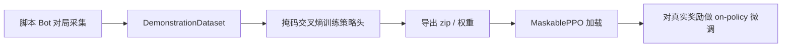

> 返回：[指南目录](README.md) · [上一章](08-curriculum-bootstrap.md) · [下一章](10-self-play.md) · [索引](../AGENTS.md)

# 第 09 章：行为克隆（Behavior Cloning, BC）

---

## 1. 本章目标

读完本章并完成短跑后，你应能：

1. 把行为克隆说成「**有标签的监督学习**」：输入局面，标签是专家动作。
2. 说明 **BC → PPO 微调** 流水线各自解决什么问题。
3. 解释为何「录了 N 局」不等于「有 N 份不同经验」——确定性 Bot 会产生**重复轨迹**。
4. 知道 loss / 准确率变好看时，对局胜率可能**完全不动**——必须用 Bot 阶梯做 sanity-eval。
5. 找到代码：`rl/imitation.py`、`examples/train_with_bc_warmstart.py`、相关 YAML。

前置：[08 课程](08-curriculum-bootstrap.md)、[05 首次 PPO](05-first-train-ppo.md)。速查：[`../algorithms/behavior-cloning.md`](../algorithms/behavior-cloning.md)。

---

## 2. 生活 / 游戏类比

| 类比 | BC / RL |
|------|---------|
| 先看大神录像，跟练招式 | BC：模仿 \((局面, 按键)\) |
| 再自己打天梯，按胜负调整 | PPO：用奖励微调 |
| 录像全是同一条「速通脚本」复制 100 遍 | 数据集虚假繁荣 → 只会背稿 |
| 考试只背标准答案句式，不会应变 | BC 过拟合演示分布（协变量偏移） |

老师傅（脚本 Bot）未必是世界冠军，但能演示「会造兵、会打架、会结束回合」。对冷启动来说，**比完全随机强太多**。

---

## 3. 基本原理（零基础）

### 3.1 和 RL 差在哪

| | 强化学习（如 PPO） | 行为克隆（BC） |
|--|-------------------|----------------|
| 信号来源 | 环境奖励（可能很稀疏） | 专家动作标签 |
| 优化目标 | 最大化回报 | 让 \(\pi(a\|o)\) 贴近专家 |
| 探索 | 必须自己试错 | 不依赖探索 |
| 上限 | 理论上可超专家 | 通常**不超过**演示质量 |

BC **不**需要你理解「为什么这一步好」，只需要大量「这一步专家怎么走」。

### 3.2 标准流水线：BC 热启动 → PPO



1. **采集**：专家（Simple/Medium/Advanced 等）在环境里打，记录观测、动作、合法动作掩码。
2. **BC**：把策略网络当分类器训练；本项目默认常**冻结或不训 value 头**，留给 PPO 学价值。
3. **导出**：得到可被 SB3 / MaskablePPO 加载的 warm-start。
4. **PPO 微调**：在真实奖励下继续学，纠正「只会模仿、不会应变」的部分。

### 3.3 掩码与类别不平衡

策略游戏大量非法动作。BC 损失应只在**合法动作**上计算（与 MaskablePPO 一致）。
演示里 **`end_turn` 往往占绝大多数**——若不加权，网络会变成「结束回合复读机」。项目用 `end_turn_weight`（可自动按频次平衡）压低/抬高这类样本的梯度贡献。

### 3.4 数据集质量 > 数据集条数

若引擎与 Bot **完全确定**，同一开局会走出**完全相同**的轨迹。你录 50 局，磁盘上有 50 段数据，信息量却可能 ≈ **1 条**。网络在背三条固定剧本，而不是学分布。

缓解：

- 对局中加入随机性（随机对手、地图、种子）；
- 开启 `stochastic_tiebreak`：Bot 在**同分决策**时随机打破平局，避免数据结构遍历顺序导致的假「先手必胜」；
- 多场景 YAML（`bc_scenarios.yaml`）混合地图与对手。

### 3.5 训练指标 vs 游戏力

作者实验：把 `end_turn` 权重拧到很高，BC 的 loss、action_type 准确率明显变好，但对 SimpleBot 的 sanity-eval **字节级不变**。原因：你主要让网络在「专家本来就会 end_turn 的帧」上更准，**没有**改变其它关键状态下的 argmax 战术。

**铁律**：上 PPO 之前，用 `evaluate_bc_against_bot_ladder`（或等价对局评估）看胜率，不要只盯 TensorBoard 的 CE loss。

---

## 4. 公式、符号表与数字例

### 4.1 基本目标

数据集 \(\mathcal{D}=\{(o_i,a_i)\}\)：

\[
L_{\text{BC}}(\theta) = -\mathbb{E}_{(o,a)\sim\mathcal{D}}\big[\log \pi_\theta(a\|o)\big]
\]

带样本权重：

\[
L = -\frac{1}{N}\sum_{i=1}^{N} w_i \log \pi_\theta(a_i\|o_i)
\]

| 符号 | 含义 |
|------|------|
| \(o_i\) | 观测（Dict：grid / units / global…） |
| \(a_i\) | 专家动作（flat 或 MultiDiscrete 各维） |
| \(\pi_\theta\) | 当前策略（掩码后的分布） |
| \(w_i\) | 样本权重（如 end_turn） |

### 4.2 end_turn 自动权重（直觉）

记 end_turn 条数 \(n_{\text{end}}\)，非 end \(n_{\text{non}}\)。常见自动设定：

\[
w_{\text{end}} = \frac{n_{\text{non}}}{\max(n_{\text{end}},1)}
\]

**数字例**：900 条 end，100 条 non → \(w_{\text{end}}\approx 0.11\)。
则 end 的总权重 \(900\times 0.11\approx 100\)，与 non 的总权重 100 同量级，避免被「结束回合」淹没。

（你也可在配置里写死较大的 `end_turn_weight` 做实验，但务必用对局指标验收。）

### 4.3 「有效样本量」

确定性对局：

\[
N_{\text{recorded}} = N,\qquad N_{\text{unique}} \approx 1
\]

开启随机平局 / 随机对手后 \(N_{\text{unique}}\) 上升，BC 才像在学**分布**。

### 4.4 从 BC 到 PPO 在优化什么

- BC：\(\max_\theta \sum \log \pi_\theta(a^{\text{expert}}\|o)\)
- PPO：\(\max_\theta \mathbb{E}[R]\)（带 clip 的策略梯度，见 [05](05-first-train-ppo.md)）

BC 把 \(\pi\) 拉到专家支持集附近，PPO 再在奖励下移动；若 BC 已把策略锁死在错误模式，PPO 需要足够熵与时间才能扳回来。

---

## 5. 为什么本项目选择它 + 优势

| 原因 | 说明 |
|------|------|
| 冷启动太难 | 大动作空间 + 稀疏胜负，纯 PPO 可能几十万步仍不会造兵 |
| 脚本 Bot 免费专家 | Medium/Advanced 会用技能、走位，演示比随机有结构 |
| 与 MaskablePPO 同构 | 同一套 obs/action/mask，权重可直接热启 |
| 可与课程拼接 | `train_bootstrap.py --build-bc` 或独立 `train_with_bc_warmstart.py` |

**优势**：样本效率高、实现直观（就是分类）、失败模式可用监督学习工具诊断（混淆矩阵、按动作类型准确率）。
**上限**：演示多差，克隆多差；分布外局面会崩；不能单靠 BC 打出自对弈上限。

速查：[`../algorithms/behavior-cloning.md`](../algorithms/behavior-cloning.md)。
源码：[`../source-analysis/rl-advanced-trainers.md`](../source-analysis/rl-advanced-trainers.md)。

---

## 6. 执行时可能遇到的问题

| 现象 | 可能原因 | 处理 |
|------|----------|------|
| BC loss 很低但不会玩 | 轨迹重复；只拟合了 end_turn | `stochastic_tiebreak`；多样场景；对局 eval |
| 微调一开始就崩 | 学习率过大；env 与采集时不一致 | 对齐 map/reward/max_actions；降 lr |
| eval 与训练表现天差地别 | 评估 env 漏传 `reward_config` 等 kwargs | **生产与 ad-hoc eval 同一套参数** |
| MultiDiscrete vs flat 对不上 | 动作空间类型不一致 | 采集与模型 `action_space_type` 统一 |
| 内存爆 | 演示过多、obs 过大 | 减 episodes；磁盘 dataset；减并行 |
| 「地图偏袒某一座位」 | 确定平局按数据结构顺序 | 随机 tiebreak 后再下结论 |

---

## 7. 作者 / 项目训练中的困难与解决（通俗改写）

材料来自 `docs/bootstrap_lessons_learned.md` 中 BC 相关段落，改为故事口吻。

### 7.1 确定性 Bot → 重复轨迹

**故事**：你让 AdvancedBot 打 AdvancedBot，录 60 局，满心以为数据很多。结果引擎与决策全确定，60 局是**同一条录像复制 60 次**。BC 把这条脚本背下来，换个小扰动就不会了。

**解决**：`stochastic_tiebreak`（同分随机）+ 多样化场景配置；心里用「唯一轨迹数」而不是「文件行数」衡量数据。

### 7.2 假的「座位不平衡」

曾在 skirmish 上看到确定对局几乎一边倒，像要「只从弱势座位录演示」。打开随机平局决胜后，胜率接近对称——原来是**平局决胜顺序**假象，不是地图结构。

### 7.3 评估环境少传一个参数，差点误判「BC 坏了」

有一次 ad-hoc 评估没把 `reward_config`、`max_actions_per_turn` 等与训练对齐，环境默认值差了数量级，安全网也关了。表现像 BC 完全无效，其实是**评测脚手架 bug**。
**教训**：评估 env 必须转发生产环境的每一个关键 kwargs。

### 7.4 更好看的 BC 曲线 ≠ 更会打架

`end_turn_weight` 拧大三倍，训练指标全面变好，对 SimpleBot 的胜率却完全一样。
**教训**：BC 的验收标准是 **Bot 阶梯对局**，不是 loss 排行榜。

---

## 8. 代码与配置落点

| 组件 | 路径 |
|------|------|
| 演示结构 / 采集 / BC 训练 | `reinforcetactics/rl/imitation.py` |
| 热启动组装 | `make_warm_started_model` 等（同模块 / `rl` 包导出） |
| 端到端示例 | `examples/train_with_bc_warmstart.py` |
| 独立构建脚本 | `scripts/build_bc_warmstart.py` |
| 场景配置 | `configs/imitation/bc_scenarios.yaml`、`bc_beginner_warmstart.yaml`、`bc_skirmish_warmstart.yaml` |
| 课程接入 | `scripts/train/train_bootstrap.py --build-bc` |
| 测试 | `tests/test_imitation.py` |

**关键 API 名（阅读代码时搜索）**：

- `collect_demonstrations` / `collect_demonstrations_multi`
- `DemonstrationDataset`
- `behavior_clone`
- `load_scenarios_from_yaml` / `DemonstrationScenario`
- `stochastic_tiebreak`
- `evaluate_bc_against_bot_ladder`（若在模块中提供）

算法卡：[`../algorithms/behavior-cloning.md`](../algorithms/behavior-cloning.md)。
源码：[`../source-analysis/rl-advanced-trainers.md`](../source-analysis/rl-advanced-trainers.md) · [`../source-analysis/rl-training-pipelines.md`](../source-analysis/rl-training-pipelines.md)。

---

## 9. 实操命令

### 9.1 短跑（优先）：示例脚本小规模 BC + 极短 PPO

```powershell
cd D:\Grok\project2\reinforce-tactics
conda activate reinforce-tactics

python examples/train_with_bc_warmstart.py `
  --demonstrator simple `
  --opponent simple `
  --n-episodes 5 `
  --bc-epochs 2 `
  --bc-batch-size 32 `
  --timesteps 2048 `
  --n-envs 1 `
  --save-path models/bc_smoke.zip `
  --seed 0
```

有场景 YAML 时：

```powershell
python examples/train_with_bc_warmstart.py `
  --scenarios configs/imitation/bc_beginner_warmstart.yaml `
  --n-episodes 5 `
  --bc-epochs 2 `
  --timesteps 2048 `
  --n-envs 1 `
  --save-path models/bc_smoke_scen.zip
```

（具体 CLI 以脚本 `--help` 为准；场景模式会忽略部分演示相关参数。）

### 9.2 单测

```powershell
python -m pytest tests/test_imitation.py -q
```

### 9.3 选做：更像样的 BC 再微调

```powershell
# 选做：更多演示与更长 PPO（耗时）
python examples/train_with_bc_warmstart.py `
  --demonstrator medium `
  --opponent medium `
  --n-episodes 100 `
  --bc-epochs 10 `
  --timesteps 200000 `
  --n-envs 4 `
  --save-path models/bc_warmstart_ppo.zip
```

课程前 BC（选做）：

```powershell
python scripts/train/train_bootstrap.py --build-bc --bc-epochs 10 --device cpu
```

---

## 10. 自测 3 题

1. **概念**
   用一句话区分 BC 与 PPO 的「监督信号」分别来自哪里。为什么 BC 通常超不过专家水平？

2. **数据**
   确定性 Bot 对打录了 \(N=50\) 局，为何有效信息可能 ≈1 条轨迹？写出一种项目内的缓解开关名称，并说明它在做什么。

3. **工程判断**
   BC 训练 loss 从 2.7 降到 1.2，full_action_acc 上升，但对 SimpleBot 胜率不变。下一步你应相信训练曲线还是对局评估？可能原因是什么？

**简答提示**

1. BC：专家动作标签；PPO：环境回报。BC 目标是拟合演示分布，演示错了就跟着错。
2. 全确定 → 重复轨迹；`stochastic_tiebreak` 在同分决策时引入随机，增加轨迹多样性。
3. 相信对局评估；权重可能只改善了 end_turn 帧，未改变关键战术状态的 argmax。

---

## 延伸阅读

- [`../algorithms/behavior-cloning.md`](../algorithms/behavior-cloning.md)
- [`../algorithms/curriculum-bootstrap.md`](../algorithms/curriculum-bootstrap.md)
- [`../source-analysis/rl-advanced-trainers.md`](../source-analysis/rl-advanced-trainers.md)
- 下一章：[10 自对弈](10-self-play.md)
