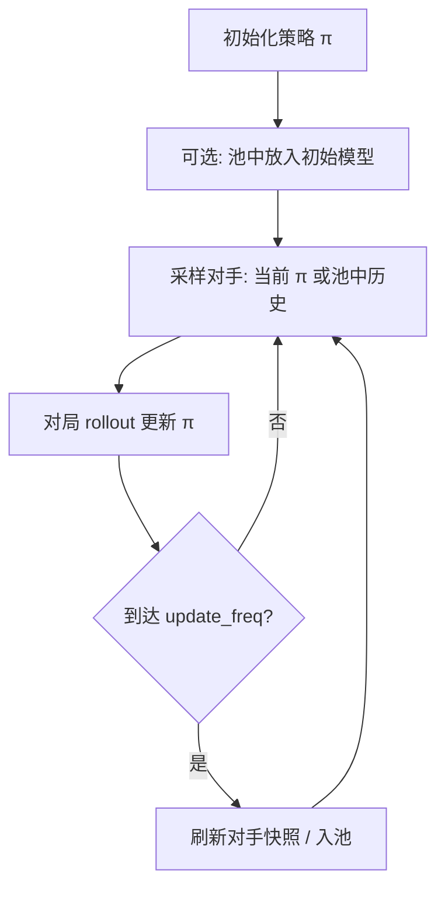

> 返回：[指南目录](README.md) · [上一章](09-behavior-cloning.md) · [下一章](11-feudal-rl.md) · [索引](../AGENTS.md)

# 第 10 章：自对弈（Self-Play）

---

## 1. 本章目标

读完本章并完成短跑后，你应能：

1. 解释：**没有更强人类/专家时**，为什么还要继续训练——对手可以是「昨天的自己」。
2. 说明**对手池（Opponent Pool）**与历史快照如何防止「只克制当前镜像」。
3. 指出环境如何通过 `set_self_play_opponent_factory` 绑定自对弈对手。
4. 知道代码与配置：`rl/self_play.py`、`train_self_play.py`、`configs/self_play/self_play.yaml`。
5. 区分「训练时自对弈」与「评估时仍用固定 Bot」的必要性。

前置：[05 PPO](05-first-train-ppo.md)、[08 课程](08-curriculum-bootstrap.md)。速查：[`../algorithms/self-play.md`](../algorithms/self-play.md)。

---

## 2. 生活 / 游戏类比

| 类比 | 自对弈 |
|------|--------|
| 围棋/电竞里「开小号镜像打自己」 | 当前策略当对手 |
| 天梯上保留旧版本幽灵，防止只会一种套路 | **对手池**采样历史 checkpoint |
| 剪刀石头布：A 克 B 克 C 克 A | **非传递性**——只打当前自己会绕圈 |
| 有时仍找木桩练习固定招式 | **mixed training**：一部分局打脚本 Bot |

专家演示（BC）和脚本 Bot 有**天花板**。打穿 Medium/Advanced 之后，继续涨分需要**自动变强的对手**——最便宜的来源就是自己的历史版本。

---

## 3. 基本原理（零基础）

### 3.1 核心思想

训练循环中：

1. 智能体用策略 \(\pi_{\text{train}}\) 操控一方；
2. 另一方由 \(\pi_{\text{opp}}\) 操控——可以是 \(\pi_{\text{train}}\) 的拷贝，或历史快照；
3. 用对局回报更新 \(\pi_{\text{train}}\)；
4. 定期把当前权重**快照进池**，供以后当对手。

这样对手强度大致跟着你长，避免「永远打固定 Bot 过拟合到三条死线」。

### 3.2 为何需要对手池，而不是永远镜像当前自己

只打「当前自己」时常见问题：

- **循环策略**：你学克制刚才的自己，对方一变，旧克制失效，像石头剪刀布转圈；
- **灾难性遗忘**：为赢现在的镜像，丢掉克制旧套路的能力；
- **评估虚高**：自己评自己，分数好看但不代表对 Bot/他人更强。

**对手池**保存多个历史策略，每局按规则采样一个当对手（均匀或偏近期）。这接近「虚构自对弈 / FSP 风格」直觉：对**历史混合分布**做最佳反应，而不是只盯一个点。

### 3.3 环境侧如何挂上对手

本项目的 `StrategyGameEnv` 在 `opponent="self"`（或等价自对弈模式）时，**不在内部写死**神经网络对手，而是：

1. 训练脚本注册工厂：`env.set_self_play_opponent_factory(factory)`；
2. `factory(game_state, opponent_player) -> Bot`（需实现 `take_turn()`）；
3. 每次 `reset` 时用工厂为对手座位绑定例如 `ModelBot`（加载某 zip/权重）。

向量环境则用 `make_self_play_env` / `make_self_play_vec_env` 批量包装。

### 3.4 其它实用旋钮

| 旋钮 | 含义 |
|------|------|
| `swap_players` | 随机坐玩家 1/2，减轻座位偏差 |
| `opponent_update_freq` | 多久刷新「当前对手」权重 |
| `pool_size` / `pool_strategy` | 池容量与采样（uniform / recent…） |
| `add_to_pool_freq` | 多久尝试把当前模型入池 |
| `min_win_rate_for_pool` | 太弱的快照不入池（可选门槛） |
| `mixed_training` + `bot_ratio` | 部分对局仍打脚本 Bot，锚定可解释基线 |

### 3.5 流程示意



**评估**：请用**固定**脚本 Bot 或固定历史快照，不要用「正在训练的自己」当唯一评测对手，否则曲线不可比。

---

## 4. 公式、符号表与数字例

### 4.1 均匀对手池

池中 \(M\) 个历史策略 \(\pi_1,\ldots,\pi_M\)：

\[
P(\text{对手}=\pi_i) = \frac{1}{M}
\]

| 符号 | 含义 | 配置 |
|------|------|------|
| \(M\) | 池大小 | `pool_size` |
| \(\pi_i\) | 第 \(i\) 份快照 | 磁盘 checkpoint |

### 4.2 偏近期采样（示意）

若权重与下标成正比 \(P(i)\propto i\)：

\[
P(M)=\frac{2}{M+1}
\]

例：\(M=10\) → 最新约占 \(2/11\approx 18\%\)，仍保留旧版本压力。

### 4.3 混合训练

`bot_ratio=0.3`：

\[
P(\text{脚本 Bot})=0.3,\quad P(\text{自对弈对手})=0.7
\]

**玩具例**：1000 局里约 300 局打 Simple/Medium，700 局打池中模型——既自我进化，又不忘「公开木桩」上的胜率含义。

### 4.4 非传递性（为何不能只有镜像）

若胜负关系成环：\(\pi_A\) 克 \(\pi_B\) 克 \(\pi_C\) 克 \(\pi_A\)。
只优化「克制当前自己」可能在环上打转；池强迫你对**多种风格**保持鲁棒。

---

## 5. 为什么本项目选择它 + 优势

| 动机 | 说明 |
|------|------|
| 脚本 Bot 有上限 | 打穿 Advanced 后需要新压力 |
| 人类演示贵 | 自对弈自动产对抗数据 |
| 与 PPO 主线兼容 | 仍是 MaskablePPO + Gym 环境，只换对手来源 |
| Feudal 等也可挂同一工厂 | `set_self_play_opponent_factory` 是环境级钩子 |

**优势**：可持续变强、减少对固定套路过拟合、实现成本低于再写更强规则 AI。
**代价**：训练更不稳定、评估更难设计、算力更高（对手也要推理）。

速查：[`../algorithms/self-play.md`](../algorithms/self-play.md)。
源码：[`../source-analysis/rl-training-pipelines.md`](../source-analysis/rl-training-pipelines.md) · [`../source-analysis/rl-gym-env.md`](../source-analysis/rl-gym-env.md)。

---

## 6. 执行时可能遇到的问题

| 现象 | 可能原因 | 处理 |
|------|----------|------|
| 训练 reward 升、对 Simple 胜率降 | 过拟合镜像风格 | 加大池；mixed_training；固定 Bot 评估 |
| 胜率在 50% 附近抖 | 双方同步变强 | 正常现象；看对固定锚的曲线 |
| 工厂未注册就 reset | 忘了 `set_self_play_opponent_factory` | 训练脚本启动时注册 |
| 座位一边倒 | 未 swap | `swap_players: true` |
| 池里全是弱模型 | 门槛过低 / 过早入池 | `min_win_rate_for_pool`；降低入池频率 |
| 太慢 | 对手也是神经网络 + 多环境 | 减 n_envs；减对手网络规模；CPU 线程 |

---

## 7. 作者 / 项目训练中的困难与解决（通俗改写）

### 7.1 「先爬 Bot 阶梯，再上自对弈」

项目主路径仍是：**课程 Bootstrap 打脚本阶梯**（必要时 BC 热启），自对弈是「打穿固定对手之后」的进阶，而不是零基础第一课。过早自对弈 = 两个菜鸟互啄，进步慢且难诊断。

### 7.2 评估锚必须固定

若评估对手也随训练更新，你无法知道「是真变强还是评测变水」。生产配置里常见：训练 `opponent=self`，评估仍对 `simple`/`medium` 或冻结快照。

### 7.3 与 BC、课程的组合

`configs/ppo/skirmish_bc_selfplay.yaml` 一类配置体现工程经验：**BC 给开局先验 → 自对弈给上限**。单独自对弈冷启动在大动作空间上仍然痛苦。

### 7.4 工厂模式统一多算法

PPO 自对弈、Feudal 自对弈都走「环境工厂绑定 ModelBot」——避免每个训练器复制一套换对手逻辑。改对手加载 bug 时只改一处。

---

## 8. 代码与配置落点

| 组件 | 路径 |
|------|------|
| 对手池 / SelfPlayEnv / 工厂辅助 | `reinforcetactics/rl/self_play.py` |
| 环境钩子 | `StrategyGameEnv.set_self_play_opponent_factory`（`rl/gym_env.py`） |
| 训练脚本 | `scripts/train/train_self_play.py` |
| 配置 | `configs/self_play/self_play.yaml` |
| BC+自对弈示例配置 | `configs/ppo/skirmish_bc_selfplay.yaml` |
| 配置类型 | `rl/config.SelfPlayConfig` |
| 测试 | `tests/test_self_play.py` |

**阅读入口建议**：

1. `OpponentPool`：如何 add / sample；
2. `SelfPlayEnv` 或 `make_self_play_vec_env`：如何包底层 env；
3. `train_self_play.py` 里 callback：何时 update 对手、何时入池；
4. `set_self_play_opponent_factory` 的调用点与 `factory` 签名。

算法卡：[`../algorithms/self-play.md`](../algorithms/self-play.md)。

---

## 9. 实操命令

### 9.1 短跑（优先）

```powershell
cd D:\Grok\project2\reinforce-tactics
conda activate reinforce-tactics

python scripts/train/train_self_play.py --help
```

按脚本支持的参数做冒烟（名称以 `--help` 为准），原则：**极少时间步、1 个环境、小池**：

```powershell
# 示例：短时间步冒烟（若脚本使用不同参数名，以 --help 为准）
python scripts/train/train_self_play.py `
  --config configs/self_play/self_play.yaml `
  --timesteps 4096 `
  --n-envs 1 `
  --use-opponent-pool `
  --pool-size 2
```

若 CLI 不暴露全部字段，可改一份临时 YAML：把 `total_timesteps` 改为几千，`n_envs: 1`，`use_subprocess: false`。

### 9.2 单测

```powershell
python -m pytest tests/test_self_play.py -q
```

### 9.3 选做：较长自对弈

```powershell
# 选做：接近配置默认的长训
python scripts/train/train_self_play.py --config configs/self_play/self_play.yaml
```

---

## 10. 自测 3 题

1. **概念**
   为什么「没有更强专家」时自对弈仍然有用？只打当前自己而不保留历史，主要风险是什么？

2. **计算**
   对手池 \(M=5\)，均匀采样。求抽到「最老快照」的概率。若改为 \(P(i)\propto i\)（\(i=1..5\)），最新快照概率是多少？

3. **工程**
   `set_self_play_opponent_factory` 的工厂应返回什么？为什么评估阶段仍建议使用固定 Bot？

**简答提示**

1. 对手强度可随自身提升自动生成；只打镜像易循环策略/遗忘。
2. 均匀：\(1/5=0.2\)；偏近期：\(P(5)=2/(5+1)=1/3\)。
3. 返回带 `take_turn()` 的 Bot（常为加载权重的 ModelBot）；固定评估才可比较跨时间实力。

---

## 延伸阅读

- [`../algorithms/self-play.md`](../algorithms/self-play.md)
- [`../algorithms/evaluation-and-elo.md`](../algorithms/evaluation-and-elo.md)
- [`../source-analysis/rl-gym-env.md`](../source-analysis/rl-gym-env.md)
- 下一章：[11 Feudal RL](11-feudal-rl.md)
