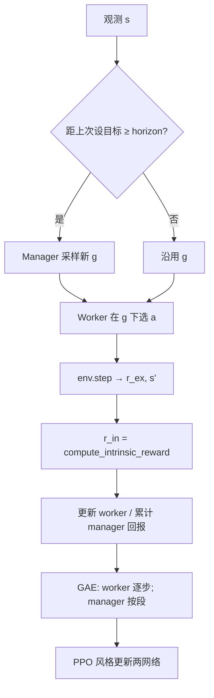

> 返回：[指南目录](README.md) · [上一章](10-self-play.md) · [下一章](12-alphazero-mcts.md) · [索引](../AGENTS.md)

# 第 11 章：Feudal RL（分层经理—工人）

---

## 1. 本章目标

读完本章并完成短跑后，你应能：

1. 用「经理下目标、工人做微操」解释 Feudal / 分层 RL。
2. 说出 **内在奖励（intrinsic）** 与 **外在奖励（extrinsic）** 如何一起塑造工人。
3. 理解为何长地平线策略游戏适合分层（信用分配）。
4. 用通俗语言复述项目 review 中的坑：奖励尺度、checkpoint 超参、AR worker 等。
5. 定位代码：`rl/feudal_rl.py`、`scripts/train/train_feudal_rl.py`、`configs/feudal/feudal_rl.yaml`。

前置：MDP/PPO 直觉（[02](02-game-mechanics-as-mdp.md)、[05](05-first-train-ppo.md)）。速查：[`../algorithms/feudal-rl.md`](../algorithms/feudal-rl.md)。

---

## 2. 生活 / 游戏类比

| 类比 | Feudal RL |
|------|-----------|
| RTS 里你点「攻击这里」，小兵自己寻路开火 | **经理**出目标，**工人**逐步执行 |
| 公司 KPI：季度目标 vs 每天打卡任务 | 高层稀疏目标 vs 底层逐步动作 |
| 工人既领公司工资，也因「靠近项目里程碑」拿奖金 | 外在环境奖 + **内在目标奖** |
| 经理每两周开一次会改方向，不是每分钟改 | `manager_horizon`：隔若干步才换目标 |

平坦 PPO 相当于「每一帧都要自己想战略 + 战术」。分层把问题拆开：高层学「现在该进攻/防守/占点/扩张」，底层学「在这个目标下点哪个格子、哪支兵」。

---

## 3. 基本原理（零基础）

### 3.1 两层决策

| 层 | 输出 | 更新频率 |
|----|------|----------|
| **Manager（经理）** | 目标 \(g=(\text{goal\_x}, \text{goal\_y}, \text{goal\_type})\) | 约每 \(H_m\) 个环境步 |
| **Worker（工人）** | 与环境相同的微动作（造/走/打/占/技能/结束回合…） | 每步 |

`goal_type` 在本项目中编码为：0 进攻、1 防守、2 占领、3 扩张（语义由训练与内在奖励塑造，不是写死的规则 AI）。

### 3.2 内在奖励是什么

环境给的仍是原来的 `reward`（外在）。此外，系统根据「工人有没有朝经理的目标靠拢」再算一笔 **intrinsic reward**，例如：

- 己方单位到目标格的曼哈顿距离越近越好（距离惩罚）；
- 站上目标格给奖励；
- 按目标类型加一点情境分（附近敌人、可占建筑等）。

工人看到的训练信号大致是「内在 + 缩放后的外在」的混合，由 `worker_reward_alpha`、`reward_scale` 等控制。

### 3.3 为什么长地平线需要分层

一局可能上百～上千环境步才分胜负。平坦策略要在极长链条上做**信用分配**：「50 步前的一次造兵是否导致了胜利？」很难。

分层后：

- 经理在**段（segment）**尺度上优化（一段 = 一个目标持续的若干 worker 步）；
- 工人在**短程**上优化「完成当前目标」——即使最终没赢，段内也可能有密集内在信号。

### 3.4 训练步骤（概念）



实现主类：`reinforcetactics.rl.feudal_rl.FeudalRLAgent`。

### 3.5 两种工人头：独立多头 vs 自回归（AR）

- **Legacy / 多独立头**：与 MultiDiscrete 各维类似，维间条件化弱，掩码有时偏近似。
- **Autoregressive（AR）worker**：像 AlphaStar 那样按阶段分解动作
  \(p(\text{类型})\,p(\text{源}\|\,)\,\ldots\)，并对每阶段使用结构化掩码，非法组合更少。

AR 更「正确」，也更吃实现与调试；项目提供 A/B 脚本 `scripts/ab_feudal_ar.py`。

### 3.6 与自对弈、锦标赛的关系

Feudal 可走 `opponent=self` + `set_self_play_opponent_factory`；checkpoint 为 `.pt`，`ModelBot` / 锦标赛发现逻辑需能加载 Feudal（见源码分析）。对初学者：先在固定 Bot 上把短训跑通，再开自对弈。

---

## 4. 公式、符号表与数字例

### 4.1 工人奖励混合（概念）

\[
r^{\text{w}}_t = \alpha\, r^{\text{in}}_t + (1-\alpha)\, c\, r^{\text{ex}}_t
\]

| 符号 | 含义 | 配置 |
|------|------|------|
| \(r^{\text{in}}\) | 内在（朝目标） | `compute_intrinsic_reward` |
| \(r^{\text{ex}}\) | 环境外在 | env `reward` |
| \(\alpha\) | 内在权重 | `worker_reward_alpha` |
| \(c\) | 外在缩放 | `reward_scale` |

终局若是 ±几千，而内在是 ±10 量级，**不缩放**会让价值网络只看见炸弹终局，内在信号被淹没，或 value loss 爆炸。

### 4.2 内在奖励结构（与代码一致的摘要）

对目标格 \((g_x,g_y)\) 与类型：

1. 无己方单位 → 较强负值（如 −10）；
2. \(d_{\min}=\min_i(|y_i-g_y|+|x_i-g_x|)\)，贡献 \(-0.1\,d_{\min}\)；
3. 单位站在目标格 → +5；
4. 按 type 追加（进攻附近敌人、防守加成、可占建筑、扩张兵力等）。

**玩具例**：目标 \((3,1)\)，type=占领；最近己方在 \((3,2)\)：

\[
d_{\min}=1,\quad r\approx -0.1
\]

下一步走上 \((3,1)\) 且该格可占：

\[
r \approx 0 + 5 + 4 = 9
\]

工人在短程内就能感到「朝目标走是对的」。

### 4.3 Manager 段 GAE（直觉）

段长 \(k_t\)（该目标持续了多少 worker 步）：

\[
\delta_t = R_t + \gamma^{k_t} V(s_{t+1})(1-d_t) - V(s_t)
\]

| 符号 | 含义 |
|------|------|
| \(R_t\) | 该段累计的经理侧回报 |
| \(\gamma^{k_t}\) | 跨过 \(k_t\) 底层步的折扣 |
| \(d_t\) | 终止标记 |

**数字**：\(\gamma=0.99\)，\(k=10\) → \(\gamma^{10}\approx 0.904\)。
意思是：经理不是每步打分，而是按「目标段落」打分。

### 4.4 Horizon

`manager_horizon=10`：大约每 10 个 env 步重选目标。
太短 → 高层噪声、工人来不及执行；太长 → 目标过时、战局已变。

---

## 5. 为什么本项目选择它 + 优势

| 动机 | 说明 |
|------|------|
| 对局长、胜利稀疏 | 分层缩短工人信用链条 |
| 战略/战术天然分层 | 占点/进攻 vs 具体走子 |
| 可与掩码、自对弈、ModelBot 集成 | 一等公民训练路径之一 |
| 可试验 AR 动作头 | 缓解大 MultiDiscrete 掩码近似 |

**优势**：可解释的「当前目标」、内在奖励提供稠密信号、架构清晰（双网络 + 段 GAE）。
**代价**：超参更多（horizon、α、reward_scale）、实现与调试重、相对 PPO 主路径**实验与社区验证更少**——把它当进阶选修，而不是唯一主线。

速查：[`../algorithms/feudal-rl.md`](../algorithms/feudal-rl.md)。
源码：[`../source-analysis/rl-advanced-trainers.md`](../source-analysis/rl-advanced-trainers.md)。
作者 review：`docs/feudal_rl_review.md`。

---

## 6. 执行时可能遇到的问题

| 现象 | 可能原因 | 处理 |
|------|----------|------|
| value_loss 爆炸 | 外在终局 ±5000 未缩放 | `reward_scale=0.001` 量级 |
| 工人不听经理 | α 过小/过大；内在未标定 | 看 `worker_intrinsic_mean` / `goal_reached_rate` |
| AR 无掩码警告 | env 缺 structured masks | 用支持结构化掩码的动作空间；或回退 legacy |
| checkpoint 加载失败 | 网格尺寸 / hyperparams 不匹配 | 同 map 尺寸；读 checkpoint 内 hyperparams |
| 只单环境很慢 | 未开 vec | `--n-envs > 1` 走 `collect_rollout_vec` |
| 与 SB3 zip 混淆 | Feudal 存 `.pt` | ModelBot 按扩展名分发 |

---

## 7. 作者 / 项目训练中的困难与解决（通俗改写）

以下来自 `docs/feudal_rl_review.md` 等，改成「发生了什么 → 怎么办」。

### 7.1 奖励尺度：价值网络被终局「炸飞」

**现象**：终端奖励动辄 ±几千，value loss 暴涨，策略更新被价值项主导。
**解决**：采集时引入 `reward_scale`（配置 / CLI），把外在信号缩到与策略熵、内在奖励同一数量级（文档示例常提到 `0.001`）。
**你怎么记**：先让三个 loss 项「数量级能同框」，再谈调 α。

### 7.2 Checkpoint 必须记住运行时超参

**现象**：只存网络权重，加载后 `manager_horizon`、网格大小、是否 AR 对不上 → 静默错行为或直接拒绝。
**解决**：`save_checkpoint` 写入 `hyperparams`；加载时恢复 horizon 等，**网格维度不匹配则拒绝**。训练脚本支持 `--resume` 连优化器与步数一并恢复。

### 7.3 AR Worker：强大但要整条链路配合

**现象**：AR 头写好了，训练脚本/YAML 曾经够不着；或环境没有 `structured_action_masks` 时静默变成无掩码乱采样。
**解决**：YAML + CLI 显式开关；缺掩码时 **RuntimeWarning** 并明确回退行为；另备 `ab_feudal_ar.py` 做对照实验。
**现状诚实点**：大规模 AR vs legacy 的胜负结论仍依赖你自己跑 A/B，不是「已经证明全面更强」。

### 7.4 工程化缺口曾挡住「能当真用」

历史上修过/补过的方向（便于你读 review 时对号入座）：

- ModelBot / 锦标赛发现 `.pt`；
- 自对弈工厂；
- 多环境向量化 rollout；
- 内在/外在/达成分解日志；
- 评估与存盘用高水位而不是脆弱的 `%` 调度；
- 线性学习率退火、梯度范数日志；
- best 模型按 (胜率, 均回报) 元组选取。

仍偏研究向的：子进程并行 env、目标空间探索奖励、horizon 课程、平台期早停等。

### 7.5 和主线 PPO 的关系

Feudal **不是**要替换 bootstrap 主路径，而是探索「长程分层是否更合适本游戏」。学习顺序建议：先跑通 MaskablePPO 课程，再开本章短训。

---

## 8. 代码与配置落点

| 组件 | 路径 |
|------|------|
| 智能体 / 网络 / buffer / 内在奖励 | `reinforcetactics/rl/feudal_rl.py` |
| 训练脚本 | `scripts/train/train_feudal_rl.py` |
| 配置 | `configs/feudal/feudal_rl.yaml` |
| AR A/B | `scripts/ab_feudal_ar.py` |
| 笔记本 | `notebooks/feudal_rl_training.ipynb` |
| 测试 | `tests/test_feudal_rl.py`、`tests/test_feudal_rl_integration.py` |
| 特征提取（可共享） | `reinforcetactics/rl/extractors.py` |

**建议阅读顺序**：`FeudalRLAgent` 构造 → `collect_rollout` / `collect_rollout_vec` → `compute_intrinsic_reward` → `update` → `save_checkpoint` / `load_checkpoint`。

算法卡：[`../algorithms/feudal-rl.md`](../algorithms/feudal-rl.md)。
源码：[`../source-analysis/rl-advanced-trainers.md`](../source-analysis/rl-advanced-trainers.md)。

---

## 9. 实操命令

### 9.1 短跑（优先）

```powershell
cd D:\Grok\project2\reinforce-tactics
conda activate reinforce-tactics

python scripts/train/train_feudal_rl.py --help
```

冒烟原则：极少 `total_timesteps`、单环境、CPU、固定小地图：

```powershell
python scripts/train/train_feudal_rl.py `
  --config configs/feudal/feudal_rl.yaml `
  --device cpu `
  --n-envs 1 `
  --total-timesteps 2048 `
  --map-file maps/1v1/starter.csv `
  --reward-scale 0.001
```

（参数名以 `--help` 为准；若 YAML 键不同，用脚本支持的覆盖方式。）

### 9.2 单测

```powershell
python -m pytest tests/test_feudal_rl.py tests/test_feudal_rl_integration.py -q
```

### 9.3 选做

```powershell
# 选做：更长训练 / AR worker / 自对弈（耗时）
python scripts/train/train_feudal_rl.py --config configs/feudal/feudal_rl.yaml --device cuda
python scripts/ab_feudal_ar.py --help
```

---

## 10. 自测 3 题

1. **概念**
   经理输出什么？工人输出什么？内在奖励主要奖励工人做什么？

2. **计算**
   \(\gamma=0.99\)，某段持续 \(k=20\) 步。经理 bootstrapping 时用的折扣因子 \(\gamma^{k}\) 大约是多少？（可用 \(0.99^{20}\approx e^{-0.2}\approx 0.82\) 估算。）若外在终局为 ±5000，为何还需要 `reward_scale`？

3. **工程**
   列举两个项目在 Feudal 上踩过的坑（奖励尺度 / checkpoint / AR 任选），并各用一句话说明修复方向。

**简答提示**

1. 经理：目标坐标+类型；工人：微动作；内在：靠近/完成目标。
2. \(\gamma^{20}\approx 0.82\)；大终局不缩放会使 value 目标与内在信号数量级失衡。
3. 例：reward_scale 压终局；checkpoint 存 hyperparams 并校验网格；AR 显式开关+缺掩码警告。

---

## 延伸阅读

- [`../algorithms/feudal-rl.md`](../algorithms/feudal-rl.md)
- [`../algorithms/ppo.md`](../algorithms/ppo.md)
- [`../source-analysis/rl-advanced-trainers.md`](../source-analysis/rl-advanced-trainers.md)
- `docs/feudal_rl_review.md` / `docs/zh/feudal_rl_review.md`
- 下一章：[12 AlphaZero 与 MCTS](12-alphazero-mcts.md)
