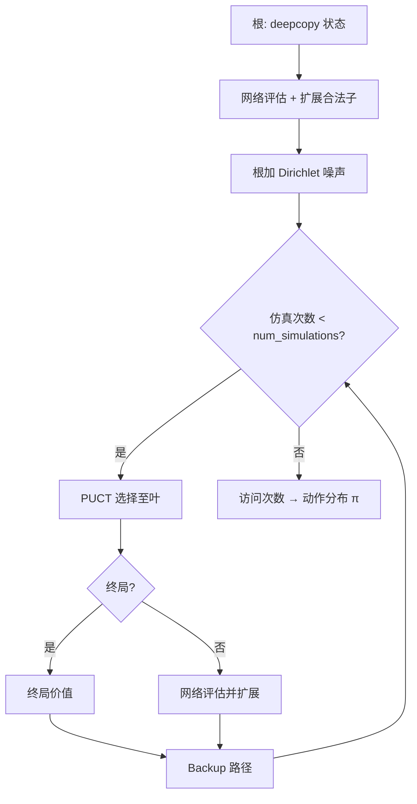

> 返回：[指南目录](README.md) · [上一章](11-feudal-rl.md) · [下一章](13-evaluation-elo-tournament.md) · [索引](../AGENTS.md)

# 第 12 章：AlphaZero 与蒙特卡洛树搜索（MCTS）

---

## 1. 本章目标

读完本章并完成短跑后，你应能：

1. 用「先想几步再落子」解释 MCTS 的选择—扩展—评估—回传。
2. 写出 **PUCT** 公式，填符号表，并手算一个两动作玩具例。
3. 说明策略头 / 价值头与自对弈数据 \((s,\pi_{\text{MCTS}},z)\) 如何训练网络。
4. **诚实理解项目状态**：代码路径已实现，但相对 MaskablePPO 课程主路径，**验证与实战调参更少**。
5. 定位：`mcts.py`、`alphazero_net.py`、`alphazero_trainer.py`、`train_alphazero.py`。

前置：MDP 基础、自对弈直觉（[02](02-game-mechanics-as-mdp.md)、[10](10-self-play.md)）。速查：[`../algorithms/alphazero-mcts.md`](../algorithms/alphazero-mcts.md)。

---

## 2. 生活 / 游戏类比

| 类比 | AlphaZero 组件 |
|------|----------------|
| 下棋前在脑中推演几条变化 | **MCTS 模拟** |
| 「这步以前常走且赢面大」 | 访问次数 \(N\) 与平均价值 \(Q\) |
| 「书上说这步是理论着」 | 网络策略先验 \(P\) |
| 「局势我方略优」的直觉分 | 价值头 \(v\) |
| 用自己和自己下的棋谱当教材 | **自对弈数据**训练网络 |
| 开局故意加点花样避免死背 | 根节点 **Dirichlet 噪声** |

和纯 PPO 的差别：PPO 主要靠采样到的真实轨迹学；AlphaZero 在**每一步决策前**用搜索「改进」走子分布，再用改进后的分布当训练目标。

---

## 3. 基本原理（零基础）

### 3.1 两块积木

1. **神经网络** \(\theta\)
   - **策略头**：\(p(a\|s)=\pi_\theta(a\|s)\)——先验「该考虑哪些着法」。
   - **价值头**：\(v_\theta(s)\in[-1,1]\) 量级——「谁更好」。

2. **MCTS**
   在真实落子前，于**克隆的游戏状态**上做多次模拟，统计每条边的访问次数，得到更靠谱的 \(\pi_{\text{MCTS}}\)。

AlphaZero 风格的叶节点评估用**网络价值**，而不是古典 MCTS 那种随机打到终局（在大动作空间上后者极慢且噪声大）。

### 3.2 MCTS 四步（循环多次）

| 步骤 | 做什么 |
|------|--------|
| **选择 Select** | 从根沿树走，用 PUCT 分选子节点，直到叶子 |
| **扩展 Expand** | 在叶子按合法动作建子，挂上网络先验 \(P\) |
| **评估 Evaluate** | 终局则 ±1/0；否则前向网络得 \(v\) |
| **回传 Backup** | 沿路径更新访问 \(N\)、累计价值 \(W\)（从而 \(Q=W/N\)） |

一次「落子」前通常跑 `num_simulations` 次上述循环，然后按访问次数（可加温度）采样或取 argmax 动作。



### 3.3 训练迭代（外环）

1. 多局自对弈：每步 MCTS → 得到 \(\pi_{\text{MCTS}}\) → 温度采样动作 → 存 \((s,\pi)\)。
2. 终局得到结果 \(z\)（相对该方：胜 +1 / 负 −1 / 和 0）。
3. 从回放缓冲采样，最小化：价值贴近 \(z\)，策略贴近 \(\pi_{\text{MCTS}}\)。
4. 定期与旧最优或规则 Bot 评估，决定是否接受新权重。

### 3.4 动作表示注意点

本项目 flat 动作常映射为：`atype * H*W + y*W + x`（与 env 一致）；`end_turn` 有规范格约定。搜索只在**合法动作掩码**上扩展。细节见源码与 [`../source-analysis/rl-advanced-trainers.md`](../source-analysis/rl-advanced-trainers.md)。

### 3.5 项目状态（诚实）

| 方面 | 状态 |
|------|------|
| 代码 | `MCTS`、`AlphaZeroNet`、`AlphaZeroTrainer`、训练脚本、测试均存在 |
| 与 PPO 主路径比 | **实验篇幅、超参扫、公开「打穿 Bot 阶梯」证据更少** |
| 你应期待 | 短跑能通、单测能过；长训出战力需要自行投入算力与调参 |
| 学习价值 | 理解「搜索 + 学习」范式；不要默认它已是本仓库最强上分路线 |

主线仍是：**MaskablePPO + 课程 Bootstrap（± BC）**。本章是进阶选修。

---

## 4. 公式、符号表与数字例

### 4.1 平均行动价值

\[
Q(s,a) = \frac{W(s,a)}{N(s,a)}
\]

| 符号 | 含义 |
|------|------|
| \(N(s,a)\) | 边访问次数 |
| \(W(s,a)\) | 回传价值累计 |
| \(Q(s,a)\) | 平均价值 |

若子节点轮到对手，实现里常对 \(Q\) **取反**（零和视角）。

### 4.2 PUCT 选择（与本仓库实现一致）

\[
\text{score}(a) = Q(s,a) + c_{\text{puct}}\, P(s,a)\, \frac{\sqrt{N(s)+1}}{1+N(s,a)}
\]

| 符号 | 含义 | 代码侧 |
|------|------|--------|
| \(Q(s,a)\) | 平均价值（或取反） | `child.q_value` |
| \(P(s,a)\) | 网络先验 | `child.prior` |
| \(N(s)\) | 父访问 | `node.visit_count` |
| \(N(s,a)\) | 边访问 | `child.visit_count` |
| \(c_{\text{puct}}\) | 探索强度 | 默认约 `1.5` |

**玩具例**：父 \(N=8\)，\(c_{\text{puct}}=1.5\)，\(\sqrt{N+1}=3\)。

| a | \(N_a\) | \(Q\) | \(P\) |
|---|--------|-------|-------|
| A | 5 | 0.4 | 0.6 |
| B | 1 | 0.1 | 0.4 |

\[
U_A = 1.5\times 0.6\times 3 / (1+5) = 0.45,\quad
\text{score}_A=0.4+0.45=0.85
\]

\[
U_B = 1.5\times 0.4\times 3 / (1+1) = 0.9,\quad
\text{score}_B=0.1+0.9=1.0
\]

→ 选 **B**（访问少、先验尚可，探索项更大）。

### 4.3 根策略与温度

\[
\pi(a) \propto N_a^{1/\tau}
\]

- \(\tau\to 0\)：取访问最多的着（评估常用）
- \(\tau=1\)：按访问比例（自对弈前段探索）

`temperature_threshold`：前若干步用高温，之后降温。

### 4.4 训练损失（标准形）

\[
L = (z - v)^2 - \pi^{\top}\log p + c\|\theta\|^2
\]

| 符号 | 含义 |
|------|------|
| \(z\) | 终局结果（相对当前方） |
| \(v\) | 价值头 |
| \(\pi\) | MCTS 改进策略 |
| \(p\) | 网络策略 |
| \(c\) | 权重衰减等正则 |

### 4.5 根 Dirichlet 噪声

\[
P'(a) = (1-\epsilon)P(a) + \epsilon\,\eta_a,\quad
\eta\sim\mathrm{Dir}(\alpha)
\]

默认量级：`dirichlet_alpha≈0.3`，`dirichlet_epsilon≈0.25`。

---

## 5. 为什么本项目选择它 + 优势

| 动机 | 说明 |
|------|------|
| 需要前瞻 | 纯策略网络一步贪心，缺规划 |
| 分支大 | 用先验 \(P\) 引导搜索，比盲搜可行 |
| 无专家标签 | 自对弈产 \((s,\pi,z)\) |
| 教学完整 | 经典「搜索+学习」对照 PPO 路径 |

**优势（理论上）**：决策带规划；训练目标是改进后的 \(\pi\) 而非瞬时策略；价值与策略联合。
**现实约束（本仓库）**：每步多次模拟 × 状态 deepcopy 成本高；调参面广；**公开可复现的「已稳定吊打 Advanced」故事弱于 PPO 课程线**。

速查：[`../algorithms/alphazero-mcts.md`](../algorithms/alphazero-mcts.md)。

---

## 6. 执行时可能遇到的问题

| 现象 | 可能原因 | 处理 |
|------|----------|------|
| 极慢 | `num_simulations` 大 + deepcopy | 短跑用 8～20 次模拟；减 `max_game_steps` |
| 策略坍缩 | 根噪声不足 / 温度过快降 | 调 Dirichlet；延长高温步数 |
| 与 PPO zip 混用 | 格式完全不同 | 勿期望互载；走 AlphaZero 自己的 ckpt |
| 非法动作 | 掩码未接入搜索 | 查 expand 是否读合法动作 |
| 评估虚高 | 只和过弱旧模型比 | 加规则 Bot 锚；看多局 |

---

## 7. 作者 / 项目训练中的困难与解决（通俗改写）

### 7.1 「实现了」≠「主线上分路径」

仓库把 MCTS + 双头网络 + 训练环写全，并有单元测试与 CLI。但作者精力与文档长篇复盘主要砸在 **PPO bootstrap**（课程、奖励、平衡、BC）。
**对你的含义**：学概念、跑通短训很合适；若目标是尽快得到强 Bot，优先 [08](08-curriculum-bootstrap.md) 主线。

### 7.2 状态克隆与动作空间成本

策略游戏每步合法动作多，树要在 `GameState` 拷贝上推进。模拟次数一加，墙钟时间线性涨。短跑配置必须**狠砍** simulations 与对局长度。

### 7.3 评估与晋级

外环常有「新模型对旧最优的胜率门槛」（如 55%）才替换。门槛与 `eval_games` 过小会噪声晋级；过大则烧预算。这与课程 patience 是同一类统计问题（见 [13](13-evaluation-elo-tournament.md)）。

### 7.4 和 Feudal / PPO 的定位

三条线解决不同假设：

| 路径 | 核心赌注 |
|------|----------|
| PPO + 课程 | 塑形 + 难度阶梯 + 掩码即可 |
| Feudal | 显式分层目标 |
| AlphaZero | 规划搜索改进策略目标 |

没有先验保证哪条在本游戏上最终最强——以你能复现的评估为准。

---

## 8. 代码与配置落点

| 组件 | 路径 |
|------|------|
| MCTS / 节点 / PUCT | `reinforcetactics/rl/mcts.py` |
| 网络 | `reinforcetactics/rl/alphazero_net.py` |
| 训练器 / 回放 / 自对弈局 | `reinforcetactics/rl/alphazero_trainer.py` |
| 对局 Bot 封装 | `reinforcetactics/game/alphazero_bot.py` |
| 配置类型 | `reinforcetactics/rl/config.py` → `AlphaZeroConfig` |
| YAML | `configs/alphazero/alphazero.yaml` |
| CLI | `scripts/train/train_alphazero.py` |
| 测试 | `tests/test_alphazero.py` |

**建议阅读顺序**：`MCTS.search` → `_select_child`（PUCT）→ `_expand_node` / `_backup` → `AlphaZeroNet.forward` → `AlphaZeroTrainer` 主循环。

算法卡：[`../algorithms/alphazero-mcts.md`](../algorithms/alphazero-mcts.md)。
源码：[`../source-analysis/rl-advanced-trainers.md`](../source-analysis/rl-advanced-trainers.md)。

---

## 9. 实操命令

### 9.1 短跑（优先）

```powershell
cd D:\Grok\project2\reinforce-tactics
conda activate reinforce-tactics

python scripts/train/train_alphazero.py `
  --iterations 2 `
  --games-per-iter 2 `
  --num-simulations 10 `
  --device cpu
```

可选钉地图：

```powershell
python scripts/train/train_alphazero.py `
  --map-file maps/1v1/starter.csv `
  --iterations 2 `
  --games-per-iter 2 `
  --num-simulations 10 `
  --device cpu
```

### 9.2 单测

```powershell
python -m pytest tests/test_alphazero.py -q
```

### 9.3 选做：较长训练

```powershell
# 选做：接近 YAML 默认（很慢，建议 GPU）
python scripts/train/train_alphazero.py --config configs/alphazero/alphazero.yaml --device cuda
```

---

## 10. 自测 3 题

1. **概念**
   AlphaZero 叶节点通常用什么估计局面？它和「随机模拟到终局」的古典 MCTS 有何不同？

2. **计算**
   用 §4.2 的 PUCT，父 \(N=3\)，\(c=1.5\)，动作 C：\(N_C=0\)，\(Q=0\)，\(P=0.5\)。计算 score(C)。（\(\sqrt{N+1}=\sqrt{4}=2\)）

3. **工程 / 态度**
   为什么本指南仍建议大多数读者把 PPO 课程当主线，而把 AlphaZero 当选修？

**简答提示**

1. 用价值网络 \(v\)；不做（或不仅依赖）长随机 rollout。
2. \(U=1.5\times 0.5\times 2/(1+0)=1.5\)，\(score=0+1.5=1.5\)。
3. PPO 路径验证、文档与实战教训更厚；AlphaZero 已实现但验证更少、算力更贵。

---

## 延伸阅读

- Silver et al., AlphaZero / AlphaGo Zero 论文
- [`../algorithms/alphazero-mcts.md`](../algorithms/alphazero-mcts.md)
- [`../algorithms/self-play.md`](../algorithms/self-play.md)
- [`../source-analysis/rl-advanced-trainers.md`](../source-analysis/rl-advanced-trainers.md)
- 下一章：[13 评估、Elo 与锦标赛](13-evaluation-elo-tournament.md)
