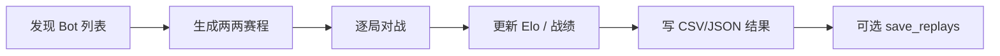

> 返回：[指南目录](README.md) · [上一章](12-alphazero-mcts.md) · [下一章](14-scripted-bots-and-balance.md) · [索引](../AGENTS.md)

# 第 13 章：评估、Elo 与锦标赛

---

## 1. 本章目标

读完本章并完成短跑后，你应能：

1. 正确解读**胜率、平局、截断**与评估噪声。
2. 手算 Elo 期望分 \(E=1/(1+10^{(R_b-R_a)/400)}\) 与一次 K 因子更新。
3. 说明**循环赛（round-robin）**如何给多 Bot 排名。
4. 找到代码：`rl/evaluation.py`、`tournament/*`、`scripts/tournament.py`。
5. 区分 **GUI 存回放** 与 **锦标赛 `save_replays`** 两条路径。

前置：任意一章训练经验即可。速查：[`../algorithms/evaluation-and-elo.md`](../algorithms/evaluation-and-elo.md)。

---

## 2. 生活 / 游戏类比

| 类比 | 评估 / Elo / 锦标赛 |
|------|---------------------|
| 排位赛打 30 把看胜率 | `n_episodes` 估计 \(\hat{w}\) |
| 只打 3 把就说「我上王者」 | **评估噪声**过大 |
| 国际象棋积分 | **Elo** 相对分 |
| 小组循环赛：每队打每队 | **Round-robin** 锦标赛 |
| 训练时教练喊「再练一组」vs 联赛官方录像 | 训练内 eval vs `scripts/tournament.py` |
| 自己打完点「保存录像」vs 赛事自动归档 | GUI 手动保存 vs 锦标赛 `save_replays` |

训练曲线上的 **reward 升高 ≠ 更会赢**。塑形可以抬高分数而不提高胜率。最终要以**对固定对手的对局统计**说话。

---

## 3. 基本原理（零基础）

### 3.1 胜率与平局怎么数

对 \(n\) 局固定对手评估：

| 结果 | 常见记法 |
|------|----------|
| 胜 | \(W\) |
| 负 | \(L\) |
| 平 / 超时和棋 | \(D\) |
| 步数截断 | 可能记入 draw 或单独 `max_steps_truncate` |

\[
\hat{w} = \frac{W}{n}
\quad\text{（有的报表也会给 }W/(W+L)\text{ 忽略平局，读表时看清定义）}
\]

本项目 `evaluate_model` 会汇总 `win_rate`、`avg_reward`、`std_reward`、局长，以及可选的奖励分解、`end_reason`、`units_built` 等。

**`end_reason` 很重要**：

| 原因（概念） | 含义 |
|--------------|------|
| `hq_capture` | 占总部获胜 |
| `elimination` | 歼灭 |
| `max_turns_draw` | 回合用尽和棋 |
| `max_steps_truncate` | 环境步数截断 |

全是 truncate 的「高 reward」可能只是拖时间吃塑形，不是真会打。

### 3.2 评估噪声

真胜率 \(w\) 未知，你只看到 \(\hat{w}\)。局数少时波动巨大——这就是课程里 **patience**、锦标赛里 **每对多局 + 换边** 的原因。

确定性评估（`deterministic=True`）：每步取策略众数，曲线更稳，但可能掩盖随机策略行为；若环境与对手也确定，还会出现 **std_reward=0 的死剧本**（见 [08](08-curriculum-bootstrap.md)）。

### 3.3 Elo 在做什么

Elo 不测量「绝对战力牛顿」，只在**当前对手集合**里给相对分：

1. 根据分差算**期望得分** \(E\)（强者期望接近 1，弱者接近 0）；
2. 实际得分 \(S\)：胜 1、负 0、和 0.5；
3. 分差更新：超预期则加分，低预期则减分。

### 3.4 锦标赛（Round-robin）

\(N\) 个 Bot，两两配对（循环赛），每对打若干局（常 **换边** 消除先手），汇总胜场 / Elo / 表。
入口：`scripts/tournament.py` → `TournamentRunner`；也可 Docker 配置批量跑。



### 3.5 GUI 回放 vs 锦标赛回放（简记）

| 场景 | 是否自动存回放 | 入口 |
|------|----------------|------|
| GUI 人机 / 本地对局 | **否**（现逻辑）；用户点「保存回放」才写 | `game_loop` + 结算菜单 |
| 锦标赛 / Docker | 由配置 **`save_replays`** 控制（常默认开） | `tournament/runner.py` |

两条路径不要混为一谈。GUI 旧版曾「终局自动存 + 按钮再存」导致重复文件，已改为仅用户确认；锦标赛批量归档仍走自己的开关。详见 [`../troubleshooting/gui-replay-save-duplicates.md`](../troubleshooting/gui-replay-save-duplicates.md)。

---

## 4. 公式、符号表与数字例

### 4.1 胜率与标准误

\[
\hat{w} = \frac{W}{n},\qquad
\mathrm{SE} \approx \sqrt{\frac{\hat{w}(1-\hat{w})}{n}}
\]

| 符号 | 含义 |
|------|------|
| \(W\) | 胜场 |
| \(n\) | 总局数 |
| \(\mathrm{SE}\) | 标准误（二项近似） |

**玩具例**：\(W=18\)，\(n=30\) → \(\hat{w}=0.6\)，

\[
\mathrm{SE}\approx\sqrt{0.6\times 0.4/30}\approx 0.089
\]

粗略 95% 区间约 \(0.6\pm 1.96\times 0.089 \approx [0.43,\,0.77]\)。
**30 局仍然很宽**——别用一次 60% 宣布革命成功。

### 4.2 Elo 期望得分

\[
E_A = \frac{1}{1 + 10^{(R_B - R_A)/400}}
\]

| 符号 | 含义 |
|------|------|
| \(R_A,R_B\) | A、B 当前 Elo |
| \(E_A\) | A 的期望得分 ∈ (0,1) |
| 400 | 经典标度：约 400 分差 → 期望约 10:1 |

对称：\(E_B = 1 - E_A\)。

**玩具例**：\(R_A=1500\)，\(R_B=1700\)：

\[
E_A = \frac{1}{1+10^{200/400}} = \frac{1}{1+10^{0.5}} \approx \frac{1}{1+3.162} \approx 0.240
\]

\[
E_B \approx 0.760
\]

### 4.3 K 因子更新

\[
R_A' = R_A + K\,(S_A - E_A)
\]

| 符号 | 含义 | 本项目默认 |
|------|------|------------|
| \(K\) | K 因子（敏感度） | 常 32 |
| \(S_A\) | 实际得分：胜 1 / 负 0 / 和 0.5 | — |

**续上例**：A 爆冷击败 B，\(S_A=1\)，\(K=32\)：

\[
\Delta R_A = 32\times(1-0.240)\approx 24.3,\quad R_A'\approx 1524.3
\]

\[
\Delta R_B = 32\times(0-0.760)\approx -24.3,\quad R_B'\approx 1675.7
\]

若打平 \(S=0.5\)：

\[
\Delta R_A = 32\times(0.5-0.240)\approx +8.3
\]

（低分者平局「赚分」，高分者「丢分」——符合直觉。）

### 4.4 分差速查

| \(R_B-R_A\) | \(E_A\)（约） |
|-------------|---------------|
| 0 | 0.50 |
| 100 | 0.36 |
| 200 | 0.24 |
| 400 | 0.09 |

### 4.5 循环赛场次（概念）

\(N\) 名选手单循环、每对打 \(g\) 局（若再换边则每对 \(2g\)）：

\[
\text{对数} = \binom{N}{2} = \frac{N(N-1)}{2},\quad
\text{总局数} = \binom{N}{2}\times(\text{每对局数})
\]

例：5 个 Bot，每对 4 局 → \(10\times 4=40\) 局。

---

## 5. 为什么本项目选择它 + 优势

| 机制 | 作用 |
|------|------|
| `evaluate_model` | 训练中与训练后统一的胜率尺子 |
| Elo | 多 Bot 相对排序，便于历史对比 |
| 锦标赛 | 脚本 Bot + 模型 +（可选）LLM 同台 |
| 换边 / 多地图 | 降先手与地图偏差 |

**优势**：可复现、可自动化、与 GUI 对战解耦；结果可落盘 CSV/JSON。
**注意**：Elo 依赖对手池；换一批对手分数不可直接横向绝对比较。

速查：[`../algorithms/evaluation-and-elo.md`](../algorithms/evaluation-and-elo.md)。
源码：[`../source-analysis/tournament-system.md`](../source-analysis/tournament-system.md)。

---

## 6. 执行时可能遇到的问题

| 现象 | 可能原因 | 处理 |
|------|----------|------|
| 胜率乱跳 | \(n\) 太小 | 加 episodes；多次 seed |
| reward 升胜率不升 | 塑形投机 | 看 W/L/D 与 end_reason |
| Elo 和观感不符 | 样本少 / 对手池偏 | 加对局；看原始胜负表 |
| 模型未被发现 | 路径/扩展名 | `models/` 下 zip 或 feudal `.pt` |
| 回放列表混乱 | GUI 与锦标赛路径混淆 | 见 §3.5 与 troubleshooting |
| 全平局 | max_turns/steps 过紧 | 调上限；查是否从不决战 |

---

## 7. 作者 / 项目训练中的困难与解决（通俗改写）

### 7.1 阈值附近的噪声会骗晋级

课程用连续多次评估（patience）就是因为单次 \(\hat{w}\) 不可信。评估章把同一教训说成统计事实：\(n=20\) 时 std 可达 ~0.1。

### 7.2 `std_reward=0` 的假「稳定」

全胜且标准差为 0，可能是真无敌，也可能是**确定性死剧本**。要结合动作多样性、换种子、随机对手再测。

### 7.3 只报胜率会藏单兵种

作者后来强调：记录 `units_built` 等组成信息，否则「100% 胜率全靠最便宜兵」与「多样战术」在曲线上长得一样。

### 7.4 评估 env 必须与训练对齐

BC/课程踩过的坑：ad-hoc eval 漏传 `reward_config`、`max_actions_per_turn` 等 → 误判算法坏了。
**规则**：评估构造 env 时转发生产配置的全部关键 kwargs。

### 7.5 GUI 回放重复 vs 锦标赛归档

GUI 自动保存曾造成「一局两文件、按钮语义混乱」；修复后 GUI **仅用户确认保存**。锦标赛仍用 `save_replays` 批量落盘——这是**产品设计差异**，不是 bug。写工具脚本时不要假设「所有回放都在 `replays/` 且规则相同」。

---

## 8. 代码与配置落点

| 组件 | 路径 |
|------|------|
| RL 评估 | `reinforcetactics/rl/evaluation.py` → `evaluate_model` |
| 常量名 | `ACTION_TYPE_NAMES`、`REWARD_COMPONENTS`、`END_REASONS` 等 |
| CLI 评估 | `scripts/eval_agent.py`；`reinforcetactics/cli/commands.py` |
| Elo | `reinforcetactics/tournament/elo.py` → `EloRatingSystem` |
| 赛程 | `reinforcetactics/tournament/schedule.py` |
| 运行器 | `reinforcetactics/tournament/runner.py` |
| Bot 发现 | `reinforcetactics/tournament/bots.py` |
| 结果 | `reinforcetactics/tournament/results.py` |
| 配置 | `reinforcetactics/tournament/config.py` |
| 入口脚本 | `scripts/tournament.py` |
| Docker 锦标赛 | `docker/tournament/` |
| 可视化 | `reinforcetactics/rl/viz.py`（评估曲线等） |

算法卡：[`../algorithms/evaluation-and-elo.md`](../algorithms/evaluation-and-elo.md)。
源码：[`../source-analysis/tournament-system.md`](../source-analysis/tournament-system.md) · [`../source-analysis/rl-training-pipelines.md`](../source-analysis/rl-training-pipelines.md)。

---

## 9. 实操命令

### 9.1 短跑（优先）：小锦标赛 / 测试模式

```powershell
cd D:\Grok\project2\reinforce-tactics
conda activate reinforce-tactics

# 查看参数
python scripts/tournament.py --help

# 测试模式（脚本会加重复 SimpleBot 等，便于冒烟）
python scripts/tournament.py --test --games-per-side 1 --no-llm --no-models
```

钉一张小地图、少局数：

```powershell
python scripts/tournament.py `
  --map maps/1v1/starter.csv `
  --games-per-side 1 `
  --no-llm `
  --output-dir tournament_results/smoke
```

### 9.2 评估单模型（若已有 zip）

```powershell
python scripts/eval_agent.py --help
# 按帮助传入 model 路径、对手、局数；短跑 n_episodes=5 即可
```

### 9.3 单测

```powershell
python -m pytest tests/test_rl_evaluation.py tests/test_tournament.py tests/test_tournament_library.py -q
```

### 9.4 选做：更完整锦标赛

```powershell
# 选做：发现 models/ 下模型，多地图，更多局（耗时）
python scripts/tournament.py `
  --map-dir maps/1v1/ `
  --map-pool-mode cycle `
  --games-per-side 2 `
  --models-dir models `
  --output-dir tournament_results
```

---

## 10. 自测 3 题

1. **概念**
   为什么训练 mean reward 上升，不能直接宣称模型变强？评估时为何要看 `end_reason`？

2. **计算**
   \(R_A=1600\)，\(R_B=1600\)，\(K=32\)。A 获胜。求 \(E_A\) 与更新后的 \(R_A'\)。
   再算：\(R_A=1400\)，\(R_B=1800\)，双方战平，\(K=32\)，A 的分数变化 \(\Delta R_A\) 约多少？

3. **工程**
   GUI 保存回放与锦标赛 `save_replays` 有何不同？`n=10` 时胜率 70% 为什么不足以单独支持「稳压对手」的结论？

**简答提示**

1. 塑形可抬 reward；end_reason 区分真胜与超时/截断投机。
2. 同分 \(E_A=0.5\)，\(R_A'=1600+32\times0.5=1616\)。
   差 400 分：\(E_A\approx 1/(1+10)=1/11\approx0.091\)，平局 \(S=0.5\)，\(\Delta R_A\approx 32\times(0.5-0.091)\approx +13.1\)。
3. GUI 现为用户确认才存；锦标赛由配置批量存。\(n=10\) 标准误大，70% 置信区间很宽。

---

## 延伸阅读

- [`../algorithms/evaluation-and-elo.md`](../algorithms/evaluation-and-elo.md)
- [`../algorithms/curriculum-bootstrap.md`](../algorithms/curriculum-bootstrap.md)
- [`../source-analysis/tournament-system.md`](../source-analysis/tournament-system.md)
- [`../troubleshooting/gui-replay-save-duplicates.md`](../troubleshooting/gui-replay-save-duplicates.md)
- 下一章：[14 规则 Bot 与平衡](14-scripted-bots-and-balance.md)
- 术语表（若已写）：[glossary.md](glossary.md)
