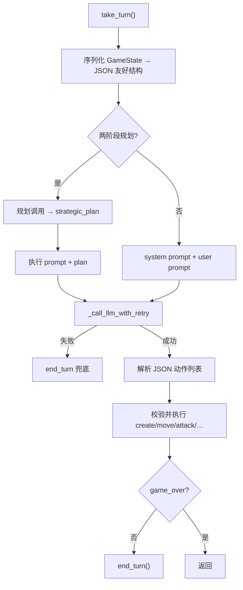

> 返回：[指南目录](README.md) · [上一章](14-scripted-bots-and-balance.md) · [下一章](16-dev-toolchain.md) · [索引](../AGENTS.md)

# 第 15 章：LLM 驱动的 Bot

本章说明 **大语言模型（LLM）如何当游戏 Bot**，以及它与 RL 策略的本质差别。读完后你应能：

1. 画出「局面 → 提示 → API → 解析 → 执行」流水线；
2. 知道 OpenAI / Claude / Gemini 依赖与 API Key 从哪来；
3. 安装 `[llm]` extra 并理解 demo 在做什么；
4. 说清成本、延迟、合法性、**不更新权重** 等限制。

源码深潜：[`../source-analysis/game-llm-and-model-bots.md`](../source-analysis/game-llm-and-model-bots.md)。

**重要边界：本指南不涉及云上训练（Vertex 等）。** LLM Bot 只是 **推理时调用外部 API**，与 `docs/vertex_training.md` 的训练任务无关。

---

## 1. LLM Bot 与 RL 策略有何不同

| 维度 | RL 策略（如 MaskablePPO / ModelBot） | LLM Bot |
|------|--------------------------------------|---------|
| 决策依据 | 本地神经网络权重 + 观察张量 | 文本 prompt + 云端/本地大模型 |
| 学习 | 用回报梯度更新参数 | **默认不学习**；每局独立「读规则答题」 |
| 动作形式 | 离散索引 / 六维向量，常带掩码 | JSON 动作列表（语义字段） |
| 合法性 | 掩码强制合法（训练时） | 解析后校验；非法项常 **跳过** |
| 成本 | 训练贵、推理相对便宜 | **几乎每回合都要付 API 钱** |
| 延迟 | 毫秒～数十毫秒级（CPU/GPU） | 常 **秒级**（网络 + 生成） |
| 可复现 | seed + 权重可复现 | 温度 > 0 时难复现；供应商还可能变模型 |

两者都实现 `BaseBot.take_turn()`，因此 GUI、锦标赛、脚本 demo **接口兼容**。但评估时不要拿「一次 LLM 对局」和「训练 200 万步的 PPO」直接比聪明程度而不谈预算。

---

## 2. 流水线：从局面到执行



### 2.1 序列化里通常有什么

- 当前玩家、回合、金币
- 单位列表（稳定 **unit_id**、类型、HP、坐标、状态）
- 建筑 / 地图摘要
- **合法动作**（格式化后的列表，避免直接 dump Python 对象）

模型应优先在合法动作里选；实现仍会做执行期校验。

### 2.2 期望的响应形状（概念）

```json
{
  "actions": [
    {"type": "CREATE_UNIT", "unit_type": "W", "x": 3, "y": 5},
    {"type": "MOVE", "unit_id": 2, "to_x": 4, "to_y": 5},
    {"type": "ATTACK", "unit_id": 2, "target_unit_id": 7},
    {"type": "SEIZE", "unit_id": 2},
    {"type": "END_TURN"}
  ]
}
```

字段名以 `llm_bot.py` 内 `_execute_*` 为准；无法解析或非法的项会被跳过。可选 `reasoning`（开启思考时）。也支持认输类动作（若启用）。

### 2.3 提示词策略

`reinforcetactics/game/llm_prompts.py`：

| 名称 | 用途 |
|------|------|
| `PROMPT_BASIC` | 规则摘要 + 动作 schema + 短策略 |
| `PROMPT_STRATEGIC` | 更强调多步战术 |
| `PROMPT_TWO_PHASE_PLAN` / `EXECUTE` | 先计划后执行（约 2 倍 API 调用） |

```python
from reinforcetactics.game.llm_prompts import get_prompt
# bot = ClaudeBot(game_state, system_prompt=get_prompt("strategic"))
```

---

## 3. 供应商与 API Key

### 3.1 类与依赖

| 类 | 供应商 | 典型环境变量 | pip 包（`[llm]` extra） |
|----|--------|--------------|-------------------------|
| `OpenAIBot` | OpenAI | `OPENAI_API_KEY` | `openai` |
| `ClaudeBot` | Anthropic | `ANTHROPIC_API_KEY` | `anthropic` |
| `GeminiBot` | Google | `GOOGLE_API_KEY` | `google-genai` |

`pyproject.toml` 中：

```toml
llm = [
    "openai",
    "anthropic",
    "google-genai",
]
```

### 3.2 安装

```powershell
cd D:\Grok\project2\reinforce-tactics
conda activate reinforce-tactics
pip install -e ".[llm]"
```

若已装过 editable 包，只需补 extra 亦可。

### 3.3 设置 Key 的两种方式

**A. 环境变量（脚本 / demo 友好）**

```powershell
$env:OPENAI_API_KEY = 'sk-...'      # 按你选的供应商改
# 或 ANTHROPIC_API_KEY / GOOGLE_API_KEY
```

**B. GUI 设置菜单**

主菜单 → **设置** → **API Keys**（`reinforcetactics/ui/menus/settings/api_keys_menu.py`）。
`bot_factory` 创建 LLM 对手时会从 `settings.get_api_key(...)` 注入，不必每次 export。

**切勿**把真实 Key 写进仓库、commit 到 git 或贴进 Issue。

### 3.4 重试与状态

- 默认 `max_retries` 约 3，指数退避
- 可选跨回合 history（更「记得」上文，但 **token 更贵**）
- 两阶段规划：每回合约两次调用

---

## 4. Demo：`examples/llm_bot_demo.py`

```powershell
conda activate reinforce-tactics
# 先设好对应 API Key
python examples/llm_bot_demo.py
```

脚本会：

1. 让你选 OpenAI / Claude / Gemini；
2. 加载地图（或随机图）；
3. 创建 LLM Bot（默认作为玩家 2）；
4. 跑约 **3 个 demo 回合**，打印金币与是否完成 `take_turn`。

失败常见原因：

| 报错感觉 | 处理 |
|----------|------|
| API key 未提供 | 设环境变量或 GUI Key |
| Missing dependency | `pip install -e ".[llm]"` |
| 限流 / 超时 | 降频率、换模型档位；Bot 已有重试 |

更完整对局：GUI 里把某位玩家设为 LLM Bot，或锦标赛开启 LLM 发现（需 Key 且 **很贵**）。

---

## 5. 限制与正确预期

1. **成本**
   全量循环赛若包含多个 LLM，可能一夜烧掉大量额度。评估时优先脚本 Bot / 本地 ModelBot。

2. **延迟**
   不适合高 `n_envs` 训练循环当对手；训练对手请用规则 Bot 或加载好的 `ModelBot`。

3. **合法性**
   LLM 可能输出不在合法列表的坐标或错误 unit_id。实现会跳过坏动作并最终 `end_turn`，表现可能像「发呆半回合」。

4. **默认不更新权重**
   这是 **提示工程 + API 推理**，不是 RL 微调。本仓库没有「把对局回报反传进 GPT」的默认路径。

5. **无云训练绑定**
   本指南 **不** 覆盖 Google Cloud / Vertex 上的训练作业。云训练文档见 `docs/vertex_training.md`（可选进阶，**非本指南范围**）。
   LLM Bot 即使 Key 指向云 API，也只是 **对战推理**，不是「在云上 train PPO」。

6. **与 ModelBot / AlphaZeroBot 区分**
   - **ModelBot**：加载本地 `.zip`（SB3）或 `.pt`（Feudal）权重
   - **AlphaZeroBot**：本地网络 + MCTS
   - **LLMBot**：远程文本模型

   三者都叫「Bot」，学习形态完全不同。

---

## 6. 代码地图

| 模块 | 路径 |
|------|------|
| LLM 基类与三家子类 | `reinforcetactics/game/llm_bot.py` |
| System prompt 库 | `reinforcetactics/game/llm_prompts.py` |
| 交互 demo | `examples/llm_bot_demo.py` |
| GUI 工厂注入 Key | `reinforcetactics/app/bot_factory.py` |
| API Keys 菜单 | `reinforcetactics/ui/menus/settings/api_keys_menu.py` |
| 锦标赛 LLM 发现 | `reinforcetactics/tournament/bots.py` |
| notebook | `notebooks/llm_bot_tournament.ipynb` |

---

## 7. 自检

- [ ] 能用一张表对比 LLM vs RL 策略
- [ ] 能口述流水线五步：序列化 → prompt → API → 解析 → 执行 + end_turn
- [ ] 知道 `[llm]` extra 与三个环境变量名
- [ ] 知道 demo 入口与「不默认学习权重」
- [ ] 明确本指南 **不做云训练**

---

## 8. 延伸阅读

| 文档 | 内容 |
|------|------|
| [`../source-analysis/game-llm-and-model-bots.md`](../source-analysis/game-llm-and-model-bots.md) | LLM / Model / AlphaZero 源码 |
| [`../../examples/README.md`](../../examples/README.md) | demo 英文说明 |
| 第 14 章 | 同一 `take_turn` 合同下的规则 Bot |
| 第 17 章 | 可选课题：一回合 LLM demo 或精读 prompt |
