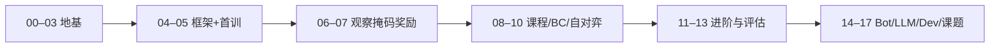

# 策略类强化学习学习指南

**基于开源项目 [Reinforce Tactics](https://github.com/kuds/reinforce-tactics)（本仓库 Fork）**

> 这是一份面向**有编程基础、零强化学习（RL）背景**读者的入门读物。
> 目标：在读完并完成实操后，你能解释 RL 核心概念、看懂本项目训练代码，并自己跑通「玩游戏 → 短训 PPO → 评估 → 锦标赛/Bot」的主线。

---

## 你将得到什么

1. **概念**：智能体、环境、奖励、策略、价值、折扣、探索……用游戏语言讲清楚。
2. **公式**：每个重要公式都有符号表 + 数字例子，不默认你会高数。
3. **框架**：Gymnasium 环境接口、Stable-Baselines3（SB3）与 MaskablePPO。
4. **本项目算法专章**：课程 Bootstrap、行为克隆、自对弈、Feudal、AlphaZero、评估与 ELO。
5. **实操**：PowerShell + Conda 下可复制命令（默认 CPU、短步数「能跑通」）。
6. **作者教训**：把 `docs/` 里偏专业的训练日记，改写成「发生了什么、为什么、后来怎么办」。

**不包含**：Google Cloud / Vertex 云训练细节（见 `docs/vertex_training.md`，可选进阶）。

---

## 推荐阅读路径



| 你的时间 | 建议 |
|----------|------|
| 半天 | 00 → 05，至少完成一次短训 |
| 2–3 天 | 到 08 + 13，理解课程与评估 |
| 一周+ | 全文 + 17 章任选课题 |

---

## 章节目录

### Part A — 地基

| 章 | 文件 | 内容 |
|----|------|------|
| 00 | [00-how-to-use-this-guide.md](00-how-to-use-this-guide.md) | 环境、仓库地图、符号约定 |
| 01 | [01-why-rl-and-this-game.md](01-why-rl-and-this-game.md) | 为何用 RL、为何用这款策略游戏 |
| 02 | [02-game-mechanics-as-mdp.md](02-game-mechanics-as-mdp.md) | 游戏规则如何变成 MDP |
| 03 | [03-math-without-tears.md](03-math-without-tears.md) | 读懂后续公式所需的最小数学 |

### Part B — 框架与第一条训练线

| 章 | 文件 | 内容 |
|----|------|------|
| 04 | [04-gymnasium-and-sb3.md](04-gymnasium-and-sb3.md) | Gymnasium、SB3、MaskablePPO |
| 05 | [05-first-train-ppo.md](05-first-train-ppo.md) | 第一次训练与评估 |
| 06 | [06-observation-action-mask.md](06-observation-action-mask.md) | 观察、动作空间、掩码 |
| 07 | [07-rewards-and-shaping.md](07-rewards-and-shaping.md) | 奖励与塑形 |

### Part C — 算法专章

| 章 | 文件 | 内容 |
|----|------|------|
| 08 | [08-curriculum-bootstrap.md](08-curriculum-bootstrap.md) | 课程学习 / Bootstrap |
| 09 | [09-behavior-cloning.md](09-behavior-cloning.md) | 行为克隆 BC |
| 10 | [10-self-play.md](10-self-play.md) | 自对弈 |
| 11 | [11-feudal-rl.md](11-feudal-rl.md) | 分层 Feudal RL |
| 12 | [12-alphazero-mcts.md](12-alphazero-mcts.md) | AlphaZero 与 MCTS |
| 13 | [13-evaluation-elo-tournament.md](13-evaluation-elo-tournament.md) | 评估、ELO、锦标赛 |

### Part D — 扩展与工程

| 章 | 文件 | 内容 |
|----|------|------|
| 14 | [14-scripted-bots-and-balance.md](14-scripted-bots-and-balance.md) | 规则 Bot 与平衡 |
| 15 | [15-llm-bots.md](15-llm-bots.md) | LLM 驱动的 Bot |
| 16 | [16-dev-toolchain.md](16-dev-toolchain.md) | 开发与测试工具链 |
| 17 | [17-capstone-projects.md](17-capstone-projects.md) | 综合练习课题 |
| — | [glossary.md](glossary.md) | 术语表与延伸阅读 |

---

## 环境一句话

```powershell
cd D:\Grok\project2\reinforce-tactics   # 换成你的仓库根
conda activate reinforce-tactics
python -c "import reinforcetactics, gymnasium, torch; print('ok')"
```

更细步骤见 [00 章](00-how-to-use-this-guide.md) 与 [`../usage/local-run-guide.md`](../usage/local-run-guide.md)。

---

## 与其他文档的关系

| 文档 | 用途 |
|------|------|
| **本指南** | 循序渐进「学会 RL + 用本项目练」 |
| [`../algorithms/`](../algorithms/) | 算法速查卡（更短） |
| [`../source-analysis/`](../source-analysis/) | 代码架构深潜 |
| [`../../docs/`](../../docs/) / [`../../docs/zh/`](../../docs/zh/) | 作者原始实验笔记（更专业、更碎） |
| 用户站 [reinforcetactics.com](https://reinforcetactics.com) | 面向玩家的安装与规则 |

---

## 插图

界面截图在 [`../assets/screenshots/`](../assets/screenshots/)。重新生成：

```powershell
python scripts/_capture_doc_screenshots.py
```

## 离线 PDF

合订 PDF（含目录，便于阅读器浏览）：

[`export/Reinforce-Tactics-RL-Learning-Guide.pdf`](export/Reinforce-Tactics-RL-Learning-Guide.pdf)

同目录还有 `learning-guide.html`（浏览器打开亦可）。重新导出可先合并 Markdown 再用 pandoc + Edge 无头打印（见仓库内导出产物时间戳）。

---

## 反馈

发现问题（命令过时、表述不清）时，欢迎改文档或开 Issue。指南随仓库演进，以当前 `feature/local-deploy` 附近代码为准。
