# 策略类强化学习学习指南

*基于 Reinforce Tactics 项目 · 离线阅读合集*

---


<div style="page-break-before: always;"></div>

# 策略类强化学习学习指南

**基于开源项目 [Reinforce Tactics](https://github.com/kuds/reinforce-tactics)（本仓库 Fork）**

> 这是一份面向**有编程基础、零强化学习（RL）背景**读者的入门读物。
> 目标：在读完并完成实操后，你能解释 RL 核心概念、看懂本项目训练代码，并自己跑通「玩游戏 → 短训 PPO → 评估 → 锦标赛/Bot」的主线。

---

## 你将得到什么

1. **概念**：智能体、环境、奖励、策略、价值、折扣、探索……用游戏语言讲清楚。
2. **公式**：每个重要公式都有符号表 + 数字例子，不默认你会高数。
3. **框架**：Gymnasium 环境接口、Stable-Baselines3（SB3）与 MaskablePPO。
4. **本项目算法专章**：课程 Bootstrap、行为克隆、自对弈、Feudal、AlphaZero、评估与 ELO。
5. **实操**：PowerShell + Conda 下可复制命令（默认 CPU、短步数「能跑通」）。
6. **作者教训**：把 `docs/` 里偏专业的训练日记，改写成「发生了什么、为什么、后来怎么办」。

**不包含**：Google Cloud / Vertex 云训练细节（见 `docs/vertex_training.md`，可选进阶）。

---

## 推荐阅读路径

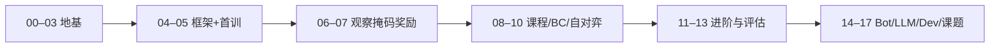

| 你的时间 | 建议 |
|----------|------|
| 半天 | 00 → 05，至少完成一次短训 |
| 2–3 天 | 到 08 + 13，理解课程与评估 |
| 一周+ | 全文 + 17 章任选课题 |

---

## 章节目录

### Part A — 地基

| 章 | 文件 | 内容 |
|----|------|------|
| 00 | [00-how-to-use-this-guide.md](00-how-to-use-this-guide.md) | 环境、仓库地图、符号约定 |
| 01 | [01-why-rl-and-this-game.md](01-why-rl-and-this-game.md) | 为何用 RL、为何用这款策略游戏 |
| 02 | [02-game-mechanics-as-mdp.md](02-game-mechanics-as-mdp.md) | 游戏规则如何变成 MDP |
| 03 | [03-math-without-tears.md](03-math-without-tears.md) | 读懂后续公式所需的最小数学 |

### Part B — 框架与第一条训练线

| 章 | 文件 | 内容 |
|----|------|------|
| 04 | [04-gymnasium-and-sb3.md](04-gymnasium-and-sb3.md) | Gymnasium、SB3、MaskablePPO |
| 05 | [05-first-train-ppo.md](05-first-train-ppo.md) | 第一次训练与评估 |
| 06 | [06-observation-action-mask.md](06-observation-action-mask.md) | 观察、动作空间、掩码 |
| 07 | [07-rewards-and-shaping.md](07-rewards-and-shaping.md) | 奖励与塑形 |

### Part C — 算法专章

| 章 | 文件 | 内容 |
|----|------|------|
| 08 | [08-curriculum-bootstrap.md](08-curriculum-bootstrap.md) | 课程学习 / Bootstrap |
| 09 | [09-behavior-cloning.md](09-behavior-cloning.md) | 行为克隆 BC |
| 10 | [10-self-play.md](10-self-play.md) | 自对弈 |
| 11 | [11-feudal-rl.md](11-feudal-rl.md) | 分层 Feudal RL |
| 12 | [12-alphazero-mcts.md](12-alphazero-mcts.md) | AlphaZero 与 MCTS |
| 13 | [13-evaluation-elo-tournament.md](13-evaluation-elo-tournament.md) | 评估、ELO、锦标赛 |

### Part D — 扩展与工程

| 章 | 文件 | 内容 |
|----|------|------|
| 14 | [14-scripted-bots-and-balance.md](14-scripted-bots-and-balance.md) | 规则 Bot 与平衡 |
| 15 | [15-llm-bots.md](15-llm-bots.md) | LLM 驱动的 Bot |
| 16 | [16-dev-toolchain.md](16-dev-toolchain.md) | 开发与测试工具链 |
| 17 | [17-capstone-projects.md](17-capstone-projects.md) | 综合练习课题 |
| — | [glossary.md](glossary.md) | 术语表与延伸阅读 |

---

## 环境一句话

```powershell
cd D:\Grok\project2\reinforce-tactics   # 换成你的仓库根
conda activate reinforce-tactics
python -c "import reinforcetactics, gymnasium, torch; print('ok')"
```

更细步骤见 [00 章](00-how-to-use-this-guide.md) 与 [`../usage/local-run-guide.md`](../usage/local-run-guide.md)。

---

## 与其他文档的关系

| 文档 | 用途 |
|------|------|
| **本指南** | 循序渐进「学会 RL + 用本项目练」 |
| [`../algorithms/`](../algorithms/) | 算法速查卡（更短） |
| [`../source-analysis/`](../source-analysis/) | 代码架构深潜 |
| [`../../docs/`](../../docs/) / [`../../docs/zh/`](../../docs/zh/) | 作者原始实验笔记（更专业、更碎） |
| 用户站 [reinforcetactics.com](https://reinforcetactics.com) | 面向玩家的安装与规则 |

---

## 插图

界面截图在 [`../assets/screenshots/`](../../assets/screenshots/)。重新生成：

```powershell
python scripts/_capture_doc_screenshots.py
```

---

## 反馈

发现问题（命令过时、表述不清）时，欢迎改文档或开 Issue。指南随仓库演进，以当前 `feature/local-deploy` 附近代码为准。

---


<div style="page-break-before: always;"></div>

# 00 · 如何使用本指南

欢迎。你是**有编程基础、零强化学习（RL）背景**的读者；本指南会用游戏与代码语言带你走完：

「会玩这款策略游戏 → 理解它为何像一个 RL 问题 → 跑通一次短训 PPO → 看懂观察、掩码与奖励」。

本章不讲算法，只帮你把**环境、仓库地图、路径约定**摆好，避免后面卡在安装上。

---

## 1. 本指南是什么、不是什么

| 是 | 不是 |
|----|------|
| 循序渐进的中文教程 | 论文精读 / 数学推导手册 |
| 绑定本仓库可运行命令 | 通用「所有游戏的 RL」百科 |
| 每章有自测与实操 | 只贴 API 文档的速查表 |
| Part A+B 为必读主线 | 云端 Vertex 训练细节（刻意不写） |

**Part A（00–03）**：动机、规则 ↔ MDP、最小数学。
**Part B（04–07）**：Gymnasium / SB3、第一次训练、观察掩码、奖励。
**Part C/D**（08 起）：课程、BC、自对弈、Feudal、AlphaZero 等，可在主线跑通后再读。

更短的算法卡片在 [`../algorithms/`](../algorithms/)；源码深潜在 [`../source-analysis/`](../source-analysis/)。

---

## 2. 阅读与实操约定

### 2.1 建议节奏

| 你的时间 | 建议路径 |
|----------|----------|
| 1–2 小时 | 00 → 02 浏览 + 本章 import 实操；可选打开 GUI 打半局 |
| 半天 | 到 05，**必须**完成一次 `--timesteps 2000` 短训 |
| 2–3 天 | 到 07，能解释「一步 / 一回合 / 掩码 / 塑形」 |

### 2.2 每章结构（统一）

1. 白话直觉
2. 概念与（必要时）公式 + 数字例子
3. 落到本仓库的路径 / 命令
4. 常见坑
5. **自测** 3 题（答案在章末折叠区或下一句提示里自检）

### 2.3 路径约定

| 写法 | 含义 |
|------|------|
| 仓库根 | 含 `main.py`、`reinforcetactics/`、`maps/` 的目录 |
| 本机示例 | `D:\Grok\project2\reinforce-tactics`（按你的克隆位置改） |
| 文档相对路径 | 从当前 `.md` 文件出发，如 `../source-analysis/rl-gym-env.md` |
| 代码模块路径 | 相对包：`reinforcetactics.rl.gym_env.StrategyGameEnv` |
| Shell | **Windows PowerShell**；不要默认用 bash 路径 |

命令块默认假设：

```powershell
cd D:\Grok\project2\reinforce-tactics   # 换成你的仓库根
conda activate reinforce-tactics
```

### 2.4 截图资源

界面插图在：

[`../assets/screenshots/`](../../assets/screenshots/)

| 文件 | 内容 |
|------|------|
| `01-main-menu-zh.png` | 中文主菜单 |
| `07-game-board-beginner.png` | Beginner 地图对局画面 |

重新生成（需 GUI 依赖）：

```powershell
python scripts/_capture_doc_screenshots.py
```

从本章引用截图的相对路径示例：

```markdown
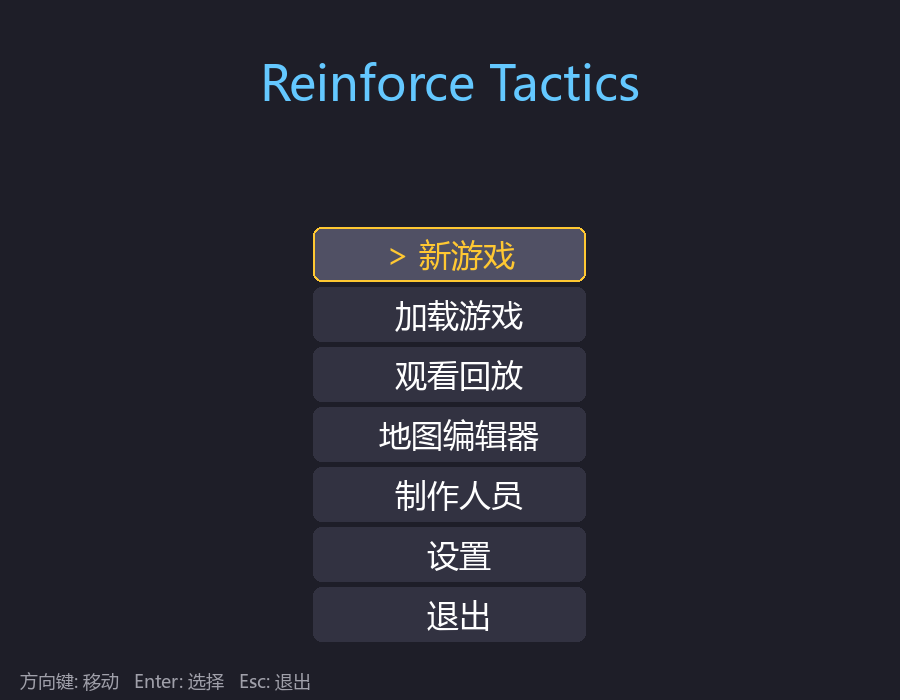
```

---

## 3. 仓库地图（你会反复碰到的包）

```text
reinforce-tactics/
├── main.py                 # CLI / GUI 总入口
├── reinforcetactics/       # 可安装的 Python 包
│   ├── core/               # GameState、格子、单位（无 pygame）
│   ├── game/               # 规则 mechanics、各类 Bot
│   ├── rl/                 # Gym 环境、观察、掩码、训练器
│   ├── app/ · ui/          # GUI 会话与菜单
│   ├── tournament/         # 锦标赛与 Elo
│   ├── cli/                # train / evaluate / play / stats
│   └── utils/              # 设置、i18n、回放、字体…
├── maps/                   # CSV 地图
├── configs/                # 课程 / PPO / 自对弈等 YAML
├── models/                 # 训练产物（常被 gitignore）
├── scripts/                # 高级训练与锦标赛脚本
├── agents/                 # 给人 / AI 助手看的知识库（本指南在此）
└── docs/ · docs/zh/        # 作者实验笔记（更碎、更专业）
```

### 3.1 主包职责一句话

| 包路径 | 一句话 |
|--------|--------|
| `reinforcetactics.core` | **唯一真相源** `GameState`：金币、单位、合法动作、`end_turn` |
| `reinforcetactics.game` | 战斗/收入规则 + Simple/Medium/Advanced/LLM/Model Bot |
| `reinforcetactics.rl` | `StrategyGameEnv`：把一局游戏变成 `reset` / `step` |
| `reinforcetactics.cli` | `main.py --mode train|evaluate|play|stats` 的实现 |
| `reinforcetactics.tournament` | 循环赛调度与 Elo |
| `reinforcetactics.ui` / `app` | 给人点的界面（训练 headless 不需要窗口） |

分层总览（更细）：[`../source-analysis/overview.md`](../source-analysis/overview.md)。

### 3.2 两套「agents 文档」怎么用

| 目录 | 适合 |
|------|------|
| **本指南** `learning-guide/` | 从零按顺序学 |
| `algorithms/` | 已经知道名词，查「PPO / 掩码 / 塑形」卡片 |
| `source-analysis/` | 打开 IDE 跟调用链 |
| `usage/` | 安装、汉化、git 提交约定 |
| `troubleshooting/` | 字体乱码、回放重复等 |

算法总览入口：[`../algorithms/overview.md`](../algorithms/overview.md)。

---

## 4. Conda 环境与 extras

### 4.1 环境名

本机约定 Conda 环境名：**`reinforce-tactics`**（Python 3.12 左右）。

```powershell
conda activate reinforce-tactics
python -V
```

若尚未创建，见 [`../usage/local-run-guide.md`](../usage/local-run-guide.md) 与 [`../../docs/LOCAL_DEPLOY.md`](../../docs/LOCAL_DEPLOY.md) / [`../../deploy/README.md`](../../deploy/README.md)。

### 4.2 依赖档位（extras）

定义在仓库根 `pyproject.toml`：

| Extra | 装了能干什么 | 本指南默认假设 |
|-------|----------------|----------------|
| **base**（必装） | Gymnasium、SB3、sb3-contrib、torch、tensorboard… | ✅ 已装 |
| **`[gui]`** | pygame-ce、截图/视频导出相关 | 玩 GUI 需要；纯 headless 训练可无 |
| **`[llm]`** | OpenAI / Anthropic / Google 客户端 | 跑 LLM Bot 才需要 |
| **`[dev]`** | pytest、ruff、mypy、pre-commit | 改代码/跑测试 |
| **`[cloud]`** | Google Cloud Storage 等 | **本指南不覆盖**；本地可不装 |

可编辑安装示例：

```powershell
pip install -e ".[gui,llm,dev]"
# 一般不装 cloud：
# pip install -e ".[cloud]"
```

### 4.3 本指南明确不覆盖的内容

- Google Cloud / Vertex AI 作业提交与账单
- 多机分布式训练
- 把模型推到线上服务

云相关原文可自行查阅 `docs/vertex_training.md` / `docs/zh/vertex_training.md`，**不是入门主线**。

### 4.4 GPU 与否

本仓库在 CPU 上即可完成短训与评估。有 CUDA 的 PyTorch 会更快，但**没有 GPU 不是 blockers**。后面 05 章短训 2000 步，CPU 通常几分钟内结束。

---

## 5. 日常工作流（你会反复做的事）

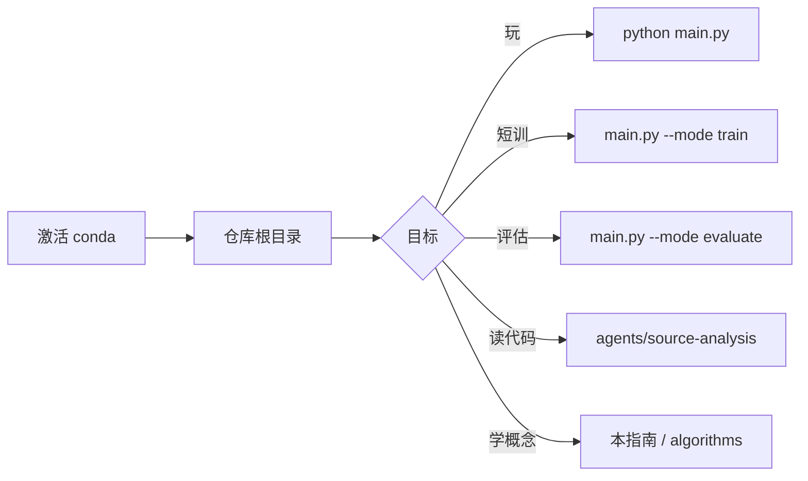

| 目标 | 命令 / 入口 |
|------|-------------|
| 打开 GUI | `python main.py` 或 `python main.py --mode play` |
| 短训冒烟 | `python main.py --mode train --algorithm ppo --timesteps 2000 --opponent bot` |
| 评估 zip | `python main.py --mode evaluate --model models/ppo_final.zip --episodes 5` |
| 看帮助 | `python main.py --help` |
| 跑测试 | `pytest tests/test_gym_env.py -q`（需 `[dev]`） |

本地操作细则：[`../usage/local-run-guide.md`](../usage/local-run-guide.md)。

---

## 6. 实操：验证 import

在**仓库根**、已 `conda activate reinforce-tactics` 时执行：

```powershell
python -c "import reinforcetactics, gymnasium, torch; print('ok', reinforcetactics.__file__)"
```

期望：打印 `ok` 以及指向本仓库内 `reinforcetactics` 包的路径（可编辑安装时一般是 `...\reinforce-tactics\reinforcetactics\...`）。

再验证 RL 环境类能导入：

```powershell
python -c "from reinforcetactics.rl.gym_env import StrategyGameEnv; print(StrategyGameEnv)"
```

可选：GUI 依赖（若你装了 `[gui]`）：

```powershell
python -c "import pygame; print('pygame', pygame.version.ver)"
```

### 6.1 常见失败

| 现象 | 可能原因 | 处理 |
|------|----------|------|
| `No module named reinforcetactics` | 未在环境中安装包 / 未激活 conda | `conda activate` 后 `pip install -e .` |
| `No module named gymnasium` | base 依赖缺失 | `pip install -e .` 或按 `requirements.txt` |
| `No module named pygame` | 未装 gui extra | `pip install -e ".[gui]"` |
| 命令在错误目录 | 不在含 `main.py` 的根 | `cd` 到仓库根再试 |
| 中文菜单方框 | 字体问题 | 见 [`../troubleshooting/chinese-font-display.md`](../troubleshooting/chinese-font-display.md) |

---

## 7. 符号与排版约定（后续章节）

- 公式用 `$$ ... $$` 或 `\[ ... \]`。
- 第一次出现的术语会给**中文白话 + 英文**。
- 代码路径用反引号；可点击的文档用 Markdown 链接。
- **Env 步**与**游戏回合**从第 02 章起严格区分——这是本项目最容易混的一点。

---

## 8. 学完 00 你应能回答

1. 我在哪个目录敲命令？Conda 环境名是什么？
2. `gui` / `llm` / `dev` / `cloud` 各干什么？本指南是否需要 cloud？
3. 训练逻辑主要在哪个包？规则引擎在哪个包？

若三条都能脱口而出，进入 [01 · 为何用 RL 与这款游戏](01-why-rl-and-this-game.md)。

---

## 自测

1. **操作**：写出激活环境并检查 `gymnasium` 可导入的两条 PowerShell 命令（可与上文不同，但必须能工作）。
2. **概念**：为什么训练路径可以不装 `pygame`，而「打开主菜单」不行？
3. **导航**：若你想查「非法动作掩码」的短文，应打开 `algorithms/` 下哪一类文档？源码又在 `source-analysis/` 的哪一篇？

<details>
<summary>参考答案（先自己想再展开）</summary>

1. `conda activate reinforce-tactics`，然后
   `python -c "import gymnasium; print(gymnasium.__version__)"`（目录在仓库根更稳妥）。
2. 领域层与 RL 环境不依赖渲染；`main.py --mode play` 走 `ui/` + pygame。
3. 算法：[`../algorithms/action-masking.md`](../algorithms/action-masking.md)；源码：[`../source-analysis/rl-gym-env.md`](../source-analysis/rl-gym-env.md)。

</details>

---

**下一章**：[01 · 为何用 RL 与这款游戏](01-why-rl-and-this-game.md)

---


<div style="page-break-before: always;"></div>

# 01 · 为何用强化学习，以及为何是这款游戏

上一章你已经能 import 包。本章回答两个「为什么」：

1. **为什么**不用普通监督学习解决「怎么打这盘棋」？
2. **为什么**回合制策略（本仓库这款游戏）是练 RL 的好靶场？

读完后你应能用自己的话向同事解释：RL 在优化什么，以及本项目的五根支柱。

---

## 1. 一张图先建立项目印象


主菜单背后其实挂着多条能力线：**人机对战、读档回放、设置语言、以及命令行训练**。GUI 是「看得见的游戏」；同一套规则引擎也可以 **完全无窗口** 地被 Gym 环境驱动，这是研究向项目的关键设计。

---

## 2. 监督学习 vs 强化学习：同一目标，两种反馈

### 2.1 用「学开车」类比

| 方式 | 老师给什么 | 学生学什么 |
|------|------------|------------|
| **监督学习** | 每一帧画面配「正确方向盘角度」标签 | 模仿标注数据：\(x \mapsto y\) |
| **强化学习** | 很少直接给「正确动作」；给**结果好坏**（有没有撞、到没到终点） | 在交互中改策略，让**长期总分**变高 |

策略游戏几乎不可能有「每一步的标准答案」：

- 高手在同一局面也可能分歧；
- 早期造兵 vs 抢塔的价值，要几十步后才显现；
- 对手在变，最优应对也在变。

所以我们把问题建成：

> 智能体在局面 \(s\) 选动作 \(a\)，环境给新局面与奖励 \(r\)，重复直到终局；目标是让期望累计奖励尽量大。

这就是 RL 的核心循环。算法总览见 [`../algorithms/overview.md`](../algorithms/overview.md)。

### 2.2 代码世界的对应

| 监督学习 | 强化学习（本项目） |
|----------|-------------------|
| 数据集 `(x, y)` | 轨迹：观察、动作、奖励序列 |
| 损失函数对标签 | 对**回报** \(G\) 或优势 \(A\) 的代理目标 |
| 离线一次训完也可 | 常要 **边交互边学**（on-policy 如 PPO） |
| 评估准确率 | 评估胜率 / Elo / 对固定 Bot 的分 |

行为克隆（BC）会把「专家回放」当监督学习用——那是 **热启动**，真正变强往往还要再上 RL。见后续 Part C 与 [`../algorithms/behavior-cloning.md`](../algorithms/behavior-cloning.md)。

### 2.3 延迟奖励：为什么比分类难

若只在「占领敌方总部」时给 \(+1000\)，中间几百步几乎全是 \(0\)。
智能体要回答：**刚才那步造兵，是不是导致了 40 步后的胜利？**
这叫 **信用分配（credit assignment）**。第 03 章的折扣回报、第 07 章的奖励塑形，都是为了对付它。

---

## 3. 为什么「回合制策略」适合当 RL 基准

不是所有游戏都同样适合入门 RL。本类游戏有几条对研究者友好的性质：

### 3.1 离散、可枚举的动作（虽多但规则清晰）

- 动作是「造哪个兵、从哪走到哪、打谁、结束回合」等，而不是连续力矩。
- 规则引擎能列出 **合法动作**（`get_legal_actions`），便于做 **动作掩码**。
- 便于写规则 Bot（Simple / Medium / Advanced）当固定对手与课程台阶。

### 3.2 状态可完全访问（默认可关战争迷雾）

- 训练默认可在完整信息下进行，降低 POMDP 难度。
- 需要时再开 fog，研究部分可观察。

### 3.3 一局既不太短也不「无限帧」

- 比 Atari 单帧决策更「有计划」：经济、站位、攻城。
- 比完整 RTS 微操简单：时间被 **回合** 切块。
- 但要注意：对 RL 接口而言，一步常常是 **一个微动作**，不是整回合（第 02 章重点）。

### 3.4 多条能力线可共享同一引擎

同一 `GameState` 可服务：

| 用途 | 消费者 |
|------|--------|
| 人玩 | GUI `app` / `ui` |
| 训智能体 | `StrategyGameEnv` |
| 规则 AI | `game/bot*.py` |
| 模型 AI | `ModelBot` 加载 `.zip` |
| 比强弱 | `tournament` + Elo |

这意味着你学的不是「一个孤立的 cartpole 玩具」，而是 **可扩展的研究脚手架**。

### 3.5 明确的胜负与可塑形的中间信号

- 终局：占 HQ、歼灭、回合上限和棋——稀疏但清晰。
- 中间：击杀、占领进度、经济差——可做塑形（也容易设错，第 07 章专门讲坑）。

---

## 4. 本项目的五根支柱

记住这句话：

> **Play · Train · Bots · Tournament · LLM**

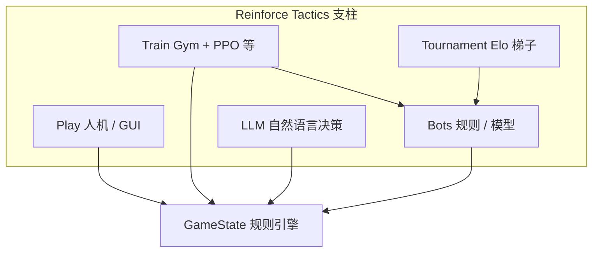

### 4.1 Play（玩）

```powershell
python main.py --mode play
```

选 1v1、beginner 图、Human vs SimpleBot，点单位、造兵、**End Turn**。
这是建立「状态长什么样」的最快方式。本地步骤见 [`../usage/local-run-guide.md`](../usage/local-run-guide.md)。

### 4.2 Train（训）

```powershell
python main.py --mode train --algorithm ppo --timesteps 2000 --opponent bot
```

Headless：环境里包着 `GameState` + 对手 Bot，SB3 的 PPO 在改策略网络。
更认真的课程训练走 `scripts/train/train_bootstrap.py` + YAML（Part C）。

### 4.3 Bots（对手与基准）

| 类型 | 角色 |
|------|------|
| Random / Noop / BalancedRandom | 弱基准、压力测试、课程最低档 |
| Simple / Medium / Advanced | 规则强度阶梯 |
| ModelBot | 加载你训好的策略 |
| AlphaZeroBot | 搜索 + 网络（进阶） |

Bot 源码导读：[`../source-analysis/game-bots.md`](../source-analysis/game-bots.md)。

### 4.4 Tournament（锦标赛）

固定赛程、多 Bot 循环赛、Elo 更新。用来回答「这次改奖励到底变强了没有」，而不是只看训练曲线。
见 [`../source-analysis/tournament-system.md`](../source-analysis/tournament-system.md) 与 [`../algorithms/evaluation-and-elo.md`](../algorithms/evaluation-and-elo.md)。

### 4.5 LLM（大模型 Bot）

把局面序列化成提示词，让 GPT/Claude/Gemini 输出动作（需 `[llm]` 与 API Key）。
它不是本指南 Part A+B 主线，但说明「决策者可插拔」：只要会操作 `GameState`，就能进同一生态。
见 [`../source-analysis/game-llm-and-model-bots.md`](../source-analysis/game-llm-and-model-bots.md)。

---

## 5. 高阶项目循环（你训练时实际在转的圈）

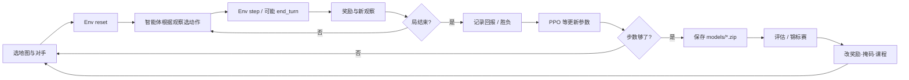

- **内环**：交互采样（数据从哪来）。
- **中环**：参数更新（学到什么）。
- **外环**：评估与改实验设置（科研节奏）。

第 05 章会把内环 + 中环落成一条可复制的 PowerShell 命令。

---

## 6. 你将优化的「东西」到底是什么

直觉上：优化 **策略** \(\pi(a \mid o)\)——在观察 \(o\) 下选动作 \(a\) 的概率分布（或确定性规则）。

实现上（PPO / MaskablePPO）：

- 一个神经网络（常叫 Actor）输出各动作的分数；
- 另一个头（Critic）估计「这局面大概值多少」；
- 用采样到的轨迹算优势，**鼓励比预期好的动作、抑制比预期差的**。

公式与 clip 细节见 [`../algorithms/ppo.md`](../algorithms/ppo.md)；第 03 章先补期望、折扣、梯度直觉。

**你不会**在 Part A+B 手写反向传播；你会调用 Stable-Baselines3 的 `model.learn(...)`，但必须理解它在优化什么，否则调参像巫术。

---

## 7. 和「只写一个会赢的脚本 Bot」有何不同

| 规则 Bot | RL 智能体 |
|----------|-----------|
| 人写 if-else / 启发式 | 人写环境、奖励、网络结构 |
| 强度上限受设计者想象约束 | 理论上可发现非直观战术 |
| 改地图可能要重写规则 | 同一算法可换地图再训（需注意泛化） |
| 行为可解释 | 行为需用对局与特征分析来解释 |

实践中两者互补：规则 Bot 当 **对手与课程**，RL 去爬更高 Elo。项目文档里大量「bootstrap lessons」正是 RL 与规则对手较劲的经验。

---

## 8. 建议你现在就做的 10 分钟体验（可选但强烈推荐）

1. `conda activate reinforce-tactics`
2. `python main.py`
3. 新游戏 → 1v1 → beginner → 己方 Human，对方 SimpleBot
4. 只做三件事：在 HQ/建筑 **买一个 Warrior**、**移动**、点 **结束回合**
5. 观察：结束回合后对方会行动，你的金币与单位如何变化

这半局会让第 02 章的「P2 为何能买两个 Warrior」变得不抽象。

---

## 9. 常见误解（提前拆弹）

1. **「RL 就是深度学习」**
   深度学习是函数逼近工具；RL 是 **交互式决策问题** 的框架。可用表格 Q-learning，也可用神经网络。

2. **「有了大模型就不需要 RL」**
   LLM Bot 仍要环境与合法动作；且没有对局反馈时很难稳定变强。RL 与 LLM 可组合，不是互相替代。

3. **「训练曲线上升 = 真的变强」**
   可能过拟合某个 Bot 的漏洞，或在刷塑形分。需要 **评估与锦标赛**（支柱 4）。

4. **「这个游戏太简单，学不到真东西」**
   稀疏奖励、巨大离散动作空间、非法动作、非平稳对手（自对弈）——正是现代深度 RL 的经典痛点，只是地图比星海小。

---

## 10. 本章与后续的衔接

| 下一章 | 你将得到 |
|--------|----------|
| [02](02-game-mechanics-as-mdp.md) | 规则 → 状态/动作/奖励/转移；**微动作 vs 回合** |
| [03](03-math-without-tears.md) | 读公式所需的最小数学 |
| [04–05](04-gymnasium-and-sb3.md) | 标准 API + 第一次 `learn` |
| [06–07](06-observation-action-mask.md) | 智能体「看见什么、被禁什么、为钱学什么」 |

源码鸟瞰继续读：[`../source-analysis/overview.md`](../source-analysis/overview.md)。

---

## 自测

1. 用两句话对比：监督学习的训练信号 vs 强化学习的训练信号。
2. 列出本项目五根支柱，并各举一个仓库内入口（命令或目录即可）。
3. 为什么说「延迟奖励」让策略游戏比 ImageNet 分类更难？（不需要公式）

<details>
<summary>参考答案</summary>

1. 监督：每样本有标签，直接拟合 \(y\)；RL：通过与环境交互获得奖励，优化长期累计回报，往往没有逐步标签。
2. Play：`main.py --mode play`；Train：`--mode train` / `reinforcetactics/rl`；Bots：`game/bot*.py`；Tournament：`tournament/` / `scripts/tournament.py`；LLM：`game/llm_bot.py` + `[llm]`。
3. 好结果很晚才出现，中间大量动作没有直接对错标签，必须做信用分配。

</details>

---

**上一章**：[00 · 如何使用本指南](00-how-to-use-this-guide.md) · **下一章**：[02 · 游戏机制作为 MDP](02-game-mechanics-as-mdp.md)

---


<div style="page-break-before: always;"></div>

# 02 · 游戏机制如何变成 MDP

强化学习把问题建成 **马尔可夫决策过程（MDP）**：状态、动作、转移、奖励、折扣。
本章用 **白话规则** 把本游戏填进这五个格子，并强调全指南最关键的一点：

> **`StrategyGameEnv.step` 的一步 = 一个微动作；游戏「回合」要等 `end_turn`。**

源码导读：[`../source-analysis/core-game-engine.md`](../source-analysis/core-game-engine.md) · [`../source-analysis/rl-gym-env.md`](../source-analysis/rl-gym-env.md)
算法对照：[`../algorithms/mdp-gymnasium-basics.md`](../algorithms/mdp-gymnasium-basics.md)

---

## 1. 先看棋盘长什么样


你看到的是：网格地形、双方单位、建筑（总部 / 普通建筑 / 塔）、金币与回合信息。
对 RL 而言，这些会被编码成观察张量（第 06 章）；本章先讲 **规则语义**。

---

## 2. 规则白话：单位、建筑、收入、胜利

### 2.1 单位（8 种）

常量在 `reinforcetactics/constants.py` 的 `UNIT_DATA` / `ALL_UNIT_TYPES`。

| 代码 | 名称 | 费用（默认） | 定位一句话 |
|------|------|--------------|------------|
| W | Warrior | 200 | 便宜近战、占点好手 |
| C | Cleric | 200 | 治疗与解控 |
| A | Archer | 250 | 远程；山地形程更远 |
| M | Mage | 300 | 远程 + 麻痹 |
| K | Knight | 350 | 冲锋加伤 |
| R | Rogue | 350 | 侧袭与闪避 |
| S | Sorcerer | 350 | 加速与攻防 Buff |
| B | Barbarian | 400 | 高机动高血玻璃炮 |

细节表见用户站/docs-site 的游戏机制文；训练时可用 `engine_overrides` 改费用与数值（研究平衡时用）。

### 2.2 建筑与收入

| 建筑 | 地图码 | 每回合收入（默认） | 备注 |
|------|--------|-------------------|------|
| 总部 HQ | `h` | 150 | 被敌方占完 → 你输 |
| 建筑 Building | `b` | 100 | 也是 **造兵点** |
| 塔 Tower | `t` | 50 | 经济点 |

- **起始金币**：双方都是 **`STARTING_GOLD = 250`**。
- 收入在 **某玩家成为当前玩家时**（`end_turn` 切换之后）结算并加入其金币。
- 占领：单位站在建筑上 **Seize**，按单位当前 HP 扣建筑 HP；扣到 0 换主人。中立建筑可缓慢回血。

### 2.3 胜利条件

| 条件 | `end_reason`（代码） |
|------|----------------------|
| 占领敌方 HQ | `hq_capture` |
| 对方单位全灭 | `elimination` |
| 回合数打满 | `max_turns_draw`（和棋） |
| 认输 | `resign` |

RL 环境还有 **env 步数上限** `max_steps` → `truncated`（人为截断，不是规则和棋）。见第 04 章 `terminated` vs `truncated`。

### 2.4 你一回合里通常做什么

1. （可选）在己方建筑空位 **造兵**（扣金币）
2. **移动** 单位
3. **攻击** / 技能 / **占领**
4. 点 **结束回合** → 轮到对手整回合

GUI 与 Bot 都是这个心智模型。**Gym 环境把 1–4 拆成多次 `step`。**

---

## 3. 关键：Env 微动作 vs 游戏回合

### 3.1 对照表

| 概念 | 含义 | 代码落点 |
|------|------|----------|
| **Env 步** / 微动作 | 智能体一次决策：造一个兵、移动一次、打一下、`end_turn`… | `StrategyGameEnv.step` |
| **游戏回合** | 当前玩家可以连续做多个微动作，直到 `end_turn` | `GameState` 的 `current_player` |
| **对手回合** | 你 `end_turn` 之后，环境内调用对手 `take_turn()`，对手内部可循环多个微动作再 `end_turn` | `_opponent_turn` |

因此：

- 一局可能有 **成百上千** 个 env 步；
- TensorBoard 的 timesteps 计的是 env 步，不是「游戏回合数」；
- 信用分配更难：终局奖励要回传到很早以前的造兵决策。

### 3.2 回合生命周期（Mermaid）

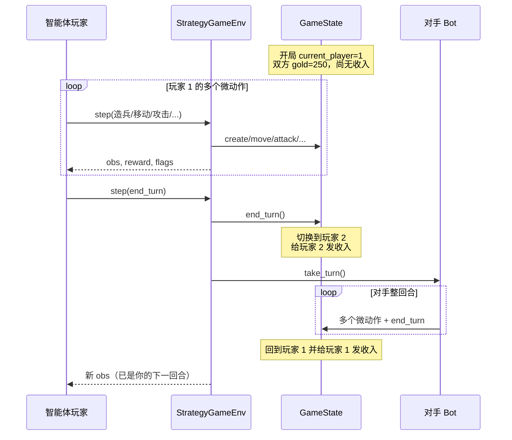

### 3.3 为什么 P2 开局能买 2 个 Warrior？

数字（默认常量，`constants.py`）：

- 双方开局金币：\(250\)（**相同**，不是 P2 开挂）
- Warrior 费用：\(200\)
- HQ 收入：\(150\)；建筑：\(100\)；塔：\(50\)

以 `maps/1v1/beginner.csv` 为例：双方对称地各有 **1 总部 + 2 建筑**，
每侧「满地产」收入为：

\[
150 + 100 + 100 = 350
\]

时间线：

1. **开局**：P1 先手，金币 250，**尚未**领过任何结构收入。
   只能买 **1** 个 Warrior（还剩 50），买不起第 2 个。
2. P1 操作完毕 → **`end_turn`**。
3. `end_turn` 内部（关键顺序）：
   - 把 `current_player` 切到 **P2**；
   - 对 **新的当前玩家 P2** 调用 `calculate_income` 并发钱。
4. P2 此时金币：

\[
250 + 350 = 600
\]

5. \(600 / 200 = 3\) → 理论上最多 **3** 个 Warrior；Bot 常见是先买 **2** 个。

即使用「只算 HQ」的保守估计 \(250+150=400\)，也已经够 2 个 W。

这不是 bug，而是 **「收入在成为当前玩家时结算」** 与 **「P1 先手但开局双方都还没领过收入」** 叠加的结果：

- P1 的第一回合：**没有**开局收入，只用起始 250；
- P2 的第一回合：起始 250 **+** 第一次成为当前玩家时的地产收入。

设计启示：先手有节奏优势，但经济上 P2 第一回合更「富」——规则 Bot 与 RL 都会利用这一点。读 `GameState.end_turn` 可见「切换玩家 → `calculate_income`」顺序。

---

## 4. 把规则填进 MDP 五元组

经典写法：

\[
\mathcal{M} = (\mathcal{S}, \mathcal{A}, P, R, \gamma)
\]

| 符号 | 本游戏中的含义 |
|------|----------------|
| \(\mathcal{S}\) | 完整局面：格子、单位列表、金币、当前玩家、冷却与 Buff、`game_over`… 即 **`GameState` 能表达的一切** |
| \(\mathcal{A}\) | 微动作集合：造兵/移动/攻击/占领/技能/`end_turn`… 常编码为 6 维离散或 flat 索引 |
| \(P(s'\|s,a)\) | 转移：多数规则 **确定性**；少数含随机（如 Rogue 闪避）。对手 Bot 也可引入随机策略 |
| \(R\) | 由 `reward_config` 定义的即时奖励 + 势函数塑形 + 终局奖（第 07 章） |
| \(\gamma\) | 折扣因子，训练与塑形应一致，常用 \(0.99\) |

### 4.1 状态 vs 观察

- **状态 \(s\)**：引擎内部完整信息（`GameState`）。
- **观察 \(o\)**：给策略网络的张量字典（`build_observation`），默认 agent-relative；可含战争迷雾。

完整信息时 \(o\) 近似够用；有雾时是 **POMDP**，入门可先关雾。

### 4.2 动作：结构化微动作

Gym 默认 `MultiDiscrete` 六维（详见第 06 章）：

```text
[action_type, unit_type, from_x, from_y, to_x, to_y]
```

`action_type` 含：`create_unit`, `move`, `attack`, `seize`, heal/cure, **`end_turn`**, 麻痹/加速/Buff 等。

合法集合由 `GameState.get_legal_actions(player)` 枚举，再转成掩码。

### 4.3 奖励（先建立量级直觉）

默认量级（可被配置覆盖）：

| 信号 | 默认量级 | 角色 |
|------|----------|------|
| 赢 / 输 | \(\pm 1000\) | 终局主目标 |
| 和棋 | \(-200\) 量级 | 避免无限磨 |
| 击杀 / 占领等 | 较小正数 | 稠密塑形 |
| 非法动作 | \(-10\) | 兜底惩罚 |

**真正「什么叫学得好」应以胜负与评估为准**，不是中途击杀分刷到最高。

### 4.4 转移与「对手是环境的一部分」

对训练中的智能体来说：

- 自己的微动作 → 改 `GameState`；
- `end_turn` → 对手 `take_turn` 整段也是转移的一部分；
- 对手若是学习型或历史快照池，环境会 **非平稳**（自对弈章节再展开）。

---

## 5. 代码指针：从规则到 Env

### 5.1 `GameState`（领域 SSOT）

| 你想了解 | 去哪 |
|----------|------|
| 构造、金币、覆盖项 | `reinforcetactics/core/game_state.py` |
| 合法动作枚举 | `get_legal_actions` |
| 结束回合与收入 | `end_turn` |
| 胜负写入 | `_set_game_over` |
| 战斗与收入计算 | `reinforcetactics/game/mechanics.py` |
| 默认数值表 | `reinforcetactics/constants.py` |

文档：[`../source-analysis/core-game-engine.md`](../source-analysis/core-game-engine.md)

### 5.2 `StrategyGameEnv`（RL 外壳）

| 你想了解 | 去哪 |
|----------|------|
| `reset` / `step` | `reinforcetactics/rl/gym_env.py` |
| 观察编码 | `reinforcetactics/rl/observation.py` |
| 掩码封装 | `reinforcetactics/rl/masking.py` |

文档：[`../source-analysis/rl-gym-env.md`](../source-analysis/rl-gym-env.md)

语义示意（非逐行复制）：

```python
# step 末尾语义
terminated = self.game_state.game_over          # 规则终局
truncated = self.current_step >= self.max_steps  # 步数截断
return obs, reward, terminated, truncated, info
```

`end_turn` 分支才会 `_opponent_turn()`。

### 5.3 谁在用同一套规则

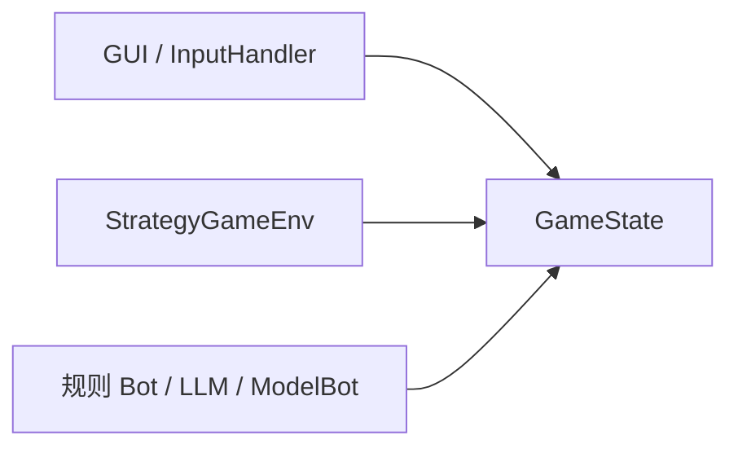

这保证：**你在 GUI 里理解的规则 = 训练里的规则**（同一套 API）。

---

## 6. 把一局拆成 MDP 轨迹（心智模型）

记智能体视角的轨迹：

\[
o_0, a_0, r_1, o_1, a_1, r_2, \ldots, o_T
\]

可能的片段：

| \(t\) | \(a_t\) 含义 | 说明 |
|-------|--------------|------|
| 0 | 造 Warrior | 金币 250→50 |
| 1 | 移动该单位 | 仍是 P1 回合 |
| 2 | `end_turn` | 触发对手整回合；奖励含对手造成的影响 |
| 3… | 下一回合微动作 | … |
| \(T-1\) | 占领 HQ 的 seize | 随后 `terminated=True`，大终局奖 |

注意：`a_2 = end_turn` 的 **一个** env 步，内部可能发生对手 **几十个** 领域动作——但它们不是你的策略输出的 \(a\)，而是环境转移。

---

## 7. 地图、模式与 Env 限制

| 能力 | 说明 |
|------|------|
| 地图 CSV | `maps/1v1/*.csv` 等；单元格如 `h_1` 表示 P1 的 HQ |
| GUI 模式 | 1v1 / 1v1v1 / 2v2 都可能有 |
| **RL Env** | **仅 1v1**（观察 self/opp 通道写死） |

训练入门优先：`maps/1v1/beginner.csv` 或 CLI 默认图。

---

## 8. 常见误解

1. **「timesteps=2000 就是打 2000 局」**
   否，是约 2000 次 `step`（微动作级）。

2. **「每 step 都会换手」**
   否，只有 `end_turn` 才换手。

3. **「双方每回合开始都有 250 收入」**
   收入来自建筑，HQ 默认 150；且 **开局第一手 P1 尚未领收入**。

4. **「状态就是 RGB 截图」**
   本项目默认是 **结构化张量**（grid/units/global_features），不是像素。

5. **「非法动作环境会帮我改成合法」**
   不保证；应靠掩码。无掩码时可能吃 `invalid_action` 惩罚。

---

## 9. 小结：本章的「地图」

```text
人类规则语言
    ↓
GameState API（合法动作、end_turn、胜负）
    ↓
StrategyGameEnv（观察、掩码、奖励、step）
    ↓
SB3 / MaskablePPO（第 04–05 章）
```

你已经能解释为什么这是一个 MDP。下一章补齐读公式所需的最小数学，仍然不要求微积分证明。

---

## 自测

1. 用自己的话区分 **env 步** 与 **游戏回合**，并指出哪一个对应 `end_turn`。
2. 从起始金币与收入规则，推导 **为何 P2 第一回合可以买 2 个 200 金的 Warrior**，而 P1 第一回合通常不能。
3. MDP 中的 \(\mathcal{S}\) 在本项目里主要由哪个类承载？策略实际吃到的 \(o\) 又由哪个模块构建？

<details>
<summary>参考答案</summary>

1. Env 步 = 一次微动作（`step`）；游戏回合 = 当前玩家连续微动作直到 `end_turn`；`end_turn` 是一种特殊微动作，触发换手与对手回合。
2. 双方开局 250；Warrior 200。P1 先手无开局收入 → 最多 1 个。P1 `end_turn` 后 P2 收 HQ 收入 150 → \(250+150=400\) → 2 个 Warrior。
3. \(\mathcal{S}\)：`GameState`；\(o\)：`observation.build_observation`（经 `StrategyGameEnv`）。

</details>

---

**上一章**：[01 · 为何用 RL](01-why-rl-and-this-game.md) · **下一章**：[03 · 无痛数学](03-math-without-tears.md)

---


<div style="page-break-before: always;"></div>

# 03 · 无痛数学：读懂后续公式的最小工具箱

本章 **不为证明定理**，只让你在看到

\[
G_t,\quad \mathbb{E}[\cdot],\quad \log\pi,\quad \nabla_\theta,\quad A_t
\]

时心里有画面。对象：会编程、高中概率即可的读者。

对照算法卡片：[`../algorithms/mdp-gymnasium-basics.md`](../algorithms/mdp-gymnasium-basics.md) · [`../algorithms/ppo.md`](../algorithms/ppo.md)

---

## 1. 期望 = 加权平均

### 1.1 白话

掷一枚不公平硬币：正面奖励 \(10\) 的概率 \(0.3\)，反面奖励 \(0\) 的概率 \(0.7\)。
「平均能拿多少」不是 \((10+0)/2\)，而是：

\[
\mathbb{E}[R] = 0.3\times 10 + 0.7\times 0 = 3
\]

**期望（expectation）** 就是：所有可能结果 × 各自概率，再求和。

### 1.2 符号表

| 符号 | 读法 | 含义 |
|------|------|------|
| \(\mathbb{E}[X]\) | 「X 的期望」 | \(X\) 的概率加权平均 |
| \(\mathbb{E}_{a\sim\pi}[X]\) | 「按策略 π 采样 a 时 X 的期望」 | 平均时用的概率来自 \(\pi\) |
| \(\sum_i p_i x_i\) | 求和 | 离散情形的期望写法 |

### 1.3 和 RL 的关系

策略 \(\pi\) 在局面 \(o\) 上对每个动作给出概率。
「这个策略有多好」≈ **按 \(\pi\) 玩游戏时，最终回报的期望**：

\[
J(\pi) = \mathbb{E}_{\tau\sim\pi}\big[G_0\big]
\]

- \(\tau\)：一整条轨迹
- \(G_0\)：从开头算起的折扣回报（下一节）
- 训练在做的事：改 \(\pi\) 的参数，让 \(J\) 变大

你不需要会算复杂积分；记住 **「好策略 = 高期望回报」** 即可。

### 1.4 小练习（心算）

三个动作奖励期望分别是 \(1, 5, 2\)，策略概率 \(0.2, 0.5, 0.3\)。
一步期望奖励 =

\[
0.2\times 1 + 0.5\times 5 + 0.3\times 2 = 0.2 + 2.5 + 0.6 = 3.3
\]

---

## 2. 折扣回报 \(G_t\) 与 \(\gamma\)

### 2.1 为什么要「折扣」

未来的分也有价值，但：

- 越远越不确定；
- 同样 \(+1\)，早拿到往往更香（可再投资经济）；
- 数学上让无穷长对局的总和收敛。

### 2.2 定义

从时刻 \(t\) 起的 **折扣回报**：

\[
G_t = r_{t+1} + \gamma r_{t+2} + \gamma^2 r_{t+3} + \gamma^3 r_{t+4} + \cdots
\]

也可写成：

\[
G_t = \sum_{k=0}^{\infty} \gamma^k r_{t+1+k}
\]

### 2.3 完整符号表

| 符号 | 含义 | 本项目常见值 |
|------|------|----------------|
| \(t\) | 时间步（env 步） | 0,1,2,… |
| \(r_{t+1}\) | 做完 \(a_t\) 后环境给的即时奖励 | 见 reward_config |
| \(\gamma\)（gamma） | 折扣因子，\(0\le\gamma\le 1\) | **0.99** 很常见 |
| \(G_t\) | 从 \(t\) 之后能拿到的「总价值」（折扣后） | 训练的优化目标相关量 |
| \(k\) | 相对 \(t\) 再往未来数的步数 | 0 表示下一步 |

**直觉旋钮**：

| \(\gamma\) | 行为倾向 |
|------------|----------|
| 接近 \(0\) | 极度短视，几乎只看下一步 |
| \(0.99\) | 重视长期，但仍对极远的奖励打折 |
| \(1\) | 不打折（有限局长时也常用，但塑形与价值估计要小心） |

### 2.4 必做数字例：\(r=1,1,1\)，\(\gamma=0.99\)

设只有三步奖励，之后为 0：

\[
r_1=1,\quad r_2=1,\quad r_3=1
\]

从 \(t=0\)：

\[
\begin{align*}
G_0
&= r_1 + \gamma r_2 + \gamma^2 r_3 \\
&= 1 + 0.99\times 1 + 0.99^2 \times 1 \\
&= 1 + 0.99 + 0.9801 \\
&= 2.9701
\end{align*}
\]

对比 \(\gamma=1\) 时 \(G_0=3\)。
**三个 \(+1\) 的「折扣总价值」约 \(2.97\)，不是 \(3\)。**

若大奖励很晚才到：\(r_1=r_2=0, r_3=1\)，

\[
G_0 = 0 + 0 + 0.99^2 \times 1 = 0.9801
\]

同样终局 \(+1\)，因为晚了两步，在 \(t=0\) 只值约 \(0.98\)。

### 2.5 和本游戏终局奖的量级直觉

默认赢棋约 \(+1000\)。若一局有 \(50\) 个 env 步才赢，中间塑形忽略：

\[
\gamma^{49}\times 1000 \approx 0.99^{49}\times 1000
\]

粗算 \(0.99^{50}\approx 0.605\)，故约 **600** 的起点价值。
**局越长，终局奖在开局时「缩水」越多**——这是长局信用分配困难的数学来源之一。

Python 心算验证：

```powershell
python -c "g=0.99; print(1 + g + g**2); print(g**49 * 1000)"
```

---

## 3. 概率与对数概率

### 3.1 策略是概率分布

在观察 \(o\) 下，策略给出：

\[
\pi(a \mid o) \in [0,1],\quad \sum_a \pi(a \mid o) = 1
\]

「采样一个动作」= 按这个分布抽签。

### 3.2 为什么出现 \(\log\pi\)

训练常最大化「好动作的概率」。对概率做 **对数** 有工程好处：

- 把很小的概率变成很大的负数，数值更稳；
- 乘积变求和：\(\log(p_1 p_2)=\log p_1+\log p_2\)；
- 策略梯度公式里自然出现 \(\nabla_\theta \log\pi_\theta(a|o)\)。

**你不必会推导**，记住：

| 说法 | 含义 |
|------|------|
| \(\pi(a|o)\) 大 | 策略很爱选这个动作 |
| \(\log\pi\) 大（不那么负） | 同上；\(\log 1=0\)，\(\log 0.01\approx -4.6\) |
| 提高好动作的 \(\log\pi\) | 让策略更常选它 |

数字：

\[
\log(0.5) \approx -0.693,\quad \log(0.9)\approx -0.105
\]

从 \(0.5\) 提到 \(0.9\)，对数从 \(-0.693\) 升到 \(-0.105\)（变大）。

### 3.3 掩码下的概率（预习第 06 章）

非法动作概率必须为 0。实现上常对 logits 做掩码再 softmax：

\[
\pi(a=i \mid o) = \frac{m_i e^{z_i}}{\sum_j m_j e^{z_j}}
\]

\(m_i=0\) 的动作不会被采样。详见 [`../algorithms/action-masking.md`](../algorithms/action-masking.md)。

---

## 4. 梯度：往哪边「拧」参数

### 4.1 不要害怕 \(\nabla\)

把神经网络参数想像成音响上的一排旋钮 \(\theta\)。
**梯度 \(\nabla_\theta J\)** 告诉你：每个旋钮 **稍微拧大一点时，目标 \(J\) 会升还是降、升多快**。

- 上坡方向 → 沿梯度走（最大化 \(J\) 时）；
- 深度学习框架自动算梯度（反向传播），你写的是前向与损失。

### 4.2 策略梯度的漫画版

我们希望：

- 若某步动作 **比平均好**（优势 \(A_t>0\)），就 **增大** 该动作的概率；
- 若 **比平均差**（\(A_t<0\)），就 **减小** 它。

示意更新方向：

\[
\theta \leftarrow \theta + \alpha \, \nabla_\theta \log\pi_\theta(a_t \mid o_t) \, A_t
\]

| 符号 | 含义 |
|------|------|
| \(\alpha\) | 学习率，步子迈多大 |
| \(\nabla_\theta \log\pi\) | 「怎样拧旋钮能提高这个动作的概率」 |
| \(A_t\) | 好坏程度；可正可负，决定拧的方向与力度 |

**没有微积分证明也能用**：把它当成「带权的打分更新」——好动作加分，坏动作减分，权重是优势。

### 4.3 为何需要 PPO 的 clip（直觉）

若某次更新把某一动作概率 **暴涨 10 倍**，策略可能突然崩溃。
PPO 用 **裁剪** 限制「新旧策略概率比」别离 1 太远（常见 \(\epsilon=0.2\)）。
细节与数字例：[`../algorithms/ppo.md`](../algorithms/ppo.md)。

---

## 5. 优势 \(A_t\)：比「平均水平」好多少

### 5.1 价值函数直觉

\[
V(o) \approx \text{从观察 } o \text{ 出发，按当前策略，期望能拿到的 } G
\]

Critic 网络学的就是这个「局面估价」。

### 5.2 优势

\[
A_t \approx \big(\text{实际这一步走下去有多好}\big) - V(o_t)
\]

| \(A_t\) | 训练含义 |
|---------|----------|
| \(>0\) | 这步比局面平均估价更好 → 鼓励 |
| \(<0\) | 更差 → 抑制 |
| \(\approx 0\) | 中规中矩 |

为什么不只用原始 \(G_t\)？
因为有的局面天生就好（已经快赢了），有的天生差；减去 \(V(o_t)\) 是在 **减基线、降方差**，让信号更干净。

### 5.3 极简数字

- 局面估价 \(V(o_t)=5\)
- 走完后估计回报（或 TD 目标）是 \(8\)
- 则 \(A_t \approx 8-5=+3\) → 加强该动作

PPO 里常用 **GAE** 把多步 TD 误差平滑成 \(A_t\)（\(\lambda\) 常见 0.95）。知道「GAE = 更稳地估优势」即可。

### 5.4 和即时奖励 \(r\) 的区别

| 量 | 时间尺度 | 角色 |
|----|----------|------|
| \(r_t\) | 单步 | 环境打的小分 |
| \(G_t\) | 从现在到结束 | 长期总分（折扣） |
| \(V(o)\) | 期望意义的长期 | 局面均分 |
| \(A_t\) | 相对均分的差值 | **更新策略的指挥棒** |

---

## 6. 把工具箱装回本项目

| 概念 | 你在本项目哪里碰到 |
|------|--------------------|
| \(\gamma\) | PPO 超参；`StrategyGameEnv(gamma=...)` 势函数塑形 |
| \(G_t\) / 回报 | 训练目标；Monitor 记录的 episode reward 是未折扣和或环境原始和（注意：日志里的「回报」定义可能与 \(G_t\) 略有差别） |
| \(\pi(a|o)\) | SB3 策略网络；MaskablePPO 在掩码上归一化 |
| \(\log\pi\) | 策略损失内部 |
| \(V, A\) | Actor-Critic；TensorBoard 上 value loss 等 |
| \(\mathbb{E}\) | 「多局平均胜率」就是经验期望 |

---

## 7. 可选：用 Python 巩固 \(G_t\)

```python
def discounted_return(rewards, gamma):
    """rewards: r_1, r_2, ..., r_T  （从第一步即时奖开始）"""
    G = 0.0
    for r in reversed(rewards):
        G = r + gamma * G
    return G

print(discounted_return([1, 1, 1], 0.99))   # ≈ 2.9701
print(discounted_return([0, 0, 1], 0.99))   # ≈ 0.9801
```

从后往前折算是实现里常用的写法，与展开式等价。

---

## 8. 常见误解

1. **「期望就是一次实验的结果」**
   期望是平均意义；一次对局的 \(G_0\) 是随机变量的一次采样。

2. **「\(\gamma=0.99\) 表示忽略 1% 的奖励」**
   更准确：每远 **一步**，再乘 0.99；远 \(n\) 步是 \(0.99^n\)。

3. **「对数概率是又一种奖励」**
   否，它是策略对动作的自信度（的对数），用在损失函数里。

4. **「优势为正就是绝对好棋」**
   只是相对 **当前价值估计** 更好；估计不准时优势也会噪。

5. **「我必须会手算梯度才能训 PPO」**
   否；你要会调学习率、看曲线、理解 \(A_t\) 在指挥什么。

---

## 9. 本章小结（一张清单）

- [ ] 期望 = 概率加权平均
- [ ] \(G_t\) = 未来奖励的折扣和；\(\gamma=0.99, r=1,1,1 \Rightarrow G_0\approx 2.9701\)
- [ ] \(\pi\) 与 \(\log\pi\)：策略有多爱某动作
- [ ] 梯度：拧参数让目标变大的方向
- [ ] 优势：比局面均分好多少，用来加权更新

下一章进入工程接口：Gymnasium 与 Stable-Baselines3。

---

## 自测

1. 计算 \(\gamma=0.9\)，奖励序列 \(r_1=2, r_2=2, r_3=2\) 的 \(G_0\)（写计算过程）。
2. 若某动作 \(\pi=0.1\) 被判定 \(A_t>0\)，训练倾向于把 \(0.1\) 调大还是调小？为什么用 \(A_t\) 而不是只用 \(r_{t+1}\)？
3. 为什么同样是终局 \(+1000\)，在第 5 步就赢与第 80 步才赢，对开局 \(G_0\) 的贡献不同？（用 \(\gamma\) 解释）

<details>
<summary>参考答案</summary>

1. \(G_0=2+0.9\times2+0.9^2\times2=2+1.8+1.62=5.42\)。
2. 调大。\(A_t\) 扣除了局面本身的基线价值，信号更公平；单步 \(r\) 不含长期后果。
3. 贡献近似 \(\gamma^{k} \times 1000\)，\(k\) 为大奖励出现的步数；\(k\) 越大 \(\gamma^k\) 越小。

</details>

---

**上一章**：[02 · 游戏机制作为 MDP](02-game-mechanics-as-mdp.md) · **下一章**：[04 · Gymnasium 与 SB3](04-gymnasium-and-sb3.md)

---


<div style="page-break-before: always;"></div>

# 04 · Gymnasium 与 Stable-Baselines3

有了 MDP 直觉后，工程上需要 **统一接口**：任何环境都提供 `reset` / `step`，任何算法库都能拿去训练。
本项目使用：

| 库 | 角色 |
|----|------|
| [Gymnasium](https://gymnasium.farama.org/) | 环境 API 标准（Farama 维护，Gym 继任者） |
| [Stable-Baselines3 (SB3)](https://stable-baselines3.readthedocs.io/) | PPO / A2C 等现成实现 |
| [sb3-contrib](https://sb3-contrib.readthedocs.io/) | **MaskablePPO** 等扩展 |

算法卡片：[`../algorithms/mdp-gymnasium-basics.md`](../algorithms/mdp-gymnasium-basics.md) · [`../algorithms/ppo.md`](../algorithms/ppo.md)
源码：[`../source-analysis/rl-gym-env.md`](../source-analysis/rl-gym-env.md)

---

## 1. Gymnasium 核心 API

### 1.1 生命周期

```text
env = make_env()
obs, info = env.reset(seed=0)
loop:
    action = policy(obs)          # 或随机 / 人类
    obs, reward, terminated, truncated, info = env.step(action)
    if terminated or truncated:
        obs, info = env.reset()
env.close()
```

### 1.2 返回值逐项

| 名称 | 类型直觉 | 含义 |
|------|----------|------|
| `obs` | 数组或 dict | 智能体观察 \(o\) |
| `reward` | float | 本步即时奖励 \(r\) |
| **`terminated`** | bool | **规则上**对局结束（赢/输/和） |
| **`truncated`** | bool | **外部**掐断（步数上限等） |
| `info` | dict | 诊断信息（不进观察） |

#### `terminated` vs `truncated`（必背）

| | `terminated=True` | `truncated=True` |
|--|-------------------|-------------------|
| 原因 | HQ 被占、歼灭、和棋规则等 | `current_step >= max_steps` |
| 语义 | 真正终局，没有「未来价值」 | 人为停止，训练器常仍用 \(V(s')\) bootstrap |
| 本项目 | `game_state.game_over` | env 步上限 |

两者可同时为假（对局继续）；一般不同时为「需要重置」的两种理由。任一为真都应 `reset` 开新局。

官方说明：[Gymnasium — Agent-Environment API](https://gymnasium.farama.org/introduction/basic_usage/)。

### 1.3 `reset`

```python
obs, info = env.reset(seed=42)
```

- 新开一局，返回初始观察；
- `seed` 控制随机性（地图固定时仍可能有 Rogue 闪避、随机 Bot 等）。

---

## 2. 本项目的观察与动作空间

### 2.1 Dict 观察

`StrategyGameEnv` 的 observation 是 **字典**（`spaces.Dict`），不是单张图：

| 键 | 形状（约） | 内容 |
|----|------------|------|
| `grid` | `(H, W, 11)` | 地形 one-hot + 归属 + 建筑 HP 比 |
| `units` | `(H, W, 16)` | 兵种、归属、是否耗尽行动、HP、状态 |
| `global_features` | `(5,)` | 己金/敌金/回合/己单位数/敌单位数（tanh 缩放） |
| `visibility` | `(H, W)` | 仅战争迷雾开启时 |

编码唯一入口：`reinforcetactics.rl.observation.build_observation`。
细节第 06 章；源码文 [`../source-analysis/rl-gym-env.md`](../source-analysis/rl-gym-env.md)。

因为是 Dict，SB3 策略网络用 **`MultiInputPolicy`**（多输入，而不是 `MlpPolicy` 单向量）。

### 2.2 MultiDiscrete 动作（默认）

```text
MultiDiscrete([10, 8, W, H, W, H])
  [0] action_type   0..9  造兵/移动/攻击/占领/治疗/end_turn/技能...
  [1] unit_type     0..7  对应 8 兵种（造兵时有意义）
  [2] from_x
  [3] from_y
  [4] to_x
  [5] to_y
```

一次 `step` 吃进长度为 6 的整数数组（或 flat 模式下的一个整数索引）。

### 2.3 可选 `flat_discrete`

把合法动作列成一张表，动作空间变成 `Discrete(max_flat_actions)`，掩码 **精确到候选**。
课程 Bootstrap 生产配置常偏好 flat，以减轻 MultiDiscrete 各维掩码的「过近似」。见第 06 章与 [`../algorithms/action-masking.md`](../algorithms/action-masking.md)。

---

## 3. Stable-Baselines3 你需要会的两件事

### 3.1 `model.learn`

```python
from stable_baselines3 import PPO

model = PPO("MultiInputPolicy", env, verbose=1, tensorboard_log="./tensorboard/")
model.learn(total_timesteps=10_000)
model.save("models/my_ppo")
```

- `total_timesteps`：与环境交互的 **env 步**总数；
- 内部循环：采样 → 算优势 → 多 epoch 更新；
- 文档：[SB3 PPO](https://stable-baselines3.readthedocs.io/en/master/modules/ppo.html)。

### 3.2 `model.predict`

```python
action, _state = model.predict(obs, deterministic=True)
obs, reward, terminated, truncated, info = env.step(action)
```

| `deterministic` | 行为 |
|-----------------|------|
| `True` | 取概率最大动作（评估常用） |
| `False` | 按分布采样（更接近训练时探索） |

CLI 评估模式封装了多局循环：第 05 章。

### 3.3 为何是 `MultiInputPolicy`

| 策略类 | 适用观察 |
|--------|----------|
| `MlpPolicy` | 一维 `Box` 向量 |
| `CnnPolicy` | 图像 |
| **`MultiInputPolicy`** | **`Dict` 多键**（本项目） |

看错策略类会在创建 model 时直接报错或维度不匹配。

---

## 4. 普通 PPO vs MaskablePPO

### 4.1 问题

离散动作里 **绝大多数组合非法**（从空格移动、打友军坐标等）。
普通 PPO 仍可能采样非法动作 → 大量 `invalid_action` 惩罚 → 几乎学不会。

### 4.2 解决：动作掩码 + MaskablePPO

- 环境提供 `action_masks()`（合法为 True）；
- **[MaskablePPO](https://sb3-contrib.readthedocs.io/en/master/modules/ppo_mask.html)**（`sb3-contrib`）在 softmax 前屏蔽非法 logit；
- 本仓库封装：`reinforcetactics.rl.masking.make_maskable_env` 等。

| | 普通 `PPO` | `MaskablePPO` |
|--|------------|----------------|
| 包 | `stable_baselines3` | `sb3-contrib` |
| 掩码 | 默认不用 | 每步读 mask |
| CLI 短训 `main.py --mode train` | 当前实现偏 **普通 PPO**（冒烟够用） | 认真训练 / 示例脚本常用 |
| 非法动作 | 靠惩罚硬扛 | 采样时基本避开 |

示例：`examples/train_with_action_masking.py`。
算法说明：[`../algorithms/action-masking.md`](../algorithms/action-masking.md) · [`../algorithms/ppo.md`](../algorithms/ppo.md)。

### 4.3 入门策略建议

1. **第 05 章**：先用 CLI 普通 PPO 跑通流水线（会训、会存、会评估）。
2. **第 06 章后**：理解掩码，再上 MaskablePPO / bootstrap 配置。
3. 不要在「环境都 step 不通」时先调 clip_range。

---

## 5. TensorBoard 基础

SB3 可写日志目录（CLI 默认 `./tensorboard/`）：

```powershell
tensorboard --logdir ./tensorboard
```

浏览器打开提示的 URL（常是 `http://localhost:6006`）。

| 常见曲线 | 粗读法 |
|----------|--------|
| `rollout/ep_rew_mean` | 回合奖励均值；上升通常是好事，但需防刷分 |
| `rollout/ep_len_mean` | 回合长度（env 步） |
| `train/loss` / `policy_gradient_loss` | 训练损失；剧烈爆炸要怀疑 lr |
| `train/entropy_loss` | 探索程度相关（实现里符号约定以 SB3 为准） |

**短训 2000 步**曲线会很噪，只适合确认「在跑」，不适合下「已经变强」的结论。

文档：[SB3 TensorBoard](https://stable-baselines3.readthedocs.io/en/master/guide/tensorboard.html)。

---

## 6. 实操：创建环境并随机 step（headless）

在仓库根、已激活 `reinforce-tactics`：

```powershell
python -c @"
from reinforcetactics.rl.gym_env import StrategyGameEnv

env = StrategyGameEnv(
    map_file='maps/1v1/beginner.csv',
    opponent='noop',   # 对手只 end_turn，便于冒烟
    render_mode=None,
)
obs, info = env.reset(seed=0)
print('obs keys:', sorted(obs.keys()))
print('action_space:', env.action_space)

total_r = 0.0
for t in range(20):
    action = env.action_space.sample()
    obs, r, terminated, truncated, info = env.step(action)
    total_r += r
    if terminated or truncated:
        print(f'episode ended at t={t}, terminated={terminated}, truncated={truncated}')
        obs, info = env.reset()
        break
else:
    print('finished 20 random steps without episode end')

print('sum reward (partial):', round(total_r, 3))
env.close()
print('ok')
"@
```

### 6.1 你应看到什么

- `obs keys` 含 `grid`, `units`, `global_features`；
- `action_space` 为 `MultiDiscrete` 或配置的 flat；
- 随机动作很多会非法 → 奖励可能偏负，**正常**；
- 打印 `ok` 表示环境可在无 GUI 下运行。

### 6.2 可选：打印掩码形状

```powershell
python -c @"
from reinforcetactics.rl.gym_env import StrategyGameEnv
env = StrategyGameEnv(map_file='maps/1v1/beginner.csv', opponent='noop')
env.reset(seed=0)
masks = env.action_masks()
if isinstance(masks, (list, tuple)):
    print('per-dim masks:', [m.shape for m in masks])
else:
    print('flat mask shape:', masks.shape, 'legal', int(masks.sum()))
env.close()
"@
```

---

## 7. CLI 与库代码如何接到一起

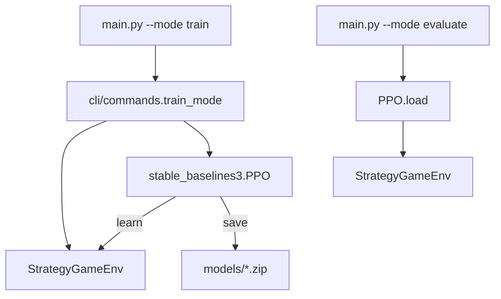

- 简单路径：`cli/commands.py` 里直接 `PPO(...)` + `Monitor`；
- 严肃路径：`scripts/train/*.py` + `configs/**/*.yaml` + 常为 MaskablePPO。

入口说明：[`../source-analysis/entrypoints-and-cli.md`](../source-analysis/entrypoints-and-cli.md)。

---

## 8. 外部文档（Markdown 链接）

| 资源 | 链接 |
|------|------|
| Gymnasium 文档首页 | https://gymnasium.farama.org/ |
| Gymnasium 基本用法 | https://gymnasium.farama.org/introduction/basic_usage/ |
| SB3 文档首页 | https://stable-baselines3.readthedocs.io/ |
| SB3 PPO | https://stable-baselines3.readthedocs.io/en/master/modules/ppo.html |
| MaskablePPO（sb3-contrib） | https://sb3-contrib.readthedocs.io/en/master/modules/ppo_mask.html |
| SB3 TensorBoard 指南 | https://stable-baselines3.readthedocs.io/en/master/guide/tensorboard.html |

---

## 9. 常见坑

1. **`obs` 是 dict，却当 numpy 直接喂错形状的网络**
   用 `MultiInputPolicy`，或自己写提取器（项目里有 `extractors`）。

2. **把 `truncated` 当成输了**
   截断只是步数到了；胜负看 `info` / `game_over` / 终局奖励。

3. **训练时 `render_mode` 开成 human**
   极慢；训练用 `None` headless。

4. **忘记 `env.close()`**
   短脚本无所谓；长期多环境注意资源。

5. **普通 PPO 训很久仍几乎随机**
   优先检查掩码与对手是否过强，而不是先加倍 timesteps。

---

## 10. 小结

- Gymnasium：`reset` / `step` + `terminated`/`truncated`。
- 本环境：Dict 观察 + MultiDiscrete（或 flat）动作。
- SB3：`learn` / `predict` / `MultiInputPolicy`。
- 认真做动作空间时用 **MaskablePPO**。
- 下一章：一条 PowerShell 命令完成首次训练与评估。

---

## 自测

1. `terminated=True` 与 `truncated=True` 在本项目中分别通常由什么触发？训练器为何要区分它们？
2. 为什么本项目的 PPO 要用 `MultiInputPolicy` 而不是 `MlpPolicy`？
3. 一句话说明 MaskablePPO 比普通 PPO 多解决了什么问题。

<details>
<summary>参考答案</summary>

1. `terminated`：`game_over`（占 HQ、歼灭、和棋等）；`truncated`：env 步数到 `max_steps`。区分是为了价值估计在截断时仍可 bootstrap，终局则停止自举。
2. 观察是 `Dict` 多键张量，需要多输入策略。
3. 在采样与 log-prob 时屏蔽非法动作，避免在巨大非法空间里瞎撞。

</details>

---

**上一章**：[03 · 无痛数学](03-math-without-tears.md) · **下一章**：[05 · 第一次训练 PPO](05-first-train-ppo.md)

---


<div style="page-break-before: always;"></div>

# 05 · 第一次训练 PPO（能跑通即可）

本章目标不是「训出能打 AdvancedBot 的神」，而是：

1. 在 Windows + Conda 下 **完整跑通** 训练；
2. 知道产物写在哪；
3. 会跑评估命令；
4. 能对照常见失败自救。

操作细则也可对照：[`../usage/local-run-guide.md`](../usage/local-run-guide.md)。
CLI 源码：`reinforcetactics/cli/commands.py` · [`../source-analysis/entrypoints-and-cli.md`](../source-analysis/entrypoints-and-cli.md)。

---

## 1. 训练前检查清单

在 **PowerShell** 中：

```powershell
cd D:\Grok\project2\reinforce-tactics   # 改成你的仓库根
conda activate reinforce-tactics
python -V
python -c "import reinforcetactics, gymnasium, torch, stable_baselines3; print('ok')"
```

确认：

- [ ] 当前目录有 `main.py`
- [ ] 环境名 `reinforce-tactics`
- [ ] import 打印 `ok`
- [ ] **不需要** GPU；CPU 即可

可选：先做第 04 章的 20 步随机 `step` 冒烟。

---

## 2. 短训命令（请原样跑一遍）

```powershell
python main.py --mode train --algorithm ppo --timesteps 2000 --opponent bot
```

| 参数 | 本命令取值 | 含义 |
|------|------------|------|
| `--mode` | `train` | 训练模式 |
| `--algorithm` | `ppo` | 使用 SB3 PPO |
| `--timesteps` | `2000` | 仅 **2000** 个 env 步（冒烟级） |
| `--opponent` | `bot` | 环境内规则对手（SimpleBot 兼容别名） |

### 2.1 可选增强参数

```powershell
# 固定地图
python main.py --mode train --algorithm ppo --timesteps 2000 --opponent bot --map-file maps/1v1/beginner.csv

# 自定义保存名（生成 models/my_first_ppo.zip）
python main.py --mode train --algorithm ppo --timesteps 2000 --opponent bot --model-name my_first_ppo

# 稍长一点的「还算认真」短训
python main.py --mode train --algorithm ppo --timesteps 50000 --opponent bot --map-file maps/1v1/beginner.csv
```

查看全部参数：

```powershell
python main.py --help
```

### 2.2 训练时终端大概会出现什么

- `Training PPO Agent` 之类横幅
- `Creating environment...` / `Creating PPO model...`
- SB3 表格：`total_timesteps`、`fps`、`explained_variance` 等
- 结束：`Model saved to models\....zip`（路径写法随实现）

`2000` 步时，SB3 默认 `n_steps=2048` 可能导致 **只完整更新极少次甚至边界行为**——这完全正常。本章优先验证 **管道**，不是验证 **强度**。若你想看到更像样的日志，可用 `10000` 或 `50000`。

---

## 3. 训练结束后磁盘上有什么

| 路径 | 内容 |
|------|------|
| **`models/`** | 最终模型，如 `ppo_final.zip`（或你 `--model-name` 指定的名字） |
| **`checkpoints/`** | 周期性检查点（CLI 里 `save_freq=10000`，故 **2000 步可能还没有** checkpoint） |
| **`tensorboard/`** | 事件文件；可用 TensorBoard 查看 |

```powershell
# 列出模型
Get-ChildItem models\*.zip

# 若有日志
tensorboard --logdir .\tensorboard
```

**注意**：`models/` 等目录常被 gitignore；换机器请自行拷贝 zip。

SB3 的 `model.save("models/ppo_final")` 会生成 **`models/ppo_final.zip`**（扩展名由 SB3 加上）。

---

## 4. 评估命令

训练完成后：

```powershell
python main.py --mode evaluate --model models/ppo_final.zip --episodes 5
```

若你用了自定义名：

```powershell
python main.py --mode evaluate --model models/my_first_ppo.zip --episodes 5
```

| 参数 | 含义 |
|------|------|
| `--model` | zip 路径 |
| `--episodes` | 评估局数 |
| `--render` | 可选；尝试渲染（需 GUI，慢） |

期望：打印若干局奖励/胜负统计（具体字段以实现为准），过程无 traceback。

**2000 步模型大概率仍然很弱**——评估的意义是确认 **加载 + 对局循环** 正常，不是看胜率。

---

## 5. 训练循环（你在跑的是这个）

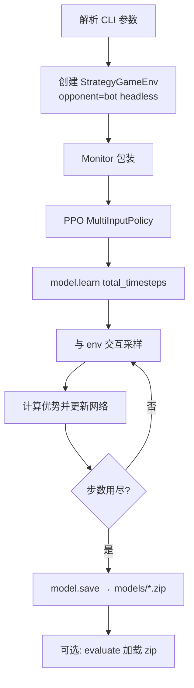

对应实现要点（`train_mode`）：

- `StrategyGameEnv(..., render_mode=None)`
- `PPO("MultiInputPolicy", env, tensorboard_log="./tensorboard/", ...)`
- `CheckpointCallback` → `checkpoints/`
- `model.learn(...)` 后 `model.save(...)`

算法直觉：[`../algorithms/ppo.md`](../algorithms/ppo.md)。

---

## 6. 对手选项（简表）

| `--opponent` | 直觉 |
|--------------|------|
| `bot` / `simple` | 弱规则 AI，入门默认 |
| `random` | 随机合法动作，噪声大 |
| `noop` | 几乎只结束回合，极弱，适合调试 |
| `self` | 自对弈（需额外设置，进阶） |

冒烟用 `bot` 或 `noop` 都行；**想尽快看到「好像在学」** 可对 `noop` 训稍长步数，但仍要以评估为准。

---

## 7. 常见失败与处理

### 7.1 Conda / 包

| 现象 | 处理 |
|------|------|
| `conda: command not found` | 先装 Anaconda/Miniconda，或用已配好的环境入口 |
| 不在 `reinforce-tactics` 环境 | `conda activate reinforce-tactics` |
| `No module named stable_baselines3` | `pip install -e .` 重装 base 依赖 |
| `No module named reinforcetactics` | 在仓库根 `pip install -e .` |

### 7.2 路径

| 现象 | 处理 |
|------|------|
| `can't open file main.py` | `cd` 到仓库根 |
| 地图找不到 | 检查 `--map-file` 相对仓库根；`maps/1v1/beginner.csv` 是否存在 |
| 评估 `FileNotFoundError` | 确认 zip 路径；注意 SB3 保存名与 `.zip` |

### 7.3 GPU 相关焦虑

- **CPU 完全可用**；本指南默认 CPU。
- 若 PyTorch 报 CUDA 乱错，可确认安装的是 CPU 轮子，或设置设备（进阶）。
- 短训不必强求 GPU。

### 7.4 训练中断

- `Ctrl+C`：CLI 会尝试捕获并仍可能保存（见 `KeyboardInterrupt` 分支）；以是否生成 zip 为准。
- 磁盘满：清 `checkpoints/`、旧 `tensorboard/` 事件。

### 7.5 「跑完了但模型是废物」

预期内。继续：

- 加长 `timesteps`（如 1e5）；
- 换地图与课程（Part C Bootstrap）；
- 上动作掩码（第 06 章）；
- 调奖励（第 07 章）。

### 7.6 Windows 特有

- 用 **PowerShell** 即可；若复制了 Linux 的 `\` 转义问题，以本指南命令为准。
- 杀毒软件锁定 `models\` 写入时，可换目录或加排除。
- 中文路径偶发工具链问题：尽量把仓库放在如 `D:\Grok\...` 较短 ASCII 路径。

---

## 8. 建议的「第一次成功」定义

你满足下列全部即可勾选本章：

1. 短训命令 **退出码成功**（无 Python traceback）
2. `models\` 下出现 **`.zip`**
3. evaluate 命令能跑完 **≥1 局**
4. 能向别人说出：timesteps 是 **env 微动作步**，不是游戏局数

```text
□ conda activate + 仓库根
□ train 2000 steps
□ models/*.zip 存在
□ evaluate 不崩
□ 理解「弱是正常的」
```

---

## 9. 接下来学什么

| 问题 | 章节 |
|------|------|
| 智能体到底看见什么？非法动作怎么办？ | [06](06-observation-action-mask.md) |
| 奖励会不会教坏？ | [07](07-rewards-and-shaping.md) |
| 如何按阶段打怪升级？ | Part C · Bootstrap |
| 命令行以外的训练脚本 | [`../source-analysis/rl-training-pipelines.md`](../source-analysis/rl-training-pipelines.md) |

---

## 10. 附录：与 GUI 对战的关系

- **训练**不打开主菜单；纯 headless。
- 想 **看** 模型下棋：评估 `--render`（若可用），或 GUI 里用 ModelBot 加载 zip（菜单路径随版本可能变化）。
- 人机手玩：`python main.py --mode play`，与训练并行不冲突。

---

## 自测

1. 写出从「进入仓库」到「短训 2000 步」的完整 PowerShell 序列（至少 3 行）。
2. 训练结束后，最终策略权重默认写在哪个目录？TensorBoard 日志呢？
3. 为什么说 `timesteps 2000` 不足以判断算法好坏，但仍值得跑？

<details>
<summary>参考答案</summary>

1. `cd ...\reinforce-tactics` → `conda activate reinforce-tactics` → `python main.py --mode train --algorithm ppo --timesteps 2000 --opponent bot`。
2. `models/`（如 `ppo_final.zip`）；`tensorboard/`。
3. 步数太少、更新次数不足、方差大；但能验证环境、依赖、存盘与评估链路。

</details>

---

**上一章**：[04 · Gymnasium 与 SB3](04-gymnasium-and-sb3.md) · **下一章**：[06 · 观察与动作掩码](06-observation-action-mask.md)

---


<div style="page-break-before: always;"></div>

# 06 · 观察空间与动作掩码

智能体每一步要回答两个问题：

1. **我看到了什么？** → 观察（observation）
2. **我被允许做什么？** → 动作掩码（action mask）

本章把 `observation.py`、`gym_env` 掩码、`masking.py` 串成一条故事线。

| 文档 | 用途 |
|------|------|
| [`../algorithms/action-masking.md`](../algorithms/action-masking.md) | 掩码算法卡片 |
| [`../source-analysis/rl-gym-env.md`](../source-analysis/rl-gym-env.md) | Env / 观察 / 掩码源码导读 |
| `benchmarks/ppo_vs_simplebot/FLAT_DISCRETE_DESIGN.md` | flat 设计笔记（可选） |

---

## 1. 智能体看到什么

观察 **不是** 屏幕截图，而是结构化 `dict`（第 04 章已见 API）。

### 1.1 `grid` — 地形与建筑归属

形状：`(H, W, 11)`，`float32`。

| 通道 | 含义 |
|------|------|
| 0–7 | 地形类型 one-hot（草地/水/山/林/路/建筑/HQ/塔 等） |
| 8 | 是否己方拥有的建筑格 |
| 9 | 是否敌方拥有 |
| 10 | 建筑 HP 比例 \([0,1]\) |

中立建筑：己/敌通道都为 0。

### 1.2 `units` — 谁站在哪

形状：`(H, W, 16)`。

| 通道 | 含义 |
|------|------|
| 0–7 | 兵种 one-hot（`ALL_UNIT_TYPES` 顺序） |
| 8 / 9 | 己方 / 敌方单位 |
| 10 | **own_exhausted**：己方单位本回合是否已无行动可做 |
| 11 | 单位 HP 比例 |
| 12–15 | 麻痹、加速、防 Buff、攻 Buff（归一化） |

空格子在兵种通道上全 0。

### 1.3 `global_features` — 五维摘要

形状：`(5,)`，各自经 `tanh(x / scale)` 压到可比较的范围：

| 索引 | 原始语义 |
|------|----------|
| 0 | 己方金币 |
| 1 | 敌方金币 |
| 2 | 回合数 |
| 3 | 己方单位数 |
| 4 | 敌方单位数 |

**刻意不包含** `current_player`：智能体只在自己的回合被 `step`，该位恒等于视角玩家，没有信息量。

### 1.4 视角：agent-relative

编码时永远把 `perspective_player` 当作「己方」。
自对弈换边时，同一物理局面会翻成相同的 self/opp 通道布局，**策略不用为「我是 P1 还是 P2」各学一套**。

### 1.5 战争迷雾（可选）

`fog_of_war=True` 时多一个 `visibility` 平面。入门训练建议先关雾，降低 POMDP 难度。

### 1.6 掩码 **不是** 观察的一部分

- 策略的 Dict obs **不含** mask；
- MaskablePPO 通过 `env.action_masks()` **另通道**取掩码；
- 设计理由：掩码是约束，不是「世界状态」本身（见 `observation.py` 模块文档）。

---

## 2. 非法动作问题（为什么必须做掩码）

### 2.1 组合爆炸

六维动作：

\[
|\mathcal{A}| \approx 10 \times 8 \times W \times H \times W \times H
\]

对 \(8\times 8\) 图粗算：\(10\times 8\times 8^4 = 327680\) 量级，且随地图变大。

其中合法的往往只有 **几十到几百**（有时更少）。

### 2.2 只靠「非法 −10」会发生什么

早期策略近似均匀乱采 → 几乎每步非法 → 梯度被惩罚淹没 → **学不会移动与攻击的结构**。
项目实践：**强烈依赖动作掩码**。

### 2.3 合法动作从哪来

```text
GameState.get_legal_actions(player)
    → 结构化 dict（create_unit / move / attack / seize / end_turn / ...）
    → build_per_dim_masks 或 build_flat_actions / build_structured_masks
    → env.action_masks()
```

规则引擎是唯一真相；掩码是它的 **布尔投影**。

---

## 3. Per-dimension 掩码 vs `flat_discrete`

### 3.1 Per-dimension（配合 MultiDiscrete）

为六个维度各做一个 bool 向量：哪些 `action_type` 合法、哪些 `from_x` 出现过……

**优点**：实现直接、与 MultiDiscrete 对齐。
**缺点：过近似**——

> 维 A 允许坐标 \(x_1\)，维 B 允许 \(x_2\)，但「从 \(x_1\) 到 \(x_2\) 的移动」仍可能非法。

笛卡尔积 ⊇ 真合法集 → 仍可能采到 env 拒绝的动作 → 仍吃 `invalid_action`（概率已低很多）。

### 3.2 `flat_discrete`

- 先列出最多 `max_flat_actions`（默认常 512）个 **完整合法微动作**；
- 动作空间：`Discrete(max_flat_actions)`；
- 掩码：前 \(K\) 个 True，其余 False —— **精确到候选**；
- 超长时截断策略会优先保留占领与 `end_turn` 等关键类型（实现细节见源码）。

Bootstrap 等生产配置常选 **flat_discrete**，就是为了消灭过近似。

### 3.3 结构化 / 自回归（预习）

采样顺序：`atype → source → unit_type → target`，每步用条件掩码。
Feudal 的 AR 头走这条路；见 [`../algorithms/feudal-rl.md`](../algorithms/feudal-rl.md)。

### 3.4 对照表

| 模式 | 空间 | 掩码精度 | 典型用途 |
|------|------|----------|----------|
| `multi_discrete` + per-dim | 6 维 | 过近似 | CLI 默认、简单实验 |
| `flat_discrete` | 1 维离散 | 精确（截断内） | 课程 / 认真 PPO |
| Structured + AR | 顺序决策 | 条件精确 | Feudal 等 |

---

## 4. 代码路径地图

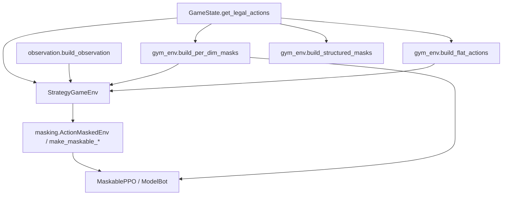

| 文件 | 职责 |
|------|------|
| `reinforcetactics/rl/observation.py` | **唯一**观察编码契约 |
| `reinforcetactics/rl/gym_env.py` | `StrategyGameEnv`、`action_masks`、`build_*_masks`、`build_flat_actions` |
| `reinforcetactics/rl/masking.py` | 与 sb3-contrib 对接的 Wrapper / 向量环境工厂、`validate_action_mask` |

GUI / 锦标赛里的 `ModelBot` 会 **复用** 同一套 `build_per_dim_masks` / flat 构建，保证训练与部署一致。

---

## 5. `end_turn` 与「永不结束回合」

- 在掩码中，`end_turn` **几乎总是合法**（保证总能交棒）。
- 若策略学到「一直移动刷塑形、从不 end_turn」：
  - 环境有 `max_actions_per_turn`：达限后掩码 **只留 end_turn**；
  - `turn_penalty` 默认 **0**（乱加会导致奇怪吸引子，见第 07 章）。

这是规则层 + 掩码层的双重保险。

---

## 6. 带掩码的概率（复习公式）

未掩码 logits \(z_i\)，掩码 \(m_i\in\{0,1\}\)：

\[
\pi(a=i \mid o) = \frac{m_i\, e^{z_i}}{\sum_j m_j\, e^{z_j}}
\]

玩具例：\(z=(0,1,2)\)，\(m=(1,0,1)\) → 中间动作概率为 0，概率只在 0 与 2 上分配。
完整推导见 [`../algorithms/action-masking.md`](../algorithms/action-masking.md)。

---

## 7. 动手：合法动作数量与掩码

```powershell
python -c @"
from reinforcetactics.rl.gym_env import StrategyGameEnv

env = StrategyGameEnv(map_file='maps/1v1/beginner.csv', opponent='noop')
obs, info = env.reset(seed=0)
print('obs shapes:', {k: getattr(v, 'shape', None) for k, v in obs.items()})

masks = env.action_masks()
if isinstance(masks, (list, tuple)):
    print('mode: multi_discrete per-dim')
    for i, m in enumerate(masks):
        print(f'  dim {i}: shape={m.shape}, true={int(m.sum())}')
else:
    print('mode: flat, legal=', int(masks.sum()), '/', masks.shape[0])

# 领域层合法动作规模
legal = env.game_state.get_legal_actions(env.agent_player)
counts = {k: (len(v) if isinstance(v, list) else v) for k, v in legal.items()}
print('legal actions summary:', counts)
env.close()
"@
```

尝试在 `reset` 后手动 `end_turn` 再看 P2 侧（若你改 `agent_player` 或读对手回合后状态）金币变化——与第 02 章经济故事互相印证。

---

## 8. 和训练算法的衔接

| 训练入口 | 掩码情况（概括） |
|----------|------------------|
| `main.py --mode train` 简单 PPO | 环境仍可提供 mask，但 **普通 PPO 默认不用** |
| `examples/train_with_action_masking.py` | 演示 MaskablePPO |
| Bootstrap YAML | 常 `flat_discrete` + masking |
| ModelBot 推理 | 必须用与训练一致的 mask 逻辑 |

**训练时用了 mask、部署时忘了 mask** → 行为分布错位，胜率断崖。保持同一 `build_*` 路径。

---

## 9. 常见误解

1. **「有 per-dim mask 就永远不会 invalid」** — 否，仍有过近似泄漏。
2. **「flat 截断 max_flat_actions 无影响」** — 合法动作极多时会丢动作；需看诊断。
3. **「把 mask 拼进 obs 就行」** — 本项目选择 API 分离；乱拼需改网络。
4. **「观察里的 exhausted 等于 mask」** — exhausted 帮助价值网络理解「谁动过」；mask 约束「下一步能选什么」。
5. **「换地图不用改网络」** — 空间尺寸变了 MultiDiscrete 的 W/H 会变；跨图课程常用 `pad_to_size` + flat。

---

## 10. 小结

- 观察：`grid` + `units` + `global_features`（+ 可选 visibility），agent-relative。
- 非法动作是默认状态；掩码是可学习的前提。
- Per-dim 快但不精确；flat 精确但有列表上限。
- 代码三角：`observation.py` · `gym_env.py` · `masking.py`。

下一章：奖励如何把「赢棋」翻译成逐步数字，以及如何避免杀敌刷分。

---

## 自测

1. 列出默认 Dict 观察的三个核心键，并各用一句话说它们描述什么。
2. 什么是 MultiDiscrete **过近似**？`flat_discrete` 如何缓解？
3. 为什么 `action_mask` 默认不放进观察字典，而要 `action_masks()` 另取？

<details>
<summary>参考答案</summary>

1. `grid`：地形与建筑归属/HP；`units`：单位类型、归属、状态；`global_features`：金币/回合/单位数摘要。
2. 各维分别合法的笛卡尔积仍可能整体非法；flat 枚举完整合法动作再掩码。
3. 掩码是动作约束而非世界状态；MaskablePPO 有专门接口；避免与状态特征耦合。

</details>

---

**上一章**：[05 · 第一次训练](05-first-train-ppo.md) · **下一章**：[07 · 奖励与塑形](07-rewards-and-shaping.md)

---


<div style="page-break-before: always;"></div>

# 07 · 奖励与塑形（Part B 收官）

策略优化的是 **期望回报**。回报由逐步奖励相加（折扣）而成——所以：

> **你写的 `reward_config`，就是在规定「什么叫好棋」。**

写错时，智能体会认真学会错误目标：杀敌刷分、永不攻城、拖到和棋……
本章用白话讲清稀疏/稠密、势能塑形，以及本项目踩过的 **kill-farm** 坑。

| 文档 | 用途 |
|------|------|
| [`../algorithms/reward-shaping.md`](../algorithms/reward-shaping.md) | 算法卡片（必读对照） |
| [`../source-analysis/rl-gym-env.md`](../source-analysis/rl-gym-env.md) | `_calculate_reward` / `_compute_potential` |
| `docs/zh/bootstrap_lessons_learned.md` | 作者实验日记（杀敌吸引子等） |

Part B 到此结束；Part C 从课程 Bootstrap 起（见 [指南目录](README.md)）。

---

## 1. 稀疏终局 vs 稠密塑形

### 1.1 稀疏（Sparse）

只在终局给大分：

| 事件 | 默认量级（代码默认，可改） |
|------|----------------------------|
| 赢 | \(+1000\) |
| 输 | \(-1000\) |
| 和 | \(-200\) 量级 |

**优点**：目标干净——真正要的是赢。
**缺点**：一局成百上千 env 步，中间几乎全 0 → 极难冷启动（第 03 章信用分配）。

### 1.2 稠密（Dense）

中途也给分：击杀、造成伤害、占领进度、造兵……

**优点**：每步都有学习信号。
**缺点**：智能体可能优化「中途分」而不是胜利 —— **目标错位（reward hacking）**。

### 1.3 本环境一步奖励拆什么

`info["reward_breakdown"]` 一类字段（实现以源码为准）概念上包括：

| 分量 | 含义 |
|------|------|
| `action` | 本微动作即时奖（杀、占、造…） |
| `shaping_delta` | 势能塑形 \(F=\gamma\Phi(s')-\Phi(s)\) |
| `invalid_penalty` | 非法动作 |
| `terminal` | 终局 win/loss/draw/截断 |

总奖励是各部分之和（再经配置缩放）。

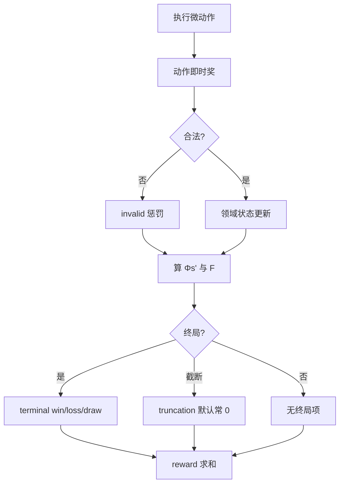

---

## 2. 故事时间：杀敌刷分吸引子（kill-farm）

### 2.1 发生了什么（白话）

项目实验中出现过一类策略：

1. 找到能稳定 **换血 / 击杀** 的打法；
2. 每杀一次拿 **击杀塑形分**；
3. **不去占 HQ**，甚至避免终结比赛；
4. 拖到回合上限和棋，塑形总分仍可能不错看；
5. 训练曲线「很好」，评估胜率却上不去，或只会对会陪你刷分的对手。

这叫 **kill-farm 吸引子**：局部最优，奖励函数的锅，不是「PPO 坏了」。

### 2.2 为什么会被学到

粗算（数字仅为直觉，非某次 run 原样）：

- 每步期望击杀塑形 \(+0.5\)，磨 100 步 → \(+50\)
- 终局赢 \(+10\)（若配置把终端缩小了）或和棋 \(-2\)
- 若 **杀分累计 > 赢棋路径的期望**，理性智能体（在优化回报的意义下）会选刷杀

### 2.3 项目里的对策方向

默认与文档中反复强调的旋钮：

| 方向 | 做法 |
|------|------|
| 抬高真正目标 | 提高 `capture` / `seize_progress` / 终局 `win` 相对 `kill` 的比重 |
| 压低刷分 | 减小 `kill`、控制 `damage_scale` |
| 惩罚拖局 | `draw` 为负；可选 `win_speed_bonus` 鼓励速胜 |
| 互殴零和 | `damage_taken_scale` 使挨打也扣分 |
| 慎用回合罚 | **`turn_penalty` 默认 0**，乱加会导致「疯狂 end_turn」或相反极端 |
| 终局势能清零 | 真终局时 \(\Phi=0\) 处理，贴近理论条件 |

细节与键名表：[`../algorithms/reward-shaping.md`](../algorithms/reward-shaping.md)。

---

## 3. 势能塑形（Potential-based shaping）

### 3.1 想法

定义「局面有多好」的势能 \(\Phi(s)\)（只依赖状态，不依赖动作）。
每步附加：

\[
F(s, s') = \gamma\,\Phi(s') - \Phi(s)
\]

| 符号 | 含义 |
|------|------|
| \(\Phi(s)\) | 状态势能 |
| \(\gamma\) | 与 PPO **相同**的折扣（env 构造参数 `gamma`） |
| \(F\) | 加到即时奖励上的塑形项 |
| \(s'\) | 动作后的下一状态 |

经典结果（Ng et al., 1999）：在合适条件下（含终局势能处理），**不改变最优策略**，只改变学习速度与中间信号。

### 3.2 本项目 \(\Phi\) 的组成（示意）

\[
\Phi(s) \approx w_{\mathrm{inc}}\Delta_{\mathrm{income}} + w_{\mathrm{unit}}\Delta_{\mathrm{units}} + w_{\mathrm{str}}\Delta_{\mathrm{structures}}
\]

权重来自 `reward_config` 的 `income_diff`、`unit_diff`、`structure_control` 等。
实现：`StrategyGameEnv._compute_potential`。

注意：这些键是 **势能源**，不是每步直接「收入差 × 权重」乱加（那会与 \(F\) 的理论形式不一致）。逐步看到的是 \(F\) 的差分效果。

### 3.3 数字玩具例

设 \(\gamma=0.99\)，只看单位差，\(w_{\mathrm{unit}}=0.3\)：

| 状态 | 己方单位 | 敌方 | \(\Delta\) | \(\Phi\) |
|------|----------|------|------------|----------|
| \(s\) | 2 | 2 | 0 | 0 |
| \(s'\) | 3 | 2 | 1 | 0.3 |

\[
F = 0.99\times 0.3 - 0 = 0.297
\]

若再丢单位回到均势 \(\Phi(s'')=0\)：

\[
F' = 0.99\times 0 - 0.3 = -0.3
\]

**直觉**：变好时发奖金，变差时把奖金 **吐回去**（近似），避免「曾经领先过」就永久躺在高分上。

### 3.4 终局时

真终局令 \(\Phi(\mathrm{terminal})=0\)，取与 \(-\Phi(s_{\mathrm{prev}})\) 相关的塑形收尾，使理论条件更干净。
实现见 `step` 终局分支与 `_calculate_reward`。

### 3.5 \(\gamma\) 必须一致

若 PPO 用 \(\gamma=0.99\)，而 env 塑形用 \(0.9\)，等于在用 **另一套** 对未来价值的折算 → 引入偏差。
构造环境时传入与训练器相同的 `gamma`。

---

## 4. `reward_config` 在哪里

### 4.1 代码默认

`StrategyGameEnv.__init__` 内 `default_reward_config`，再被调用方 `update`。

CLI 短训（`commands.train_mode`）示例性传入：

```python
reward_config={
    "win": 1000.0,
    "loss": -1000.0,
    "income_diff": args.reward_income,
    "unit_diff": args.reward_units,
    "structure_control": args.reward_structures,
    "invalid_action": -10.0,
}
```

### 4.2 YAML / 课程

Bootstrap 等配置常在 `env.reward_config` 下写缩小版终端奖（如 win=10），以稳住价值网络数值尺度。
阶段还可 `CurriculumStage.reward_config` 合并覆盖。

### 4.3 键的角色分类（记忆用）

| 类别 | 例 | 角色 |
|------|----|------|
| 终局 | `win` `loss` `draw` `win_speed_bonus` `truncation` | 主目标 |
| 动作稠密 | `kill` `capture` `seize_progress` `create_unit` `damage_scale` | 战术路标 |
| 惩罚 | `invalid_action` `enemy_*_capture` `turn_penalty` | 约束 |
| 势能 | `income_diff` `unit_diff` `structure_control` | 进入 \(\Phi\) |

完整表与默认意图：[`../source-analysis/rl-gym-env.md`](../source-analysis/rl-gym-env.md) 中 `reward_config` 节。

---

## 5. 设计奖励时的检查清单

在你改任何权重前过一遍：

1. **真胜利路径的期望回报是否仍高于** 和棋刷分 / 无限换血？
2. `kill` 与 `capture` / `win` 的相对量级是否合理？
3. `draw` 是否足够负，避免「躺平磨分」？
4. `gamma` 训练与 env 是否一致？
5. 是否误开大 `turn_penalty`？
6. 评估时是否看 **胜率**，而不只看 `ep_rew_mean`？
7. 换对手后，曲线是否只是在 exploite 单一 Bot 漏洞？

---

## 6. 与评估、锦标赛的关系

奖励是训练信号；**发布结论靠评估**：

- `main.py --mode evaluate`
- `scripts/tournament.py` + Elo

同一奖励下可能过拟合 SimpleBot；换 Medium/自对弈池才知道泛化。
见 [`../algorithms/evaluation-and-elo.md`](../algorithms/evaluation-and-elo.md)。

---

## 7. 和前几章的拼图

| 章 | 拼图块 |
|----|--------|
| 02 | 微动作 / 回合；终局条件 |
| 03 | \(G_t\)、\(\gamma\)、优势——奖励进入这些公式 |
| 04–05 | Env 返回的 `reward`；SB3 用它学 |
| 06 | 非法动作惩罚 vs 掩码（掩码优先） |
| **07** | **如何定义 reward** |

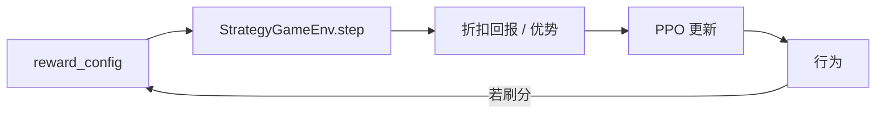

---

## 8. 常见误解

1. **「奖励越高说明模型越强」** — 可能在刷塑形；要看胜负。
2. **「多加中间奖励一定更好」** — 常更差（目标错位）。
3. **「势能塑形可以随便加与状态无关的奖金」** — 破坏策略不变性；应用 \(F=\gamma\Phi(s')-\Phi(s)\) 形式。
4. **「和棋给 0 就行」** — 相对刷分路径，0 可能仍太甜；项目默认和棋为负。
5. **「截断 truncated 应等于输」** — 未必；乱加 truncation 惩罚会扭曲长局价值。默认截断项常为 0，避免与 SB3 逻辑双计。

---

## 9. Part B 毕业标准

你可以：

- [ ] 解释稀疏 vs 稠密
- [ ] 手算一个 \(F=\gamma\Phi'-\Phi\) 小例子
- [ ] 讲述 kill-farm 为何出现、如何从权重上压制
- [ ] 指出 `reward_config` 与 `_compute_potential` 的代码位置
- [ ] 说清：改奖励后必须用 **评估/锦标赛** 验收

若全部满足，Part A+B 主线完成。
下一步按时间选：

| 目标 | 去向 |
|------|------|
| 课程打怪 | [指南目录 Part C · 08](README.md) · [`../algorithms/curriculum-bootstrap.md`](../algorithms/curriculum-bootstrap.md) |
| 巩固算法 | [`../algorithms/overview.md`](../algorithms/overview.md) |
| 读实现 | [`../source-analysis/rl-gym-env.md`](../source-analysis/rl-gym-env.md) |
| 再训长一点 | 第 05 章加长 `timesteps` + 第 06 章掩码示例 |

---

## 自测

1. 用两句话对比稀疏终局奖励与稠密塑形的利弊。
2. 设 \(\Phi(s)=1.0\)，\(\Phi(s')=1.5\)，\(\gamma=0.99\)，求 \(F\)。若下一步回到 \(\Phi=1.0\)，新的 \(F'\) 是多少？
3. 什么是 kill-farm？举出至少两条本项目用来缓解它的配置方向。

<details>
<summary>参考答案</summary>

1. 稀疏目标清晰但难学；稠密好学但易目标错位。
2. \(F=0.99\times1.5 - 1.0 = 0.485\)；\(F'=0.99\times1.0 - 1.5 = -0.51\)。
3. 通过反复击杀刷塑形、回避真正胜利条件的策略。缓解：压低 kill、抬高 capture/win、draw 为负、伤害近似零和等。

</details>

---

**上一章**：[06 · 观察与动作掩码](06-observation-action-mask.md) · **下一章**：[08 · 课程 Bootstrap](08-curriculum-bootstrap.md) · **目录**：[指南目录](README.md)

> Part B 完。你已具备继续 Part C（课程 / BC / 自对弈…）的概念与实操地基。

---


<div style="page-break-before: always;"></div>

# 第 08 章：课程学习与 Bootstrap 冷启动

---

## 1. 本章目标

读完本章并完成短跑命令后，你应能：

1. 用自己的话解释：**为什么**不能一上来就让随机策略打最强对手、最大地图。
2. 说出课程里的关键旋钮：阶段（stage）、晋级胜率、耐心（patience）、阶段预算（max_timesteps）、MixedBot 难度桥。
3. 看懂一张「阶段状态机」图，并对应到 `run_curriculum` 的行为。
4. 理解作者踩过的坑（全确定性 noop 老师、和棋吸引子、评估噪声、阶段间策略漂移）以及「后来怎么改」。
5. 知道配置与代码落在哪：`bootstrap.yaml`、`rl/bootstrap.py`、`train_bootstrap.py`。

前置：建议已读 [05 首次 PPO](05-first-train-ppo.md)、[07 奖励](07-rewards-and-shaping.md)。速查卡见 [`../algorithms/curriculum-bootstrap.md`](../algorithms/curriculum-bootstrap.md)。

---

## 2. 生活 / 游戏类比

想象你学一款新的回合制策略游戏：

| 现实 | 课程 Bootstrap |
|------|----------------|
| 先在教程图里学会「造兵、走路、结束回合」 | 小地图 + 弱对手 |
| 通过再开下一关，不过关就重练 | 晋级胜率 + patience |
| 关卡有时间限制，超时判失败 | `max_timesteps` 用尽 → `CurriculumStalled` |
| 有时对手一半时间像新手、一半像老手 | **MixedBot** 按局混合 easy/hard |
| 别只找「站着不动」的陪练——太无聊，学不到应变 | 不要只用全确定的 NoopBot 当唯一老师 |

**Bootstrap（冷启动）**：策略一开始几乎在乱按键，回报几乎全是「输」。若不降低难度、不塑形、不控制地图规模，梯度会「没信号」——像在全黑房间里学走路。课程就是**有意识地排关卡表**，把「能学会」的台阶搭好。

---

## 3. 基本原理（零基础）

### 3.1 冷启动为什么会「死」

PPO 等 on-policy 方法靠「多条轨迹回报的差异」来更新：

- 若每条轨迹的回报几乎一样（全输、全平、全同一剧本）→ 优势（advantage）≈ 0 → 策略几乎不更新 → 继续产出同样烂数据 → **死策略陷阱**。
- 若地图突然变大、价值函数完全错位 → 更新会乱晃，策略可能缩回安全动作（例如狂点「结束回合」）。

所以冷启动要同时管三件事：**对手方差、地图难度、奖励尺度**。

### 3.2 阶段（Stage）是什么

一个阶段通常是：

\[
\text{Stage} = (\text{地图},\;\text{对手类型},\;\text{晋级门槛},\;\text{耐心},\;\text{步数预算},\;\text{可选奖励/熵覆盖})
\]

训练循环：在当前阶段环境上 `learn` → 周期性评估胜率 → 决定是否晋级。

### 3.3 晋级、耐心、预算

| 概念 | 白话 | 配置名（示意） |
|------|------|----------------|
| **晋级胜率** \(\tau\) | 评估胜率要到多高才算「会了」 | `promotion_win_rate` |
| **耐心** \(p\) | 要连续多少次评估都达标（防一次运气） | `patience` |
| **阶段预算** \(T_{\max}\) | 本阶段最多再训多少 env 步 | `max_timesteps` |
| **可选最低训练步** | 没训够不许晋级（默认常 0） | `min_timesteps_before_promotion` |

评估胜率本身有噪声：真胜率 85%、只评 20 局时，偶然掉到 75% 并不稀奇。**patience ≥ 2** 就是为了这一点。

### 3.4 MixedBot：难度桥

直接从 SimpleBot 跳到 MediumBot 可能太陡。`MixedBot` 在**整局开始时**按概率选 easy 或 hard（局中不切换）：

- 例：`easy=simple`，`hard=medium`，`p_hard=0.5` → 一半对局像 Simple，一半像 Medium。
- 策略被迫同时应付两种节奏，比「突然换一张脸」平滑。

### 3.5 阶段间「带走峰值，别带走漂移」

同一阶段内，策略可能先冲到高胜率，再被「和棋 + 塑形奖励」的吸引子慢慢带偏。若晋级时带走的是**阶段末内存里的模型**，下一关可能从「已经走形」的版本起步。

本项目默认：**晋级后加载本阶段 `best_model`**（`restore_best_checkpoint_between_stages`），把峰值交给下一阶段。

### 3.6 阶段状态机

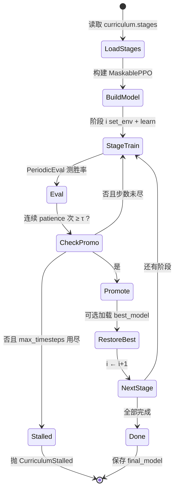

对应实现：`reinforcetactics.rl.bootstrap.run_curriculum`；晋级逻辑在 `rl.callbacks.PromotionCallback`。

---

## 4. 公式、符号表与数字例

### 4.1 评估胜率

\[
\hat{w}_k = \frac{W_k}{n}
\]

| 符号 | 含义 |
|------|------|
| \(W_k\) | 第 \(k\) 次评估中的胜局数 |
| \(n\) | 每次评估局数（`eval.n_eval_episodes`） |
| \(\hat{w}_k\) | 第 \(k\) 次估计胜率 |

### 4.2 晋级条件（概念）

\[
\hat{w}_{t-p+1},\;\ldots,\;\hat{w}_t \;\ge\; \tau
\quad\text{（且若配置了最低步数，需已训满）}
\]

| 符号 | 含义 | 配置 |
|------|------|------|
| \(\tau\) | 阈值 | `promotion_win_rate` |
| \(p\) | 连续次数 | `patience` |
| \(T_{\max}\) | 阶段预算 | `max_timesteps` |

**玩具例**

- \(\tau=0.9\)，\(p=2\)，\(n=20\)
- 评估序列：0.85 → 0.95 → 0.92

第 2、3 次连续 ≥ 0.9 → **晋级**。
若 0.95 → 0.80 → 0.95：中间一次打断耐心，需重新连满 2 次。

### 4.3 评估噪声（为何要 patience）

真胜率 \(w=0.85\)，\(n=20\)：

\[
\mathrm{Var}(\hat{w})=\frac{w(1-w)}{n}\approx 0.0064,\quad
\mathrm{std}\approx 0.08
\]

单次评估掉到 ~0.75 并不罕见。阈值附近尤甚——作者文档里常写「阈值附近 ±15% 抖动」。

### 4.4 MixedBot

\[
\text{本局对手} =
\begin{cases}
\text{hard} & \text{概率 }p_{\text{hard}}\\
\text{easy} & \text{概率 }1-p_{\text{hard}}
\end{cases}
\]

例：`p_hard=0.5` 时，长期期望难度在 easy/hard 中间，但**每局内部**仍是单一脚本 Bot，便于策略连贯。

---

## 5. 为什么本项目选择它 + 优势

| 动机 | 说明 |
|------|------|
| 动作空间大、胜利稀疏 | 纯随机很难「碰巧」走出造兵—行军—占 HQ 长序列 |
| 脚本 Bot 阶梯现成 | noop / random / simple / mixed / medium / advanced 可当活靶 |
| 地图可从小到大 | starter → beginner → skirmish… 控制价值函数迁移难度 |
| 与 MaskablePPO 主线一致 | 课程只是编排环境与晋级，不换算法全家桶 |
| 失败要大声 | `CurriculumStalled` 带历史与 best checkpoint，避免「训满步数假装成功」 |

**相对「一阶段训到底」的优势**：可诊断（卡在哪一关一目了然）、可复现实验（改某一 stage 的 `ent_coef` / 奖励）、可与 BC 热启动拼接（先模仿再爬阶梯）。

更短的算法卡片：[`../algorithms/curriculum-bootstrap.md`](../algorithms/curriculum-bootstrap.md)。
管线源码导读：[`../source-analysis/rl-training-pipelines.md`](../source-analysis/rl-training-pipelines.md)。

---

## 6. 执行时可能遇到的问题

| 现象 | 可能原因 | 处理方向 |
|------|----------|----------|
| 一阶段永远 0% 胜率 | 对手过强 / 奖励无分化 / 策略锁死 | 降对手；查 `std_reward`；查动作直方图 |
| `std_reward = 0` 且 W/L/D 全相同 | 确定性对手 + 确定性评估 → 死剧本 | 换随机对手；勿只靠抬 `ent_coef` |
| 小图 100% 后大图崩溃 | 价值函数错位 | 小图 patience 别过大；大图首阶段抬熵 |
| 阈值附近反复晋级失败 | 评估噪声 + 策略漂移 | 加大 `n_eval_episodes`；恢复 best；勿盲目加 `min_timesteps` |
| `CurriculumStalled` | 预算耗尽未连续达标 | 读异常信息与 stage 目录下 eval；别静默接下阶段 |
| 全胜但只会造一种兵 | 单位性价比吸引子 | 看 `units_built`；调平衡而非只拧课程 |
| 大量和棋 | 超时 / max_steps 截断 / 不敢决战 | 看 `end_reason`；调 `max_turns`/`max_steps`/奖励 |

---

## 7. 作者 / 项目训练中的困难与解决（通俗改写）

以下主题来自 `docs/bootstrap_lessons_learned.md` 等实验日记，**用程序员能懂的故事讲**，不堆 jargon。

### 7.1 不要用「完全不动」的对手当唯一老师

**想法**：先让对手 Noop（每回合直接结束），智能体可以安心练「走路、占点」。
**现实**：对手从不扰动局面 → 几乎每局同一条轨迹 → 回报方差为 0 → PPO 优势为 0 → 更新停摆。评估时若再 `deterministic=True` 取 argmax，30 局奖励标准差经常是 **0.0**。

**教训**：「更弱」≠「更好学」。**带一点随机性的对手**往往才是冷启动友好的老师。纯 noop 阶段若要用，应先接行为克隆，而不是纯 RL 硬啃。

### 7.2 战斗塑形与地图几何要匹配

小地图上「占 HQ 加成远高于歼灭」可能合理；换到更大、更挤的 beginner 时，几何上很难走完占领流程，同一套奖励会变成**扭曲激励**（一直想去抢办不到的事）。
作者做法：按地图改终端奖励比例、降低不切实际的 `seize_progress` 等——**奖励要贴地图**，不是全局抄一份。

### 7.3 「和棋 + 塑形」吸引子

有些阶段会出现：策略学会赚塑形分、拖到和棋，胜率从高位掉到 0 附近再抖。这叫**漂移吸引子**：不是「完全不会玩」，而是优化到了「不输不赢但塑形还行」的盆地。
应对思路：阶段间加载 **best** 而非末态；慎用「晋级前强制再训很多步」（有时会把峰值磨掉）；诊断时看 W/L/D，别只看 mean reward。

### 7.4 `max_timesteps` 是安全阀，不是建议值

阶段预算用尽仍未晋级 → **抛错失败**，而不是默默进下一关。这逼你正视「这一关没学会」，避免垃圾策略污染后续阶段。调参时：预算太短会误杀慢热；太长会浪费算力在已死的吸引子上。

### 7.5 评估噪声 + 阈值附近

真胜率就在门槛附近时，20～40 局评估会像抛硬币。作者用 **patience**（连续多次达标）而不是「第一次碰到阈值就晋级」（小地图有时反而用 patience=1 防止过拟合到死剧本）。
**实操**：阈值附近波动大时，先加评估局数，再动课程结构。

### 7.6 其它可记一笔的坑（扩展阅读）

- **奖励项静默漂移**：多写几个看起来合理的奖励项，可能单独就能让某一关再也稳不住——「复现实验」要对齐 reward 字典的每一个键。
- **平衡写在 constants 里**：曾导致 YAML 以为复现了，引擎数值其实变了；现已用 `engine_overrides` 把经济/兵种写进配置并快照。
- **单兵种统治**：若最便宜兵在 HP/$、Atk/$ 全赢，课程拧多少也可能 100% 单兵种——那是**平衡几何**问题，不是再加 patience 能解的。

原始长文：`docs/bootstrap_lessons_learned.md`、`docs/zh/bootstrap_lessons_learned.md`。

---

## 8. 代码与配置落点

| 组件 | 路径 |
|------|------|
| 课程主循环 | `reinforcetactics/rl/bootstrap.py` → `run_curriculum`、`CurriculumStalled`、`make_stage_env` |
| 阶段 / 课程配置类型 | `reinforcetactics/rl/config.py` → `CurriculumStage`、`CurriculumConfig` |
| 晋级与周期评估 | `reinforcetactics/rl/callbacks.py` → `PromotionCallback`、`PeriodicEvalCallback` |
| MixedBot | `reinforcetactics/game/bot.py`（经 env `opponent="mixed"` + `opponent_kwargs`） |
| 默认生产配置 | `configs/ppo/bootstrap.yaml` |
| 扫描 / 复现实验 | `configs/ppo/bootstrap_sweep/` |
| CLI 入口 | `scripts/train/train_bootstrap.py` |
| 笔记本镜像 | `notebooks/ppo_bootstrap.ipynb` |

**YAML 里你会看到的字段（概念）**：

```yaml
curriculum:
  restore_best_checkpoint_between_stages: true
  stages:
    - name: beginner_random
      map_file: maps/1v1/beginner.csv
      opponent: random
      promotion_win_rate: 0.9
      patience: 2
      max_timesteps: 500_000
      # ent_coef / reward_config / max_turns 等可按阶段覆盖
```

相关算法卡：[`../algorithms/curriculum-bootstrap.md`](../algorithms/curriculum-bootstrap.md) · [`../algorithms/ppo.md`](../algorithms/ppo.md)。
源码：[`../source-analysis/rl-training-pipelines.md`](../source-analysis/rl-training-pipelines.md) · [`../source-analysis/rl-gym-env.md`](../source-analysis/rl-gym-env.md)。

---

## 9. 实操命令

在仓库根目录、已激活 `reinforce-tactics` 环境的前提下。

### 9.1 短跑（优先）：冒烟式改配置覆盖

完整 `bootstrap.yaml` 可能是千万级步数。短跑请用 `--set` 砍预算、减并行、减评估局数：

```powershell
cd D:\Grok\project2\reinforce-tactics
conda activate reinforce-tactics

# 仅验证管线能启动：1 个环境、极短阶段预算（按你本机 YAML 键名微调）
python scripts/train/train_bootstrap.py `
  --config configs/ppo/bootstrap.yaml `
  --device cpu `
  --skip-plots --skip-videos `
  --sanity-episodes 0 `
  --output-dir benchmarks/bootstrap_smoke `
  --set env.n_envs=1 `
  --set env.use_subprocess=false
```

若默认课程阶段过多，可在实验 YAML 里只留 1～2 个 stage，或从 `configs/ppo/bootstrap_sweep/` 里挑小配置。目标是：**不报错跑完 / 或干净地 CurriculumStalled**，而不是刷胜率。

### 9.2 单测相关逻辑（更快）

```powershell
python -m pytest tests/test_bootstrap.py -q
```

### 9.3 选做：较长课程

```powershell
# 选做：接近生产配置的长训（GPU、数小时～数天）
python scripts/train/train_bootstrap.py `
  --config configs/ppo/bootstrap.yaml `
  --device cuda `
  --output-dir benchmarks/bootstrap_full
```

可选 `--build-bc` 在课程前做行为克隆热启动（见 [09 章](09-behavior-cloning.md)）。

---

## 10. 自测 3 题

1. **概念**
   为什么「对手完全不动（Noop）+ 确定性评估」时，PPO 可能比打随机对手**更难学**？用「回报方差 / 优势」说一句。

2. **计算**
   \(\tau=0.8\)，\(p=2\)。评估胜率序列为：0.75, 0.85, 0.82, 0.79, 0.90, 0.88。
   最早在第几次评估后可以晋级？若 `max_timesteps` 在第 4 次评估后用尽且从未连满 2 次，系统应怎样表现？

3. **工程**
   你打开某阶段目录，发现 `best_model.zip` 胜率高于阶段结束时的内存模型。下一阶段若**不** `restore_best_checkpoint_between_stages`，可能发生什么？MixedBot 在课程里扮演什么角色？

**简答提示**

1. 无状态扰动 → 轨迹/回报几乎常数 → 优势≈0 → 学不动；随机对手提供可学习的方差。
2. 在第 6 次评估后（0.90 与 0.88 连续 ≥0.8）。预算用尽应 **CurriculumStalled**，不要默默晋级。
3. 可能把已漂移的弱策略带进更难关；MixedBot 在 easy/hard 间按局抽样，作难度桥。

---

## 延伸阅读

- [`../algorithms/curriculum-bootstrap.md`](../algorithms/curriculum-bootstrap.md)
- [`../algorithms/reward-shaping.md`](../algorithms/reward-shaping.md)
- [`../source-analysis/rl-training-pipelines.md`](../source-analysis/rl-training-pipelines.md)
- `docs/bootstrap_lessons_learned.md` / `docs/zh/bootstrap_lessons_learned.md`
- 下一章：[09 行为克隆](09-behavior-cloning.md)

---


<div style="page-break-before: always;"></div>

# 第 09 章：行为克隆（Behavior Cloning, BC）

---

## 1. 本章目标

读完本章并完成短跑后，你应能：

1. 把行为克隆说成「**有标签的监督学习**」：输入局面，标签是专家动作。
2. 说明 **BC → PPO 微调** 流水线各自解决什么问题。
3. 解释为何「录了 N 局」不等于「有 N 份不同经验」——确定性 Bot 会产生**重复轨迹**。
4. 知道 loss / 准确率变好看时，对局胜率可能**完全不动**——必须用 Bot 阶梯做 sanity-eval。
5. 找到代码：`rl/imitation.py`、`examples/train_with_bc_warmstart.py`、相关 YAML。

前置：[08 课程](08-curriculum-bootstrap.md)、[05 首次 PPO](05-first-train-ppo.md)。速查：[`../algorithms/behavior-cloning.md`](../algorithms/behavior-cloning.md)。

---

## 2. 生活 / 游戏类比

| 类比 | BC / RL |
|------|---------|
| 先看大神录像，跟练招式 | BC：模仿 \((局面, 按键)\) |
| 再自己打天梯，按胜负调整 | PPO：用奖励微调 |
| 录像全是同一条「速通脚本」复制 100 遍 | 数据集虚假繁荣 → 只会背稿 |
| 考试只背标准答案句式，不会应变 | BC 过拟合演示分布（协变量偏移） |

老师傅（脚本 Bot）未必是世界冠军，但能演示「会造兵、会打架、会结束回合」。对冷启动来说，**比完全随机强太多**。

---

## 3. 基本原理（零基础）

### 3.1 和 RL 差在哪

| | 强化学习（如 PPO） | 行为克隆（BC） |
|--|-------------------|----------------|
| 信号来源 | 环境奖励（可能很稀疏） | 专家动作标签 |
| 优化目标 | 最大化回报 | 让 \(\pi(a\|o)\) 贴近专家 |
| 探索 | 必须自己试错 | 不依赖探索 |
| 上限 | 理论上可超专家 | 通常**不超过**演示质量 |

BC **不**需要你理解「为什么这一步好」，只需要大量「这一步专家怎么走」。

### 3.2 标准流水线：BC 热启动 → PPO

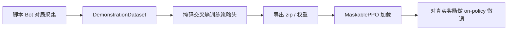

1. **采集**：专家（Simple/Medium/Advanced 等）在环境里打，记录观测、动作、合法动作掩码。
2. **BC**：把策略网络当分类器训练；本项目默认常**冻结或不训 value 头**，留给 PPO 学价值。
3. **导出**：得到可被 SB3 / MaskablePPO 加载的 warm-start。
4. **PPO 微调**：在真实奖励下继续学，纠正「只会模仿、不会应变」的部分。

### 3.3 掩码与类别不平衡

策略游戏大量非法动作。BC 损失应只在**合法动作**上计算（与 MaskablePPO 一致）。
演示里 **`end_turn` 往往占绝大多数**——若不加权，网络会变成「结束回合复读机」。项目用 `end_turn_weight`（可自动按频次平衡）压低/抬高这类样本的梯度贡献。

### 3.4 数据集质量 > 数据集条数

若引擎与 Bot **完全确定**，同一开局会走出**完全相同**的轨迹。你录 50 局，磁盘上有 50 段数据，信息量却可能 ≈ **1 条**。网络在背三条固定剧本，而不是学分布。

缓解：

- 对局中加入随机性（随机对手、地图、种子）；
- 开启 `stochastic_tiebreak`：Bot 在**同分决策**时随机打破平局，避免数据结构遍历顺序导致的假「先手必胜」；
- 多场景 YAML（`bc_scenarios.yaml`）混合地图与对手。

### 3.5 训练指标 vs 游戏力

作者实验：把 `end_turn` 权重拧到很高，BC 的 loss、action_type 准确率明显变好，但对 SimpleBot 的 sanity-eval **字节级不变**。原因：你主要让网络在「专家本来就会 end_turn 的帧」上更准，**没有**改变其它关键状态下的 argmax 战术。

**铁律**：上 PPO 之前，用 `evaluate_bc_against_bot_ladder`（或等价对局评估）看胜率，不要只盯 TensorBoard 的 CE loss。

---

## 4. 公式、符号表与数字例

### 4.1 基本目标

数据集 \(\mathcal{D}=\{(o_i,a_i)\}\)：

\[
L_{\text{BC}}(\theta) = -\mathbb{E}_{(o,a)\sim\mathcal{D}}\big[\log \pi_\theta(a\|o)\big]
\]

带样本权重：

\[
L = -\frac{1}{N}\sum_{i=1}^{N} w_i \log \pi_\theta(a_i\|o_i)
\]

| 符号 | 含义 |
|------|------|
| \(o_i\) | 观测（Dict：grid / units / global…） |
| \(a_i\) | 专家动作（flat 或 MultiDiscrete 各维） |
| \(\pi_\theta\) | 当前策略（掩码后的分布） |
| \(w_i\) | 样本权重（如 end_turn） |

### 4.2 end_turn 自动权重（直觉）

记 end_turn 条数 \(n_{\text{end}}\)，非 end \(n_{\text{non}}\)。常见自动设定：

\[
w_{\text{end}} = \frac{n_{\text{non}}}{\max(n_{\text{end}},1)}
\]

**数字例**：900 条 end，100 条 non → \(w_{\text{end}}\approx 0.11\)。
则 end 的总权重 \(900\times 0.11\approx 100\)，与 non 的总权重 100 同量级，避免被「结束回合」淹没。

（你也可在配置里写死较大的 `end_turn_weight` 做实验，但务必用对局指标验收。）

### 4.3 「有效样本量」

确定性对局：

\[
N_{\text{recorded}} = N,\qquad N_{\text{unique}} \approx 1
\]

开启随机平局 / 随机对手后 \(N_{\text{unique}}\) 上升，BC 才像在学**分布**。

### 4.4 从 BC 到 PPO 在优化什么

- BC：\(\max_\theta \sum \log \pi_\theta(a^{\text{expert}}\|o)\)
- PPO：\(\max_\theta \mathbb{E}[R]\)（带 clip 的策略梯度，见 [05](05-first-train-ppo.md)）

BC 把 \(\pi\) 拉到专家支持集附近，PPO 再在奖励下移动；若 BC 已把策略锁死在错误模式，PPO 需要足够熵与时间才能扳回来。

---

## 5. 为什么本项目选择它 + 优势

| 原因 | 说明 |
|------|------|
| 冷启动太难 | 大动作空间 + 稀疏胜负，纯 PPO 可能几十万步仍不会造兵 |
| 脚本 Bot 免费专家 | Medium/Advanced 会用技能、走位，演示比随机有结构 |
| 与 MaskablePPO 同构 | 同一套 obs/action/mask，权重可直接热启 |
| 可与课程拼接 | `train_bootstrap.py --build-bc` 或独立 `train_with_bc_warmstart.py` |

**优势**：样本效率高、实现直观（就是分类）、失败模式可用监督学习工具诊断（混淆矩阵、按动作类型准确率）。
**上限**：演示多差，克隆多差；分布外局面会崩；不能单靠 BC 打出自对弈上限。

速查：[`../algorithms/behavior-cloning.md`](../algorithms/behavior-cloning.md)。
源码：[`../source-analysis/rl-advanced-trainers.md`](../source-analysis/rl-advanced-trainers.md)。

---

## 6. 执行时可能遇到的问题

| 现象 | 可能原因 | 处理 |
|------|----------|------|
| BC loss 很低但不会玩 | 轨迹重复；只拟合了 end_turn | `stochastic_tiebreak`；多样场景；对局 eval |
| 微调一开始就崩 | 学习率过大；env 与采集时不一致 | 对齐 map/reward/max_actions；降 lr |
| eval 与训练表现天差地别 | 评估 env 漏传 `reward_config` 等 kwargs | **生产与 ad-hoc eval 同一套参数** |
| MultiDiscrete vs flat 对不上 | 动作空间类型不一致 | 采集与模型 `action_space_type` 统一 |
| 内存爆 | 演示过多、obs 过大 | 减 episodes；磁盘 dataset；减并行 |
| 「地图偏袒某一座位」 | 确定平局按数据结构顺序 | 随机 tiebreak 后再下结论 |

---

## 7. 作者 / 项目训练中的困难与解决（通俗改写）

材料来自 `docs/bootstrap_lessons_learned.md` 中 BC 相关段落，改为故事口吻。

### 7.1 确定性 Bot → 重复轨迹

**故事**：你让 AdvancedBot 打 AdvancedBot，录 60 局，满心以为数据很多。结果引擎与决策全确定，60 局是**同一条录像复制 60 次**。BC 把这条脚本背下来，换个小扰动就不会了。

**解决**：`stochastic_tiebreak`（同分随机）+ 多样化场景配置；心里用「唯一轨迹数」而不是「文件行数」衡量数据。

### 7.2 假的「座位不平衡」

曾在 skirmish 上看到确定对局几乎一边倒，像要「只从弱势座位录演示」。打开随机平局决胜后，胜率接近对称——原来是**平局决胜顺序**假象，不是地图结构。

### 7.3 评估环境少传一个参数，差点误判「BC 坏了」

有一次 ad-hoc 评估没把 `reward_config`、`max_actions_per_turn` 等与训练对齐，环境默认值差了数量级，安全网也关了。表现像 BC 完全无效，其实是**评测脚手架 bug**。
**教训**：评估 env 必须转发生产环境的每一个关键 kwargs。

### 7.4 更好看的 BC 曲线 ≠ 更会打架

`end_turn_weight` 拧大三倍，训练指标全面变好，对 SimpleBot 的胜率却完全一样。
**教训**：BC 的验收标准是 **Bot 阶梯对局**，不是 loss 排行榜。

---

## 8. 代码与配置落点

| 组件 | 路径 |
|------|------|
| 演示结构 / 采集 / BC 训练 | `reinforcetactics/rl/imitation.py` |
| 热启动组装 | `make_warm_started_model` 等（同模块 / `rl` 包导出） |
| 端到端示例 | `examples/train_with_bc_warmstart.py` |
| 独立构建脚本 | `scripts/build_bc_warmstart.py` |
| 场景配置 | `configs/imitation/bc_scenarios.yaml`、`bc_beginner_warmstart.yaml`、`bc_skirmish_warmstart.yaml` |
| 课程接入 | `scripts/train/train_bootstrap.py --build-bc` |
| 测试 | `tests/test_imitation.py` |

**关键 API 名（阅读代码时搜索）**：

- `collect_demonstrations` / `collect_demonstrations_multi`
- `DemonstrationDataset`
- `behavior_clone`
- `load_scenarios_from_yaml` / `DemonstrationScenario`
- `stochastic_tiebreak`
- `evaluate_bc_against_bot_ladder`（若在模块中提供）

算法卡：[`../algorithms/behavior-cloning.md`](../algorithms/behavior-cloning.md)。
源码：[`../source-analysis/rl-advanced-trainers.md`](../source-analysis/rl-advanced-trainers.md) · [`../source-analysis/rl-training-pipelines.md`](../source-analysis/rl-training-pipelines.md)。

---

## 9. 实操命令

### 9.1 短跑（优先）：示例脚本小规模 BC + 极短 PPO

```powershell
cd D:\Grok\project2\reinforce-tactics
conda activate reinforce-tactics

python examples/train_with_bc_warmstart.py `
  --demonstrator simple `
  --opponent simple `
  --n-episodes 5 `
  --bc-epochs 2 `
  --bc-batch-size 32 `
  --timesteps 2048 `
  --n-envs 1 `
  --save-path models/bc_smoke.zip `
  --seed 0
```

有场景 YAML 时：

```powershell
python examples/train_with_bc_warmstart.py `
  --scenarios configs/imitation/bc_beginner_warmstart.yaml `
  --n-episodes 5 `
  --bc-epochs 2 `
  --timesteps 2048 `
  --n-envs 1 `
  --save-path models/bc_smoke_scen.zip
```

（具体 CLI 以脚本 `--help` 为准；场景模式会忽略部分演示相关参数。）

### 9.2 单测

```powershell
python -m pytest tests/test_imitation.py -q
```

### 9.3 选做：更像样的 BC 再微调

```powershell
# 选做：更多演示与更长 PPO（耗时）
python examples/train_with_bc_warmstart.py `
  --demonstrator medium `
  --opponent medium `
  --n-episodes 100 `
  --bc-epochs 10 `
  --timesteps 200000 `
  --n-envs 4 `
  --save-path models/bc_warmstart_ppo.zip
```

课程前 BC（选做）：

```powershell
python scripts/train/train_bootstrap.py --build-bc --bc-epochs 10 --device cpu
```

---

## 10. 自测 3 题

1. **概念**
   用一句话区分 BC 与 PPO 的「监督信号」分别来自哪里。为什么 BC 通常超不过专家水平？

2. **数据**
   确定性 Bot 对打录了 \(N=50\) 局，为何有效信息可能 ≈1 条轨迹？写出一种项目内的缓解开关名称，并说明它在做什么。

3. **工程判断**
   BC 训练 loss 从 2.7 降到 1.2，full_action_acc 上升，但对 SimpleBot 胜率不变。下一步你应相信训练曲线还是对局评估？可能原因是什么？

**简答提示**

1. BC：专家动作标签；PPO：环境回报。BC 目标是拟合演示分布，演示错了就跟着错。
2. 全确定 → 重复轨迹；`stochastic_tiebreak` 在同分决策时引入随机，增加轨迹多样性。
3. 相信对局评估；权重可能只改善了 end_turn 帧，未改变关键战术状态的 argmax。

---

## 延伸阅读

- [`../algorithms/behavior-cloning.md`](../algorithms/behavior-cloning.md)
- [`../algorithms/curriculum-bootstrap.md`](../algorithms/curriculum-bootstrap.md)
- [`../source-analysis/rl-advanced-trainers.md`](../source-analysis/rl-advanced-trainers.md)
- 下一章：[10 自对弈](10-self-play.md)

---


<div style="page-break-before: always;"></div>

# 第 10 章：自对弈（Self-Play）

---

## 1. 本章目标

读完本章并完成短跑后，你应能：

1. 解释：**没有更强人类/专家时**，为什么还要继续训练——对手可以是「昨天的自己」。
2. 说明**对手池（Opponent Pool）**与历史快照如何防止「只克制当前镜像」。
3. 指出环境如何通过 `set_self_play_opponent_factory` 绑定自对弈对手。
4. 知道代码与配置：`rl/self_play.py`、`train_self_play.py`、`configs/self_play/self_play.yaml`。
5. 区分「训练时自对弈」与「评估时仍用固定 Bot」的必要性。

前置：[05 PPO](05-first-train-ppo.md)、[08 课程](08-curriculum-bootstrap.md)。速查：[`../algorithms/self-play.md`](../algorithms/self-play.md)。

---

## 2. 生活 / 游戏类比

| 类比 | 自对弈 |
|------|--------|
| 围棋/电竞里「开小号镜像打自己」 | 当前策略当对手 |
| 天梯上保留旧版本幽灵，防止只会一种套路 | **对手池**采样历史 checkpoint |
| 剪刀石头布：A 克 B 克 C 克 A | **非传递性**——只打当前自己会绕圈 |
| 有时仍找木桩练习固定招式 | **mixed training**：一部分局打脚本 Bot |

专家演示（BC）和脚本 Bot 有**天花板**。打穿 Medium/Advanced 之后，继续涨分需要**自动变强的对手**——最便宜的来源就是自己的历史版本。

---

## 3. 基本原理（零基础）

### 3.1 核心思想

训练循环中：

1. 智能体用策略 \(\pi_{\text{train}}\) 操控一方；
2. 另一方由 \(\pi_{\text{opp}}\) 操控——可以是 \(\pi_{\text{train}}\) 的拷贝，或历史快照；
3. 用对局回报更新 \(\pi_{\text{train}}\)；
4. 定期把当前权重**快照进池**，供以后当对手。

这样对手强度大致跟着你长，避免「永远打固定 Bot 过拟合到三条死线」。

### 3.2 为何需要对手池，而不是永远镜像当前自己

只打「当前自己」时常见问题：

- **循环策略**：你学克制刚才的自己，对方一变，旧克制失效，像石头剪刀布转圈；
- **灾难性遗忘**：为赢现在的镜像，丢掉克制旧套路的能力；
- **评估虚高**：自己评自己，分数好看但不代表对 Bot/他人更强。

**对手池**保存多个历史策略，每局按规则采样一个当对手（均匀或偏近期）。这接近「虚构自对弈 / FSP 风格」直觉：对**历史混合分布**做最佳反应，而不是只盯一个点。

### 3.3 环境侧如何挂上对手

本项目的 `StrategyGameEnv` 在 `opponent="self"`（或等价自对弈模式）时，**不在内部写死**神经网络对手，而是：

1. 训练脚本注册工厂：`env.set_self_play_opponent_factory(factory)`；
2. `factory(game_state, opponent_player) -> Bot`（需实现 `take_turn()`）；
3. 每次 `reset` 时用工厂为对手座位绑定例如 `ModelBot`（加载某 zip/权重）。

向量环境则用 `make_self_play_env` / `make_self_play_vec_env` 批量包装。

### 3.4 其它实用旋钮

| 旋钮 | 含义 |
|------|------|
| `swap_players` | 随机坐玩家 1/2，减轻座位偏差 |
| `opponent_update_freq` | 多久刷新「当前对手」权重 |
| `pool_size` / `pool_strategy` | 池容量与采样（uniform / recent…） |
| `add_to_pool_freq` | 多久尝试把当前模型入池 |
| `min_win_rate_for_pool` | 太弱的快照不入池（可选门槛） |
| `mixed_training` + `bot_ratio` | 部分对局仍打脚本 Bot，锚定可解释基线 |

### 3.5 流程示意

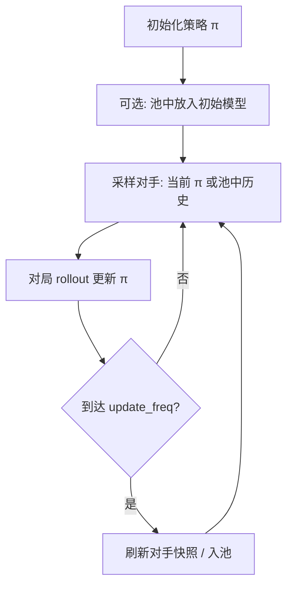

**评估**：请用**固定**脚本 Bot 或固定历史快照，不要用「正在训练的自己」当唯一评测对手，否则曲线不可比。

---

## 4. 公式、符号表与数字例

### 4.1 均匀对手池

池中 \(M\) 个历史策略 \(\pi_1,\ldots,\pi_M\)：

\[
P(\text{对手}=\pi_i) = \frac{1}{M}
\]

| 符号 | 含义 | 配置 |
|------|------|------|
| \(M\) | 池大小 | `pool_size` |
| \(\pi_i\) | 第 \(i\) 份快照 | 磁盘 checkpoint |

### 4.2 偏近期采样（示意）

若权重与下标成正比 \(P(i)\propto i\)：

\[
P(M)=\frac{2}{M+1}
\]

例：\(M=10\) → 最新约占 \(2/11\approx 18\%\)，仍保留旧版本压力。

### 4.3 混合训练

`bot_ratio=0.3`：

\[
P(\text{脚本 Bot})=0.3,\quad P(\text{自对弈对手})=0.7
\]

**玩具例**：1000 局里约 300 局打 Simple/Medium，700 局打池中模型——既自我进化，又不忘「公开木桩」上的胜率含义。

### 4.4 非传递性（为何不能只有镜像）

若胜负关系成环：\(\pi_A\) 克 \(\pi_B\) 克 \(\pi_C\) 克 \(\pi_A\)。
只优化「克制当前自己」可能在环上打转；池强迫你对**多种风格**保持鲁棒。

---

## 5. 为什么本项目选择它 + 优势

| 动机 | 说明 |
|------|------|
| 脚本 Bot 有上限 | 打穿 Advanced 后需要新压力 |
| 人类演示贵 | 自对弈自动产对抗数据 |
| 与 PPO 主线兼容 | 仍是 MaskablePPO + Gym 环境，只换对手来源 |
| Feudal 等也可挂同一工厂 | `set_self_play_opponent_factory` 是环境级钩子 |

**优势**：可持续变强、减少对固定套路过拟合、实现成本低于再写更强规则 AI。
**代价**：训练更不稳定、评估更难设计、算力更高（对手也要推理）。

速查：[`../algorithms/self-play.md`](../algorithms/self-play.md)。
源码：[`../source-analysis/rl-training-pipelines.md`](../source-analysis/rl-training-pipelines.md) · [`../source-analysis/rl-gym-env.md`](../source-analysis/rl-gym-env.md)。

---

## 6. 执行时可能遇到的问题

| 现象 | 可能原因 | 处理 |
|------|----------|------|
| 训练 reward 升、对 Simple 胜率降 | 过拟合镜像风格 | 加大池；mixed_training；固定 Bot 评估 |
| 胜率在 50% 附近抖 | 双方同步变强 | 正常现象；看对固定锚的曲线 |
| 工厂未注册就 reset | 忘了 `set_self_play_opponent_factory` | 训练脚本启动时注册 |
| 座位一边倒 | 未 swap | `swap_players: true` |
| 池里全是弱模型 | 门槛过低 / 过早入池 | `min_win_rate_for_pool`；降低入池频率 |
| 太慢 | 对手也是神经网络 + 多环境 | 减 n_envs；减对手网络规模；CPU 线程 |

---

## 7. 作者 / 项目训练中的困难与解决（通俗改写）

### 7.1 「先爬 Bot 阶梯，再上自对弈」

项目主路径仍是：**课程 Bootstrap 打脚本阶梯**（必要时 BC 热启），自对弈是「打穿固定对手之后」的进阶，而不是零基础第一课。过早自对弈 = 两个菜鸟互啄，进步慢且难诊断。

### 7.2 评估锚必须固定

若评估对手也随训练更新，你无法知道「是真变强还是评测变水」。生产配置里常见：训练 `opponent=self`，评估仍对 `simple`/`medium` 或冻结快照。

### 7.3 与 BC、课程的组合

`configs/ppo/skirmish_bc_selfplay.yaml` 一类配置体现工程经验：**BC 给开局先验 → 自对弈给上限**。单独自对弈冷启动在大动作空间上仍然痛苦。

### 7.4 工厂模式统一多算法

PPO 自对弈、Feudal 自对弈都走「环境工厂绑定 ModelBot」——避免每个训练器复制一套换对手逻辑。改对手加载 bug 时只改一处。

---

## 8. 代码与配置落点

| 组件 | 路径 |
|------|------|
| 对手池 / SelfPlayEnv / 工厂辅助 | `reinforcetactics/rl/self_play.py` |
| 环境钩子 | `StrategyGameEnv.set_self_play_opponent_factory`（`rl/gym_env.py`） |
| 训练脚本 | `scripts/train/train_self_play.py` |
| 配置 | `configs/self_play/self_play.yaml` |
| BC+自对弈示例配置 | `configs/ppo/skirmish_bc_selfplay.yaml` |
| 配置类型 | `rl/config.SelfPlayConfig` |
| 测试 | `tests/test_self_play.py` |

**阅读入口建议**：

1. `OpponentPool`：如何 add / sample；
2. `SelfPlayEnv` 或 `make_self_play_vec_env`：如何包底层 env；
3. `train_self_play.py` 里 callback：何时 update 对手、何时入池；
4. `set_self_play_opponent_factory` 的调用点与 `factory` 签名。

算法卡：[`../algorithms/self-play.md`](../algorithms/self-play.md)。

---

## 9. 实操命令

### 9.1 短跑（优先）

```powershell
cd D:\Grok\project2\reinforce-tactics
conda activate reinforce-tactics

python scripts/train/train_self_play.py --help
```

按脚本支持的参数做冒烟（名称以 `--help` 为准），原则：**极少时间步、1 个环境、小池**：

```powershell
# 示例：短时间步冒烟（若脚本使用不同参数名，以 --help 为准）
python scripts/train/train_self_play.py `
  --config configs/self_play/self_play.yaml `
  --timesteps 4096 `
  --n-envs 1 `
  --use-opponent-pool `
  --pool-size 2
```

若 CLI 不暴露全部字段，可改一份临时 YAML：把 `total_timesteps` 改为几千，`n_envs: 1`，`use_subprocess: false`。

### 9.2 单测

```powershell
python -m pytest tests/test_self_play.py -q
```

### 9.3 选做：较长自对弈

```powershell
# 选做：接近配置默认的长训
python scripts/train/train_self_play.py --config configs/self_play/self_play.yaml
```

---

## 10. 自测 3 题

1. **概念**
   为什么「没有更强专家」时自对弈仍然有用？只打当前自己而不保留历史，主要风险是什么？

2. **计算**
   对手池 \(M=5\)，均匀采样。求抽到「最老快照」的概率。若改为 \(P(i)\propto i\)（\(i=1..5\)），最新快照概率是多少？

3. **工程**
   `set_self_play_opponent_factory` 的工厂应返回什么？为什么评估阶段仍建议使用固定 Bot？

**简答提示**

1. 对手强度可随自身提升自动生成；只打镜像易循环策略/遗忘。
2. 均匀：\(1/5=0.2\)；偏近期：\(P(5)=2/(5+1)=1/3\)。
3. 返回带 `take_turn()` 的 Bot（常为加载权重的 ModelBot）；固定评估才可比较跨时间实力。

---

## 延伸阅读

- [`../algorithms/self-play.md`](../algorithms/self-play.md)
- [`../algorithms/evaluation-and-elo.md`](../algorithms/evaluation-and-elo.md)
- [`../source-analysis/rl-gym-env.md`](../source-analysis/rl-gym-env.md)
- 下一章：[11 Feudal RL](11-feudal-rl.md)

---


<div style="page-break-before: always;"></div>

# 第 11 章：Feudal RL（分层经理—工人）

---

## 1. 本章目标

读完本章并完成短跑后，你应能：

1. 用「经理下目标、工人做微操」解释 Feudal / 分层 RL。
2. 说出 **内在奖励（intrinsic）** 与 **外在奖励（extrinsic）** 如何一起塑造工人。
3. 理解为何长地平线策略游戏适合分层（信用分配）。
4. 用通俗语言复述项目 review 中的坑：奖励尺度、checkpoint 超参、AR worker 等。
5. 定位代码：`rl/feudal_rl.py`、`scripts/train/train_feudal_rl.py`、`configs/feudal/feudal_rl.yaml`。

前置：MDP/PPO 直觉（[02](02-game-mechanics-as-mdp.md)、[05](05-first-train-ppo.md)）。速查：[`../algorithms/feudal-rl.md`](../algorithms/feudal-rl.md)。

---

## 2. 生活 / 游戏类比

| 类比 | Feudal RL |
|------|-----------|
| RTS 里你点「攻击这里」，小兵自己寻路开火 | **经理**出目标，**工人**逐步执行 |
| 公司 KPI：季度目标 vs 每天打卡任务 | 高层稀疏目标 vs 底层逐步动作 |
| 工人既领公司工资，也因「靠近项目里程碑」拿奖金 | 外在环境奖 + **内在目标奖** |
| 经理每两周开一次会改方向，不是每分钟改 | `manager_horizon`：隔若干步才换目标 |

平坦 PPO 相当于「每一帧都要自己想战略 + 战术」。分层把问题拆开：高层学「现在该进攻/防守/占点/扩张」，底层学「在这个目标下点哪个格子、哪支兵」。

---

## 3. 基本原理（零基础）

### 3.1 两层决策

| 层 | 输出 | 更新频率 |
|----|------|----------|
| **Manager（经理）** | 目标 \(g=(\text{goal\_x}, \text{goal\_y}, \text{goal\_type})\) | 约每 \(H_m\) 个环境步 |
| **Worker（工人）** | 与环境相同的微动作（造/走/打/占/技能/结束回合…） | 每步 |

`goal_type` 在本项目中编码为：0 进攻、1 防守、2 占领、3 扩张（语义由训练与内在奖励塑造，不是写死的规则 AI）。

### 3.2 内在奖励是什么

环境给的仍是原来的 `reward`（外在）。此外，系统根据「工人有没有朝经理的目标靠拢」再算一笔 **intrinsic reward**，例如：

- 己方单位到目标格的曼哈顿距离越近越好（距离惩罚）；
- 站上目标格给奖励；
- 按目标类型加一点情境分（附近敌人、可占建筑等）。

工人看到的训练信号大致是「内在 + 缩放后的外在」的混合，由 `worker_reward_alpha`、`reward_scale` 等控制。

### 3.3 为什么长地平线需要分层

一局可能上百～上千环境步才分胜负。平坦策略要在极长链条上做**信用分配**：「50 步前的一次造兵是否导致了胜利？」很难。

分层后：

- 经理在**段（segment）**尺度上优化（一段 = 一个目标持续的若干 worker 步）；
- 工人在**短程**上优化「完成当前目标」——即使最终没赢，段内也可能有密集内在信号。

### 3.4 训练步骤（概念）

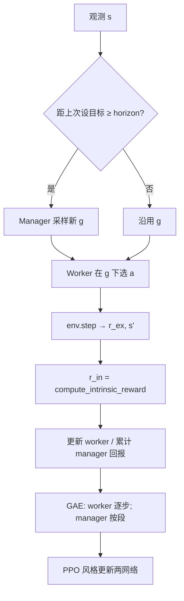

实现主类：`reinforcetactics.rl.feudal_rl.FeudalRLAgent`。

### 3.5 两种工人头：独立多头 vs 自回归（AR）

- **Legacy / 多独立头**：与 MultiDiscrete 各维类似，维间条件化弱，掩码有时偏近似。
- **Autoregressive（AR）worker**：像 AlphaStar 那样按阶段分解动作
  \(p(\text{类型})\,p(\text{源}\|\,)\,\ldots\)，并对每阶段使用结构化掩码，非法组合更少。

AR 更「正确」，也更吃实现与调试；项目提供 A/B 脚本 `scripts/ab_feudal_ar.py`。

### 3.6 与自对弈、锦标赛的关系

Feudal 可走 `opponent=self` + `set_self_play_opponent_factory`；checkpoint 为 `.pt`，`ModelBot` / 锦标赛发现逻辑需能加载 Feudal（见源码分析）。对初学者：先在固定 Bot 上把短训跑通，再开自对弈。

---

## 4. 公式、符号表与数字例

### 4.1 工人奖励混合（概念）

\[
r^{\text{w}}_t = \alpha\, r^{\text{in}}_t + (1-\alpha)\, c\, r^{\text{ex}}_t
\]

| 符号 | 含义 | 配置 |
|------|------|------|
| \(r^{\text{in}}\) | 内在（朝目标） | `compute_intrinsic_reward` |
| \(r^{\text{ex}}\) | 环境外在 | env `reward` |
| \(\alpha\) | 内在权重 | `worker_reward_alpha` |
| \(c\) | 外在缩放 | `reward_scale` |

终局若是 ±几千，而内在是 ±10 量级，**不缩放**会让价值网络只看见炸弹终局，内在信号被淹没，或 value loss 爆炸。

### 4.2 内在奖励结构（与代码一致的摘要）

对目标格 \((g_x,g_y)\) 与类型：

1. 无己方单位 → 较强负值（如 −10）；
2. \(d_{\min}=\min_i(|y_i-g_y|+|x_i-g_x|)\)，贡献 \(-0.1\,d_{\min}\)；
3. 单位站在目标格 → +5；
4. 按 type 追加（进攻附近敌人、防守加成、可占建筑、扩张兵力等）。

**玩具例**：目标 \((3,1)\)，type=占领；最近己方在 \((3,2)\)：

\[
d_{\min}=1,\quad r\approx -0.1
\]

下一步走上 \((3,1)\) 且该格可占：

\[
r \approx 0 + 5 + 4 = 9
\]

工人在短程内就能感到「朝目标走是对的」。

### 4.3 Manager 段 GAE（直觉）

段长 \(k_t\)（该目标持续了多少 worker 步）：

\[
\delta_t = R_t + \gamma^{k_t} V(s_{t+1})(1-d_t) - V(s_t)
\]

| 符号 | 含义 |
|------|------|
| \(R_t\) | 该段累计的经理侧回报 |
| \(\gamma^{k_t}\) | 跨过 \(k_t\) 底层步的折扣 |
| \(d_t\) | 终止标记 |

**数字**：\(\gamma=0.99\)，\(k=10\) → \(\gamma^{10}\approx 0.904\)。
意思是：经理不是每步打分，而是按「目标段落」打分。

### 4.4 Horizon

`manager_horizon=10`：大约每 10 个 env 步重选目标。
太短 → 高层噪声、工人来不及执行；太长 → 目标过时、战局已变。

---

## 5. 为什么本项目选择它 + 优势

| 动机 | 说明 |
|------|------|
| 对局长、胜利稀疏 | 分层缩短工人信用链条 |
| 战略/战术天然分层 | 占点/进攻 vs 具体走子 |
| 可与掩码、自对弈、ModelBot 集成 | 一等公民训练路径之一 |
| 可试验 AR 动作头 | 缓解大 MultiDiscrete 掩码近似 |

**优势**：可解释的「当前目标」、内在奖励提供稠密信号、架构清晰（双网络 + 段 GAE）。
**代价**：超参更多（horizon、α、reward_scale）、实现与调试重、相对 PPO 主路径**实验与社区验证更少**——把它当进阶选修，而不是唯一主线。

速查：[`../algorithms/feudal-rl.md`](../algorithms/feudal-rl.md)。
源码：[`../source-analysis/rl-advanced-trainers.md`](../source-analysis/rl-advanced-trainers.md)。
作者 review：`docs/feudal_rl_review.md`。

---

## 6. 执行时可能遇到的问题

| 现象 | 可能原因 | 处理 |
|------|----------|------|
| value_loss 爆炸 | 外在终局 ±5000 未缩放 | `reward_scale=0.001` 量级 |
| 工人不听经理 | α 过小/过大；内在未标定 | 看 `worker_intrinsic_mean` / `goal_reached_rate` |
| AR 无掩码警告 | env 缺 structured masks | 用支持结构化掩码的动作空间；或回退 legacy |
| checkpoint 加载失败 | 网格尺寸 / hyperparams 不匹配 | 同 map 尺寸；读 checkpoint 内 hyperparams |
| 只单环境很慢 | 未开 vec | `--n-envs > 1` 走 `collect_rollout_vec` |
| 与 SB3 zip 混淆 | Feudal 存 `.pt` | ModelBot 按扩展名分发 |

---

## 7. 作者 / 项目训练中的困难与解决（通俗改写）

以下来自 `docs/feudal_rl_review.md` 等，改成「发生了什么 → 怎么办」。

### 7.1 奖励尺度：价值网络被终局「炸飞」

**现象**：终端奖励动辄 ±几千，value loss 暴涨，策略更新被价值项主导。
**解决**：采集时引入 `reward_scale`（配置 / CLI），把外在信号缩到与策略熵、内在奖励同一数量级（文档示例常提到 `0.001`）。
**你怎么记**：先让三个 loss 项「数量级能同框」，再谈调 α。

### 7.2 Checkpoint 必须记住运行时超参

**现象**：只存网络权重，加载后 `manager_horizon`、网格大小、是否 AR 对不上 → 静默错行为或直接拒绝。
**解决**：`save_checkpoint` 写入 `hyperparams`；加载时恢复 horizon 等，**网格维度不匹配则拒绝**。训练脚本支持 `--resume` 连优化器与步数一并恢复。

### 7.3 AR Worker：强大但要整条链路配合

**现象**：AR 头写好了，训练脚本/YAML 曾经够不着；或环境没有 `structured_action_masks` 时静默变成无掩码乱采样。
**解决**：YAML + CLI 显式开关；缺掩码时 **RuntimeWarning** 并明确回退行为；另备 `ab_feudal_ar.py` 做对照实验。
**现状诚实点**：大规模 AR vs legacy 的胜负结论仍依赖你自己跑 A/B，不是「已经证明全面更强」。

### 7.4 工程化缺口曾挡住「能当真用」

历史上修过/补过的方向（便于你读 review 时对号入座）：

- ModelBot / 锦标赛发现 `.pt`；
- 自对弈工厂；
- 多环境向量化 rollout；
- 内在/外在/达成分解日志；
- 评估与存盘用高水位而不是脆弱的 `%` 调度；
- 线性学习率退火、梯度范数日志；
- best 模型按 (胜率, 均回报) 元组选取。

仍偏研究向的：子进程并行 env、目标空间探索奖励、horizon 课程、平台期早停等。

### 7.5 和主线 PPO 的关系

Feudal **不是**要替换 bootstrap 主路径，而是探索「长程分层是否更合适本游戏」。学习顺序建议：先跑通 MaskablePPO 课程，再开本章短训。

---

## 8. 代码与配置落点

| 组件 | 路径 |
|------|------|
| 智能体 / 网络 / buffer / 内在奖励 | `reinforcetactics/rl/feudal_rl.py` |
| 训练脚本 | `scripts/train/train_feudal_rl.py` |
| 配置 | `configs/feudal/feudal_rl.yaml` |
| AR A/B | `scripts/ab_feudal_ar.py` |
| 笔记本 | `notebooks/feudal_rl_training.ipynb` |
| 测试 | `tests/test_feudal_rl.py`、`tests/test_feudal_rl_integration.py` |
| 特征提取（可共享） | `reinforcetactics/rl/extractors.py` |

**建议阅读顺序**：`FeudalRLAgent` 构造 → `collect_rollout` / `collect_rollout_vec` → `compute_intrinsic_reward` → `update` → `save_checkpoint` / `load_checkpoint`。

算法卡：[`../algorithms/feudal-rl.md`](../algorithms/feudal-rl.md)。
源码：[`../source-analysis/rl-advanced-trainers.md`](../source-analysis/rl-advanced-trainers.md)。

---

## 9. 实操命令

### 9.1 短跑（优先）

```powershell
cd D:\Grok\project2\reinforce-tactics
conda activate reinforce-tactics

python scripts/train/train_feudal_rl.py --help
```

冒烟原则：极少 `total_timesteps`、单环境、CPU、固定小地图：

```powershell
python scripts/train/train_feudal_rl.py `
  --config configs/feudal/feudal_rl.yaml `
  --device cpu `
  --n-envs 1 `
  --total-timesteps 2048 `
  --map-file maps/1v1/starter.csv `
  --reward-scale 0.001
```

（参数名以 `--help` 为准；若 YAML 键不同，用脚本支持的覆盖方式。）

### 9.2 单测

```powershell
python -m pytest tests/test_feudal_rl.py tests/test_feudal_rl_integration.py -q
```

### 9.3 选做

```powershell
# 选做：更长训练 / AR worker / 自对弈（耗时）
python scripts/train/train_feudal_rl.py --config configs/feudal/feudal_rl.yaml --device cuda
python scripts/ab_feudal_ar.py --help
```

---

## 10. 自测 3 题

1. **概念**
   经理输出什么？工人输出什么？内在奖励主要奖励工人做什么？

2. **计算**
   \(\gamma=0.99\)，某段持续 \(k=20\) 步。经理 bootstrapping 时用的折扣因子 \(\gamma^{k}\) 大约是多少？（可用 \(0.99^{20}\approx e^{-0.2}\approx 0.82\) 估算。）若外在终局为 ±5000，为何还需要 `reward_scale`？

3. **工程**
   列举两个项目在 Feudal 上踩过的坑（奖励尺度 / checkpoint / AR 任选），并各用一句话说明修复方向。

**简答提示**

1. 经理：目标坐标+类型；工人：微动作；内在：靠近/完成目标。
2. \(\gamma^{20}\approx 0.82\)；大终局不缩放会使 value 目标与内在信号数量级失衡。
3. 例：reward_scale 压终局；checkpoint 存 hyperparams 并校验网格；AR 显式开关+缺掩码警告。

---

## 延伸阅读

- [`../algorithms/feudal-rl.md`](../algorithms/feudal-rl.md)
- [`../algorithms/ppo.md`](../algorithms/ppo.md)
- [`../source-analysis/rl-advanced-trainers.md`](../source-analysis/rl-advanced-trainers.md)
- `docs/feudal_rl_review.md` / `docs/zh/feudal_rl_review.md`
- 下一章：[12 AlphaZero 与 MCTS](12-alphazero-mcts.md)

---


<div style="page-break-before: always;"></div>

# 第 12 章：AlphaZero 与蒙特卡洛树搜索（MCTS）

---

## 1. 本章目标

读完本章并完成短跑后，你应能：

1. 用「先想几步再落子」解释 MCTS 的选择—扩展—评估—回传。
2. 写出 **PUCT** 公式，填符号表，并手算一个两动作玩具例。
3. 说明策略头 / 价值头与自对弈数据 \((s,\pi_{\text{MCTS}},z)\) 如何训练网络。
4. **诚实理解项目状态**：代码路径已实现，但相对 MaskablePPO 课程主路径，**验证与实战调参更少**。
5. 定位：`mcts.py`、`alphazero_net.py`、`alphazero_trainer.py`、`train_alphazero.py`。

前置：MDP 基础、自对弈直觉（[02](02-game-mechanics-as-mdp.md)、[10](10-self-play.md)）。速查：[`../algorithms/alphazero-mcts.md`](../algorithms/alphazero-mcts.md)。

---

## 2. 生活 / 游戏类比

| 类比 | AlphaZero 组件 |
|------|----------------|
| 下棋前在脑中推演几条变化 | **MCTS 模拟** |
| 「这步以前常走且赢面大」 | 访问次数 \(N\) 与平均价值 \(Q\) |
| 「书上说这步是理论着」 | 网络策略先验 \(P\) |
| 「局势我方略优」的直觉分 | 价值头 \(v\) |
| 用自己和自己下的棋谱当教材 | **自对弈数据**训练网络 |
| 开局故意加点花样避免死背 | 根节点 **Dirichlet 噪声** |

和纯 PPO 的差别：PPO 主要靠采样到的真实轨迹学；AlphaZero 在**每一步决策前**用搜索「改进」走子分布，再用改进后的分布当训练目标。

---

## 3. 基本原理（零基础）

### 3.1 两块积木

1. **神经网络** \(\theta\)
   - **策略头**：\(p(a\|s)=\pi_\theta(a\|s)\)——先验「该考虑哪些着法」。
   - **价值头**：\(v_\theta(s)\in[-1,1]\) 量级——「谁更好」。

2. **MCTS**
   在真实落子前，于**克隆的游戏状态**上做多次模拟，统计每条边的访问次数，得到更靠谱的 \(\pi_{\text{MCTS}}\)。

AlphaZero 风格的叶节点评估用**网络价值**，而不是古典 MCTS 那种随机打到终局（在大动作空间上后者极慢且噪声大）。

### 3.2 MCTS 四步（循环多次）

| 步骤 | 做什么 |
|------|--------|
| **选择 Select** | 从根沿树走，用 PUCT 分选子节点，直到叶子 |
| **扩展 Expand** | 在叶子按合法动作建子，挂上网络先验 \(P\) |
| **评估 Evaluate** | 终局则 ±1/0；否则前向网络得 \(v\) |
| **回传 Backup** | 沿路径更新访问 \(N\)、累计价值 \(W\)（从而 \(Q=W/N\)） |

一次「落子」前通常跑 `num_simulations` 次上述循环，然后按访问次数（可加温度）采样或取 argmax 动作。

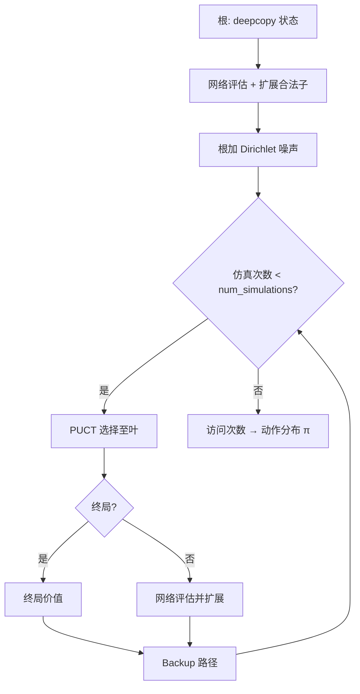

### 3.3 训练迭代（外环）

1. 多局自对弈：每步 MCTS → 得到 \(\pi_{\text{MCTS}}\) → 温度采样动作 → 存 \((s,\pi)\)。
2. 终局得到结果 \(z\)（相对该方：胜 +1 / 负 −1 / 和 0）。
3. 从回放缓冲采样，最小化：价值贴近 \(z\)，策略贴近 \(\pi_{\text{MCTS}}\)。
4. 定期与旧最优或规则 Bot 评估，决定是否接受新权重。

### 3.4 动作表示注意点

本项目 flat 动作常映射为：`atype * H*W + y*W + x`（与 env 一致）；`end_turn` 有规范格约定。搜索只在**合法动作掩码**上扩展。细节见源码与 [`../source-analysis/rl-advanced-trainers.md`](../source-analysis/rl-advanced-trainers.md)。

### 3.5 项目状态（诚实）

| 方面 | 状态 |
|------|------|
| 代码 | `MCTS`、`AlphaZeroNet`、`AlphaZeroTrainer`、训练脚本、测试均存在 |
| 与 PPO 主路径比 | **实验篇幅、超参扫、公开「打穿 Bot 阶梯」证据更少** |
| 你应期待 | 短跑能通、单测能过；长训出战力需要自行投入算力与调参 |
| 学习价值 | 理解「搜索 + 学习」范式；不要默认它已是本仓库最强上分路线 |

主线仍是：**MaskablePPO + 课程 Bootstrap（± BC）**。本章是进阶选修。

---

## 4. 公式、符号表与数字例

### 4.1 平均行动价值

\[
Q(s,a) = \frac{W(s,a)}{N(s,a)}
\]

| 符号 | 含义 |
|------|------|
| \(N(s,a)\) | 边访问次数 |
| \(W(s,a)\) | 回传价值累计 |
| \(Q(s,a)\) | 平均价值 |

若子节点轮到对手，实现里常对 \(Q\) **取反**（零和视角）。

### 4.2 PUCT 选择（与本仓库实现一致）

\[
\text{score}(a) = Q(s,a) + c_{\text{puct}}\, P(s,a)\, \frac{\sqrt{N(s)+1}}{1+N(s,a)}
\]

| 符号 | 含义 | 代码侧 |
|------|------|--------|
| \(Q(s,a)\) | 平均价值（或取反） | `child.q_value` |
| \(P(s,a)\) | 网络先验 | `child.prior` |
| \(N(s)\) | 父访问 | `node.visit_count` |
| \(N(s,a)\) | 边访问 | `child.visit_count` |
| \(c_{\text{puct}}\) | 探索强度 | 默认约 `1.5` |

**玩具例**：父 \(N=8\)，\(c_{\text{puct}}=1.5\)，\(\sqrt{N+1}=3\)。

| a | \(N_a\) | \(Q\) | \(P\) |
|---|--------|-------|-------|
| A | 5 | 0.4 | 0.6 |
| B | 1 | 0.1 | 0.4 |

\[
U_A = 1.5\times 0.6\times 3 / (1+5) = 0.45,\quad
\text{score}_A=0.4+0.45=0.85
\]

\[
U_B = 1.5\times 0.4\times 3 / (1+1) = 0.9,\quad
\text{score}_B=0.1+0.9=1.0
\]

→ 选 **B**（访问少、先验尚可，探索项更大）。

### 4.3 根策略与温度

\[
\pi(a) \propto N_a^{1/\tau}
\]

- \(\tau\to 0\)：取访问最多的着（评估常用）
- \(\tau=1\)：按访问比例（自对弈前段探索）

`temperature_threshold`：前若干步用高温，之后降温。

### 4.4 训练损失（标准形）

\[
L = (z - v)^2 - \pi^{\top}\log p + c\|\theta\|^2
\]

| 符号 | 含义 |
|------|------|
| \(z\) | 终局结果（相对当前方） |
| \(v\) | 价值头 |
| \(\pi\) | MCTS 改进策略 |
| \(p\) | 网络策略 |
| \(c\) | 权重衰减等正则 |

### 4.5 根 Dirichlet 噪声

\[
P'(a) = (1-\epsilon)P(a) + \epsilon\,\eta_a,\quad
\eta\sim\mathrm{Dir}(\alpha)
\]

默认量级：`dirichlet_alpha≈0.3`，`dirichlet_epsilon≈0.25`。

---

## 5. 为什么本项目选择它 + 优势

| 动机 | 说明 |
|------|------|
| 需要前瞻 | 纯策略网络一步贪心，缺规划 |
| 分支大 | 用先验 \(P\) 引导搜索，比盲搜可行 |
| 无专家标签 | 自对弈产 \((s,\pi,z)\) |
| 教学完整 | 经典「搜索+学习」对照 PPO 路径 |

**优势（理论上）**：决策带规划；训练目标是改进后的 \(\pi\) 而非瞬时策略；价值与策略联合。
**现实约束（本仓库）**：每步多次模拟 × 状态 deepcopy 成本高；调参面广；**公开可复现的「已稳定吊打 Advanced」故事弱于 PPO 课程线**。

速查：[`../algorithms/alphazero-mcts.md`](../algorithms/alphazero-mcts.md)。

---

## 6. 执行时可能遇到的问题

| 现象 | 可能原因 | 处理 |
|------|----------|------|
| 极慢 | `num_simulations` 大 + deepcopy | 短跑用 8～20 次模拟；减 `max_game_steps` |
| 策略坍缩 | 根噪声不足 / 温度过快降 | 调 Dirichlet；延长高温步数 |
| 与 PPO zip 混用 | 格式完全不同 | 勿期望互载；走 AlphaZero 自己的 ckpt |
| 非法动作 | 掩码未接入搜索 | 查 expand 是否读合法动作 |
| 评估虚高 | 只和过弱旧模型比 | 加规则 Bot 锚；看多局 |

---

## 7. 作者 / 项目训练中的困难与解决（通俗改写）

### 7.1 「实现了」≠「主线上分路径」

仓库把 MCTS + 双头网络 + 训练环写全，并有单元测试与 CLI。但作者精力与文档长篇复盘主要砸在 **PPO bootstrap**（课程、奖励、平衡、BC）。
**对你的含义**：学概念、跑通短训很合适；若目标是尽快得到强 Bot，优先 [08](08-curriculum-bootstrap.md) 主线。

### 7.2 状态克隆与动作空间成本

策略游戏每步合法动作多，树要在 `GameState` 拷贝上推进。模拟次数一加，墙钟时间线性涨。短跑配置必须**狠砍** simulations 与对局长度。

### 7.3 评估与晋级

外环常有「新模型对旧最优的胜率门槛」（如 55%）才替换。门槛与 `eval_games` 过小会噪声晋级；过大则烧预算。这与课程 patience 是同一类统计问题（见 [13](13-evaluation-elo-tournament.md)）。

### 7.4 和 Feudal / PPO 的定位

三条线解决不同假设：

| 路径 | 核心赌注 |
|------|----------|
| PPO + 课程 | 塑形 + 难度阶梯 + 掩码即可 |
| Feudal | 显式分层目标 |
| AlphaZero | 规划搜索改进策略目标 |

没有先验保证哪条在本游戏上最终最强——以你能复现的评估为准。

---

## 8. 代码与配置落点

| 组件 | 路径 |
|------|------|
| MCTS / 节点 / PUCT | `reinforcetactics/rl/mcts.py` |
| 网络 | `reinforcetactics/rl/alphazero_net.py` |
| 训练器 / 回放 / 自对弈局 | `reinforcetactics/rl/alphazero_trainer.py` |
| 对局 Bot 封装 | `reinforcetactics/game/alphazero_bot.py` |
| 配置类型 | `reinforcetactics/rl/config.py` → `AlphaZeroConfig` |
| YAML | `configs/alphazero/alphazero.yaml` |
| CLI | `scripts/train/train_alphazero.py` |
| 测试 | `tests/test_alphazero.py` |

**建议阅读顺序**：`MCTS.search` → `_select_child`（PUCT）→ `_expand_node` / `_backup` → `AlphaZeroNet.forward` → `AlphaZeroTrainer` 主循环。

算法卡：[`../algorithms/alphazero-mcts.md`](../algorithms/alphazero-mcts.md)。
源码：[`../source-analysis/rl-advanced-trainers.md`](../source-analysis/rl-advanced-trainers.md)。

---

## 9. 实操命令

### 9.1 短跑（优先）

```powershell
cd D:\Grok\project2\reinforce-tactics
conda activate reinforce-tactics

python scripts/train/train_alphazero.py `
  --iterations 2 `
  --games-per-iter 2 `
  --num-simulations 10 `
  --device cpu
```

可选钉地图：

```powershell
python scripts/train/train_alphazero.py `
  --map-file maps/1v1/starter.csv `
  --iterations 2 `
  --games-per-iter 2 `
  --num-simulations 10 `
  --device cpu
```

### 9.2 单测

```powershell
python -m pytest tests/test_alphazero.py -q
```

### 9.3 选做：较长训练

```powershell
# 选做：接近 YAML 默认（很慢，建议 GPU）
python scripts/train/train_alphazero.py --config configs/alphazero/alphazero.yaml --device cuda
```

---

## 10. 自测 3 题

1. **概念**
   AlphaZero 叶节点通常用什么估计局面？它和「随机模拟到终局」的古典 MCTS 有何不同？

2. **计算**
   用 §4.2 的 PUCT，父 \(N=3\)，\(c=1.5\)，动作 C：\(N_C=0\)，\(Q=0\)，\(P=0.5\)。计算 score(C)。（\(\sqrt{N+1}=\sqrt{4}=2\)）

3. **工程 / 态度**
   为什么本指南仍建议大多数读者把 PPO 课程当主线，而把 AlphaZero 当选修？

**简答提示**

1. 用价值网络 \(v\)；不做（或不仅依赖）长随机 rollout。
2. \(U=1.5\times 0.5\times 2/(1+0)=1.5\)，\(score=0+1.5=1.5\)。
3. PPO 路径验证、文档与实战教训更厚；AlphaZero 已实现但验证更少、算力更贵。

---

## 延伸阅读

- Silver et al., AlphaZero / AlphaGo Zero 论文
- [`../algorithms/alphazero-mcts.md`](../algorithms/alphazero-mcts.md)
- [`../algorithms/self-play.md`](../algorithms/self-play.md)
- [`../source-analysis/rl-advanced-trainers.md`](../source-analysis/rl-advanced-trainers.md)
- 下一章：[13 评估、Elo 与锦标赛](13-evaluation-elo-tournament.md)

---


<div style="page-break-before: always;"></div>

# 第 13 章：评估、Elo 与锦标赛

---

## 1. 本章目标

读完本章并完成短跑后，你应能：

1. 正确解读**胜率、平局、截断**与评估噪声。
2. 手算 Elo 期望分 \(E=1/(1+10^{(R_b-R_a)/400)}\) 与一次 K 因子更新。
3. 说明**循环赛（round-robin）**如何给多 Bot 排名。
4. 找到代码：`rl/evaluation.py`、`tournament/*`、`scripts/tournament.py`。
5. 区分 **GUI 存回放** 与 **锦标赛 `save_replays`** 两条路径。

前置：任意一章训练经验即可。速查：[`../algorithms/evaluation-and-elo.md`](../algorithms/evaluation-and-elo.md)。

---

## 2. 生活 / 游戏类比

| 类比 | 评估 / Elo / 锦标赛 |
|------|---------------------|
| 排位赛打 30 把看胜率 | `n_episodes` 估计 \(\hat{w}\) |
| 只打 3 把就说「我上王者」 | **评估噪声**过大 |
| 国际象棋积分 | **Elo** 相对分 |
| 小组循环赛：每队打每队 | **Round-robin** 锦标赛 |
| 训练时教练喊「再练一组」vs 联赛官方录像 | 训练内 eval vs `scripts/tournament.py` |
| 自己打完点「保存录像」vs 赛事自动归档 | GUI 手动保存 vs 锦标赛 `save_replays` |

训练曲线上的 **reward 升高 ≠ 更会赢**。塑形可以抬高分数而不提高胜率。最终要以**对固定对手的对局统计**说话。

---

## 3. 基本原理（零基础）

### 3.1 胜率与平局怎么数

对 \(n\) 局固定对手评估：

| 结果 | 常见记法 |
|------|----------|
| 胜 | \(W\) |
| 负 | \(L\) |
| 平 / 超时和棋 | \(D\) |
| 步数截断 | 可能记入 draw 或单独 `max_steps_truncate` |

\[
\hat{w} = \frac{W}{n}
\quad\text{（有的报表也会给 }W/(W+L)\text{ 忽略平局，读表时看清定义）}
\]

本项目 `evaluate_model` 会汇总 `win_rate`、`avg_reward`、`std_reward`、局长，以及可选的奖励分解、`end_reason`、`units_built` 等。

**`end_reason` 很重要**：

| 原因（概念） | 含义 |
|--------------|------|
| `hq_capture` | 占总部获胜 |
| `elimination` | 歼灭 |
| `max_turns_draw` | 回合用尽和棋 |
| `max_steps_truncate` | 环境步数截断 |

全是 truncate 的「高 reward」可能只是拖时间吃塑形，不是真会打。

### 3.2 评估噪声

真胜率 \(w\) 未知，你只看到 \(\hat{w}\)。局数少时波动巨大——这就是课程里 **patience**、锦标赛里 **每对多局 + 换边** 的原因。

确定性评估（`deterministic=True`）：每步取策略众数，曲线更稳，但可能掩盖随机策略行为；若环境与对手也确定，还会出现 **std_reward=0 的死剧本**（见 [08](08-curriculum-bootstrap.md)）。

### 3.3 Elo 在做什么

Elo 不测量「绝对战力牛顿」，只在**当前对手集合**里给相对分：

1. 根据分差算**期望得分** \(E\)（强者期望接近 1，弱者接近 0）；
2. 实际得分 \(S\)：胜 1、负 0、和 0.5；
3. 分差更新：超预期则加分，低预期则减分。

### 3.4 锦标赛（Round-robin）

\(N\) 个 Bot，两两配对（循环赛），每对打若干局（常 **换边** 消除先手），汇总胜场 / Elo / 表。
入口：`scripts/tournament.py` → `TournamentRunner`；也可 Docker 配置批量跑。

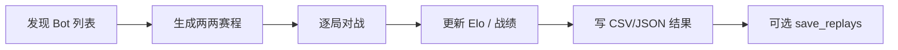

### 3.5 GUI 回放 vs 锦标赛回放（简记）

| 场景 | 是否自动存回放 | 入口 |
|------|----------------|------|
| GUI 人机 / 本地对局 | **否**（现逻辑）；用户点「保存回放」才写 | `game_loop` + 结算菜单 |
| 锦标赛 / Docker | 由配置 **`save_replays`** 控制（常默认开） | `tournament/runner.py` |

两条路径不要混为一谈。GUI 旧版曾「终局自动存 + 按钮再存」导致重复文件，已改为仅用户确认；锦标赛批量归档仍走自己的开关。详见 [`../troubleshooting/gui-replay-save-duplicates.md`](../troubleshooting/gui-replay-save-duplicates.md)。

---

## 4. 公式、符号表与数字例

### 4.1 胜率与标准误

\[
\hat{w} = \frac{W}{n},\qquad
\mathrm{SE} \approx \sqrt{\frac{\hat{w}(1-\hat{w})}{n}}
\]

| 符号 | 含义 |
|------|------|
| \(W\) | 胜场 |
| \(n\) | 总局数 |
| \(\mathrm{SE}\) | 标准误（二项近似） |

**玩具例**：\(W=18\)，\(n=30\) → \(\hat{w}=0.6\)，

\[
\mathrm{SE}\approx\sqrt{0.6\times 0.4/30}\approx 0.089
\]

粗略 95% 区间约 \(0.6\pm 1.96\times 0.089 \approx [0.43,\,0.77]\)。
**30 局仍然很宽**——别用一次 60% 宣布革命成功。

### 4.2 Elo 期望得分

\[
E_A = \frac{1}{1 + 10^{(R_B - R_A)/400}}
\]

| 符号 | 含义 |
|------|------|
| \(R_A,R_B\) | A、B 当前 Elo |
| \(E_A\) | A 的期望得分 ∈ (0,1) |
| 400 | 经典标度：约 400 分差 → 期望约 10:1 |

对称：\(E_B = 1 - E_A\)。

**玩具例**：\(R_A=1500\)，\(R_B=1700\)：

\[
E_A = \frac{1}{1+10^{200/400}} = \frac{1}{1+10^{0.5}} \approx \frac{1}{1+3.162} \approx 0.240
\]

\[
E_B \approx 0.760
\]

### 4.3 K 因子更新

\[
R_A' = R_A + K\,(S_A - E_A)
\]

| 符号 | 含义 | 本项目默认 |
|------|------|------------|
| \(K\) | K 因子（敏感度） | 常 32 |
| \(S_A\) | 实际得分：胜 1 / 负 0 / 和 0.5 | — |

**续上例**：A 爆冷击败 B，\(S_A=1\)，\(K=32\)：

\[
\Delta R_A = 32\times(1-0.240)\approx 24.3,\quad R_A'\approx 1524.3
\]

\[
\Delta R_B = 32\times(0-0.760)\approx -24.3,\quad R_B'\approx 1675.7
\]

若打平 \(S=0.5\)：

\[
\Delta R_A = 32\times(0.5-0.240)\approx +8.3
\]

（低分者平局「赚分」，高分者「丢分」——符合直觉。）

### 4.4 分差速查

| \(R_B-R_A\) | \(E_A\)（约） |
|-------------|---------------|
| 0 | 0.50 |
| 100 | 0.36 |
| 200 | 0.24 |
| 400 | 0.09 |

### 4.5 循环赛场次（概念）

\(N\) 名选手单循环、每对打 \(g\) 局（若再换边则每对 \(2g\)）：

\[
\text{对数} = \binom{N}{2} = \frac{N(N-1)}{2},\quad
\text{总局数} = \binom{N}{2}\times(\text{每对局数})
\]

例：5 个 Bot，每对 4 局 → \(10\times 4=40\) 局。

---

## 5. 为什么本项目选择它 + 优势

| 机制 | 作用 |
|------|------|
| `evaluate_model` | 训练中与训练后统一的胜率尺子 |
| Elo | 多 Bot 相对排序，便于历史对比 |
| 锦标赛 | 脚本 Bot + 模型 +（可选）LLM 同台 |
| 换边 / 多地图 | 降先手与地图偏差 |

**优势**：可复现、可自动化、与 GUI 对战解耦；结果可落盘 CSV/JSON。
**注意**：Elo 依赖对手池；换一批对手分数不可直接横向绝对比较。

速查：[`../algorithms/evaluation-and-elo.md`](../algorithms/evaluation-and-elo.md)。
源码：[`../source-analysis/tournament-system.md`](../source-analysis/tournament-system.md)。

---

## 6. 执行时可能遇到的问题

| 现象 | 可能原因 | 处理 |
|------|----------|------|
| 胜率乱跳 | \(n\) 太小 | 加 episodes；多次 seed |
| reward 升胜率不升 | 塑形投机 | 看 W/L/D 与 end_reason |
| Elo 和观感不符 | 样本少 / 对手池偏 | 加对局；看原始胜负表 |
| 模型未被发现 | 路径/扩展名 | `models/` 下 zip 或 feudal `.pt` |
| 回放列表混乱 | GUI 与锦标赛路径混淆 | 见 §3.5 与 troubleshooting |
| 全平局 | max_turns/steps 过紧 | 调上限；查是否从不决战 |

---

## 7. 作者 / 项目训练中的困难与解决（通俗改写）

### 7.1 阈值附近的噪声会骗晋级

课程用连续多次评估（patience）就是因为单次 \(\hat{w}\) 不可信。评估章把同一教训说成统计事实：\(n=20\) 时 std 可达 ~0.1。

### 7.2 `std_reward=0` 的假「稳定」

全胜且标准差为 0，可能是真无敌，也可能是**确定性死剧本**。要结合动作多样性、换种子、随机对手再测。

### 7.3 只报胜率会藏单兵种

作者后来强调：记录 `units_built` 等组成信息，否则「100% 胜率全靠最便宜兵」与「多样战术」在曲线上长得一样。

### 7.4 评估 env 必须与训练对齐

BC/课程踩过的坑：ad-hoc eval 漏传 `reward_config`、`max_actions_per_turn` 等 → 误判算法坏了。
**规则**：评估构造 env 时转发生产配置的全部关键 kwargs。

### 7.5 GUI 回放重复 vs 锦标赛归档

GUI 自动保存曾造成「一局两文件、按钮语义混乱」；修复后 GUI **仅用户确认保存**。锦标赛仍用 `save_replays` 批量落盘——这是**产品设计差异**，不是 bug。写工具脚本时不要假设「所有回放都在 `replays/` 且规则相同」。

---

## 8. 代码与配置落点

| 组件 | 路径 |
|------|------|
| RL 评估 | `reinforcetactics/rl/evaluation.py` → `evaluate_model` |
| 常量名 | `ACTION_TYPE_NAMES`、`REWARD_COMPONENTS`、`END_REASONS` 等 |
| CLI 评估 | `scripts/eval_agent.py`；`reinforcetactics/cli/commands.py` |
| Elo | `reinforcetactics/tournament/elo.py` → `EloRatingSystem` |
| 赛程 | `reinforcetactics/tournament/schedule.py` |
| 运行器 | `reinforcetactics/tournament/runner.py` |
| Bot 发现 | `reinforcetactics/tournament/bots.py` |
| 结果 | `reinforcetactics/tournament/results.py` |
| 配置 | `reinforcetactics/tournament/config.py` |
| 入口脚本 | `scripts/tournament.py` |
| Docker 锦标赛 | `docker/tournament/` |
| 可视化 | `reinforcetactics/rl/viz.py`（评估曲线等） |

算法卡：[`../algorithms/evaluation-and-elo.md`](../algorithms/evaluation-and-elo.md)。
源码：[`../source-analysis/tournament-system.md`](../source-analysis/tournament-system.md) · [`../source-analysis/rl-training-pipelines.md`](../source-analysis/rl-training-pipelines.md)。

---

## 9. 实操命令

### 9.1 短跑（优先）：小锦标赛 / 测试模式

```powershell
cd D:\Grok\project2\reinforce-tactics
conda activate reinforce-tactics

# 查看参数
python scripts/tournament.py --help

# 测试模式（脚本会加重复 SimpleBot 等，便于冒烟）
python scripts/tournament.py --test --games-per-side 1 --no-llm --no-models
```

钉一张小地图、少局数：

```powershell
python scripts/tournament.py `
  --map maps/1v1/starter.csv `
  --games-per-side 1 `
  --no-llm `
  --output-dir tournament_results/smoke
```

### 9.2 评估单模型（若已有 zip）

```powershell
python scripts/eval_agent.py --help
# 按帮助传入 model 路径、对手、局数；短跑 n_episodes=5 即可
```

### 9.3 单测

```powershell
python -m pytest tests/test_rl_evaluation.py tests/test_tournament.py tests/test_tournament_library.py -q
```

### 9.4 选做：更完整锦标赛

```powershell
# 选做：发现 models/ 下模型，多地图，更多局（耗时）
python scripts/tournament.py `
  --map-dir maps/1v1/ `
  --map-pool-mode cycle `
  --games-per-side 2 `
  --models-dir models `
  --output-dir tournament_results
```

---

## 10. 自测 3 题

1. **概念**
   为什么训练 mean reward 上升，不能直接宣称模型变强？评估时为何要看 `end_reason`？

2. **计算**
   \(R_A=1600\)，\(R_B=1600\)，\(K=32\)。A 获胜。求 \(E_A\) 与更新后的 \(R_A'\)。
   再算：\(R_A=1400\)，\(R_B=1800\)，双方战平，\(K=32\)，A 的分数变化 \(\Delta R_A\) 约多少？

3. **工程**
   GUI 保存回放与锦标赛 `save_replays` 有何不同？`n=10` 时胜率 70% 为什么不足以单独支持「稳压对手」的结论？

**简答提示**

1. 塑形可抬 reward；end_reason 区分真胜与超时/截断投机。
2. 同分 \(E_A=0.5\)，\(R_A'=1600+32\times0.5=1616\)。
   差 400 分：\(E_A\approx 1/(1+10)=1/11\approx0.091\)，平局 \(S=0.5\)，\(\Delta R_A\approx 32\times(0.5-0.091)\approx +13.1\)。
3. GUI 现为用户确认才存；锦标赛由配置批量存。\(n=10\) 标准误大，70% 置信区间很宽。

---

## 延伸阅读

- [`../algorithms/evaluation-and-elo.md`](../algorithms/evaluation-and-elo.md)
- [`../algorithms/curriculum-bootstrap.md`](../algorithms/curriculum-bootstrap.md)
- [`../source-analysis/tournament-system.md`](../source-analysis/tournament-system.md)
- [`../troubleshooting/gui-replay-save-duplicates.md`](../troubleshooting/gui-replay-save-duplicates.md)
- 下一章：[14 规则 Bot 与平衡](14-scripted-bots-and-balance.md)
- 术语表（若已写）：[glossary.md](glossary.md)

---


<div style="page-break-before: always;"></div>

# 第 14 章：规则 Bot 与平衡分析

本章把 **脚本启发式对手**（scripted bots）讲清楚：它们是课程学习的「梯子」、评估的「标尺」，也是平衡分析最容易踩坑的地方。读完后你应能：

1. 说出 Bot 难度阶梯上每一层大致在干什么；
2. 背出 `take_turn` 合同；
3. 解释为何「确定性 Bot + 多局重复」会骗你对样本量的直觉；
4. 跑一次可选的短锦标赛冒烟命令。

更细的源码说明见 [`../source-analysis/game-bots.md`](../source-analysis/game-bots.md)、[`../source-analysis/tournament-system.md`](../source-analysis/tournament-system.md)；作者原始笔记见 [`../../docs/zh/balance_analysis_lessons_learned.md`](../../docs/zh/balance_analysis_lessons_learned.md)。

---

## 1. 为什么脚本 Bot 对 RL 很重要

| 用途 | 说明 |
|------|------|
| **课程对手** | Bootstrap 阶段从 Noop / Random 一路升到 Simple → Medium → …，让策略「先学会赢弱对手再学打强的」 |
| **评估标尺** | 「对 Simple 胜率 70%」比「平均奖励 12.3」更好懂、更可比 |
| **可复现基线** | 规则固定、无网络权重，换机器重跑行为可对齐（配合 `rng` 时则是可复现的随机） |
| **奖励 sanity** | 若连 `NoopBot` 都打不赢，问题多半在策略/奖励/掩码，而不是「对手太强」 |
| **平衡与设计** | 单位成本、技能、地图改动后，用 Bot 锦标赛看强弱是否塌缩成单一文化 |

神经网络策略在训练早期很弱且不稳定；脚本 Bot 提供 **可控难度曲线** 和 **不依赖 checkpoint 的评测锚点**。

---

## 2. Bot 难度阶梯

实现主要在：

| 模块 | 路径 |
|------|------|
| 抽象合同与 mixin | `reinforcetactics/game/bot_base.py` |
| 规则 Bot 实现 | `reinforcetactics/game/bot.py` |
| 锦标赛发现与工厂 | `reinforcetactics/tournament/bots.py`、`runner.py` |
| CLI | `scripts/tournament.py` |

### 2.1 一览表

| 类 | 角色（白话） |
|----|----------------|
| **NoopBot** | 直接结束回合；零压力。课程 stage-0 / 奖励自检 |
| **RandomBot** | 在合法动作上均匀随机，最多 `max_actions` 次后 `end_turn` |
| **BalancedRandomBot** | 可选造 1 个兵 + 每单位最多 1 个随机动作；压力随兵力缩放，介于 Noop 与「狂乱 Random」之间 |
| **SimpleBot** | 固定购买优先级 + 贪心接近 / 攻击 / 占领 |
| **MediumBot** | 集火、低血撤退治疗、占领去重、简单克制购买 |
| **AdvancedBot** | 地图分析、阶段机、编制目标、技能特化（冲锋、侧袭等） |
| **MasterBot** | 威胁图、更聪明的撤退 / 集火 / 占领优先级 |
| **MixedBot** | 每局掷硬币选 easy / hard 内层 Bot；课程「桥接阶段」专用 |

继承关系（概念）：

```text
BaseBot + BotUnitMixin
  ├─ NoopBot
  ├─ RandomBot
  │    └─ BalancedRandomBot
  ├─ SimpleBot
  ├─ MediumBot
  │    └─ AdvancedBot
  │         └─ MasterBot
  └─ MixedBot  （内部再构造 simple/medium/…）
```

### 2.2 各层策略直觉

**NoopBot**
什么都不做就 `end_turn()`。若智能体胜率仍接近 0，先查奖励与动作掩码。

**RandomBot**
从「除 end_turn 外的合法动作」里 `choice`，执行最多约 20 次。噪声大，适合早期探索压力，不适合当「公平强敌」。

**BalancedRandomBot**
先有机会造一个单位，再按单位分桶各做一次随机动作。比 Noop 有威胁，又不会像 Random 那样在一回合内乱点几十下。

**SimpleBot**
`purchase_units → move_and_act_units → end_turn`。购买按优先级表（Warrior 最高）；行动贪心打残血、靠近、占领。需要 **Warrior 占比上限**，否则会「只造勇士」的单一文化（见第 5 节）。

**MediumBot**
在 Simple 之上加：集火可击杀目标、低血撤到治疗建筑、占领目标不重复抢、购买看克制关系。

**AdvancedBot**
分析地图（HQ、山地、森林），用阶段机（扩张 / 交战 / 征服等）+ 编制目标 + 单位技能（骑士冲锋、盗贼侧袭、术士加速等）。

**MasterBot**
每回合建威胁图（敌方下一步能打到的格），撤退与集火更「怕死」也更敢集火。

**MixedBot**
构造时指定 `easy` / `hard` / `p_hard`（例如 50% Simple + 50% Medium）。环境每次 `reset` 会重建对手，于是不同 episode 难度不同——适合 **课程桥接**（刚打过 easy，预习 hard）。

---

## 3. `take_turn` 合同

所有 Bot（规则、LLM、ModelBot、AlphaZeroBot）都实现同一接口，因此可塞进 GUI、Gym 对手位或锦标赛。

```text
take_turn() 必须：
  1. 在有限步骤内返回（禁止死循环）
  2. 代表 self.bot_player 执行 0..N 个领域动作
     （create_unit / move / attack / seize / 技能…）
  3. 调用 game_state.end_turn()
     （若已经 game_over 可直接返回）
```

`BaseBot` 只保证持有：

- `self.game_state` — 共享的 `GameState`
- `self.bot_player` — 自己的玩家编号

可选遥测：`_record("knight_charge")` 等，锦标赛 / 平衡分析可从回放 `game_info` 读能力触发次数。

**和 RL env 步的区别（复习）**：

| 概念 | 含义 |
|------|------|
| Env 的 `step` | 智能体一个 **微动作** |
| Bot 的 `take_turn` | 一整 **游戏回合**（内部可含很多领域动作，最后 `end_turn`） |

对手在 env 里走完一整回合时，智能体那边可能已经过去很多 `step`（见第 02 / 04 章）。

---

## 4. 在课程与评估中的用法

### 4.1 课程（Bootstrap）

`configs/ppo/bootstrap.yaml` 的 `curriculum.stages` 里，阶段字段类似：

```yaml
- name: starter_simple
  opponent: simple
  # map、胜率门槛、max_timesteps …
```

常见对手名：`noop`、`random`、`balanced_random`、`simple`、`medium`、`advanced`、`mixed`。

桥接示例（概念）：

```yaml
- name: beginner_mixed_simple_medium
  opponent: mixed
  opponent_kwargs:
    easy: simple
    hard: medium
    p_hard: 0.5
```

直觉：**一半局仍像刚打过的 Simple，一半局预习 Medium**，避免难度断崖导致 `CurriculumStalled`。

### 4.2 评估与锦标赛

- 短评估：CLI / `scripts/eval_agent.py` 对指定 Bot 打多局算胜率
- 全梯子：`scripts/tournament.py` 循环赛 + Elo
- 消费方还包括 `app/bot_factory`（GUI 选人机对手）

评估时建议固定地图、`max_turns`，并想清楚是否启用 **随机平局决胜**（下一节）。

---

## 5. 平衡分析教训（白话版）

以下主题来自 `docs/zh/balance_analysis_lessons_learned.md`，改写成入门语言。

### 5.1 确定性重复局：看起来有 N 个样本，其实只有 1 个

**现象**
`games_per_side=4`，Medium vs Simple 在同一张图上打 4 局，回放 **字节级相同**，胜负完全一样。你却把 N=4 当成 4 个独立样本去算置信区间——区间会 **虚窄**。

**原因**
脚本 Bot 在候选列表上做 `sort` / `max` / `min`。平分时 Python 总取「插入顺序的第一个」。引擎也是确定性的 → 同一开局永远同一轨迹。

**教训**
- 没有随机性时，`games_per_side > 1` **不会**增加信息量，只会复制同一局。
- 旧基线里「96 局」可能实际是「12 个唯一对局 × 8 份拷贝」。

### 5.2 随机平局决胜（stochastic tiebreak）

**做法**
每个 Bot 仍只在 **最高分候选** 里选，但在排序前用 `_maybe_shuffle` 打乱平局项。`rng_seed` 固定时可复现。

**效果**
同样 4 局会走出不同动作流、不同胜负——**有效样本量恢复**。锦标赛 runner 用稳定哈希从全局 seed 派生每局每侧的 `rng`，避免 Python 内置 `hash()` 跨进程不稳定。

**注意**
只有 **每一个** 排名点都 shuffle 才有用；漏掉 `find_best_move_position` 一类热点，会让部分决策仍确定性、能力统计偏斜。

### 5.3 自杀防护（suicide guards）

**现象**
攻击评分 `value = 伤害 - 反击 + 成本项` 在「自己必死、也杀不死对方」时仍可能 **为正**。调用方 `if value > 0: 攻击` → 白送单位。

**修复直觉**
评分函数之外加硬规则：

```text
若 反击伤害 ≥ 自己当前 HP 且 自己造成的伤害 < 目标当前 HP：
    记 suicide_eval_rejected，返回极负分
```

**指标命名**
计数发生在「评估候选」时，不是「最终选定攻击」时，所以叫 `suicide_eval_rejected` 比 `suicide_blocked` 更诚实。

### 5.4 其它相关教训（简记）

| 主题 | 一句话 |
|------|--------|
| 购买单一文化 | 严格优先级 + Warrior 最便宜 → 100% 造 W；需要组成上限 |
| 能力遥测 | 终局统计只说「发生了什么」；`knight_charge` 等才说「启发式为何触发」 |
| 回放文件名 | 仅时间戳秒级会在并发/随机模式下互相覆盖；应带 `game_id` |

---

## 6. 代码地图

| 你想找… | 去哪 |
|---------|------|
| `BaseBot` / `take_turn` 合同 | `reinforcetactics/game/bot_base.py` |
| Noop…Master、MixedBot | `reinforcetactics/game/bot.py` |
| `_maybe_shuffle` / 距离 / 技能辅助 | `BotUnitMixin`（同 `bot_base.py`） |
| 锦标赛调度、Elo、导出 | `reinforcetactics/tournament/` |
| CLI 入口 | `scripts/tournament.py` |
| GUI 如何 new Bot | `reinforcetactics/app/bot_factory.py` |
| 平衡 notebook | `notebooks/balance_analysis.ipynb`、`bot_tournament.ipynb` |

---

## 7. 实操：可选短锦标赛

目标：**验证锦标赛管线能跑**，不是认真排行榜。

```powershell
cd D:\Grok\project2\reinforce-tactics   # 换成你的仓库根
conda activate reinforce-tactics

# --test：额外塞一个 SimpleBot2，保证至少 2 个参赛者（无模型/无 LLM 时也够）
# --no-llm --no-models：跳过 API 与 models/ 扫描，启动更快
# 单图 + 每侧 1 局 + 回合上限收紧：几分钟内结束（视 CPU 而定）
python scripts/tournament.py `
  --test `
  --no-llm `
  --no-models `
  --map maps/1v1/starter.csv `
  --games-per-side 1 `
  --max-turns 80 `
  --output-dir tournament_results/learning_guide_smoke
```

预期：

- 日志里出现参赛 Bot 与对局进度；
- `tournament_results/learning_guide_smoke/` 下有结果 JSON/CSV（具体文件名以 `ResultsExporter` 为准）。

若报「Need at least 2 bots」，确认加了 `--test`。默认地图路径若与你分支不一致，换成 `maps/1v1/` 下任意存在的 `.csv`。

想对比 **两条规则 Bot** 的定性强弱，可在课题章（第 17 章）做更小范围的配对实验，或读 `notebooks/bot_tournament.ipynb`。

---

## 8. 自检

- [ ] 能按强度大致排序：Noop < Random/BalancedRandom < Simple < Medium < Advanced < Master
- [ ] 能默写 `take_turn` 三条合同
- [ ] 知道为何确定性 Bot 下 `N` 局可能不是 `N` 个独立样本
- [ ] 知道 `rng` 平局决胜与自杀硬防护各解决什么问题
- [ ] 知道 MixedBot 在课程里扮演「桥」

---

## 9. 延伸阅读

| 文档 | 内容 |
|------|------|
| [`../source-analysis/game-bots.md`](../source-analysis/game-bots.md) | 规则 Bot 源码深潜 |
| [`../source-analysis/tournament-system.md`](../source-analysis/tournament-system.md) | 赛程 / Elo / CLI |
| [`../algorithms/evaluation-and-elo.md`](../algorithms/evaluation-and-elo.md) | 胜率噪声与 Elo 公式 |
| [`../../docs/zh/balance_analysis_lessons_learned.md`](../../docs/zh/balance_analysis_lessons_learned.md) | 完整平衡教训 |
| 第 13 章 | 评估、ELO、锦标赛总览 |
| 第 15 章 | LLM Bot（同一 `take_turn` 合同） |

---


<div style="page-break-before: always;"></div>

# 第 15 章：LLM 驱动的 Bot

本章说明 **大语言模型（LLM）如何当游戏 Bot**，以及它与 RL 策略的本质差别。读完后你应能：

1. 画出「局面 → 提示 → API → 解析 → 执行」流水线；
2. 知道 OpenAI / Claude / Gemini 依赖与 API Key 从哪来；
3. 安装 `[llm]` extra 并理解 demo 在做什么；
4. 说清成本、延迟、合法性、**不更新权重** 等限制。

源码深潜：[`../source-analysis/game-llm-and-model-bots.md`](../source-analysis/game-llm-and-model-bots.md)。

**重要边界：本指南不涉及云上训练（Vertex 等）。** LLM Bot 只是 **推理时调用外部 API**，与 `docs/vertex_training.md` 的训练任务无关。

---

## 1. LLM Bot 与 RL 策略有何不同

| 维度 | RL 策略（如 MaskablePPO / ModelBot） | LLM Bot |
|------|--------------------------------------|---------|
| 决策依据 | 本地神经网络权重 + 观察张量 | 文本 prompt + 云端/本地大模型 |
| 学习 | 用回报梯度更新参数 | **默认不学习**；每局独立「读规则答题」 |
| 动作形式 | 离散索引 / 六维向量，常带掩码 | JSON 动作列表（语义字段） |
| 合法性 | 掩码强制合法（训练时） | 解析后校验；非法项常 **跳过** |
| 成本 | 训练贵、推理相对便宜 | **几乎每回合都要付 API 钱** |
| 延迟 | 毫秒～数十毫秒级（CPU/GPU） | 常 **秒级**（网络 + 生成） |
| 可复现 | seed + 权重可复现 | 温度 > 0 时难复现；供应商还可能变模型 |

两者都实现 `BaseBot.take_turn()`，因此 GUI、锦标赛、脚本 demo **接口兼容**。但评估时不要拿「一次 LLM 对局」和「训练 200 万步的 PPO」直接比聪明程度而不谈预算。

---

## 2. 流水线：从局面到执行

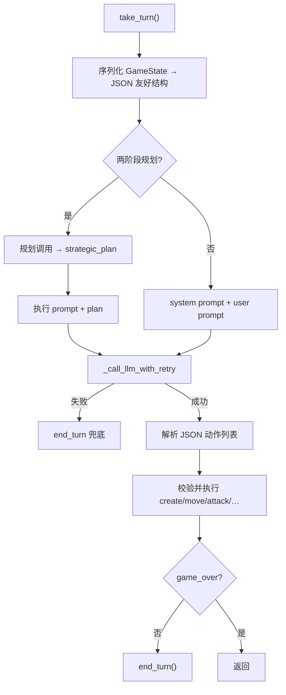

### 2.1 序列化里通常有什么

- 当前玩家、回合、金币
- 单位列表（稳定 **unit_id**、类型、HP、坐标、状态）
- 建筑 / 地图摘要
- **合法动作**（格式化后的列表，避免直接 dump Python 对象）

模型应优先在合法动作里选；实现仍会做执行期校验。

### 2.2 期望的响应形状（概念）

```json
{
  "actions": [
    {"type": "CREATE_UNIT", "unit_type": "W", "x": 3, "y": 5},
    {"type": "MOVE", "unit_id": 2, "to_x": 4, "to_y": 5},
    {"type": "ATTACK", "unit_id": 2, "target_unit_id": 7},
    {"type": "SEIZE", "unit_id": 2},
    {"type": "END_TURN"}
  ]
}
```

字段名以 `llm_bot.py` 内 `_execute_*` 为准；无法解析或非法的项会被跳过。可选 `reasoning`（开启思考时）。也支持认输类动作（若启用）。

### 2.3 提示词策略

`reinforcetactics/game/llm_prompts.py`：

| 名称 | 用途 |
|------|------|
| `PROMPT_BASIC` | 规则摘要 + 动作 schema + 短策略 |
| `PROMPT_STRATEGIC` | 更强调多步战术 |
| `PROMPT_TWO_PHASE_PLAN` / `EXECUTE` | 先计划后执行（约 2 倍 API 调用） |

```python
from reinforcetactics.game.llm_prompts import get_prompt
# bot = ClaudeBot(game_state, system_prompt=get_prompt("strategic"))
```

---

## 3. 供应商与 API Key

### 3.1 类与依赖

| 类 | 供应商 | 典型环境变量 | pip 包（`[llm]` extra） |
|----|--------|--------------|-------------------------|
| `OpenAIBot` | OpenAI | `OPENAI_API_KEY` | `openai` |
| `ClaudeBot` | Anthropic | `ANTHROPIC_API_KEY` | `anthropic` |
| `GeminiBot` | Google | `GOOGLE_API_KEY` | `google-genai` |

`pyproject.toml` 中：

```toml
llm = [
    "openai",
    "anthropic",
    "google-genai",
]
```

### 3.2 安装

```powershell
cd D:\Grok\project2\reinforce-tactics
conda activate reinforce-tactics
pip install -e ".[llm]"
```

若已装过 editable 包，只需补 extra 亦可。

### 3.3 设置 Key 的两种方式

**A. 环境变量（脚本 / demo 友好）**

```powershell
$env:OPENAI_API_KEY = 'sk-...'      # 按你选的供应商改
# 或 ANTHROPIC_API_KEY / GOOGLE_API_KEY
```

**B. GUI 设置菜单**

主菜单 → **设置** → **API Keys**（`reinforcetactics/ui/menus/settings/api_keys_menu.py`）。
`bot_factory` 创建 LLM 对手时会从 `settings.get_api_key(...)` 注入，不必每次 export。

**切勿**把真实 Key 写进仓库、commit 到 git 或贴进 Issue。

### 3.4 重试与状态

- 默认 `max_retries` 约 3，指数退避
- 可选跨回合 history（更「记得」上文，但 **token 更贵**）
- 两阶段规划：每回合约两次调用

---

## 4. Demo：`examples/llm_bot_demo.py`

```powershell
conda activate reinforce-tactics
# 先设好对应 API Key
python examples/llm_bot_demo.py
```

脚本会：

1. 让你选 OpenAI / Claude / Gemini；
2. 加载地图（或随机图）；
3. 创建 LLM Bot（默认作为玩家 2）；
4. 跑约 **3 个 demo 回合**，打印金币与是否完成 `take_turn`。

失败常见原因：

| 报错感觉 | 处理 |
|----------|------|
| API key 未提供 | 设环境变量或 GUI Key |
| Missing dependency | `pip install -e ".[llm]"` |
| 限流 / 超时 | 降频率、换模型档位；Bot 已有重试 |

更完整对局：GUI 里把某位玩家设为 LLM Bot，或锦标赛开启 LLM 发现（需 Key 且 **很贵**）。

---

## 5. 限制与正确预期

1. **成本**
   全量循环赛若包含多个 LLM，可能一夜烧掉大量额度。评估时优先脚本 Bot / 本地 ModelBot。

2. **延迟**
   不适合高 `n_envs` 训练循环当对手；训练对手请用规则 Bot 或加载好的 `ModelBot`。

3. **合法性**
   LLM 可能输出不在合法列表的坐标或错误 unit_id。实现会跳过坏动作并最终 `end_turn`，表现可能像「发呆半回合」。

4. **默认不更新权重**
   这是 **提示工程 + API 推理**，不是 RL 微调。本仓库没有「把对局回报反传进 GPT」的默认路径。

5. **无云训练绑定**
   本指南 **不** 覆盖 Google Cloud / Vertex 上的训练作业。云训练文档见 `docs/vertex_training.md`（可选进阶，**非本指南范围**）。
   LLM Bot 即使 Key 指向云 API，也只是 **对战推理**，不是「在云上 train PPO」。

6. **与 ModelBot / AlphaZeroBot 区分**
   - **ModelBot**：加载本地 `.zip`（SB3）或 `.pt`（Feudal）权重
   - **AlphaZeroBot**：本地网络 + MCTS
   - **LLMBot**：远程文本模型

   三者都叫「Bot」，学习形态完全不同。

---

## 6. 代码地图

| 模块 | 路径 |
|------|------|
| LLM 基类与三家子类 | `reinforcetactics/game/llm_bot.py` |
| System prompt 库 | `reinforcetactics/game/llm_prompts.py` |
| 交互 demo | `examples/llm_bot_demo.py` |
| GUI 工厂注入 Key | `reinforcetactics/app/bot_factory.py` |
| API Keys 菜单 | `reinforcetactics/ui/menus/settings/api_keys_menu.py` |
| 锦标赛 LLM 发现 | `reinforcetactics/tournament/bots.py` |
| notebook | `notebooks/llm_bot_tournament.ipynb` |

---

## 7. 自检

- [ ] 能用一张表对比 LLM vs RL 策略
- [ ] 能口述流水线五步：序列化 → prompt → API → 解析 → 执行 + end_turn
- [ ] 知道 `[llm]` extra 与三个环境变量名
- [ ] 知道 demo 入口与「不默认学习权重」
- [ ] 明确本指南 **不做云训练**

---

## 8. 延伸阅读

| 文档 | 内容 |
|------|------|
| [`../source-analysis/game-llm-and-model-bots.md`](../source-analysis/game-llm-and-model-bots.md) | LLM / Model / AlphaZero 源码 |
| [`../../examples/README.md`](../../examples/README.md) | demo 英文说明 |
| 第 14 章 | 同一 `take_turn` 合同下的规则 Bot |
| 第 17 章 | 可选课题：一回合 LLM demo 或精读 prompt |

---


<div style="page-break-before: always;"></div>

# 第 16 章：开发与测试工具链

本章面向「不仅跑训练、还要改代码」的读者：如何装 dev 依赖、跑测试、用 linter / 类型检查 / pre-commit，以及 **为什么 RL 代码特别需要测试**。读完后你应能在本机执行一轮「测一下再提交」的最短闭环。

提交作者环境（本机常无 global git user）见：
[`../usage/git-commit-push.md`](../usage/git-commit-push.md)。

---

## 1. 安装开发依赖

仓库根目录：

```powershell
cd D:\Grok\project2\reinforce-tactics
conda activate reinforce-tactics
pip install -e ".[dev]"
```

`pyproject.toml` 中 `dev` extra 包含：

| 包 | 用途 |
|----|------|
| `pytest` / `pytest-cov` | 单元测试与覆盖率 |
| `ruff` |  lint + 格式化 |
| `mypy` | 静态类型检查 |
| `pre-commit` | Git 提交前钩子 |

可选组合：

```powershell
# 只要 GUI
pip install -e ".[gui]"
# LLM Bot
pip install -e ".[llm]"
# 本地常见：gui + llm + dev（本机快照常如此；cloud 一般不装）
pip install -e ".[gui,llm,dev]"
```

覆盖率门槛（`pyproject.toml`）：`pytest` 默认 `--cov=reinforcetactics --cov-fail-under=65`。只跑少量文件时若触发全局 cov 失败，可临时：

```powershell
python -m pytest tests/test_fonts.py -q --no-cov
```

---

## 2. pytest 示例

### 2.1 与 Gym / 环境相关

```powershell
# 环境 step / reset / 动作空间等
python -m pytest tests/test_gym_env.py -q --no-cov

# 动作掩码
python -m pytest tests/test_rl_masking.py -q --no-cov

# 观察构造
python -m pytest tests/test_observation.py -q --no-cov
```

### 2.2 与字体 / i18n 相关

中文 UI 曾踩过 Windows SysFont 崩溃问题（见排查文档）。相关测试：

```powershell
python -m pytest tests/test_fonts.py -q --no-cov
python -m pytest tests/test_language_menu.py -q --no-cov
```

### 2.3 Bot / 锦标赛 / 回放确定性

```powershell
python -m pytest tests/test_bot_base.py tests/test_random_bot.py tests/test_noop_bot.py -q --no-cov
python -m pytest tests/test_tournament.py -q --no-cov
python -m pytest tests/test_replay_determinism.py -q --no-cov
```

### 2.4 全量（提交前推荐）

```powershell
python -m pytest -q
```

首次全量会较慢；失败时读断言与失败用例名，优先修 **确定性 / 掩码 / 奖励符号** 类问题。

---

## 3. ruff、mypy、pre-commit

### 3.1 ruff

配置在 `pyproject.toml` 的 `[tool.ruff]`：Python 3.11+、行宽 127 等。

```powershell
# 检查
ruff check .
# 自动修复可修项
ruff check --fix .
# 格式化
ruff format .
```

### 3.2 mypy

```powershell
mypy .
```

项目对部分模块开启了 `ignore_errors`（历史债），全树仍可能有噪声；**以 CI 与 pre-commit 配置为准**。本地解释器需已安装项目依赖（mypy 用 system 环境解析 numpy/torch 等）。

### 3.3 pre-commit

配置文件：`.pre-commit-config.yaml`。

钩子包括：

- 通用：尾随空白、EOF、YAML/JSON、大文件、合并冲突标记
- **ruff** + **ruff-format**
- **mypy**（对整棵树，`pass_filenames: false`）

一次性安装钩子：

```powershell
pre-commit install
```

对全部文件试跑（首次会下 hook 环境，较慢）：

```powershell
pre-commit run --all-files
```

提交时钩子失败 → **先修再 commit**，不要 `--no-verify` 除非你明确知道在做什么。

### 3.4 与本机 Git 作者的关系

pre-commit 通过后，`git commit` 仍可能因 **Author identity unknown** 失败。本机约定：

- **不要**改 global `user.name` / `user.email`
- 用环境变量 `GIT_AUTHOR_*` / `GIT_COMMITTER_*`

完整命令与踩坑：[`../usage/git-commit-push.md`](../usage/git-commit-push.md)。

---

## 4. 为什么 RL 代码特别需要测试

| 风险 | 没有测试时会发生什么 | 测试能钉住什么 |
|------|----------------------|----------------|
| **非确定性** | 同 seed 训练结果对不上；「修了 bug」其实是运气 | `seed`、回放轨迹、rng 平局决胜 |
| **动作掩码错误** | 采样非法动作 → 环境惩罚或静默失败 → 策略学歪 | `test_rl_masking`、合法动作集合一致性 |
| **观察与空间形状** | checkpoint 与地图尺寸 / FOW 通道不一致，加载才炸 | obs 通道数、pad、visibility 键 |
| **奖励符号/量级** | 赢棋给负分、塑形爆炸、value 网络学崩 | 终局奖励符号、简单 episode 回报范围 |
| **合同破坏** | Bot 不 `end_turn` 卡死循环；env 不换边 | `take_turn` 后 `current_player`、`game_over` |
| **回归** | 改 SimpleBot 购买逻辑拖垮课程阶段 | Bot 单元测试 + 小型锦标赛 smoke |

RL 的失败常常是 **静默变差**（胜率从 60% 掉到 40%），而不是立刻异常。自动化测试至少守住 **接口与不变量**；胜率回归还要靠固定评估协议（第 13 章）。

---

## 5. 建议的日常节奏

```text
改代码
  → ruff check --fix . && ruff format .
  → 相关 pytest（gym / bot / 你改的模块）
  → 需要提交时：pre-commit + 作者环境变量 commit
  → 确认 commit 成功后再 push
```

训练实验本身的产物（`models/`、长日志、大回放）不要误提交；以 `.gitignore` 为准。

---

## 6. 自检

- [ ] 已 `pip install -e ".[dev]"` 且 `pytest` / `ruff` 可运行
- [ ] 能单独跑 `test_gym_env` 与 `test_fonts` 一类冒烟
- [ ] 知道 pre-commit 会跑 ruff 与 mypy
- [ ] 知道提交作者 env 文档路径
- [ ] 能解释「掩码 + 确定性」为何对 RL 测试关键

---

## 7. 延伸阅读

| 文档 | 内容 |
|------|------|
| [`../usage/git-commit-push.md`](../usage/git-commit-push.md) | commit 作者、钩子失败重试、push 顺序 |
| [`../usage/local-run-guide.md`](../usage/local-run-guide.md) | 环境激活与 GUI / 训练 |
| [`../troubleshooting/chinese-font-display.md`](../troubleshooting/chinese-font-display.md) | 中文字体问题 |
| [`../../docs/zh/LOCAL_DEPLOY.md`](../../docs/zh/LOCAL_DEPLOY.md) | 完整本地部署 |
| `pyproject.toml` | ruff / mypy / pytest / extras 权威配置 |

---


<div style="page-break-before: always;"></div>

# 第 17 章：综合练习课题

本章是指南的 **收束实战**：五个课题由浅到深，验收标准写清楚，方便自学或作为课程作业。不必全做；按时间选 1–2 个做完并留下简短报告即可。

**默认环境**

```powershell
cd D:\Grok\project2\reinforce-tactics
conda activate reinforce-tactics
python -c "import reinforcetactics, gymnasium, torch; print('ok')"
```

命令以当前仓库 CLI / 脚本为准；若参数名有微调，以 `--help` 与 [`../usage/local-run-guide.md`](../usage/local-run-guide.md) 为准。

---

## 课题 1：短 PPO 训练 + 评估报告

### 目标

跑通「训练 → 保存 → 评估」主线，写一页纸结论（中文即可）。

### 建议步骤

1. 用 **短步数** 配置或 CLI 覆盖（CPU 友好），例如总步数 \(10^4\sim5\times10^4\) 量级（能出 checkpoint 即可，不求强）。
2. 训练：

   ```powershell
   python main.py --mode train --algorithm ppo --help
   # 按 help 与 local-run-guide 选择短配置 / 覆盖 total_timesteps
   ```

3. 评估：对 `noop` / `random` / `simple` 中至少 **一种** 对手多局评估。
4. 记录：地图、步数、种子、对手、胜率或平均回报、训练墙钟时间。

### 验收标准

- [ ] 训练过程无崩溃，磁盘上有可加载的模型产物（如 `.zip`）
- [ ] 至少完成一次自动化评估并记下数字
- [ ] 书面说明：你认为结果「有没有学到东西」——例如是否优于随机瞎点（允许结论为「步数太短没学到」）
- [ ] 点出 **一个** 你对照过的代码位置（如 `rl/gym_env.py` 的 `step` 或 CLI train 入口）

### 对应章节

04、05、13；算法卡 [`../algorithms/ppo.md`](../algorithms/ppo.md)

---

## 课题 2：改一项 `reward_config` 并定性对比

### 目标

理解奖励塑形对行为的影响，而不是只调学习率。

### 建议步骤

1. 找到 `reward_config`（训练 YAML 如 `configs/ppo/ppo_baseline.yaml` / `bootstrap.yaml` 的 `env.reward_config`，或 env 默认值）。
2. **只改一个标量**，例如：
   - 提高 / 降低 `win_by_hq_capture` 或 `win_by_elimination`；或
   - 调整某项塑形（占领进度、回合惩罚等——以配置里真实键名为准）。
3. 用 **相同种子、相同短步数、相同对手** 各训一小段（或用固定脚本策略 + 打印 episode 回报做更轻的对比）。
4. 定性观察：是否更爱冲 HQ、是否拖回合、是否只杀单位不占建筑等。

### 验收标准

- [ ] 写明改动前后的 **键名与数值**
- [ ] 控制变量：至少种子与对手协议一致
- [ ] 用 3–5 句描述行为差异（允许「看不出差异，因为步数太短」）
- [ ] 联系第 07 章：稀疏终局 vs 稠密塑形、潜在风险（杀敌刷分、量级压垮 value）

### 对应章节

07；[`../algorithms/reward-shaping.md`](../algorithms/reward-shaping.md)；源码 [`../source-analysis/rl-gym-env.md`](../source-analysis/rl-gym-env.md)

---

## 课题 3：微型 Bootstrap 或精读阶段 YAML

### 目标

搞清课程学习「阶段」长什么样，以及晋级在说什么。

### 路径 A — 真跑一个极短课程（可选，耗时）

1. 复制 `configs/ppo/bootstrap.yaml` 为本地临时配置。
2. 删到只剩 **1–2 个最简单阶段**（如 starter + random/simple），把 `max_timesteps`、评估频率降到可接受。
3. 跑 `scripts/train/train_bootstrap.py` 或文档推荐入口，观察是否晋级 / 是否 `CurriculumStalled`。

### 路径 B — 只读不训（推荐 CPU 紧张时）

1. 打开 `configs/ppo/bootstrap.yaml`。
2. 列出至少 **4 个** `curriculum.stages` 条目：`name`、`opponent`（及 `opponent_kwargs` 若有）、地图相关字段、晋升门槛（若有）。
3. 用自己的话解释：为什么 Simple 之后要接 MixedBot，而不是直接 Advanced。

### 验收标准

- [ ] 能画出「弱 → 强」的阶段箭头（文字版即可）
- [ ] 正确解释 `MixedBot` 的 `easy` / `hard` / `p_hard` 至少一处实例
- [ ] 说明 `CurriculumStalled` 大致在什么情况下出现（阶段预算用尽仍未达胜率）
- [ ] 若跑了训练：贴阶段目录或日志中晋级相关一行证据

### 对应章节

08、14；[`../algorithms/curriculum-bootstrap.md`](../algorithms/curriculum-bootstrap.md)；[`../../docs/zh/bootstrap_lessons_learned.md`](../../docs/zh/bootstrap_lessons_learned.md)

---

## 课题 4：两个脚本 Bot 的锦标赛

### 目标

用锦标赛管线比较规则 Bot，巩固第 14 章。

### 建议步骤

```powershell
python scripts/tournament.py `
  --test `
  --no-llm `
  --no-models `
  --map maps/1v1/starter.csv `
  --games-per-side 1 `
  --max-turns 100 `
  --output-dir tournament_results/capstone_bots
```

1. 确认输出目录中有结果文件。
2. 阅读胜负表：内置 Simple / Medium / … 与 `--test` 的 SimpleBot2 谁赢。
3. **思考题**：若 `games_per-side` 提到 4 且 **不** 开随机平局决胜，统计上可能有什么问题？（第 14 章 5.1）

进阶（可选）：在 notebook 或小脚本里只实例化 `SimpleBot` vs `MediumBot` 多局，手动统计胜率。

### 验收标准

- [ ] 命令成功跑完，结果目录非空
- [ ] 用表格或列表写出至少一对 matchup 的胜负
- [ ] 书面回答：确定性重复局为何会让「N 局」的置信区间骗人
- [ ] 指出 `take_turn` 合同中「必须 end_turn」一条

### 对应章节

13、14；[`../source-analysis/tournament-system.md`](../source-analysis/tournament-system.md)

---

## 课题 5：LLM 一回合 Demo **或** 精读 Prompt 结构

任选一条路径。

### 路径 A — 真调用 API（需 Key 与 `[llm]`）

```powershell
pip install -e ".[llm]"
$env:OPENAI_API_KEY = '...'   # 或 Claude / Gemini 对应变量
python examples/llm_bot_demo.py
```

验收：

- [ ] Demo 至少成功完成 **1 次** `take_turn`（日志中有成功标记）
- [ ] 记录供应商、是否报错重试、体感延迟
- [ ] 用三句话对比 LLM Bot 与 PPO ModelBot（第 15 章表）

### 路径 B — 不调用 API，只读代码

1. 阅读 `reinforcetactics/game/llm_prompts.py` 中 `PROMPT_BASIC` 或 `PROMPT_STRATEGIC`。
2. 阅读 `llm_bot.py` 中 `take_turn`：序列化 → 调用 → 解析 → 执行。
3. 写出：
   - system prompt 里规定了哪些动作类型；
   - 非法 JSON / 非法动作时 Bot 如何兜底；
   - 为何默认 **不会** 用回报更新 LLM 权重。

### 验收标准（路径 B）

- [ ] 列出至少 4 种动作类型字段（如 CREATE_UNIT、MOVE、ATTACK、END_TURN）
- [ ] 说明失败时为何仍应 `end_turn`（合同）
- [ ] 明确：本课题 **不是** 云训练

### 对应章节

15；[`../source-analysis/game-llm-and-model-bots.md`](../source-analysis/game-llm-and-model-bots.md)

---

## 学习清单：章节回映

用此表自检是否达到指南目标。全部勾完 ≈ 走完主线。

### Part A — 地基

| 能力 | 章 | 自检 |
|------|----|------|
| 能激活环境并指向仓库地图 | 00 | [ ] |
| 能解释为何用 RL 做这款策略游戏 | 01 | [ ] |
| 能把规则对应到 MDP 要素 \(S,A,R,P,\gamma\) | 02 | [ ] |
| 能读懂折扣回报与简单期望式 | 03 | [ ] |

### Part B — 框架与首训

| 能力 | 章 | 自检 |
|------|----|------|
| 能说明 Gymnasium `reset/step` 与 SB3 角色 | 04 | [ ] |
| 能完成一次短训并找到产物 | 05 | [ ] |
| 能区分观察、动作空间、掩码 | 06 | [ ] |
| 能举一例稀疏奖励 vs 塑形 | 07 | [ ] |

### Part C — 算法专章

| 能力 | 章 | 自检 |
|------|----|------|
| 能解释课程阶段与晋级 / stalled | 08 | [ ] |
| 知道 BC 是模仿演示而非回报最大化 | 09 | [ ] |
| 知道自对弈为何需要对手池 / 快照 | 10 | [ ] |
| 知道 Feudal 的 Manager/Worker 分工 | 11 | [ ] |
| 知道 AlphaZero = 网络 + MCTS 自对弈数据 | 12 | [ ] |
| 能解释胜率噪声与 Elo 直觉 | 13 | [ ] |

### Part D — 扩展与工程

| 能力 | 章 | 自检 |
|------|----|------|
| 能排序 Bot 梯子并复述 `take_turn` 合同 | 14 | [ ] |
| 能描述 LLM 流水线与主要限制 | 15 | [ ] |
| 能跑 pytest / ruff，并知道 commit 作者 env | 16 | [ ] |
| 至少完成 **一个** 本章课题并留下笔记 | 17 | [ ] |
| 能用术语表查中英对照 | [glossary.md](glossary.md) | [ ] |

### 综合目标（指南开头承诺）

| 目标 | 自检 |
|------|------|
| 能向他人用游戏语言讲清 agent / env / reward / policy | [ ] |
| 知道本项目主线：玩 → 短训 PPO → 评估 → Bot / 锦标赛 | [ ] |
| 知道算法速查在 `agents/algorithms/`，源码深潜在 `agents/source-analysis/` | [ ] |
| **不做** 默认路径上的云训练（Vertex） | [ ] |

---

## 报告模板（可选）

```text
课题编号与标题：
日期与环境（CPU/GPU、commit 哈希可选）：
做了什么（命令 / 改动文件）：
关键数字或观察：
结论（3–8 句）：
卡点与下一步：
对应章节：
```

---

## 下一步去哪

| 你想… | 去向 |
|--------|------|
| 查术语 | [glossary.md](glossary.md) |
| 继续抠算法 | [`../algorithms/overview.md`](../algorithms/overview.md) |
| 继续抠源码 | [`../source-analysis/overview.md`](../source-analysis/overview.md) |
| 读作者训练日记 | [`../../docs/zh/`](../../docs/zh/) |
| 玩家向安装与规则 | [reinforcetactics.com](https://reinforcetactics.com) |

恭喜读到这里。把课题笔记留下，比「只收藏文档」有效得多。

---


<div style="page-break-before: always;"></div>

# 术语表与延伸阅读

本表汇总学习指南中出现的 **中英对照** 术语，按主题分组。符号以正文常见写法为准；细节以对应章节为准。

---

## 1. 强化学习基础

| 中文 | 英文 / 符号 | 白话 |
|------|-------------|------|
| 强化学习 | Reinforcement Learning (RL) | 通过与环境交互、最大化累计奖励来学习 |
| 智能体 | agent | 做决策的程序或策略 |
| 环境 | environment | 游戏规则 + 状态转移 +（常含）对手 |
| 状态 | state \(s\) | 环境完整描述 |
| 观察 | observation \(o\) | 智能体看到的信息（可含战争迷雾） |
| 动作 | action \(a\) | 一次决策输出 |
| 奖励 | reward \(r\) | 即时标量反馈 |
| 回报 | return \(G_t\) | 从 \(t\) 起折扣累计奖励 |
| 折扣因子 | discount \(\gamma\) | 未来奖励的衰减（常 0.99） |
| 轨迹 | trajectory / episode rollout | \(o_0,a_0,r_1,\ldots\) 序列 |
| 策略 | policy \(\pi(a\|o)\) | 观察下如何选动作（可随机） |
| 价值函数 | value function \(V(o)\) | 从观察出发的期望回报 |
| 动作价值 | action-value \(Q(o,a)\) | 在观察下采取动作 \(a\) 的期望回报 |
| 优势 | advantage \(A_t\) | 某动作比「平均水平」好多少 |
| 马尔可夫决策过程 | Markov Decision Process (MDP) | \((S,A,P,R,\gamma)\) 形式化 |
| 转移 | transition \(P\) | \(s,a \mapsto s'\) 的规律 |
| 回合结束 | terminated | 按规则结束（胜/负/和） |
| 截断 | truncated | 外部原因停止（步数上限等） |
| 探索 | exploration | 尝试非常规动作以发现更好策略 |
| 利用 | exploitation | 选当前认为最优的动作 |
| 信用分配 | credit assignment | 哪个动作该对延迟奖励负责 |
| 在策略 | on-policy | 用当前策略采的数据更新（如 PPO） |
| 离策略 | off-policy | 可用行为策略与目标策略不同的数据（如 DQN） |
| 监督学习 | supervised learning | 有标签拟合；对比 RL 常无逐步标签 |
| 行为克隆 | Behavior Cloning (BC) | 模仿专家动作分布的监督式初始化 |

---

## 2. 本项目中的「步」与「回合」

| 中文 | 英文 | 白话 |
|------|------|------|
| 环境步 / 微动作 | env step / micro-action | `StrategyGameEnv.step` 一次调用 |
| 游戏回合 | game turn | 当前玩家操作阶段，以 `end_turn` 结束 |
| 对手回合 | opponent turn | 环境内调用对手 `take_turn()` |
| 合法动作 | legal actions | 规则允许的操作集合 |
| 动作掩码 | action mask | 把非法动作概率压掉的布尔/向量掩码 |
| 平坦离散动作 | flat discrete | 一个整数索引进动作表 |
| 多离散动作 | MultiDiscrete | 多维整数向量（本项目常见六元组） |
| 战争迷雾 | fog of war (FOW) | 只能看见部分地图/单位 |
| 引擎覆盖 | engine_overrides | YAML 覆盖单位数值等经济/规则常量 |

---

## 3. PPO 与训练框架

| 中文 | 英文 / 符号 | 白话 |
|------|-------------|------|
| 近端策略优化 | Proximal Policy Optimization (PPO) | 用 clip 限制策略更新幅度的 Actor-Critic 算法 |
| 可掩码 PPO | MaskablePPO | sb3-contrib 中支持动作掩码的 PPO |
| 演员 | Actor | 策略网络 \(\pi\) |
| 评论家 | Critic | 价值网络 \(V\) |
| 演员—评论家 | Actor-Critic | 二者配合更新 |
| 裁剪 | clip \(\epsilon\) | 限制重要性比率偏离 1 |
| 重要性比率 | probability ratio \(r_t(\theta)\) | 新/旧策略概率比 |
| 广义优势估计 | GAE \(\lambda\) | 多步 TD 折中估计优势 |
| 熵系数 | entropy coefficient | 鼓励探索的损失权重 |
| 学习率 | learning rate | 梯度更新步长 |
| 并行环境数 | `n_envs` | 同时采样的环境副本数 |
| 总时间步 | `total_timesteps` | 训练预算（环境步累计） |
| 检查点 | checkpoint | 保存的模型权重快照 |
| Stable-Baselines3 | SB3 | 常用 RL 算法库 |
| Gymnasium | Gymnasium | 环境 `reset/step` API 标准 |
| 向量化环境 | VecEnv | 并行封装多个 env |
| 回调 | callback | 训练循环中插入评估、保存等逻辑 |

---

## 4. 课程、自对弈与进阶算法

| 中文 | 英文 | 白话 |
|------|------|------|
| 课程学习 | curriculum learning | 由易到难安排任务 |
| Bootstrap 课程 | bootstrap curriculum | 本仓库分阶段升对手/地图的训练管线 |
| 晋级 | promotion | 达胜率等门槛进入下一阶段 |
| 课程停滞 | CurriculumStalled | 阶段预算耗尽仍未晋级时抛出的失败 |
| 混合对手 | MixedBot | 按概率在 easy/hard 规则 Bot 间切换 |
| 自对弈 | self-play | 与自身或历史快照对战以提升 |
| 对手池 | opponent pool | 自对弈中采样的历史策略集合 |
| 封建 / 分层 RL | Feudal RL | Manager 定目标、Worker 执行 |
| 内在奖励 | intrinsic reward | 对达成子目标的额外奖励 |
| AlphaZero | AlphaZero | 策略价值网 + MCTS + 自对弈数据 |
| 蒙特卡洛树搜索 | MCTS | 用模拟扩展的博弈树搜索 |
| PUCT | PUCT | MCTS 选节点时的探索公式族 |
| 热启动 | warm start | 用 BC 等先初始化再 PPO |

---

## 5. 奖励与评估

| 中文 | 英文 | 白话 |
|------|------|------|
| 稀疏奖励 | sparse reward | 只在终局等少数时刻给分 |
| 稠密奖励 | dense reward | 逐步给塑形信号 |
| 奖励塑形 | reward shaping | 手工加中间信号引导学习 |
| 基于势能的塑形 | potential-based shaping | 用势差形式、理论上不改变最优策略（折扣意义下） |
| 奖励配置 | `reward_config` | env 中各项奖励权重字典 |
| 胜率 | win rate | 对指定对手的获胜比例 |
| 埃洛评分 | Elo rating | 用期望胜率模型更新的相对实力分 |
| 评估 | evaluation | 固定协议下测策略，通常不开探索噪声 |
| 威尔逊区间 | Wilson CI | 二项比例置信区间（样本量解释需谨慎） |

---

## 6. 脚本 Bot 与平衡

| 中文 | 英文 | 白话 |
|------|------|------|
| 规则 / 脚本 Bot | scripted bot | 启发式代码，不学权重 |
| 回合合同 | `take_turn` contract | 有限步内行动并 `end_turn` |
| 空操作 Bot | NoopBot | 直接结束回合 |
| 随机 Bot | RandomBot | 随机合法动作 |
| 均衡随机 Bot | BalancedRandomBot | 有限随机，压力随兵力缩放 |
| 简单 / 中级 / 高级 / 大师 | Simple / Medium / Advanced / Master | 递增启发式强度 |
| 随机平局决胜 | stochastic tiebreak | 同分候选 shuffle 后再选 |
| 自杀防护 | suicide guard | 禁止必死且杀不死敌的攻击 |
| 能力遥测 | capability telemetry | 记录启发式触发次数 |
| 单一文化 | monoculture | 购买策略塌缩为单一兵种 |
| 锦标赛 | tournament | 多 Bot 循环赛 |
| 回放 | replay | 对局过程记录文件 |

---

## 7. LLM 与模型 Bot

| 中文 | 英文 | 白话 |
|------|------|------|
| 大语言模型 | Large Language Model (LLM) | 文本生成模型 |
| 提示 / 提示词 | prompt | 送给 LLM 的系统与用户文本 |
| 应用编程接口 | API | 调用云端模型的接口 |
| 解析 | parse | 从模型输出提取 JSON 动作 |
| 温度 | temperature | 采样随机性；高则更发散 |
| 模型 Bot | ModelBot | 加载 SB3/Feudal 等本地权重对战 |
| AlphaZero Bot | AlphaZeroBot | 本地网络 + MCTS 对战 |

---

## 8. 工程与工具

| 中文 | 英文 | 白话 |
|------|------|------|
| 可编辑安装 | editable install (`pip install -e`) | 改源码立即生效的安装方式 |
| 可选依赖 | extras (`[dev]`, `[llm]`, `[gui]`) | pyproject 中分组依赖 |
| 单元测试 | unit test (pytest) | 自动检验函数/模块行为 |
| 覆盖率 | coverage | 测试执行到的代码比例 |
| 静态检查 | lint (ruff) | 风格与常见错误扫描 |
| 类型检查 | type check (mypy) | 静态类型分析 |
| 提交前钩子 | pre-commit | commit 前自动跑检查 |
| 连续集成 | CI | 远端自动测试构建 |
| 种子 | seed | 伪随机数初值，利复现 |
| 确定性 | determinism | 同输入同输出的程度 |

---

## 9. 游戏领域用语（简表）

| 中文 | 英文 | 白话 |
|------|------|------|
| 总部 | headquarters (HQ) | 关键关键建筑；占领敌方 HQ 可胜 |
| 占领 / 夺取 | seize / capture | 对建筑推进占领进度 |
| 单位 | unit | 战士、弓手、骑士等 |
| 金币 / 经济 | gold / economy | 购买单位与收入 |
| 回合制策略 | turn-based strategy | 分回合行动的策略玩法 |
| 克制 | counter | 兵种相生相克关系 |

---

## 10. 延伸阅读

### 10.1 经典与框架（概念级）

| 资源 | 说明 |
|------|------|
| [Sutton & Barto, *Reinforcement Learning: An Introduction*](http://incompleteideas.net/book/the-book-2nd.html) | RL 圣经；先抓直觉与符号，不必一次读完 |
| [Gymnasium 文档](https://gymnasium.farama.org/) | `Env`、`reset`、`step`、spaces 官方说明 |
| [Stable-Baselines3 文档](https://stable-baselines3.readthedocs.io/) | PPO 等算法用法与自定义 env |
| [Spinning Up — PPO](https://spinningup.openai.com/en/latest/algorithms/ppo.html) | OpenAI 对 PPO 的清晰算法说明 |
| [AlphaZero 论文（高层次）](https://www.science.org/doi/10.1126/science.aar6404) | Silver et al., *Mastering Chess and Shogi by Self-Play…*；先读摘要与方法框图即可 |
| [sb3-contrib MaskablePPO](https://sb3-contrib.readthedocs.io/) | 带动作掩码的 PPO 扩展 |

### 10.2 本仓库文档

| 路径 | 说明 |
|------|------|
| [本指南目录](README.md) | 00–17 章学习路径 |
| [`../algorithms/`](../algorithms/) | 算法速查卡 |
| [`../source-analysis/`](../source-analysis/) | 源码分层深潜 |
| [`../usage/local-run-guide.md`](../usage/local-run-guide.md) | 本地运行与短训 |
| [`../usage/git-commit-push.md`](../usage/git-commit-push.md) | 本机 Git 作者与提交 |
| [`../../docs/zh/`](../../docs/zh/) | 中文贡献者笔记（训练日记、平衡教训等） |
| [`../../docs/zh/README.md`](../../docs/zh/README.md) | `docs/zh` 索引 |
| [`../../docs/zh/balance_analysis_lessons_learned.md`](../../docs/zh/balance_analysis_lessons_learned.md) | 平衡分析教训 |
| [`../../docs/zh/bootstrap_lessons_learned.md`](../../docs/zh/bootstrap_lessons_learned.md) | Bootstrap 训练教训 |
| [reinforcetactics.com](https://reinforcetactics.com) | 用户向安装、规则、功能说明 |

### 10.3 明确不在本指南范围

| 主题 | 何处可选阅读 |
|------|----------------|
| Google Cloud / Vertex 云训练 | `docs/vertex_training.md` / `docs/zh/vertex_training.md` |
| 生产级超参扫荡与长时训练运维 | `docs/zh/` 下 REVIEW / bootstrap 笔记 |

---

## 11. 符号速查

| 符号 | 含义 |
|------|------|
| \(s, o, a, r\) | 状态、观察、动作、奖励 |
| \(\pi_\theta\) | 参数为 \(\theta\) 的策略 |
| \(V_\phi\) | 参数为 \(\phi\) 的价值 |
| \(G_t\) | 从 \(t\) 起的折扣回报 |
| \(\gamma\) | 折扣因子 |
| \(A_t\) | 优势 |
| \(r_t(\theta)\) | PPO 重要性比率 |
| \(\epsilon\) | PPO clip 范围 |
| \(\lambda\) | GAE 参数 |

---

返回完整目录：[README.md](README.md) · 知识库索引：[../AGENTS.md](../AGENTS.md)

---
