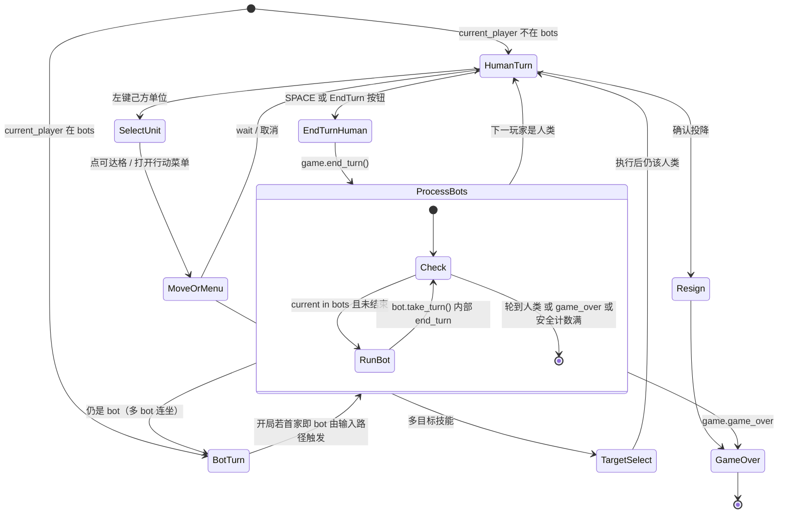

> 返回：[源码总览](overview.md) · [算法总览](../algorithms/overview.md) · [索引](../AGENTS.md)

# 应用运行时：`app/*` GUI 对局会话

本文说明 **表现层与领域之间的胶水**：如何从主菜单进入一局、每帧事件如何处理、人类与 Bot 回合如何交替、Bot 如何按配置工厂化创建。

读完后应能回答：

1. `GameSession.run` 循环里一帧做了什么？
2. 人类 `end_turn` 后为何连续多个 Bot 会自动跑完？
3. `create_bots_from_config` 支持哪些 bot_type？失败时怎样降级？
4. `action_executor` 与 `GameState` API 如何对应？

---

## 位置

| 模块 | 路径 |
|------|------|
| 会话与模式入口 | `reinforcetactics/app/game_loop.py` |
| 输入状态机 | `reinforcetactics/app/input_handler.py` |
| 单位菜单动作执行 | `reinforcetactics/app/action_executor.py` |
| Bot 工厂 | `reinforcetactics/app/bot_factory.py` |

上游入口：`cli/commands.play_mode` → `MainMenu` → `start_new_game` / `load_saved_game` / `watch_replay`。
下游：`core.game_state.GameState`、`ui.renderer.Renderer`、`game.bot*` / `llm_bot` / `model_bot`。

---

## 文件清单

| 文件 | 关键符号 | 职责 |
|------|----------|------|
| `game_loop.py` | `GameSession`, `start_new_game`, `load_saved_game`, `watch_replay` | 帧循环、暂停/存档/终局、开局装配 |
| `input_handler.py` | `InputHandler` | 键鼠、菜单、选中单位、Bot 连续回合 |
| `action_executor.py` | `execute_unit_action`, `handle_action_menu_result` | 把 UI 动作字典落到 `GameState` |
| `bot_factory.py` | `create_bot`, `create_bots_from_config`, `get_player_name/type` | 配置 → Bot 实例 |

---

## 职责

### `GameSession`

持有：

- `game: GameState`
- `renderer: Renderer`
- `bots: dict[player_num, BaseBot]`
- `input_handler: InputHandler`
- `clock`（60 FPS）

`run()` 在 `running and not game.game_over` 时循环处理 pygame 事件 → 渲染 → tick。退出原因：

| 返回值 | 场景 |
|--------|------|
| `quit` | 用户退出 / 关窗走暂停后确认 |
| `main_menu` | 暂停或终局回主菜单 |
| `new_game` 等 | 终局菜单选择（由 `GameOverMenu` 决定） |

中途退出若有 `action_history` 会尝试 `save_replay_to_file()`。

### `InputHandler`

维护交互状态，而不是规则：

- `selected_unit`
- `active_menu`（购买 / 单位行动）
- `target_selection_mode` + `target_selection_action`
- 右键攻击范围预览

键盘：`ESC` 暂停或取消、`SPACE` 结束回合、`S` 存档。
鼠标：按钮（结束回合、投降）、网格选中、菜单点击。

### `action_executor`

仅处理 **单位行动菜单** 结果：wait / cancel_move / capture / 需要目标的 attack·heal·…
不处理购买（购买在 `InputHandler._handle_menu_result` 调 `create_unit`）。

### `bot_factory`

把 `player_configs` 中 `type=="computer"` 的项实例化为 Bot，并回填：

- `player_name`（显示名）
- `player_type`: `human` | `bot` | `llm` | `rl`
- LLM 额外：`temperature`、`max_tokens`

---

## 数据结构

### `player_configs` 项

```python
{
  "type": "human" | "computer",
  "bot_type": "SimpleBot" | "MediumBot" | "AdvancedBot" | "MasterBot"
              | "OpenAIBot" | "ClaudeBot" | "GeminiBot" | "ModelBot",
  "model_path": str | None,   # ModelBot 必需
  # 工厂回填：
  "player_name": str,
  "player_type": "human" | "bot" | "llm" | "rl",
  "temperature": float | None,
  "max_tokens": int | None,
}
```

索引约定：`player_configs[i]` 对应玩家 **`i+1`**。

### 单位行动菜单 `action` 字典

| `action["type"]` | 含义 | 执行 |
|------------------|------|------|
| `wait` | 结束该单位回合 | `unit.end_unit_turn()`（Haste 可能再行动） |
| `cancel_move` | 撤销本单位移动 | `unit.cancel_move()` |
| `capture` | 占领脚下 | `game.seize(unit)` |
| `attack` / `paralyze` / `heal` / `cure` / `haste` / `defence_buff` / `attack_buff` | 有 `targets` 列表 | 单目标直接打；多目标进选择模式 |

### 会话内 bots 映射

```text
bots = { 2: SimpleBot(...), 3: ModelBot(...), ... }
# 仅 computer 玩家；人类不在 dict 中
```

`current_player in bots` 即「该由 AI 思考」。

---

## 核心逻辑

### 开局：`start_new_game`

1. 解析地图：`FileIO.load_map(..., for_ui=True, border_size=2)` 或 `generate_random_map`。
2. `enabled_units = settings.get_enabled_units()`。
3. `GameState(map_data, num_players, enabled_units, fog_of_war)`；FOW 时 `update_visibility()`。
4. 写入 `player_configs`（缺省：P1 人类，其余 SimpleBot）。
5. `Renderer(game)` + `create_bots_from_config(...)`。
6. 遗留模式 `human_vs_computer` 若缺 P2 bot 则强制 `SimpleBot`。
7. `GameSession(...).run()`，结束后 `pygame.quit()` 并把导航结果返回 CLI 菜单循环。

`load_saved_game` 走 `GameState.from_dict`；若已 `game_over` 直接 `GameOverMenu`。
`watch_replay` 使用 `ReplayPlayer`，**不**走 `GameSession`。

### 帧循环与人类/Bot 状态机（Mermaid）



说明：

- **Bot 不单独占 pygame 帧逻辑分支**；它们在人类结束回合后于 `_process_bot_turns` **同步阻塞调用** `take_turn()`（LLM 可能很慢，UI 会卡住到返回）。
- 安全阀：`max_bot_turns = num_players * 2`，防止错误 Bot 不 `end_turn` 死循环。
- **约定**：Bot 必须在 `take_turn` 内自己调用 `game_state.end_turn()`（见 [game-bots.md](game-bots.md)）；`_process_bot_turns` **不会**再 end 一次。

### 输入优先级（左键）

1. 目标选择模式
2. 打开中的菜单（打开后 200ms 内忽略点击防穿透）
3. HUD：`end_turn_button` / `resign_button`
4. 网格：选单位、移动、点 Building 打开购买菜单

### 渲染叠加（`_render_frame`）

顺序：`renderer.render()` → 移动范围/选中高亮 → 右键攻击预览 → 目标覆盖 → tooltip → 活动菜单 → `flip()`。

### 工厂：`create_bot`

| bot_type | 类 | 额外依赖 |
|----------|-----|----------|
| SimpleBot / MediumBot / AdvancedBot / MasterBot | `game.bot` | 无 |
| OpenAIBot / ClaudeBot / GeminiBot | `game.llm_bot` | API Key（settings 或环境变量） |
| ModelBot | `game.model_bot` | `model_path`；SB3 / torch |
| 未知 | 回落 SimpleBot | 打印警告 |

`ValueError` / `ImportError` → 打印错误并 **回落 SimpleBot**，避免菜单配置坏掉导致整局无法开始。

`get_player_name`：规则 Bot 用类名；LLM 用 `bot.model`；ModelBot 用模型文件 stem。

注意：工厂 **不** 创建 `NoopBot` / `RandomBot` / `MixedBot` / `AlphaZeroBot`——这些主要用于 RL curriculum 与脚本/锦标赛，不在 GUI 玩家配置枚举里（锦标赛可有独立注册，见 `tournament/`）。

---

## 与需求关系

| 需求 | 落点 |
|------|------|
| 人机对战 | P1 human + bots[2+]；SPACE 后 `_process_bot_turns` |
| 机机观战 | 全部 computer；需有人触发首段 Bot 链（或从 bot 回合存档加载） |
| 换难度 | 菜单写 `bot_type` → 工厂 |
| 用训练模型打 | `ModelBot` + `model_path` |
| LLM 对战 | 设置 API Key + OpenAI/Claude/GeminiBot |
| 战争迷雾 | `start_new_game(..., fog_of_war=True)` |
| 存档继续 | `from_dict` + 工厂重建 Bot（Bot **内部记忆不序列化**，规则 Bot 无状态可接受） |
| 回放 | 独立 `ReplayPlayer`，按日志重放而非 AI 重算 |

---

## 相关算法文档

本层偏 UI 运行时；算法相关仅间接：

| 文档 | 关系 |
|------|------|
| [game-bots.md](game-bots.md) | `take_turn` 合同与规则 Bot |
| [game-llm-and-model-bots.md](game-llm-and-model-bots.md) | ModelBot / LLM 在会话中的行为 |
| [../algorithms/evaluation-and-elo.md](../algorithms/evaluation-and-elo.md) | 批量对局更应用 tournament，而非 GUI 循环 |

---

## 延伸阅读

- [entrypoints-and-cli.md](entrypoints-and-cli.md) — `play_mode` 菜单外环
- [core-game-engine.md](core-game-engine.md) — 真正改状态的 API
- [ui-and-menus.md](ui-and-menus.md) — 菜单树与 Renderer（若已成文）
- [../usage/local-run-guide.md](../usage/local-run-guide.md)
- 测试：`tests/test_input_handler.py`、`tests/test_menus.py`

### 常见误解

1. **Bot 在独立线程** — 否；同步 `take_turn`，LLM 会冻帧。
2. **工厂支持 AlphaZeroBot** — 当前 GUI 工厂表无；需代码侧接入或锦标赛路径。
3. **人类结束回合后还要手动点 Bot** — 否；`_process_bot_turns` 自动连跑。
4. **`action_executor` 处理购买** — 否；只处理单位行动菜单。
5. **会话持有两份 GameState** — 否；Renderer / Input / Bot 共享同一引用。
