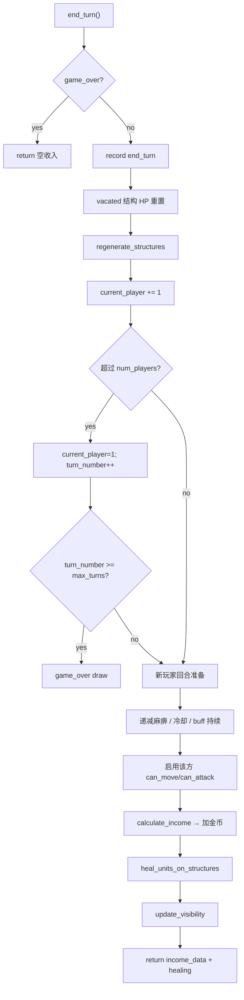
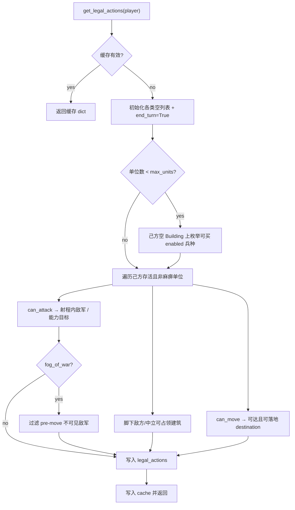

> 返回：[源码总览](overview.md) · [算法总览](../algorithms/overview.md) · [索引](../AGENTS.md)

# 核心游戏引擎：`core/*` / `mechanics` / `constants`

本文描述 **领域层（无 pygame）**：唯一权威状态、规则执行、合法动作、胜负与可配置覆盖。GUI、Gym、Bot、回放最终都读写同一套 API。

读完后应能回答：

1. 为什么说 `GameState` 是 single source of truth？
2. 一次 `end_turn` 会触发哪些副作用？
3. `get_legal_actions` 输出什么、缓存如何失效？
4. HQ 占领与全灭如何结束对局？`engine_overrides` 能改什么？

---

## 位置

| 模块 | 路径 |
|------|------|
| 状态聚合 | `reinforcetactics/core/game_state.py` |
| 单位 | `reinforcetactics/core/unit.py` |
| 地块 | `reinforcetactics/core/tile.py` |
| 网格 | `reinforcetactics/core/grid.py` |
| 战争迷雾 | `reinforcetactics/core/visibility.py` |
| 规则实现 | `reinforcetactics/game/mechanics.py` |
| 数值常量 | `reinforcetactics/constants.py` |

设计原则：**领域不依赖渲染**。`Tile.get_color()` 等少量显示辅助可存在于 core，但训练路径从不 import pygame。

---

## 文件清单

| 文件 | 关键类型 / 符号 | 职责 |
|------|-----------------|------|
| `game_state.py` | `GameState` | 状态权威：单位列表、金币、回合、动作日志、API 门面 |
| `unit.py` | `Unit` | 单兵属性、攻击距离、移动可达、状态效果字段 |
| `tile.py` | `Tile` | 地形码、所属玩家、可占领建筑 HP |
| `grid.py` | `TileGrid` | 二维 tile 容器、`to_numpy` 编码 |
| `visibility.py` | `VisibilityMap`、视野常量 | FOW 三态 + 记忆快照 |
| `mechanics.py` | `GameMechanics` | 战斗、占领、收入、冷却递减等纯规则 |
| `constants.py` | `UNIT_DATA`、`TileType`、收入/战斗系数 | 默认数值表 |

---

## 职责

### `GameState`：唯一真相源（SSOT）

所有可变对局信息挂在 `GameState` 实例上；Bot / Env / GUI 持有**同一引用**（或序列化后恢复的副本）。典型字段：

| 字段 | 含义 |
|------|------|
| `grid` | `TileGrid` |
| `units` | `list[Unit]` |
| `_next_unit_id` | 单调单位 id（回放 v3 按 id 定位） |
| `current_player` / `num_players` / `turn_number` | 回合控制 |
| `player_gold` | 每名玩家金币 |
| `unit_data` / `income_rates` / `starting_gold` | **本局**解析后的表（覆盖后与全局常量解耦） |
| `damage_model` | `"flat"` \| `"hp_scaled"` |
| `max_units_per_player` | 造兵上限（创建门控） |
| `structure_health` | 建筑最大 HP 覆盖 |
| `game_over` / `winner` / `end_reason` | 终局 |
| `action_history` | 回放动作流 |
| `fog_of_war` / `visibility_maps` | 可选迷雾 |
| `enabled_units` | 启用兵种列表 |
| `rng` | 可选 RNG（目前主要 Rogue 闪避） |
| `engine_overrides` | 原始覆盖 dict（会进 config/replay 快照） |

**写路径**应走 `create_unit` / `move_unit` / `attack` / `seize` / 能力 API / `end_turn` / `resign`，不要直接改 `units` 绕过日志与缓存失效。

### `GameMechanics`：无状态规则库

几乎全是 `@staticmethod`：给定 unit/grid/units 计算「能否走、打谁、伤多少、占领结果、收入」。`GameState` 调用它，并负责：

- 校验所有权 / `can_move` / 尸体引用
- 写 `action_history`（含结果字段，避免回放重掷 RNG）
- 移除死亡单位、触发 `_set_game_over`
- `_invalidate_cache()`

### `constants.py`：默认表

- 地形枚举 `TileType`：`p/w/m/f/r/b/h/t/o`
- `ALL_UNIT_TYPES = ["W","M","C","A","K","R","S","B"]`（与 RL 动作索引对齐）
- `UNIT_DATA`：费用、HP、攻击、防御、移动
- 经济：`STARTING_GOLD=250`，HQ/Building/Tower 收入 150/100/50
- 战斗：反击倍率、防御减伤、冲锋/侧袭/闪避、麻痹与 buff 冷却

**Balance 扫参**优先用 `engine_overrides`，避免改模块全局再污染其它对局。

---

## 数据结构

### 地图与地块

CSV 单元格格式：`type` 或 `type_player` 或 `type_player_team`（如 `h_1`、`b_2`）。

| 码 | 含义 | 可行走 | 可占领 |
|----|------|--------|--------|
| `p` | 草地 | ✓ | |
| `r` | 道路 | ✓ | |
| `m` | 山地（弓箭射程+） | ✓ | |
| `f` | 森林（盗贼闪避+） | ✓ | |
| `w` / `o` | 水 / 洋 | ✗ | |
| `b` | 建筑（造兵点） | ✓ | ✓ |
| `h` | 总部 | ✓ | ✓ |
| `t` | 塔 | ✓ | ✓ |

可占领建筑带 `health` / `max_health` / `regenerating`。

`TileGrid.to_numpy()` → `(H, W, 3)`：地形编码、owner、结构 HP%。海洋 `o` 与水 `w` 同码，避免 RL 把海洋当草地。

### 单位 `Unit`

| 字段组 | 内容 |
|--------|------|
| 身份 | `unit_id`, `type`, `player`, `(x,y)` |
| 战斗 | `health`/`max_health`, `attack_data`, `defence` |
| 回合标志 | `can_move`, `can_attack`, `has_moved`, `distance_moved` |
| 状态 | `paralyzed_turns`, haste/buff 冷却与持续 |
| FOW | `visible_enemies_at_action_start` |

攻击距离（曼哈顿）：近战 1；法师/术士 1–2；弓箭 2–3（山地 2–4，**不可**打距离 1）。

### 合法动作字典

`get_legal_actions(player)` 返回：

```text
{
  "create_unit": [{"unit_type", "x", "y"}, ...],
  "move": [{"unit", "from_x", "from_y", "to_x", "to_y"}, ...],
  "attack": [{"attacker", "target"}, ...],
  "paralyze" | "heal" | "cure" | "haste" | "defence_buff" | "attack_buff": [...],
  "seize": [{"unit", "tile"}, ...],
  "end_turn": True,
}
```

列表项里常直接嵌 `Unit` / `Tile` 引用——**适合进程内 Bot**；LLM 路径会再序列化为 JSON id。

### 终局原因 `end_reason`

| 值 | 触发 |
|----|------|
| `hq_capture` | 成功占领敌方 HQ |
| `elimination` | 某方单位全灭（2 人立即出胜者；多人剩 1 人时） |
| `max_turns_draw` | `turn_number >= max_turns` |
| `resign` | `resign()` |

经 `_set_game_over` 单点写入，幂等（第一次生效）。

---

## 核心逻辑

### 1. 构造与 `engine_overrides`

```python
GameState(
    map_data,
    num_players=2,
    max_turns=None,
    enabled_units=None,
    fog_of_war=False,
    engine_overrides=None,  # sparse overlay
    rng=None,
)
```

覆盖解析（未知键 / 非法值 **loud fail**）：

- 经济：`starting_gold`、`*_income`
- 结构 HP：`tower_health` / `building_health` / `headquarters_health`
- `damage_model`: `flat` | `hp_scaled`
- `max_units_per_player`（必须 > 0）
- `unit_data: {CODE: {field: value}}` 稀疏 delta

解析结果写入 **实例字段** `self.unit_data` 等；`create_unit` 用 `Unit(..., stats=self.unit_data[type])`，不读可变的全局表。

### 2. 动作 API（领域门面）

| 方法 | 行为摘要 |
|------|----------|
| `create_unit(type, x, y, player?)` | 检查上限 / 占格 / 金币 → 扣费 → 赋 `unit_id` → 日志 |
| `move_unit(unit, to_x, to_y)` | 要求 `can_move`、在可达集、目的地无单位；消耗移动；FOW 懒快照；更新视野 |
| `attack(attacker, target)` | 委托 `mechanics.attack_unit`；完整结果进回放；处理死亡与消灭胜负 |
| `paralyze` / `heal` / `cure` / `haste` / `defence_buff` / `attack_buff` | 能力封装 + 日志 |
| `seize(unit)` | 对脚下建筑 `seize_structure`；HQ 俘获 → `hq_capture`；消耗该单位行动 |
| `end_turn()` | 见下节生命周期 |
| `resign(player?)` | 移除该方单位并判负 |
| `get_legal_actions(player?)` | 枚举 + 缓存 |

共同防护：

- **尸体引用**：`unit not in self.units` 时 no-op（Bot 循环中反击致死的后续调用）
- **动作后** `_invalidate_cache()`
- **回放可自描述**：攻击记录 damage / evade / hp_after，避免重掷 Rogue 闪避

### 3. 战斗（`mechanics.attack_unit`）

1. 按距离与地形算基础伤；`hp_scaled` 时乘攻击者当前 HP 比例。
2. 骑士冲锋（本回合 `distance_moved >= 3`）+50%。
3. 盗贼侧袭（目标邻接己方另一单位）+50%。
4. 攻击 buff / 防御减伤 / 防御 buff。
5. 目标存活且未麻痹 → 反击：
   - 弓箭手攻击时，仅 A/M/S 可反击
   - 盗贼可闪避反击（基础 15%，森林 +15%）
   - 反击伤乘 `COUNTER_ATTACK_MULTIPLIER`（0.8）并再走防御逻辑

### 4. 占领

`seize_structure`：对建筑造成 **等于单位当前 HP** 的伤害；≤0 则易主并回满 HP。离开未完成占领的格会在 `end_turn` 时重置建筑 HP。

### 5. `end_turn` 生命周期（Mermaid）



结构上自动治疗（己方建筑上、需扣金币）：塔 1 HP；HQ/建筑 2 HP；费用按单位造价折算；优先靠近敌 HQ 的伤兵。

### 6. 合法动作收集（高层 Mermaid）



注意：`create_unit` **仅 Building**，不是 HQ。单位上限同时约束 `create_unit` 与合法动作枚举，避免 RL 掩码与引擎拒绝不一致。

### 7. 战争迷雾（摘要）

- 三态：`UNEXPLORED=0` / `SHROUDED=1` / `VISIBLE=2`
- 单位/结构视野半径（Chebyshev）；山地对单位视野 +1
- 移动前快照可见敌军，禁止「先走进视野再打」的作弊
- GUI 与 LLM 序列化可按可见性裁剪；完整规则细节见 `visibility.py` 与 `tests/test_fog_of_war.py`

### 8. 序列化

- `to_dict` / `from_dict`：存档
- `save_replay_to_file`：`game_info` + `actions[]`（含 unit_id）
- `to_numpy(for_player=...)`：给观察编码用的中间结构

---

## 与需求关系

| 需求 | 引擎落点 |
|------|----------|
| 规则一致、可 headless 训练 | 无 pygame 的 `GameState` + `GameMechanics` |
| Gym `step` 执行微动作 | 直接调用上述 API |
| Bot 一整回合 | 多次 API + 最终 `end_turn` |
| 回放确定性 | 动作日志记录战斗结果，不重掷闪避 |
| 平衡实验 | `engine_overrides` 写入 config，不改 constants 源码 |
| 多人对战 GUI | `num_players` 3/4；胜负消除逻辑分支 |
| 关闭某些兵种 | `enabled_units` + 合法动作过滤 |

MDP 视角下：`GameState` ≈ 完整状态 \(s\)；`get_legal_actions` ≈ 动作集合 \(\mathcal{A}(s)\)；`end_turn` 推进玩家与经济。见 [MDP / Gymnasium 基础](../algorithms/mdp-gymnasium-basics.md)。

---

## 相关算法文档

| 文档 | 关联 |
|------|------|
| [../algorithms/mdp-gymnasium-basics.md](../algorithms/mdp-gymnasium-basics.md) | 状态/动作/一步语义 |
| [../algorithms/action-masking.md](../algorithms/action-masking.md) | 合法动作 → 掩码 |
| [../algorithms/reward-shaping.md](../algorithms/reward-shaping.md) | 奖励读的是状态差分，非 UI 分数 |

---

## 延伸阅读

- [app-runtime.md](app-runtime.md) — GUI 如何点到 `GameState` API
- [game-bots.md](game-bots.md) — 规则 Bot 如何消费 `get_legal_actions`
- [rl-gym-env.md](rl-gym-env.md) — 观察编码与 env 步
- 测试：`tests/test_game_state.py`、`test_mechanics.py`、`test_engine_overrides.py`、`test_fog_of_war.py`
- 用户向机制说明：`docs-site/docs/game-mechanics.md`（中文站 `docs-site/zh/docs/`）

### 常见误解

1. **Env 一步 = 一整游戏回合** — 否；一步常是一次 move/attack；`end_turn` 才交手。
2. **改 `constants.UNIT_DATA` 只影响新局** — 全局可变；已开的局用 `self.unit_data`；应用 overrides。
3. **单位上限会杀掉超额单位** — 否；只阻止新建。
4. **占领伤害按攻击力** — 否；按 **单位当前 HP**。
5. **`get_legal_actions` 永远新鲜** — 有缓存；状态变更必须走会 `_invalidate_cache` 的 API。
