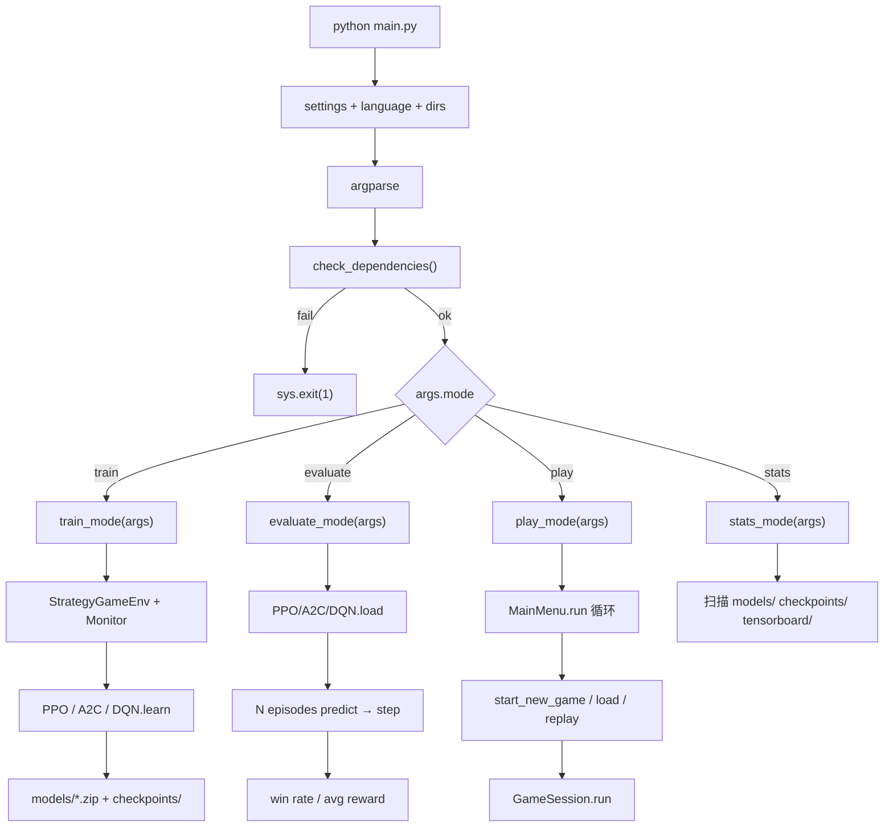

> 返回：[源码总览](overview.md) · [算法总览](../algorithms/overview.md) · [索引](../AGENTS.md)

# 入口与 CLI：`main.py` / `cli/commands.py`

本文说明仓库**最外层启动路径**：参数如何解析、四个 `--mode` 如何分发、训练/评估/对局/统计各自落到哪些实现。读完后应能回答：

1. `python main.py ...` 从哪里进、依赖检查在哪里做？
2. `train` / `evaluate` / `play` / `stats` 分别创建什么、依赖什么 extras？
3. CLI 级 PPO 与进阶脚本（bootstrap / feudal）的边界在哪？

**主要源码**：`main.py`、`reinforcetactics/cli/commands.py`、`reinforcetactics/utils/dependency_checker.py`、`reinforcetactics/utils/settings.py`。

---

## 位置

| 角色 | 路径 |
|------|------|
| 可执行入口 | `main.py`（仓库根） |
| 模式实现 | `reinforcetactics/cli/commands.py` |
| 依赖检查 | `reinforcetactics/utils/dependency_checker.py` |
| 设置 / 语言初始化 | `utils/settings.py`、`utils/language.py` |
| 打包入口声明 | `pyproject.toml` / `egg-info/entry_points.txt`（若安装为包） |

`main.py` 会把项目根插入 `sys.path`，因此**未 pip install 可编辑包**时也能直接运行。

---

## 文件清单

| 文件 | 职责摘要 |
|------|----------|
| `main.py` | `argparse` 定义、`check_dependencies()`、按 `args.mode` 路由到四个函数 |
| `cli/commands.py` | `train_mode` / `evaluate_mode` / `play_mode` / `stats_mode` |
| `cli/__init__.py` | 包标记（通常为空或再导出） |

---

## 职责

### `main.py`：薄路由层

启动顺序固定：

1. **设置与语言**：`get_settings()`、`get_language()`，并 `settings.ensure_directories()`（保证 `models/`、`saves/` 等目录存在）。
2. **解析 CLI 参数**（见下表）。
3. **`check_dependencies()`**：失败则 `sys.exit(1)`。
4. **按 mode 分发**到 `train_mode` / `evaluate_mode` / `play_mode` / `stats_mode`。
5. 成功结束打印 `✅ Done!`。

默认 mode 是 **`play`**，因此裸跑 `python main.py` 进入 GUI。

### 参数分组

| 分组 | 参数 | 默认 / 说明 |
|------|------|-------------|
| 模式 | `--mode` | `play`；`train` \| `evaluate` \| `play` \| `stats` |
| 训练算法 | `--algorithm` | `ppo`；另支持 `a2c`、`dqn` |
| 训练规模 | `--timesteps` | `100000` |
| 对手 | `--opponent` | `bot` \| `random` \| `noop` \| `self` |
| 地图 | `--map-file` | `None` → 环境内随机或默认逻辑 |
| 模型名 | `--model-name` | 保存到 `models/{name}.zip` |
| 奖励塑形 | `--reward-income` / `--reward-units` / `--reward-structures` | 系数默认 `0.0` |
| 评估 | `--model`、`--episodes`、`--render` | 评估必填模型路径 |

奖励相关参数只写入 `StrategyGameEnv(reward_config=...)`，语义见 [算法：奖励塑形](../algorithms/reward-shaping.md)（若尚未成文，以 env 内 `reward_config` 为准）。

---

## 数据结构

CLI 层几乎不引入领域结构，主要是：

- **`argparse.Namespace`**：贯穿四个 mode 的 `args`。
- **训练产物路径约定**（约定大于配置）：
  - 模型：`models/{algorithm}_final.zip` 或 `--model-name`
  - 检查点：`checkpoints/{algorithm}_strategy_*.zip`（`CheckpointCallback`，每 10000 步）
  - TensorBoard：`./tensorboard/`

`play_mode` 通过菜单结果字典驱动会话，典型键：

```python
{
  "type": "new_game" | "load_game" | "watch_replay" | "exit",
  "mode": "human_vs_computer" | "2v2" | ...,
  "map": str | "random",
  "players": [ {...}, ... ],   # player_configs
  "fog_of_war": bool,
  "replay_path": str | None,
}
```

---

## 核心逻辑

### 模式路由（Mermaid）



### `train_mode`

1. **依赖**：必须能 import `stable_baselines3`；否则打印安装提示并返回。
2. **环境导入容错**：先尝试 `reinforcetactics.rl.rl_gym_env`，失败再 `reinforcetactics.rl.gym_env`（兼容历史路径名）。
3. **构造 `StrategyGameEnv`**：
   - `render_mode=None`（headless）
   - `opponent=args.opponent`
   - `reward_config` 含 `win/loss=±1000`、`invalid_action=-10`、以及三个 CLI 塑形系数
4. **`Monitor` 包装**后创建算法：
   - **PPO**：`MultiInputPolicy`，`lr=3e-4`，`n_steps=2048`，`batch_size=64`，`n_epochs=10`，TB log
   - **A2C**：`n_steps=5`
   - **DQN**：`buffer_size=50000`，`lr=1e-4`
5. **`CheckpointCallback(save_freq=10000)`**。
6. **`model.learn(..., progress_bar=True)`**；`KeyboardInterrupt` 时仍尝试保存最终模型。
7. **`model.save(models/{name})`** → 实际文件为 `.zip`。

要点：这是**快速验证路径**，不是课程 bootstrap。完整 curriculum、MaskablePPO YAML、自对弈等走 `scripts/train/*` 与 `configs/ppo/`。算法直觉见 [PPO 算法文](../algorithms/ppo.md)。

### `evaluate_mode`

1. 要求 `--model` 路径存在。
2. 按路径名启发式加载：含 `ppo`/`a2c`/`dqn` 字符串选择类，否则默认 `PPO.load`。
3. 创建 env（`opponent` 来自 args；`--render` 时 `render_mode="human"`）。
4. 每局：`reset` → `predict(deterministic=True)` → `step`，累计 reward。
5. 以 `info["game_over"]` 且 `info["winner"] == 1` 计胜（**假定 agent 为 player 1**）。
6. 汇总胜率、平均/最大/最小 reward。

注意：此路径使用的是 **plain SB3** 的 `predict`，**未传 action_masks**；若模型是 MaskablePPO 训练的，评估更稳妥的方式见 `scripts/eval_agent.py` 与 `rl/evaluation.py`。

### `play_mode`

1. 初始化 pygame，进入 **主菜单循环**（`while True`）。
2. 每次迭代重新 `pygame.init()`（对局会话结束后可能 quit pygame）。
3. `MainMenu.run()` 返回：
   - `exit` / 空 → 退出
   - `new_game` → `start_new_game(mode, map, players, fog_of_war)`
   - `load_game` → `load_saved_game()`
   - `watch_replay` → `watch_replay(path)`
4. 会话返回 `quit` 则退出 CLI；`main_menu` / `new_game` 则回到菜单。

GUI 会话细节见 [app-runtime.md](app-runtime.md)。

### `stats_mode`

不读 TensorBoard 事件内容，只做**文件系统扫描**：

- `models/*.zip` 列表（最多显示 10 个）
- `checkpoints/*.zip` 数量
- 是否存在 `tensorboard/`，并提示 `tensorboard --logdir ./tensorboard/`

适合快速确认「本机有没有训过东西」，不是完整实验看板。

---

## 与需求关系

| 需求 | CLI 落点 | 备注 |
|------|----------|------|
| 本地打开 GUI 玩一局 | `--mode play` | 默认 mode |
| 最快验证 SB3 能训 | `--mode train --algorithm ppo` | 固定超参、无 curriculum |
| 对已有 `.zip` 粗评 | `--mode evaluate --model ...` | 胜负以 player 1 为准 |
| 看本机产物 | `--mode stats` | 目录扫描 |
| 严肃课程 / Feudal / AZ | **不是** `main.py` | 用 `scripts/train/*` + YAML |

`--opponent` 字符串会传入 `StrategyGameEnv`，在 env 内映射为规则 Bot（如 bot→SimpleBot 一类、random、noop、self）。具体映射见 [rl-gym-env](rl-gym-env.md)（若尚未成文，直接读 `gym_env.py` 的 opponent 构造）。

---

## 相关算法文档

| 文档 | 关联点 |
|------|--------|
| [../algorithms/ppo.md](../algorithms/ppo.md) | CLI 默认 PPO 超参与 MultiInputPolicy 直觉 |
| [../algorithms/mdp-gymnasium-basics.md](../algorithms/mdp-gymnasium-basics.md) | `reset/step`、env 步 vs 游戏回合 |
| [../algorithms/curriculum-bootstrap.md](../algorithms/curriculum-bootstrap.md) | 为何生产训练不走 `main.py train` |
| [../algorithms/evaluation-and-elo.md](../algorithms/evaluation-and-elo.md) | 比 CLI 胜率更稳的评估与锦标赛 |

---

## 延伸阅读

- [overview.md](overview.md) — 分层与两条主控制流
- [app-runtime.md](app-runtime.md) — `play` 进入后的会话与输入
- [core-game-engine.md](core-game-engine.md) — 环境底层改写的真正状态
- [../usage/local-run-guide.md](../usage/local-run-guide.md) — Windows + Conda 操作命令
- 进阶训练入口：`scripts/train/train_bootstrap.py`、`train_feudal_rl.py`、`train_alphazero.py`、`train_self_play.py`
- 示例：`examples/train_with_action_masking.py`、`examples/train_with_bc_warmstart.py`

### 常见误解

1. **`main.py train` = 项目推荐训练管线** — 否；它是最小可跑路径。
2. **evaluate 与 bootstrap 评估一致** — 否；CLI 不处理掩码、不读 YAML、不报 ELO。
3. **`--model-name` 含路径** — 会拼在 `models/` 下；一般只给 stem 名。
4. **`stats` 显示训练曲线** — 不会；需自行开 TensorBoard。
