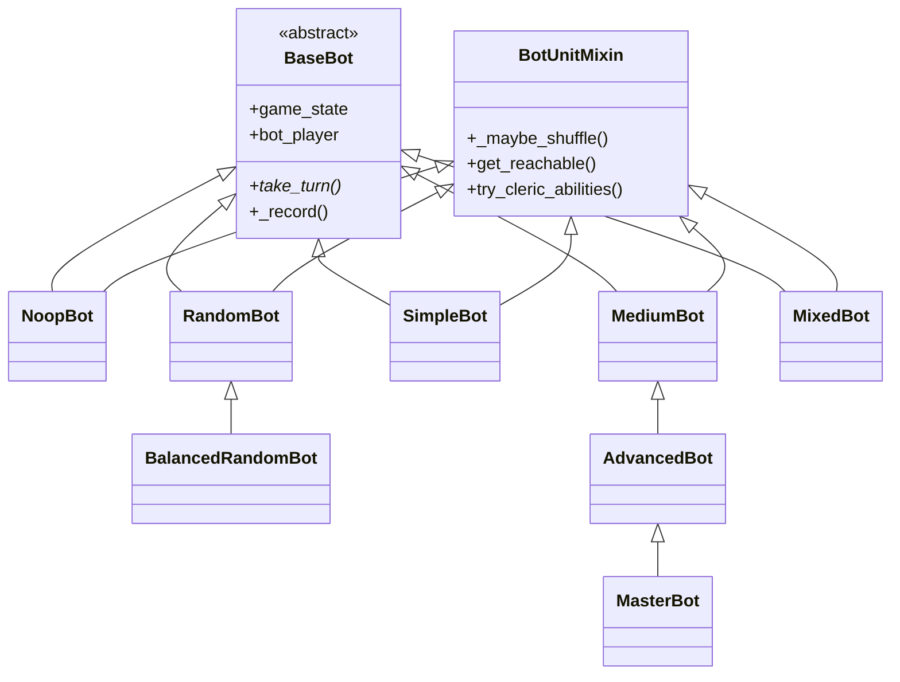

> 返回：[源码总览](overview.md) · [算法总览](../algorithms/overview.md) · [索引](../AGENTS.md)

# 规则 Bot 体系：`bot_base` / `bot`

本文覆盖 **脚本启发式对手**：从抽象合同、共享 mixin，到 Noop → Random → Simple → … → Master 的难度阶梯，以及课程桥接 `MixedBot`。

读完后应能回答：

1. 所有 Bot 必须遵守的 `take_turn` 合同是什么？
2. 各层级在策略上差在哪？
3. `MixedBot` 为何适合 curriculum，如何配置？
4. `rng` / `_maybe_shuffle` 如何在不改变「最优启发式」的前提下增加轨迹多样性？

**LLM / 神经网络 Bot** 见 [game-llm-and-model-bots.md](game-llm-and-model-bots.md)。

---

## 位置

| 模块 | 路径 |
|------|------|
| 抽象基类与 mixin | `reinforcetactics/game/bot_base.py` |
| 规则 Bot 实现 | `reinforcetactics/game/bot.py` |

消费方：`app/bot_factory`、`rl/gym_env` 对手、`tournament/*`、`rl/bootstrap` curriculum。

---

## 文件清单

| 文件 | 类型 | 说明 |
|------|------|------|
| `bot_base.py` | `BaseBot`, `BotUnitMixin`, `ABILITY_PROVIDERS`, 兵种角色元组 | 合同 + 共享工具 |
| `bot.py` | `NoopBot` … `MasterBot`, `MixedBot` | 具体策略 |

---

## 职责

### `BaseBot` 合同

```text
take_turn() 必须：
  1. 在有限步骤内返回（禁止死循环）
  2. 代表 self.bot_player 执行 0..N 个领域动作
  3. 调用 game_state.end_turn()（或 game_over 时直接返回）
```

`BaseBot` 只保证 `game_state` + `bot_player`；并提供可选遥测：

- `_record(name)` / `get_capabilities_fired()` — 统计如 `buy_W`、`knight_charge` 等启发式触发次数，供锦标赛 / 平衡分析写入 replay `game_info`。

### `BotUnitMixin`

混入辅助（不单独实例化）：

- 启用兵种查询：`get_enabled_units*`、`has_units_with_ability`
- 距离与可达：`manhattan_distance`、`get_reachable`、`find_best_move_position`
- 占领续作：`continue_active_seizes`
- 通用技能：`try_cleric_abilities`、`try_mage_paralyze`
- **随机决胜**：`_rng` + `_maybe_shuffle`

`ABILITY_PROVIDERS` 把能力名映射到兵种字母（charge→K, flank→R, …），减少散落硬编码。

### 规则 Bot 层级职责一览

| 类 | 角色 |
|----|------|
| `NoopBot` | 空操作；课程 stage-0 / 奖励 sanity |
| `RandomBot` | 均匀随机合法动作，上限 `max_actions` |
| `BalancedRandomBot` | 可选造 1 兵 + 每单位 1 随机动作；压力随兵力缩放 |
| `SimpleBot` | 固定购买优先级 + 贪心接近/攻击/占领 |
| `MediumBot` | 集火、撤退治疗、占领优先级、克制购买 |
| `AdvancedBot` | 地图分析、阶段机、编制目标、技能特化 |
| `MasterBot` | 威胁图、更聪明撤退/集火/占领 |
| `MixedBot` | 每局掷硬币选 easy/hard 内层 Bot |

---

## 数据结构

### 实例字段（共性）

```python
self.game_state   # 共享 GameState
self.bot_player   # int
self._rng         # None | random.Random | random 模块
self.capabilities_fired  # 可选 dict[str,int]
```

### `MixedBot` 配置

| 参数 | 默认 | 含义 |
|------|------|------|
| `easy` / `hard` | `"simple"` / `"medium"` | 内层名 |
| `p_hard` | `0.5` | 选 hard 的概率 |
| `easy_kwargs` / `hard_kwargs` | `None` | 传给内层的额外参数 |
| `rng` | 全局 random | 硬币 + 转发内层 |

合法内层名：`simple`, `medium`, `advanced`, `master`, `random`, `balanced_random`。
保留键 `rng` / `player` / `game_state` 禁止出现在 kwargs（构造期 `ValueError`）。

### 遥测名示例

`buy_W`、`warrior_cap_hit`、`knight_charge`、`sorcerer_haste`、`suicide_eval_rejected` 等——以源码 `_record(...)` 调用为准。

---

## 核心逻辑

### 继承关系（Mermaid）



（MRO 实际为 `class X(BotUnitMixin, BaseBot)`。）

### 各 Bot `take_turn` 摘要

#### `NoopBot`

直接 `end_turn()`。用于：若 agent 都打不赢 Noop，问题在策略/奖励而非对手强度。

#### `RandomBot`

最多 `max_actions`（默认 20）次：从除 `end_turn` 外的合法动作扁平列表 `rng.choice` → `_execute` 分发到 `GameState` API → 最后 `end_turn`。

#### `BalancedRandomBot`

1. 若有 `create_unit`，随机造一个并刷新合法动作
2. 按单位分桶，每单位随机执行一个动作
3. `end_turn`

介于 Noop（零压力）与 Random(max=20)（噪声吞吐）之间，见 `configs/ppo/bootstrap.yaml` 注释。

#### `SimpleBot`

```text
purchase_units() → move_and_act_units() → end_turn()
```

- 购买：优先级表 W 最高 … S 最低；Warrior 占比 cap（≥3 单位且 W≥50% 时强制买非 W）
- 行动：贪心选目标（伤兵/低血/近距离）、移动后攻击或去占领

#### `MediumBot`

同三角色阶段，但增强：

- **集火** `coordinate_attacks` / `find_killable_targets`
- **低血撤退**到可治疗建筑
- **占领目标去重** `_capture_assigned`
- **争建筑打断** `_interrupt_assigned`
- 购买含简单克制 `get_counter_unit`
- `calculate_attack_value` 估攻击期望（含冲锋/侧袭因素）

#### `AdvancedBot(MediumBot)`

- 首次 `analyze_map`（HQ、山地、森林）
- **阶段机** `compute_target_phase` / `update_phase`（需连续若干回合确认才切换）
- `purchase_units_enhanced` + 动态编制 `FULL_COMPOSITION_TARGETS`
- `act_with_unit_enhanced`：骑士冲锋、盗贼侧袭/森林、术士 buff/haste、远程优先等

#### `MasterBot(AdvancedBot)`

- 每回合 `_compute_threat_map`：敌方可移动后打击到的格累积威胁
- 撤退与走位参考 `threat_at`
- 覆盖集火排序、占领选择、术士能力优先级

#### `MixedBot`

构造时：

```text
use_hard = rng.random() < p_hard
_inner = build(hard if use_hard else easy)
take_turn → _inner.take_turn()
```

**整局固定**内层（不在中途切换）。`gym_env.reset` 会重建对手 → 每 episode 重新掷硬币。
`rng` 会转发给内层，使启发式决胜也随机。

### `rng` 与随机决胜

- `_rng is None`：**完全确定性**（同开局同轨迹）——便于回归测试。
- `_rng` 有值：在 sort / 选 best 前 `_maybe_shuffle`，**同分启发式**结果多样化，评分函数本身不变。

训练里 env 常注入 episode seed 派生的 `Random`，既可复现实验又可避免「永远同一 SimpleBot 棋谱」。

---

## 与需求关系

| 需求 | 使用建议 |
|------|----------|
| RL 课程由易到难 | Noop → BalancedRandom → Random → Simple → Mixed → Medium → Advanced |
| GUI 人机难度 | 工厂暴露 Simple/Medium/Advanced/Master |
| 训练对手多样性 | MixedBot + `p_hard` 斜坡；内层 `rng` |
| 基准弱策略 | RandomBot / BalancedRandomBot |
| 平衡分析 | 开 `capabilities_fired` + 锦标赛 CSV |
| 自对弈前的固定靶 | MasterBot 作为强规则上界参考 |

Curriculum 配置见 `configs/ppo/bootstrap.yaml` 与 [curriculum-bootstrap](../algorithms/curriculum-bootstrap.md)。

---

## 相关算法文档

| 文档 | 关联 |
|------|------|
| [../algorithms/curriculum-bootstrap.md](../algorithms/curriculum-bootstrap.md) | 阶段对手、MixedBot 桥 |
| [../algorithms/evaluation-and-elo.md](../algorithms/evaluation-and-elo.md) | 规则 Bot 作 ELO 锚点 |
| [../algorithms/mdp-gymnasium-basics.md](../algorithms/mdp-gymnasium-basics.md) | 对手作为环境一部分 |

---

## 延伸阅读

- [core-game-engine.md](core-game-engine.md) — `get_legal_actions` 是 Random* 的动作源
- [app-runtime.md](app-runtime.md) — GUI 工厂子集
- [game-llm-and-model-bots.md](game-llm-and-model-bots.md) — 非规则决策者
- 测试：`tests/test_noop_bot.py`、`test_random_bot.py`、`test_balanced_random_bot.py`、`test_mixed_bot.py`、`test_medium_bot.py`、`test_advanced_bot.py`、`test_master_bot.py`、`test_bot_base.py`
- 笔记：`docs/zh/REVIEW_advancedbot.md`、`docs/zh/bootstrap_lessons_learned.md`

### 常见误解

1. **MixedBot 一回合 soft/hard 混合** — 否；一 episode 一种内层。
2. **高级 Bot 搜索博弈树** — 否；启发式 + 局部估值，无 MCTS。
3. **`_record` 影响强度** — 否；纯遥测。
4. **GUI 能选 RandomBot** — 标准工厂表没有；训练/env 可直接构造。
5. **SimpleBot 总是全 Warrior** — 有 Warrior share cap；旧版本问题已缓解。
