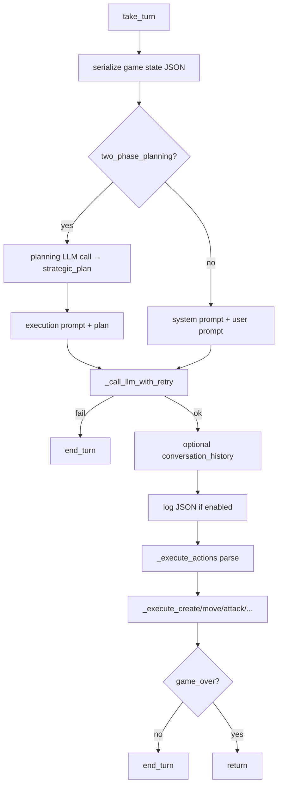
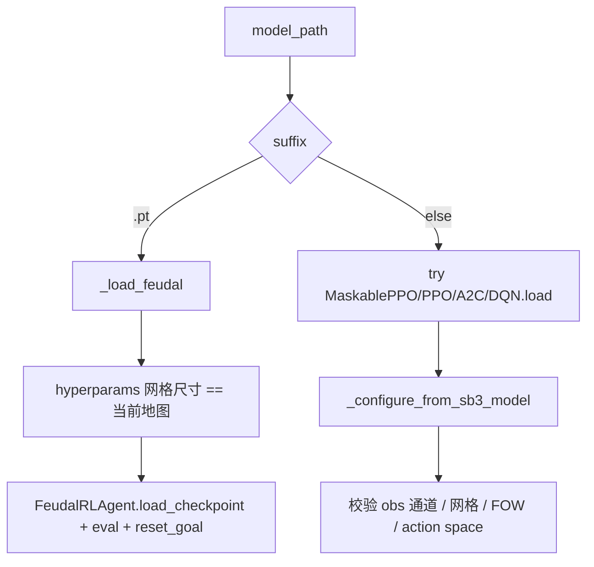

> 返回：[源码总览](overview.md) · [算法总览](../algorithms/overview.md) · [索引](../AGENTS.md)

# LLM / 模型 / AlphaZero Bot

本文覆盖 **非规则启发式** 的决策者：调用大模型的 `LLMBot` 族、加载 SB3/Feudal 权重的 `ModelBot`、以及 MCTS+网络的 `AlphaZeroBot`。它们都实现 `BaseBot.take_turn()`，因而可插入 GUI、Env 对手位或锦标赛。

读完后应能回答：

1. LLM 如何把局面变成 prompt、又如何把 JSON 动作写回 `GameState`？
2. `ModelBot` 如何区分 `.zip` 与 `.pt`？flat / multi_discrete / feudal 推理差在哪？
3. AlphaZeroBot 的「一步」是微动作还是整回合？
4. 与训练管线文档如何对照？

---

## 位置

| 模块 | 路径 |
|------|------|
| LLM 基类与供应商 | `reinforcetactics/game/llm_bot.py` |
| 系统提示库 | `reinforcetactics/game/llm_prompts.py` |
| SB3 / Feudal 模型 Bot | `reinforcetactics/game/model_bot.py` |
| AlphaZero + MCTS Bot | `reinforcetactics/game/alphazero_bot.py` |
| 观察 / 掩码 / 执行辅助 | `rl/observation.py`、`rl/gym_env.py`（`build_flat_actions` 等）、`rl/mcts.py` |

---

## 文件清单

| 文件 | 关键类型 | 职责 |
|------|----------|------|
| `llm_bot.py` | `LLMBot`, `OpenAIBot`, `ClaudeBot`, `GeminiBot` | 序列化、调用、解析、执行、token 统计 |
| `llm_prompts.py` | `PROMPT_*`, `get_prompt` | 可切换 system prompt 策略 |
| `model_bot.py` | `ModelBot` | 加载权重、构造 obs、predict、译码执行 |
| `alphazero_bot.py` | `AlphaZeroBot` | 加载 `AlphaZeroNet` + `MCTS.select_action` 循环 |

---

## 职责

### `LLMBot`（抽象）

- 输入：共享 `GameState` + API 配置
- 过程：序列化局面 →（可选两阶段规划）→ LLM → 解析 JSON 动作列表 → 校验执行
- 输出：领域副作用 + 必定 `end_turn`（已 `game_over` 除外）
- 子类只实现 `_call_llm` 与 SDK 版本等供应商细节

### `llm_prompts`

提供多套策略文本：

| 名 | 用途 |
|----|------|
| `PROMPT_BASIC` / 默认 | 规则摘要 + 动作 schema + 简短策略提示 |
| `PROMPT_STRATEGIC` | 更强调多步战术 |
| `PROMPT_TWO_PHASE_PLAN` / `EXECUTE` | 两阶段：先计划后执行 |

可用 `get_prompt("strategic")` 或直接传长字符串。

### `ModelBot`

- **`.zip`**：Stable-Baselines3（优先试 `MaskablePPO`，再 PPO/A2C/DQN）
- **`.pt`**：`FeudalRLAgent` checkpoint
- 从 checkpoint 的 `observation_space` / `action_space` **推断** flat vs multi_discrete、是否 pad、是否 FOW
- `take_turn`：循环 predict→execute，直到 end_turn 或上限 50 次微动作

### `AlphaZeroBot`

- 加载 `model_state_dict` + 可选 config 网格尺寸
- 每微动作：`MCTS.select_action` → `_execute_action_on_state`
- temperature=0 默认贪心；`add_noise=False` 用于对战

---

## 数据结构

### LLM 序列化局面（概念）

`_serialize_game_state` 产出 JSON 友好 dict，通常含：

- 当前玩家、回合、金币
- 单位列表（含 **稳定 unit_id**、类型、HP、坐标、状态）
- 结构与地图摘要
- **合法动作**（经 `_format_legal_actions`，坐标/id 化，避免直接 dump Python 对象）

用户 prompt 还会嵌入这些 JSON；两阶段时附加 plan。

### LLM 响应期望

解析 `_extract_json` 后，动作列表项大致形如：

```json
{
  "actions": [
    {"type": "CREATE_UNIT", "unit_type": "W", "x": 3, "y": 5},
    {"type": "MOVE", "unit_id": 2, "to_x": 4, "to_y": 5},
    {"type": "ATTACK", "unit_id": 2, "target_unit_id": 7},
    {"type": "SEIZE", "unit_id": 2},
    {"type": "END_TURN"}
  ]
}
```

（字段名以 `_execute_*` 实现为准；非法项跳过。）支持 RESIGN。可选 `reasoning` 字段（`should_reason=True`）。

### ModelBot 动作向量

**MultiDiscrete 六元组**（与 `StrategyGameEnv` 一致）：

```text
[action_type, unit_type_idx, from_x, from_y, to_x, to_y]

action_type:
  0 create, 1 move, 2 attack, 3 seize, 4 heal/cure,
  5 end_turn, 6 paralyze, 7 haste, 8 defence_buff, 9 attack_buff
unit_type_idx: 对齐 ALL_UNIT_TYPES 索引
```

**Flat Discrete**：索引进 `build_flat_actions(...)` 表；越界则退回 end_turn 向量。

### AlphaZero 侧

MCTS 返回 flat action id + `get_action_info` → `{key, action}`，其中 `key` 为 `create_unit`/`move`/…/`end_turn`。

---

## 核心逻辑

### 1. LLM 回合流水线



要点：

- **重试**：指数退避，`max_retries` 默认 3
- **stateful**：跨回合附加 history（token 更贵）
- **两阶段**：每回合约 2 倍 API 调用
- 执行使用 **unit_id 映射** `_get_unit_by_id`，与引擎 id 一致
- API Key：构造参数或环境变量（OpenAI / Anthropic / Google 各自 `_env_var_name`）

GUI 路径：`bot_factory` 从 `settings.get_api_key(...)` 注入。

### 2. ModelBot 加载分支



失败模式（**故意 loud**）：

- 地图比 checkpoint 观察更大
- MultiDiscrete 网格宽高与当前地图不符
- FOW 与训练时 visibility 键不一致
- Feudal 网格不匹配

### 3. ModelBot `take_turn` 与动作翻译

```text
loop up to 50:
  obs = build_observation(state, perspective=bot_player, pad_to=_pad_to)
  if feudal: action = select_action(..., masks)
  else:      action = predict_sb3 (flat 表解码 或 6-vector)
  execute 6-vector → create/move/attack/...
  break if end_turn or invalid
if still our turn: end_turn()
```

| 模式 | predict | 掩码 |
|------|---------|------|
| flat | Discrete 索引 → `build_flat_actions` | 前 `len(table)` 为 True |
| multi_discrete | 6 维向量 | `build_per_dim_masks` 拼接（若支持） |
| feudal AR | `structured_masks` | `build_structured_masks` |
| feudal 非 AR | 同 multi 维掩码 | `build_per_dim_masks` |

执行层 `_create_unit` / `_move_unit` / … 用坐标从 `game_state` 查找单位，再调领域 API；失败返回 False 结束循环。

观察 **永远以 `bot_player` 为视角**（金币/单位特征 agent-relative），与训练 env 一致——即使该 Bot 在 GUI 里是 player 2。

### 4. AlphaZeroBot

```text
while actions < 50 and our turn and not game_over:
  flat, _ = mcts.select_action(state, temperature, add_noise=False)
  info = mcts.get_action_info(state, flat)
  if info is None or key==end_turn: end_turn; break
  _execute_action_on_state(state, key, action)
ensure end_turn if still our turn
```

与 ModelBot 相同：**回合内多个微动作**，每步一次搜索（`num_simulations` 默认 100）。无模型路径时仍可建随机初始化网络（弱棋，仅调试）。

---

## 与需求关系

| 需求 | 组件 |
|------|------|
| 人机用训练好的 PPO | GUI `ModelBot` + `.zip`；地图尺寸/FOW 需匹配 |
| Feudal 演示 | `.pt` 加载；网格必须一致 |
| LLM 锦标赛 / 研究 | `OpenAIBot` 等 + `log_conversations` + token 统计 |
| 换 prompt 做消融 | `system_prompt=` 或 `get_prompt` |
| AlphaZero 对战 | 自行构造 `AlphaZeroBot`（工厂默认未挂） |
| 与课程规则 Bot 公平对比 | 同一 `BaseBot` 接口进 tournament runner |

**不在本文范围**：权重如何训出——见算法与 RL 管线文档。

---

## 相关算法文档

| 文档 | 关联 |
|------|------|
| [../algorithms/ppo.md](../algorithms/ppo.md) | SB3 `.zip` 策略来源 |
| [../algorithms/feudal-rl.md](../algorithms/feudal-rl.md) | Manager/Worker、`.pt` 语义 |
| [../algorithms/alphazero-mcts.md](../algorithms/alphazero-mcts.md) | 网络 + MCTS |
| [../algorithms/action-masking.md](../algorithms/action-masking.md) | ModelBot 掩码与训练一致的原因 |
| [../algorithms/evaluation-and-elo.md](../algorithms/evaluation-and-elo.md) | 模型进阶梯评估 |

---

## 延伸阅读

- [game-bots.md](game-bots.md) — 规则对手与 `take_turn` 合同
- [app-runtime.md](app-runtime.md) — 工厂如何创建 LLM/ModelBot
- [core-game-engine.md](core-game-engine.md) — 执行落到的 API
- [rl-gym-env.md](rl-gym-env.md) / [rl-advanced-trainers.md](rl-advanced-trainers.md)
- 测试：`tests/test_llm_bot.py`、`test_llm_prompts.py`、`test_model_bot.py`、`test_model_bot_feudal.py`、`test_alphazero.py`
- 示例：`examples/llm_bot_demo.py`
- 笔记本：`notebooks/llm_bot_tournament.ipynb`

### 常见误解

1. **ModelBot 自动适配任意地图** — 否；空间与训练绑定，不匹配即报错。
2. **LLM 保证合法** — 否；依赖 prompt 中的 legal list + 执行时校验，仍可能跳过非法项。
3. **AlphaZeroBot 一步 MCTS 走完整回合** — 否；循环微动作，每步搜索。
4. **`.pt` 一定是 AlphaZero** — 在 `ModelBot` 里 `.pt` 是 **Feudal**；AlphaZero 走 `AlphaZeroBot` 自己的加载逻辑。
5. **evaluate CLI 与 ModelBot 行为相同** — CLI `evaluate_mode` 不经 ModelBot，且可能不传 masks。

### 依赖 extras

| Bot | 典型依赖 |
|-----|----------|
| OpenAI/Claude/Gemini | 对应 SDK + API Key（`llm` extra） |
| ModelBot `.zip` | `stable-baselines3`；掩码需 `sb3-contrib` |
| ModelBot `.pt` | `torch` + `feudal_rl` |
| AlphaZeroBot | `torch` + `alphazero_net` / `mcts` |
