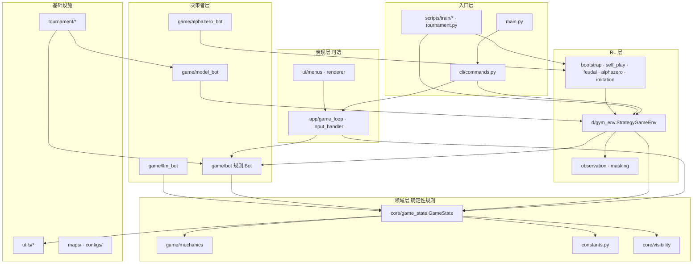
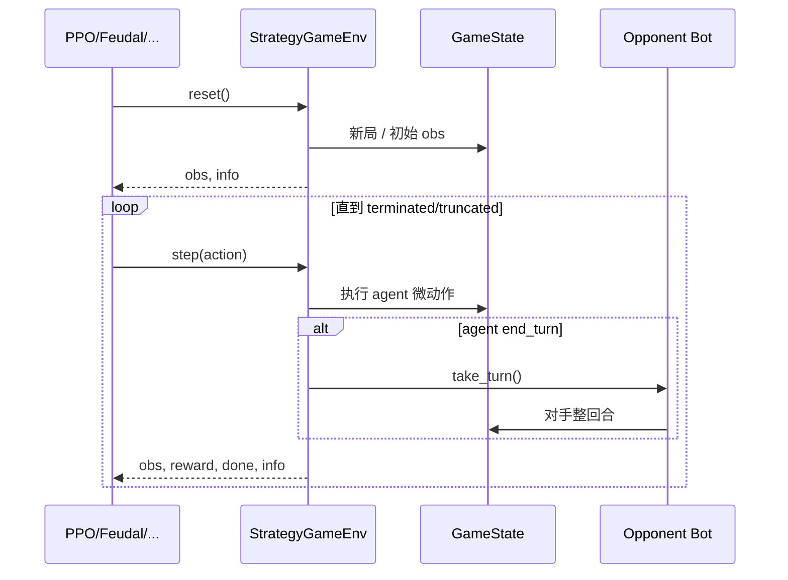

# 源码架构总览

> 返回：[索引](../AGENTS.md) · [算法总览](../algorithms/overview.md)
> 推荐阅读顺序见文末。

本文是 **Reinforce Tactics** 代码库的入口地图。读完后你应能回答：

1. 项目分哪几层？数据/控制流怎么走？
2. 「玩游戏 / 训练 / 评测」分别落在哪些文件？
3. 接下来该点开哪篇分文档？

**文档基准**：仓库 `feature/local-deploy` 附近源码（包版本约 0.3.x）。类名与函数名可直接在 IDE 中搜索核对。

---

## 1. 项目一句话

**一个可 headless 运行的回合制策略游戏引擎**，外面包了标准 **Gymnasium** 接口，用于训练与评测强化学习智能体；同时提供 **Pygame GUI**、**规则 Bot / LLM Bot / 模型 Bot** 和 **锦标赛（ELO）** 系统。

核心设计取舍：

| 取舍 | 含义 |
|------|------|
| 领域逻辑与渲染分离 | `core/game_state` 不依赖 pygame，可纯 CPU 训练 |
| 决策者可插拔 | 凡实现 `take_turn()` 的 Bot 都能进 GUI / Env / 锦标赛 |
| 训练只保证 1v1 Env | `StrategyGameEnv` 的观察编码按双方（self/opp）设计；1v1v1/2v2 主要走 GUI |
| 多训练路径并存 | CLI 简单 PPO、`bootstrap` 课程、Feudal、AlphaZero、自对弈脚本各司其职 |

---

## 2. 分层架构



### 2.1 各层职责

| 层 | 职责 | 关键路径 | 分文档 |
|----|------|----------|--------|
| **入口** | 解析参数、选择 train/evaluate/play/stats | `main.py`, `cli/commands.py`, `scripts/` | [entrypoints-and-cli.md](entrypoints-and-cli.md) · [scripts-configs-maps.md](scripts-configs-maps.md) |
| **领域** | 地图、单位、合法动作、战斗、胜负、序列化 | `core/`, `game/mechanics.py`, `constants.py` | [core-game-engine.md](core-game-engine.md) |
| **决策者** | 给定 `GameState` 执行一整回合 | `game/bot*.py`, `llm_bot`, `model_bot` | [game-bots.md](game-bots.md) · [game-llm-and-model-bots.md](game-llm-and-model-bots.md) |
| **RL** | 把领域包装成 `reset/step`，并提供训练器 | `rl/*` | [rl-gym-env.md](rl-gym-env.md) · [rl-training-pipelines.md](rl-training-pipelines.md) · [rl-advanced-trainers.md](rl-advanced-trainers.md) |
| **表现** | 菜单、渲染、鼠标键盘 | `ui/`, `app/` | [app-runtime.md](app-runtime.md) · [ui-and-menus.md](ui-and-menus.md) |
| **竞赛** | 循环赛、发现模型、ELO | `tournament/` | [tournament-system.md](tournament-system.md) |
| **基建** | 设置、语言、字体、存档回放、IO | `utils/` | [utils-infra.md](utils-infra.md) |

---

## 3. 需求 → 代码落点

| 你想做什么 | 入口 | 核心依赖 |
|------------|------|----------|
| 手动玩一局 | `python main.py --mode play` | [app-runtime](app-runtime.md) → [core](core-game-engine.md) |
| 快速训 PPO | `main.py --mode train` | [entrypoints](entrypoints-and-cli.md) → [rl-gym-env](rl-gym-env.md) + [PPO 算法](../algorithms/ppo.md) |
| 课程冷启动 | `scripts/train/train_bootstrap.py` | [rl-training-pipelines](rl-training-pipelines.md) + [课程算法](../algorithms/curriculum-bootstrap.md) |
| 分层 RL | `scripts/train/train_feudal_rl.py` | [rl-advanced-trainers](rl-advanced-trainers.md) + [Feudal](../algorithms/feudal-rl.md) |
| AlphaZero | `scripts/train/train_alphazero.py` | [rl-advanced-trainers](rl-advanced-trainers.md) + [AlphaZero/MCTS](../algorithms/alphazero-mcts.md) |
| 自对弈 | `scripts/train/train_self_play.py` | [rl-training-pipelines](rl-training-pipelines.md) + [自对弈](../algorithms/self-play.md) |
| Bot 锦标赛 | `scripts/tournament.py` | [tournament-system](tournament-system.md) + [ELO](../algorithms/evaluation-and-elo.md) |
| LLM 对战 | 设置 API Key + 锦标赛/人机 | [game-llm-and-model-bots](game-llm-and-model-bots.md) |

---

## 4. 两条主控制流

### 4.1 GUI 对局

```mermaid
sequenceDiagram
  participant User
  participant Main as main/cli
  participant Loop as GameSession
  participant Input as InputHandler
  participant GS as GameState
  participant Bot as BaseBot

  User->>Main: --mode play
  Main->>Loop: 创建 GameState + Renderer + bots
  loop 每帧
    Loop->>Input: 事件 / 当前玩家
    alt 人类回合
      Input->>GS: move/attack/seize/...
    else Bot 回合
      Loop->>Bot: take_turn()
      Bot->>GS: 一系列动作 + end_turn
    end
    Loop->>Loop: render
  end
```

### 4.2 RL 训练一步



细节见 [rl-gym-env.md](rl-gym-env.md)；MDP 语义见 [mdp-gymnasium-basics.md](../algorithms/mdp-gymnasium-basics.md)。

---

## 5. 包目录速查

```text
reinforce-tactics/
├── main.py                 # CLI 入口
├── reinforcetactics/
│   ├── constants.py        # 单位数值、地形码、收入等
│   ├── core/               # GameState, Unit, Tile, Grid, Visibility
│   ├── game/               # mechanics + 各类 Bot
│   ├── app/                # GUI 对局循环
│   ├── ui/                 # 菜单与渲染
│   ├── rl/                 # Gym 环境与训练器
│   ├── tournament/         # 锦标赛
│   ├── cli/                # train/evaluate/play/stats 实现
│   ├── utils/              # 设置、语言、字体、IO、回放
│   └── cloud/              # GCS 等（可选 extra）
├── configs/                # YAML 训练配置
├── maps/                   # CSV 地图
├── scripts/                # 进阶训练与锦标赛脚本
├── tests/                  # pytest
└── agents/                 # 本知识库
```

---

## 6. 术语表（源码 ↔ 算法）

| 中文 | 英文/代码 | 说明 |
|------|-----------|------|
| 状态 | `GameState` / observation | 棋盘 + 单位 + 金币 + 回合… |
| 微动作 | env `step` 的 action | 一次移动/攻击/建造等，**不等于**一整游戏回合 |
| 游戏回合 | `end_turn` / `turn_number` | 玩家操作完后交给下家 |
| 合法动作 | `get_legal_actions` | 规则允许的动作集合 |
| 动作掩码 | `action_masks` | 告诉策略哪些维度/动作非法 |
| 策略 | policy \(\pi\) | 从观测到动作的分布 |
| 价值 | value \(V\) | 对「当前局面有多好」的估计 |
| 奖励 | `reward_config` | 训练信号，**不等于**游戏得分 UI |
| 课程 | curriculum / bootstrap | 由易到难的阶段序列 |

算法展开见 [algorithms/overview.md](../algorithms/overview.md)。

---

## 7. 分文档索引

### 源码分析

| 文档 | 内容 |
|------|------|
| [entrypoints-and-cli.md](entrypoints-and-cli.md) | `main.py` 与 CLI 四模式 |
| [core-game-engine.md](core-game-engine.md) | 领域引擎与回合/合法动作 |
| [app-runtime.md](app-runtime.md) | GUI 会话、输入、Bot 工厂 |
| [game-bots.md](game-bots.md) | 规则 Bot 层级 |
| [game-llm-and-model-bots.md](game-llm-and-model-bots.md) | LLM / 模型 / AlphaZero Bot |
| [rl-gym-env.md](rl-gym-env.md) | Gym 环境、观察、掩码、奖励 |
| [rl-training-pipelines.md](rl-training-pipelines.md) | Bootstrap、自对弈、配置、回调 |
| [rl-advanced-trainers.md](rl-advanced-trainers.md) | Feudal、AlphaZero、MCTS、BC |
| [tournament-system.md](tournament-system.md) | 锦标赛与 ELO |
| [ui-and-menus.md](ui-and-menus.md) | UI 与菜单总览 |
| [utils-infra.md](utils-infra.md) | 设置、i18n、字体、存档回放 |
| [scripts-configs-maps.md](scripts-configs-maps.md) | 脚本、配置、地图资产 |

### 算法（配套）

见 [../algorithms/overview.md](../algorithms/overview.md)。

---

## 8. 推荐阅读路径

**路径 A — 只想搞懂「游戏本身」**

1. 本文 §2–§4
2. [core-game-engine.md](core-game-engine.md)
3. [app-runtime.md](app-runtime.md) 或 [game-bots.md](game-bots.md)

**路径 B — 从零理解 RL 训练**

1. [algorithms/overview.md](../algorithms/overview.md)
2. [algorithms/mdp-gymnasium-basics.md](../algorithms/mdp-gymnasium-basics.md)
3. [rl-gym-env.md](rl-gym-env.md)
4. [algorithms/ppo.md](../algorithms/ppo.md) + [rl-training-pipelines.md](rl-training-pipelines.md)

**路径 C — 研究进阶算法**

1. 路径 B
2. [action-masking](../algorithms/action-masking.md) · [reward-shaping](../algorithms/reward-shaping.md) · [curriculum-bootstrap](../algorithms/curriculum-bootstrap.md)
3. [feudal-rl](../algorithms/feudal-rl.md) / [alphazero-mcts](../algorithms/alphazero-mcts.md) + [rl-advanced-trainers](rl-advanced-trainers.md)

---

## 9. 延伸

- 用户文档站源：`docs-site/docs/`（中文：`docs-site/zh/docs/`）
- 贡献者笔记：`docs/`（中文：`docs/zh/`）
- 本地运行：[`../usage/local-run-guide.md`](../usage/local-run-guide.md)
