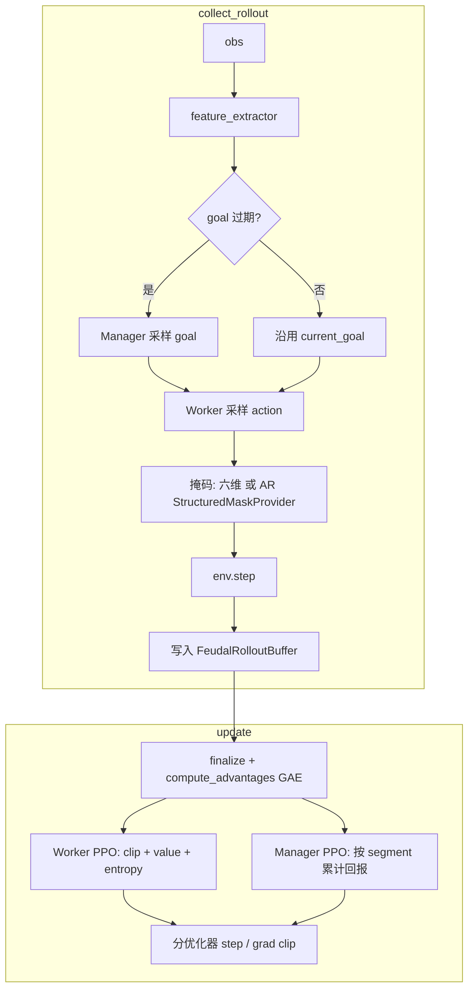
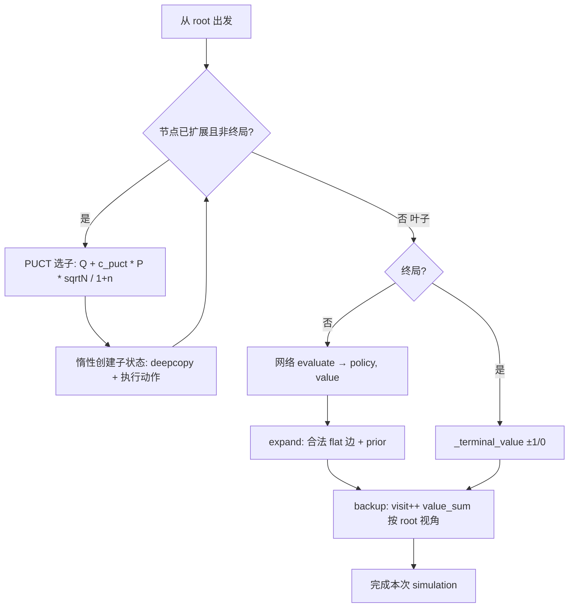

> 返回：[源码总览](overview.md) · [算法总览](../algorithms/overview.md) · [索引](../AGENTS.md)

# 进阶训练器：Feudal RL、AlphaZero / MCTS、行为克隆与特征提取

本文覆盖非「纯 SB3 MaskablePPO 课程」的训练栈：分层 Manager/Worker、自对弈 + MCTS 的 AlphaZero、BC 热启动，以及共享 CNN 特征提取器。

---

## 位置

| 路径 | 角色 |
|------|------|
| `reinforcetactics/rl/feudal_rl.py` | Feudal 网络、AR 头、`FeudalRLAgent`、rollout/PPO update |
| `reinforcetactics/rl/alphazero_net.py` | 残差策略-价值网 |
| `reinforcetactics/rl/alphazero_trainer.py` | 自对弈数据 + 训练 + 评估循环 |
| `reinforcetactics/rl/mcts.py` | PUCT MCTS |
| `reinforcetactics/rl/imitation.py` | 示教收集与 BC |
| `reinforcetactics/rl/extractors.py` | `SpatialFeatureExtractor`（Feudal 与 MaskablePPO 共用） |
| `scripts/train/train_feudal_rl.py` | Feudal CLI |
| `scripts/train/train_alphazero.py` | AlphaZero CLI |
| `scripts/build_bc_warmstart.py` | BC 检查点构建 |
| `configs/feudal/`、`configs/alphazero/`、`configs/imitation/` | 对应 YAML |

---

## 文件清单

| 符号 | 说明 |
|------|------|
| `ManagerNetwork` | 高层目标：goal_x, goal_y, goal_type + value |
| `WorkerNetwork` | 六维独立头（与 MultiDiscrete 对齐） |
| `AutoregressiveActionHead` / `AutoregressiveWorkerNetwork` | AlphaStar 式因式分解 + 阶段掩码 |
| `StructuredMaskProvider` | `StructuredActionMasks` → AR 各阶段 mask |
| `FeudalRolloutBuffer` / `FeudalRLAgent` | 采集 + GAE + 双优化器 PPO update |
| `AlphaZeroNet` / `ResidualBlock` | 网格/单位 CNN + 全局特征 → policy, value |
| `MCTS` / `MCTSNode` | 微动作为边的树搜索 |
| `ReplayBuffer` / `self_play_game` / trainer 主循环 | AlphaZero 管线 |
| `collect_demonstrations` / `behavior_clone` / `make_warm_started_model` | BC |
| `SpatialFeatureExtractor` | SB3 `BaseFeaturesExtractor` + 空间 CNN |

---

## 职责

| 子系统 | 职责 |
|--------|------|
| **Feudal** | 长程目标（Manager）与逐步微动作（Worker）；可选 AR 精确掩码 |
| **AlphaZero** | MCTS 改进策略目标 + 终局价值；网络迭代与「是否接受新权重」评估 |
| **MCTS** | 在 `GameState` 克隆上做 PUCT；动作为 flat index `atype * H*W + y*W + x` |
| **Imitation** | 用规则 Bot 示教缓解稀疏信用分配；产出 MaskablePPO 热启动 |
| **Extractors** | 保留 grid/units 空间结构，避免纯 Flatten 丢失邻域 |

---

## 数据结构

### Feudal 目标与动作

| 层 | 输出 |
|----|------|
| Manager | `(goal_x ∈ [0,W), goal_y ∈ [0,H), goal_type ∈ {0..3})`：攻/守/夺/扩（语义由训练塑造） |
| Worker（独立头） | 与 Env 相同的 6 维：atype, unit_type, from_x/y, to_x/y |
| Worker（AR） | \(p(\text{atype})\,p(\text{src}\mid\text{atype})\,p(\text{ut}\mid\ldots)\,p(\text{tgt}\mid\ldots)\) |

`manager_horizon`（默认 10）：每 N 个 env step 重采样目标。

Worker 奖励混合（`worker_reward_alpha`）：外在奖励与「朝向目标」内在项的加权（见 `collect_rollout`）。

### AlphaZero 网络 I/O

- 输入：`grid`, `units`, `global_features`（与 observation 契约一致；训练细节以 `alphazero_net` / `_obs_from_game_state` 为准）。
- 输出：flat action logits（大小 `10 * H * W`）+ 标量 value。
- `predict` 对非法动作用 mask 置 `-inf`。

### MCTS 节点

`MCTSNode`：`visit_count`, `value_sum`, `prior`, `children[flat_action]`, 惰性 `game_state`（首次选中时 deepcopy 并执行动作）。

### BC 示教元组

`(observation, action_vec, per_dim_mask)` — 与 `MaskableMultiInputPolicy` / multi_discrete 一致。**仅支持 multi_discrete**。`END_TURN_ACTION_IDX=5` 类不平衡在 `behavior_clone` 中加权。

### `FeudalConfig` / `AlphaZeroConfig`（`config.py`）

| 配置 | 要点 |
|------|------|
| feudal | `manager_horizon`, `worker_reward_alpha`, lr scales, `autoregressive_worker`, `reward_scale` |
| alphazero | `res_blocks`, `channels`, `num_simulations`, `c_puct`, `dirichlet_alpha`, iterations/games/epochs, buffer, temperature_threshold, eval_threshold |

---

## 核心逻辑

### Feudal：一次 update 步骤

要点：

1. **共享** `SpatialFeatureExtractor`；Manager/Worker **分优化器**，降低互相拖曳。
2. AR 模式必须在 env 上暴露 `structured_action_masks()`；否则无掩码采样并打警告。
3. `collect_rollout_vec` 多 env 合并 buffer；GAE 按 env 边界计算。
4. 推理：`select_action(obs, action_masks=..., structured_masks=...)`；GUI `ModelBot` 可走同一套。

### MCTS：一次 simulation

`search` 循环 `num_simulations` 次后，用访问计数归一化为 `action_probs`。根节点可加 Dirichlet 噪声（自对弈探索）。`select_action` 支持温度：前 `temperature_threshold` 步 \(T=1\)，之后贪心。

### AlphaZero 训练迭代（概念）

1. `self_play_game`：双方均用当前网 + MCTS；存 (obs, mcts_policy, …)，终局填 value target。
2. `ReplayBuffer` 采样 → 策略交叉熵 + 价值 MSE。
3. 新网 vs 旧 best 打 `eval_games`；胜率 ≥ `eval_threshold` 才晋升 best。

### 行为克隆

1. `collect_demonstrations`：示教 Bot 对局，包装 `GameState` 变更以记录 (obs, action, mask)。
2. `behavior_clone`：对 policy 头做**带掩码**交叉熵；**不训练 value 头**。
3. `make_warm_started_model`：返回可直接 `learn` 的 MaskablePPO。
4. 脚本 `build_bc_warmstart.py` + `configs/imitation/*.yaml` 产出 `.zip`，供 bootstrap `warm_start_path`。

### 特征提取（`extractors.py`）

`SpatialFeatureExtractor`：对 `grid`/`units` 做卷积（支持 pad 后 live-cell mask），与 `global_features` MLP 融合。YAML 中通过
`policy_kwargs.features_extractor_class: reinforcetactics.rl.extractors.SpatialFeatureExtractor`
字符串解析（bootstrap `_resolve_policy_kwargs`）。

---

## 与需求关系

| 需求 | 落点 |
|------|------|
| 分层决策 / 长程目标 | Feudal Manager + horizon |
| 精确合法动作采样（非六维过近似） | AR worker + `StructuredActionMasks` |
| 规划增强的自对弈 | AlphaZero + MCTS |
| 能力单位（法师/术士/牧师）难探索 | BC 从 Medium/Advanced 示教 |
| MaskablePPO 也要空间归纳偏置 | `SpatialFeatureExtractor` 写入 `policy_kwargs` |
| 与 GUI/锦标赛共用策略 | ModelBot / AlphaZeroBot 读同一 checkpoint 接口 |

---

## 相关算法

| 文档 | 关系 |
|------|------|
| [feudal-rl.md](../algorithms/feudal-rl.md) | Manager-Worker 与奖励分解 |
| [alphazero-mcts.md](../algorithms/alphazero-mcts.md) | PUCT、噪声、晋升 |
| [behavior-cloning.md](../algorithms/behavior-cloning.md) | 示教与类平衡 |
| [action-masking.md](../algorithms/action-masking.md) | 六维 vs 结构化掩码 |

环境与掩码基础见 [rl-gym-env.md](rl-gym-env.md)。

---

## 延伸阅读

- 源码：`feudal_rl.py`、`mcts.py`、`alphazero_*.py`、`imitation.py`、`extractors.py`
- 配置：`configs/feudal/feudal_rl.yaml`、`configs/alphazero/alphazero.yaml`、`configs/imitation/`
- 文档：`docs/feudal_rl_review.md`
- 测试：`tests/test_feudal_rl*.py`、`test_alphazero.py`、`test_imitation.py`、`test_autoregressive_*.py`
- Notebook：`notebooks/feudal_rl_training.ipynb`
- 脚本：`scripts/ab_feudal_ar.py`（AR 对照实验）
