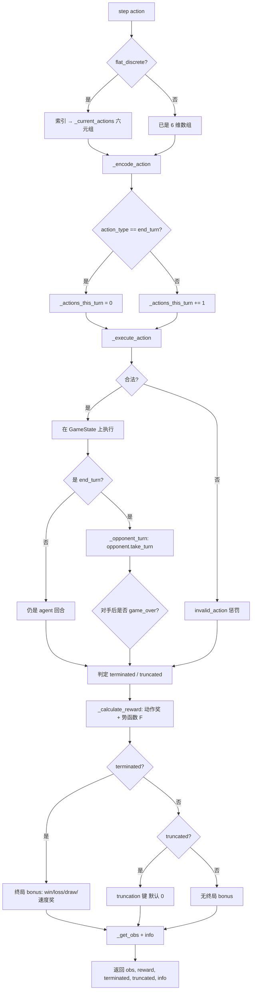

> 返回：[源码总览](overview.md) · [算法总览](../algorithms/overview.md) · [索引](../AGENTS.md)

# RL Gym 环境：观察、动作空间与奖励

本文分析 `reinforcetactics/rl/gym_env.py`、`observation.py`、`masking.py`，回答：策略每一步「看到什么、能做什么、得到什么回报」。

---

## 位置

| 路径 | 角色 |
|------|------|
| `reinforcetactics/rl/gym_env.py` | Gymnasium 环境本体 `StrategyGameEnv`、掩码纯函数、动作解码 |
| `reinforcetactics/rl/observation.py` | 棋盘 → Dict 观察的**唯一**编码入口 |
| `reinforcetactics/rl/masking.py` | MaskablePPO 兼容封装与工厂函数 |

---

## 文件清单

| 符号 | 文件 | 说明 |
|------|------|------|
| `StrategyGameEnv` | `gym_env.py` | 1v1 回合制策略的 `gym.Env` |
| `StructuredActionMasks` | `gym_env.py` | 自回归（AR）策略用的决策树式掩码 |
| `build_per_dim_masks` | `gym_env.py` | 六维 MultiDiscrete 掩码纯函数（Env / ModelBot 共用） |
| `build_structured_masks` | `gym_env.py` | AR 用 atype→source→unit_type→target 掩码 |
| `build_flat_actions` | `gym_env.py` | `flat_discrete` 的合法动作表 |
| `build_observation` | `observation.py` | agent-relative 观察编码 |
| `ActionMaskedEnv` | `masking.py` | 拼接掩码的 Wrapper |
| `make_maskable_env` / `make_maskable_vec_env` | `masking.py` | 训练用工厂 |

---

## 职责

1. 把确定性领域引擎 `GameState` 包装成标准 `reset / step`。
2. 每步只让 RL **智能体玩家**（默认 `agent_player=1`）做一个**微动作**；对手整回合由 Bot 在 `end_turn` 后执行。
3. 提供动作掩码（MaskablePPO / Feudal AR / ModelBot 推理共用逻辑）。
4. 用 `reward_config` + **势函数 shaping** 产出稠密训练信号。

**约束**：仅支持 1v1（`num_players=2`）。观察里的 self/opp 通道与 `opp = 3 - perspective_player` 写死；1v1v1 / 2v2 只走 GUI，不经过本 Env。

---

## 数据结构

### 观察空间（Dict）

编码契约在 `observation.py` 模块文档与常量中固定：

| 键 | 形状 | 内容 |
|----|------|------|
| `grid` | `(H, W, 11)` float32 | 8 维地形 one-hot + self/opp 所有者 + 建筑 HP 比例 |
| `units` | `(H, W, 16)` float32 | 8 维兵种 + self/opp + own_exhausted + HP + 4 状态（麻痹/加速/防 Buff/攻 Buff） |
| `global_features` | `(5,)` float32 | `tanh` 归一化后的：己金、敌金、回合、己单位数、敌单位数 |
| `visibility` | `(H, W)` uint8 | 仅 `fog_of_war=True` 时出现 |

- **agent-relative**：始终以 `perspective_player` 为 self，自对弈换边时编码一致。
- **不包含** `action_mask`（掩码经 `env.action_masks()` 拉取）；可选传入 `action_mask` 供 MCTS/AlphaZero 打包。
- `pad_to=(pad_h, pad_w)`：空间张量零填充，供跨地图尺寸的课程训练（见下）。

### 动作空间：MultiDiscrete 六维（默认）

```text
MultiDiscrete([10, 8, W, H, W, H])
  [0] action_type  0 create_unit · 1 move · 2 attack · 3 seize · 4 heal/cure
                   5 end_turn · 6 paralyze · 7 haste · 8 defence_buff · 9 attack_buff
  [1] unit_type    0..7  对应 ALL_UNIT_TYPES（仅 create_unit 有意义）
  [2] from_x
  [3] from_y
  [4] to_x
  [5] to_y
```

合法动作来自 `GameState.get_legal_actions`，经 `_ACTION_KEY_MAP_MODULE` 映射到上述索引。`end_turn`（类型 5）在掩码中**始终合法**。

### `flat_discrete` 选项

| 项 | 行为 |
|----|------|
| 动作空间 | `Discrete(max_flat_actions)`，默认 512 |
| 解码表 | `build_flat_actions` → 列表，每项为 6 元 `int` 数组（与 MultiDiscrete 同布局） |
| 掩码 | 前 `len(actions)` 位 True，其余 False（**精确**合法集） |
| 截断 | 超出 `max_flat_actions` 时优先保留 seize(3) 与 end_turn(5) |
| 与 pad | **`pad_to_size` 仅支持 flat_discrete**（动作空间与网格尺寸解耦；multi_discrete 的 W/H 随图变） |

### `StructuredActionMasks`

AR 采样顺序：`atype → source → (unit_type if create) → target`。

| 字段 | 形状 / 类型 |
|------|-------------|
| `atype` | `(A,)` bool，`A=10` |
| `source` | `(A, H, W)` bool |
| `target` | `{(atype,sx,sy): (H,W) bool}` |
| `unit_type` | `{(sx,sy): (U,) bool}`，`U=8` |

### `reward_config`（默认键，可被 YAML 覆盖）

| 类别 | 键（节选） | 默认意图 |
|------|------------|----------|
| 终局 | `win` / `loss` / `draw` / `win_by_hq_capture` / `win_by_elimination` / `win_speed_bonus` / `truncation` | 胜负主导；截断默认不加 draw 以免与 SB3 bootstrap 双计 |
| 稠密 | `create_unit`, `move`, `damage_scale`, `damage_taken_scale`, `kill`, `seize_progress`, `capture`, 治疗/Buff 类 | 塑造战术行为 |
| 惩罚 | `invalid_action`, `turn_penalty`（默认 0）, `enemy_neutral_capture`, `enemy_owned_capture` | 非法动作 / 被夺建筑 |
| 势函数源 | `income_diff`, `unit_diff`, `structure_control` | 进入 \(\Phi(s)\)，**不**直接逐步加分 |

### 关键 Env 状态字段

| 字段 | 含义 |
|------|------|
| `agent_player` | 1 或 2；`SelfPlayEnv` 可换边 |
| `opponent_type` | 见下节 |
| `max_actions_per_turn` | 单游戏回合内 agent 微动作上限；达限后掩码只留 end_turn |
| `gamma` | 势函数 shaping 用折扣，**应与训练器 gamma 一致** |
| `pad_height` / `pad_width` | 来自 `pad_to_size` |
| `_prev_potential` | 上一步 \(\Phi(s)\) |

---

## 核心逻辑

### 对手类型（`opponent` / `opponent_type`）

`_BOT_OPPONENT_TYPES`：

| 字符串 | 行为 |
|--------|------|
| `"bot"` / `"simple"` | `SimpleBot`（`bot` 为兼容别名） |
| `"medium"` / `"mixed"` / `"advanced"` | 对应规则 Bot；`opponent_kwargs` 可传构造参数 |
| `"random"` | `RandomBot`（默认 `max_actions=20`，偏压测） |
| `"balanced_random"` | 行动量随兵力缩放，noop 与 random 之间的台阶 |
| `"noop"` | 只 end_turn，课程 0 阶段 / 冒烟 |
| `"self"` | 自对弈：`set_self_play_opponent_factory(gs, player)` 在 `reset` 时绑定快照 Bot |
| `None` | 无自动对手 |

`reset` 时根据类型构造对手；`agent_player` 的对手方为 `3 - agent_player`。

### `action_masks()` / 工厂

- `multi_discrete`：返回 6 个 bool 数组（各维过近似掩码）。
- `flat_discrete`：返回单个精确 mask。
- `ActionMaskedEnv.action_masks()`：拼接成 1D bool，供 MaskablePPO。
- `max_actions_per_turn` 达限：强制只允许 end_turn。

### 势函数 shaping（Ng et al. 1999）

\[
F(s,s') = \gamma\,\Phi(s') - \Phi(s)
\]

- \(\Phi(s)\) 由 `income_diff`、`unit_diff`、`structure_control` 加权差分构成（`_compute_potential`）。
- **真终局**时 \(\Phi(\text{terminal})=0\)，取 \(F=-\Phi(s_{\text{prev}})\)，保持策略不变性。
- `gamma` 与 PPO/MaskablePPO 不一致会引入偏差。

### `step()` 流程



要点：

1. **微动作 ≠ 游戏回合**：只有 `end_turn` 才触发对手 `take_turn()`。
2. 对手回合内造成的伤害 / 被夺建筑等，在 end_turn 分支计入 shaping 或显式惩罚键。
3. `info` 含 `end_reason`（`hq_capture` / `elimination` / `max_turns_draw` / `max_steps_truncate`）、`reward_breakdown`、`n_legal_actions`、`seize_available` 等诊断。

### `reset()` 要点

- 用 `initial_map_data` 重建 `GameState`（保留 `enabled_units`、`fog_of_war`、`max_turns`、`engine_overrides`）。
- 引擎 RNG 从 `np_random` 派生（如 Rogue 闪避），保证 `reset(seed=...)` 可复现。
- `_prev_potential = Φ(s0)`，第一步 shaping 从正确基线起步。
- 自对弈时调用 factory 重绑对手。

---

## 与需求关系

| 需求 / 场景 | 代码落点 |
|-------------|----------|
| 标准 Gym 训练接口 | `StrategyGameEnv.reset/step` |
| MaskablePPO | `masking.make_maskable_*` + `action_masks` |
| 课程跨地图尺寸 | `pad_to_size` + `flat_discrete`（bootstrap 自动算 max H/W） |
| 防止「永不 end_turn」 | `max_actions_per_turn` 收窄掩码；`turn_penalty` 默认 0 |
| 自对弈换边 | `agent_player` + `set_self_play_opponent_factory` |
| 平衡扫参 | `engine_overrides` → `GameState` |
| GUI/锦标赛加载同策略 | `build_per_dim_masks` / `build_flat_actions` / `build_observation` 无 Env 可调 |

---

## 相关算法

| 文档 | 关系 |
|------|------|
| [mdp-gymnasium-basics.md](../algorithms/mdp-gymnasium-basics.md) | 状态/动作/转移/截断语义 |
| [action-masking.md](../algorithms/action-masking.md) | 掩码与 MaskablePPO |
| [reward-shaping.md](../algorithms/reward-shaping.md) | `reward_config` 与势函数 |
| [self-play.md](../algorithms/self-play.md) | `opponent="self"` 与对手工厂 |

配套训练管线见 [rl-training-pipelines.md](rl-training-pipelines.md)。

---

## 延伸阅读

- 源码：`reinforcetactics/rl/gym_env.py`、`observation.py`、`masking.py`
- 测试：`tests/test_gym_env.py`、`test_observation.py`、`test_rl_masking.py`、`test_structured_masks.py`
- 设计笔记：`benchmarks/ppo_vs_simplebot/FLAT_DISCRETE_DESIGN.md`
- 总览：[overview.md](overview.md) §4.2 RL 训练一步
