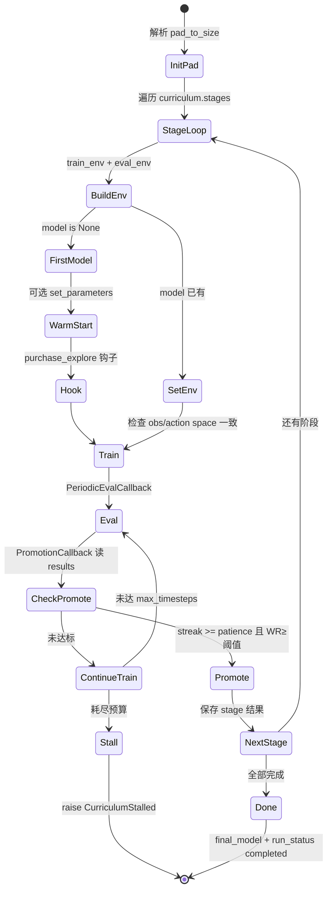

> 返回：[源码总览](overview.md) · [算法总览](../algorithms/overview.md) · [索引](../AGENTS.md)

# RL 训练管线：Bootstrap、自对弈、配置与 CLI

本文覆盖生产级 PPO/MaskablePPO 训练路径：课程冷启动、自对弈工具、YAML 配置、SB3 回调、评估与购买探索，以及 `cli train` 如何调用 Stable-Baselines3。

---

## 位置

| 路径 | 角色 |
|------|------|
| `reinforcetactics/rl/bootstrap.py` | 课程训练主循环 `run_curriculum` |
| `reinforcetactics/rl/self_play.py` | 自对弈 Env、对手池、回调 |
| `reinforcetactics/rl/config.py` | YAML → 类型化 `TrainingConfig` |
| `reinforcetactics/rl/callbacks.py` | 评估 / 晋升 / 熵调度 / 指标 |
| `reinforcetactics/rl/evaluation.py` | `evaluate_model` |
| `reinforcetactics/rl/purchase_exploration.py` | 购兵 unit_type 探索钩子 |
| `reinforcetactics/cli/commands.py` | `train_mode`（简易 SB3） |
| `scripts/train/train_bootstrap.py` | 课程 CLI 入口 |
| `scripts/train/train_self_play.py` | 自对弈 CLI 入口 |
| `configs/ppo/*.yaml` 等 | 超参与课程定义 |

---

## 文件清单

| 符号 | 说明 |
|------|------|
| `run_curriculum` | 按 `cfg.curriculum.stages` 顺序训；一模型贯穿全课程 |
| `CurriculumStalled` | 某阶段耗尽 `max_timesteps` 未晋升时抛出 |
| `PromotionCallback` | 连续 `patience` 次 eval 胜率 ≥ 阈值 → 提前结束 `learn()` |
| `PeriodicEvalCallback` | 按 `eval_freq` 调 `evaluate_model`，写 best_model / jsonl |
| `TrainingMetricsCallback` | 记录 KL、clip_fraction 等，可写 `train_metrics.csv` |
| `EntropyScheduleCallback` | 阶段内熵系数退火 |
| `OpponentPool` / `SelfPlayEnv` / `SelfPlayCallback` | 虚构自对弈与对手更新 |
| `EnvConfig` / `PPOConfig` / `CurriculumStage` / `TrainingConfig` | 配置数据类 |
| `install_purchase_explore_hook` | 以 ε 重采样 create_unit 的 unit_type |
| `evaluate_model` | 统一 MaskablePPO / PPO 评估 |

---

## 职责

| 模块 | 做什么 |
|------|--------|
| **bootstrap** | 地图×对手阶梯；晋升或卡死；跨阶段 `set_env`；可选 warm-start；自动 `pad_to_size` |
| **self_play** | agent 对历史自身 / 混合 Bot；`swap_players`；对手池采样策略 |
| **config** | 可复现超参；CLI 点号覆盖（`ppo.learning_rate=1e-4`） |
| **callbacks** | 训练期诊断、晋升闸门、熵/购兵探索调度 |
| **evaluation** | 可复现种子、动作/奖励分解、截断轨迹 JSONL |
| **CLI train** | 零配置快速试跑 PPO/A2C/DQN（**无**掩码、**无**课程） |

---

## 数据结构

### `TrainingConfig` 分区（`config.py`）

| 分区 | 关键字段 |
|------|----------|
| `env` | `map_file`, `opponent`, `max_steps`, `max_turns`, `action_space_type`, `max_flat_actions`, `max_actions_per_turn`, `reward_config`, `pad_to_size`, `n_envs`, scales, `engine_overrides`, `opponent_kwargs` |
| `ppo` | SB3 超参 + `use_action_masking`, `purchase_explore_eps`, `policy_kwargs` |
| `curriculum.stages[]` | 每阶段：`name`, `map_file`, `opponent`, `promotion_win_rate`, `patience`, `max_timesteps`, 可覆盖 reward/ent/eps/kwargs |
| `eval` | `eval_freq`, `seed_offset` 等 |
| `self_play` / `feudal` / `alphazero` | 各算法专用（本管线主要用前两者） |
| `warm_start_path` | BC 或上一 run 的 `.zip` |

### 阶段解析

`CurriculumStage` 提供 `resolve_max_steps` / `resolve_reward_config` / `resolve_ent_coef` / `resolve_purchase_explore_eps` 等：阶段字段优先，否则回落全局 `env`/`ppo`。

### `run_curriculum` 返回值

```text
{
  "model": MaskablePPO,
  "history": [ {stage, win_rate, timesteps, promoted, ...}, ... ],
  "final_model_path": ".../final_model.zip",
  "best_model_path": "...",   # 视实现
  "metrics_callback": TrainingMetricsCallback,
}
```

卡死时 `CurriculumStalled.partial_result()` 同形，并带 `stalled=True`。

### 产物目录（典型）

```text
output_dir/
  train_metrics.csv
  policy_summary.json
  run_status.json          # completed_curriculum | curriculum_stalled
  tensorboard/
  stage_name/
    best_model.zip
    config.json
    eval_results.jsonl
    traces/                # max_steps_truncate 等
  final_model.zip
  bootstrap_results.csv
```

---

## 核心逻辑

### Bootstrap 阶段状态机



实现细节：

1. **单模型贯穿**：首阶段 `MaskablePPO("MultiInputPolicy", ...)`；后续 `model.set_env(vec_env)`。
2. **`reset_num_timesteps=False`**：全局步数累加；`PromotionCallback.min_timesteps` 相对**本阶段**起点计量。
3. **晋升条件**：`PeriodicEvalCallback` 先写入 `results`，`PromotionCallback` 消费；连续 `patience` 次 `win_rate >= threshold` → `_on_step` 返回 `False` 结束 `learn()`。
4. **卡死**：`promoted=False` 且达到 `max_timesteps` → `CurriculumStalled`（不要只靠加大预算掩盖 reward/超参问题）。
5. **pad**：多地图尺寸且 `flat_discrete` 时自动取课程内 max H/W；`multi_discrete` 混尺寸会直接 `ValueError`。

### 自对弈（`self_play.py`）

| 组件 | 行为 |
|------|------|
| `OpponentPool` | 存历史参数；`uniform` / `recent` / `prioritized` 采样 |
| `SelfPlayEnv` | 包装 `StrategyGameEnv`；可 `swap_players` |
| `SelfPlayCallback` | 按 `opponent_update_freq` 刷新对手；可选写入 pool |
| 工厂 | Env `opponent="self"` + `set_self_play_opponent_factory` |

配置见 `SelfPlayConfig`：`pool_size`、`bot_ratio`（mixed_training）、`min_win_rate_for_pool` 等。

### CLI `train_mode` 与 SB3

`reinforcetactics/cli/commands.py` 的 `train_mode`：

1. 依赖 `stable_baselines3`（**非** sb3-contrib MaskablePPO）。
2. 直接 `StrategyGameEnv(map, opponent, reward_config=...)`，`Monitor` 包装。
3. 按 `args.algorithm` 建 `PPO` / `A2C` / `DQN`，策略均为 `MultiInputPolicy`。
4. `CheckpointCallback` → `checkpoints/`；`model.learn` → `models/{name}.zip`。

**与生产路径的差异**：

| | CLI `train` | `run_curriculum` / train_bootstrap |
|--|-------------|-------------------------------------|
| 算法 | 普通 PPO 等 | MaskablePPO |
| 掩码 | 无 | 有 |
| 配置 | 命令行零散默认 | YAML + 课程 |
| 向量环境 | 单 Env | `n_envs` Subproc/Dummy |
| 用途 | 冒烟 / 教学 | 正式实验 |

进阶：`scripts/train/train_bootstrap.py` 调 `load_config` + `run_curriculum`；`train_self_play.py` 使用 self-play 工厂与回调。

### 评估（`evaluation.py`）

`evaluate_model(model, env, n_episodes, deterministic, seed, ...)`：

- 自动探测是否支持 `action_masks`。
- `seed + i` 复现第 i 局。
- 返回 `win_rate`、`wins/losses/draws`、`seize_available_rate`、`max_legal_actions` 等。
- 可选 `trace_dir` 对 `max_steps_truncate` 等写 JSONL。

### 购买探索（`purchase_exploration.py`）

- `install_purchase_explore_hook(model, eps)`：包装 policy forward；以 ε 在**合法 unit_type** 上重采样 create_unit。
- 替换后的动作写入 rollout，并重算 log-prob，保持 PPO ratio 一致。
- `PurchaseExploreScheduleCallback`：阶段内 ε 退火；bootstrap 按阶段 `resolve_purchase_explore_eps` 写入 `model.purchase_explore_eps`。

---

## 与需求关系

| 需求 | 落点 |
|------|------|
| 由易到难冷启动 | `configs/ppo/bootstrap.yaml` + `run_curriculum` |
| 可复现训练 | `config.load_config` + seed + eval 固定题集 |
| 胜率驱动晋级 | `PromotionCallback` + `PeriodicEvalCallback` |
| Colab 断线可恢复诊断 | `train_metrics.csv`、`eval_results.jsonl`、`run_status.json` |
| BC 热启动后 RL | `warm_start_path` + `model.set_parameters` |
| 快速试一下 PPO | `python main.py --mode train` |
| 自对弈提升上限 | `self_play` + `train_self_play.py` |

---

## 相关算法

| 文档 | 关系 |
|------|------|
| [curriculum-bootstrap.md](../algorithms/curriculum-bootstrap.md) | 课程阶段设计与失败模式 |
| [self-play.md](../algorithms/self-play.md) | 对手池与换边 |
| [ppo.md](../algorithms/ppo.md) | MaskablePPO / 超参 |
| [behavior-cloning.md](../algorithms/behavior-cloning.md) | warm-start 来源 |

环境语义见 [rl-gym-env.md](rl-gym-env.md)。

---

## 延伸阅读

- 源码：`bootstrap.py`、`self_play.py`、`config.py`、`callbacks.py`、`evaluation.py`、`purchase_exploration.py`
- 配置：`configs/ppo/bootstrap.yaml`、`configs/self_play/self_play.yaml`
- 经验：`docs/bootstrap_lessons_learned.md`、`docs/REVIEW_ppo_training.md`
- 测试：`tests/test_bootstrap.py`、`test_self_play.py`、`test_rl_config.py`、`test_rl_evaluation.py`
- Notebook：`notebooks/ppo_bootstrap.ipynb`、`ppo_training.ipynb`
